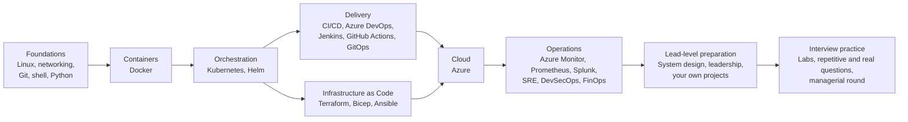
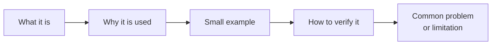
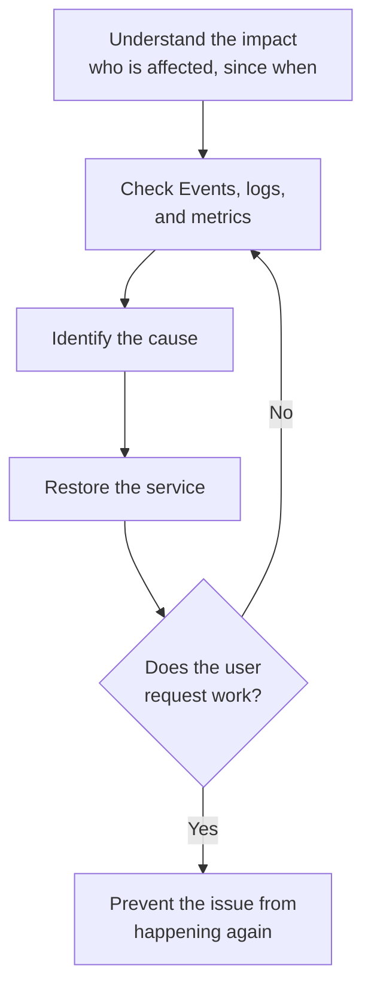

# DevOps Interview Questions

**🌐 Website: [sivakumarmahan.github.io/interview-questions](https://sivakumarmahan.github.io/interview-questions/)**: the same content with search and dark mode.

This repository contains interview questions, short notes, detailed answers, scenarios, commands, and examples for DevOps, cloud, Kubernetes, CI/CD, GitOps, security, networking, monitoring, and scripting.

## Table of contents

- [Start here](#start-here)
  - [Night before the interview: top 10 files](#night-before-the-interview-top-10-files)
  - [1-day revision path](#1-day-revision-path)
  - [1-week study plan](#1-week-study-plan)
  - [Recommended study order](#recommended-study-order)
- [How this repository is organized](#how-this-repository-is-organized)
- [Topic index](#topic-index)
  - [Containers, orchestration, and GitOps](#containers-orchestration-and-gitops)
  - [CI/CD, source control, and artifacts](#cicd-source-control-and-artifacts)
  - [Infrastructure as Code and configuration](#infrastructure-as-code-and-configuration)
  - [Cloud](#cloud)
  - [Logging platform](#logging-platform)
  - [Operating systems and scripting](#operating-systems-and-scripting)
  - [Observability, operations, and networking](#observability-operations-and-networking)
  - [Lead-level preparation](#lead-level-preparation)
- [Other folders](#other-folders)
- [How to structure an answer](#how-to-structure-an-answer)
- [Common technical terms in simple words](#common-technical-terms-in-simple-words)
- [Common abbreviations](#common-abbreviations)
- [Interview tip](#interview-tip)

## Start here

Pick the plan that matches the time you have. Each plan lists files in the order to read them. In every file, read **Key Concepts** first, then answer the **Interview Questions** out loud before you read the answers.

### Night before the interview: top 10 files

These files cover the questions that come up most in Senior and Lead DevOps rounds. Read the Key Concepts, then skim the question titles and make sure you can answer each one in a few sentences.

| # | File | Why it matters |
| --- | --- | --- |
| 1 | [kubernetes/08-troubleshooting.md](kubernetes/08-troubleshooting.md) | CrashLoopBackOff, ImagePullBackOff, Pending Pods, and NotReady nodes come up in almost every round |
| 2 | [kubernetes/03-networking-and-traffic.md](kubernetes/03-networking-and-traffic.md) | Services, Ingress, DNS, NetworkPolicies, and 502/503/504 errors |
| 3 | [ci-cd/04-deployment-strategies-and-rollback.md](ci-cd/04-deployment-strategies-and-rollback.md) | Rolling, blue/green, and canary deployments, and how to roll back safely |
| 4 | [azure-devops/03-pipeline-design-variables-and-templates.md](azure-devops/03-pipeline-design-variables-and-templates.md) | YAML pipelines, stages, templates, and variable groups |
| 5 | [terraform/03-state-and-backends.md](terraform/03-state-and-backends.md) | Remote state, locking, and state problems |
| 6 | [terraform/09-cicd-testing-and-security.md](terraform/09-cicd-testing-and-security.md) | Running Terraform in pipelines, testing, secrets, and policy as code |
| 7 | [azure/04-storage-networking-and-reliability.md](azure/04-storage-networking-and-reliability.md) | VNets, NSGs, private endpoints, Application Gateway, and the 502 decision tree |
| 8 | [docker/06-troubleshooting-and-host-maintenance.md](docker/06-troubleshooting-and-host-maintenance.md) | Debugging containers that fail to start or run out of resources |
| 9 | [ops/03-sre.md](ops/03-sre.md) | SLOs, incidents, and postmortems, which are central to lead roles |
| 10 | [repetitive-questions/production-issues.md](repetitive-questions/production-issues.md) | Real production incidents, told as stories |

For a **Lead** role, also read [system-design/01-approach-and-framework.md](system-design/01-approach-and-framework.md) and [leadership/04-leading-incidents.md](leadership/04-leading-incidents.md), and rehearse your own stories in [my-projects](my-projects/README.md).

### 1-day revision path

About 8 hours. Take a short break after each block.

| Block | Time | Files |
| --- | --- | --- |
| 1. Warm-up | 30 min | This README's [answer structures](#how-to-structure-an-answer), [kubernetes/01](kubernetes/01-architecture-and-fundamentals.md) |
| 2. Kubernetes | 2 h | [kubernetes/02](kubernetes/02-workloads-and-pod-lifecycle.md), [03](kubernetes/03-networking-and-traffic.md), [05](kubernetes/05-scheduling-resources-autoscaling.md), [08](kubernetes/08-troubleshooting.md) |
| 3. Docker | 45 min | [docker/02](docker/02-dockerfiles-and-building-images.md), [docker/06](docker/06-troubleshooting-and-host-maintenance.md) |
| 4. Terraform | 1 h 30 min | [terraform/01](terraform/01-fundamentals-and-workflow.md), [03](terraform/03-state-and-backends.md), [07](terraform/07-lifecycle-and-safe-changes.md), [08](terraform/08-drift-import-and-refactoring.md) |
| 5. CI/CD and GitOps | 1 h 30 min | [ci-cd/01](ci-cd/01-fundamentals-and-tooling.md), [ci-cd/04](ci-cd/04-deployment-strategies-and-rollback.md), [azure-devops/03](azure-devops/03-pipeline-design-variables-and-templates.md), [azure-devops/06](azure-devops/06-troubleshooting.md), [gitops/01](gitops/01-gitops-fundamentals.md) |
| 6. Cloud and operations | 1 h 15 min | [azure/02](azure/02-compute-and-app-hosting.md), [azure/05](azure/05-identity-security-and-governance.md), [azure/09](azure/09-azure-monitor-kql-and-alerting.md), [monitoring-tools/01](monitoring-tools/01-observability-and-apm.md), [ops/03](ops/03-sre.md) |
| 7. Interview practice | 30 min | [repetitive-questions](repetitive-questions/), [real-interview-questions](real-interview-questions/), [managerial-round](managerial-round/) |

### 1-week study plan

About 3–4 hours a day. Each day ends with 20 minutes of answering that day's questions out loud.

| Day | Focus | Files |
| --- | --- | --- |
| 1 | Foundations | [linux](linux/) 01, 03, 04, 06, 09 · [networking/fundamentals](networking/fundamentals/) · [git](git/) 01–04 · [shell-scripting](shell-scripting/) 01–02 |
| 2 | Containers and Kubernetes basics | [docker](docker/) 01–06 · [kubernetes](kubernetes/) 01–04 |
| 3 | Kubernetes in production | [kubernetes](kubernetes/) 05–09 · [helm](helm/) 01–04 · [gitops](gitops/) 01–02 |
| 4 | Infrastructure as Code | [terraform](terraform/) 01–10 · skim [ansible](ansible/) 01 and 04 |
| 5 | CI/CD | [ci-cd](ci-cd/) 01–07 · [azure-devops](azure-devops/) 01–06 · [artifact-repositories](artifact-repositories/) 05 · [testing-tools](testing-tools/) 01–02 |
| 6 | Azure and operations | [azure](azure/) 01–10 · [monitoring-tools](monitoring-tools/) 01, 04, 06 · [splunk](splunk/) 01, 03 · [ops](ops/) 02–04 |
| 7 | Mock interview day | [repetitive-questions](repetitive-questions/) · [real-interview-questions](real-interview-questions/) · [managerial-round](managerial-round/) · [others/behavioral](others/behavioral/) · [cheatcodes](cheatcodes/) |

### Recommended study order

Learn the groups from left to right. Each group builds on the one before it. The last step is practice, not new topics.



## How this repository is organized

Each tool or subject has its own folder, split **by topic** into 2–10 numbered files:

```text
kubernetes/
├── 01-architecture-and-fundamentals.md
├── 02-workloads-and-pod-lifecycle.md
├── ...
└── 09-observability-backup-dr.md
```

- **Numbers give the study order.** `01` is the fundamentals, and the last files cover troubleshooting, production, and advanced topics.
- **Every file has the same layout:**
  - a one-line scope at the top saying what the file covers
  - `## Key Concepts`: the main ideas, explanations, commands, and examples
  - `## Interview Questions`: numbered questions, with related questions next to each other
- **Answers are hidden so you can test yourself.** Each question is a collapsed row: say your answer out loud first, then click the question to check it.
- **Difficulty tags:**
  - **[Basic]:** definitions, "what is X", and "difference between X and Y"
  - **[Intermediate]:** day-to-day how-to and standard troubleshooting
  - **[Advanced]:** design at scale, security incidents, multi-team or multi-region trade-offs, and tricky edge cases
- **Tags show where a question came from:**
  - *(asked in interview round)*: the question was asked in a real interview
  - *(scenario)*: a troubleshooting or design situation

To revise one topic, open its file and read Key Concepts first, then practise the questions.

To add a new topic file, copy the layout in [TEMPLATE.md](TEMPLATE.md).

The same content is published as a searchable [website](https://sivakumarmahan.github.io/interview-questions/), built from `mkdocs.yml`. Every pull request runs Markdown lint, a link check, a spell check, and a site build (`.github/workflows/docs-quality.yml`).

## Topic index

28 topic folders, 162 topic files, and 1,470 interview questions in total.

### Containers, orchestration, and GitOps

| Folder | Files | Questions | Topics |
| --- | --- | --- | --- |
| [docker](docker/) | 6 | 55 | Fundamentals, Dockerfiles, image optimization and multi-stage builds, networking/volumes/Compose, security and CI/CD, troubleshooting |
| [kubernetes](kubernetes/) | 10 | 241 | Architecture, workloads and Pod lifecycle, networking and traffic, storage and StatefulSets, scheduling/resources/autoscaling, security and RBAC, deployments and upgrades, troubleshooting, observability/backup/DR, service mesh with Istio |
| [helm](helm/) | 4 | 11 | Chart structure, releases/values/hooks, multi-environment and reusable charts, security/CI/CD/troubleshooting |
| [gitops](gitops/) | 2 | 6 | GitOps fundamentals (push vs. pull, drift, rollback, GitOps at scale), Argo CD and its reconcile loop |

### CI/CD, source control, and artifacts

| Folder | Files | Questions | Topics |
| --- | --- | --- | --- |
| [ci-cd](ci-cd/) | 7 | 56 | Fundamentals and the end-to-end flow, pipeline design, environments and approvals, rolling/blue-green/canary and rollback, security, runners and performance, troubleshooting |
| [jenkins](jenkins/) | 9 | 72 | Architecture, pipeline as code and shared libraries, pipeline design, Kubernetes deployments, SCM triggers, credentials and security, agents and HA, performance, troubleshooting |
| [github-actions](github-actions/) | 3 | 8 | Workflows, cross-repository triggers, end-to-end pipelines, security and troubleshooting |
| [gitlab](gitlab/) | 3 | 18 | Repositories and collaboration, CI/CD pipelines, secrets/deployments/troubleshooting |
| [azure-devops](azure-devops/) | 6 | 28 | Platform overview, Azure Repos and branching, pipeline design and templates, deployments and approvals, security and secrets, troubleshooting |
| [git](git/) | 4 | 20 | Daily workflow, branching strategies and releases, pull requests and merge conflicts, recovery and troubleshooting |
| [artifact-repositories](artifact-repositories/) | 8 | 39 | Repository selection, Azure Artifacts/Artifactory/GitHub Packages, Nexus, versioning and promotion, signing and access control, HA and backup, troubleshooting |
| [testing-tools](testing-tools/) | 3 | 17 | Pipeline testing and quality gates, security scanning and supply chain, Checkov |

### Infrastructure as Code and configuration

| Folder | Files | Questions | Topics |
| --- | --- | --- | --- |
| [terraform](terraform/) | 11 | 167 | Workflow, variables/functions/meta-arguments, state and backends, modules, environments and workspaces, providers and multi-cloud, lifecycle, drift and import, CI/CD/testing/security, troubleshooting, OpenTofu vs. Terraform |
| [bicep](bicep/) | 3 | 13 | Structure, deployment scopes/environments/secrets, validation and troubleshooting |
| [ansible](ansible/) | 8 | 12 | Setup, inventory, ad hoc commands and modules, playbooks, variables/loops/conditions, roles and Galaxy, Vault and production practices, debugging |
| [yaml](yaml/) | 4 | 11 | Syntax, worked examples, common mistakes and validation, YAML in DevOps tools |

### Cloud

| Folder | Files | Questions | Topics |
| --- | --- | --- | --- |
| [aws](aws/) | 4 | 29 | Architecture and HA, compute/storage/serverless, networking/security/IAM, monitoring and troubleshooting |
| [azure](azure/) | 10 | 99 | Architecture, compute and app hosting (VMs, App Service, Functions, ACR, AKS behind Application Gateway), integration and messaging (Service Bus, Event Grid), storage/networking/reliability (502 decision tree), identity/Key Vault/governance, automation/monitoring/cost, Application Gateway and WAF, VM Scale Sets and autoscale, Azure Monitor/KQL/alerting, backup/recovery and PostgreSQL |

### Logging platform

| Folder | Files | Questions | Topics |
| --- | --- | --- | --- |
| [splunk](splunk/) | 4 | 57 | Architecture (forwarders, indexers, search heads), SPL queries, alerts and dashboards, troubleshooting |

### Operating systems and scripting

| Folder | Files | Questions | Topics |
| --- | --- | --- | --- |
| [linux](linux/) | 9 | 99 | Fundamentals, files and text processing, users/permissions/SSH, processes and services, disks and filesystems, networking, packages, logs, performance troubleshooting |
| [windows](windows/) | 3 | 12 | Administration and patching, logs and troubleshooting, networking and remote access |
| [shell-scripting](shell-scripting/) | 2 | 17 | Bash fundamentals and error handling, automation scripts in practice |
| [python](python/) | 5 | 53 | Fundamentals, functions and classes, automation/APIs/data, logging with Loguru, coding challenges |

### Observability, operations, and networking

| Folder | Files | Questions | Topics |
| --- | --- | --- | --- |
| [monitoring-tools](monitoring-tools/) | 10 | 61 | Observability and APM, Prometheus, Grafana and Alertmanager, logging, host monitoring, Kubernetes, databases, cloud monitoring, CI/CD and IaC, FinOps |
| [ops](ops/) | 7 | 77 | Operations overview, DevSecOps, SRE, FinOps, AIOps, HashiCorp Vault, policy as code with OPA and Kyverno |
| [networking](networking/) | 4 subfolders | – | Networking fundamentals (including a common ports reference), proxies and load balancing, network security, multi-cloud networking. Tool-specific networking lives in each tool's folder. |

### Lead-level preparation

| Folder | Files | Questions | Topics |
| --- | --- | --- | --- |
| [system-design](system-design/) | 5 | 67 | How to run a design interview, CI/CD platform for 50 teams, multi-region DR on Azure, centralized logging platform, secrets management at scale |
| [leadership](leadership/) | 5 | 59 | Architecture decision records, writing postmortems, mentoring, leading incidents, stakeholder communication |
| [my-projects](my-projects/) | 7 | 66 | STAR templates for the projects on your resume (AKS upgrades, Helm RBAC in Go, Bicep RBAC, DevSecOps gates, VMSS and backup automation, monitoring and Splunk, Functions with Service Bus). See its [README](my-projects/README.md). |

## Other folders

| Folder | What it contains |
| --- | --- |
| [labs](labs/) | Three hands-on labs with expected results: fix a broken Deployment on kind, OpenTofu remote state, workspaces, and locking with a local PostgreSQL (`pg` backend), and a multi-stage Dockerfile exercise |
| [cheatcodes](cheatcodes/) | Quick command cheat-sheets per tool: kubectl, Docker, Git, Terraform, Ansible, Argo CD, Jenkins, GitHub Actions, AWS CLI, Linux, shell, TLS |
| [repetitive-questions](repetitive-questions/) | Questions asked again and again across interviews: CI/CD flow, branching, rollback, zero-downtime deployment, secrets, sample pipelines and Dockerfiles, production issues |
| [real-interview-questions](real-interview-questions/) | Question sets from real interviews at specific companies, and an [interview tracker](real-interview-questions/README.md) |
| [managerial-round](managerial-round/) | Managerial-round questions and company background |
| [ai](ai/) | AI-assisted DevOps project ideas: code review, cloud cost, Kubernetes agent and upgrades, Terraform drift detection |
| [others](others/) | Behavioral, microservices, databases, cloud, coding challenges, general scenarios, and interview preparation notes |

## How to structure an answer

You do not need to memorize every sentence. For each answer, remember this simple structure:



The same structure as text:

```text
What it is
-> why it is used
-> small example
-> how to verify it
-> common problem or limitation
```

For a troubleshooting question, use:



The same steps as text:

```text
understand the impact
-> check Events, logs, and metrics
-> identify the cause
-> restore the service
-> verify the user request
-> prevent the issue from happening again
```

## Common technical terms in simple words

| Term | Simple meaning |
| --- | --- |
| Artifact | A file produced by a build, such as a JAR, ZIP, package, or container image |
| Backoff | Waiting longer between each retry |
| Blast radius | The number of users, services, or resources that a failure can affect |
| Cardinality | The number of unique metric label combinations; too many can increase monitoring cost and memory use |
| Drift | A difference between the configuration in code and the real system |
| Failure domain | A group of resources that can fail together, such as one availability zone |
| GitOps | Using a Git repository as the source of truth for deployments; a controller such as Argo CD keeps the cluster matching Git |
| Idempotent | Safe to run more than once without creating unwanted extra changes |
| Immutable | Not changed after creation; publish a new version instead of editing the old one |
| Least privilege | Giving only the permissions needed for the task |
| Reconciliation | Making the real system match the desired configuration |
| Saturation | How close CPU, memory, disk, connections, or another resource is to its limit |
| Telemetry | Monitoring data such as metrics, logs, and traces |

## Common abbreviations

| Abbreviation | Meaning |
| --- | --- |
| ACR | Azure Container Registry |
| ADR | Architecture Decision Record; a short document that records a technical decision and why it was made |
| AKS | Azure Kubernetes Service |
| APM | Application Performance Monitoring |
| CI/CD | Continuous Integration and Continuous Delivery or Deployment |
| EKS | Amazon Elastic Kubernetes Service |
| HPA | Horizontal Pod Autoscaler |
| IaC | Infrastructure as Code |
| mTLS | Mutual TLS; both sides verify each other's certificate |
| OIDC | OpenID Connect; often used by CI/CD to obtain short-lived cloud access |
| PDB | PodDisruptionBudget |
| PVC | PersistentVolumeClaim |
| RBAC | Role-Based Access Control |
| RPO | Recovery Point Objective; the maximum acceptable data-loss period |
| RTO | Recovery Time Objective; the target time to restore a service |
| SAST | Static Application Security Testing; scans source or compiled code |
| SBOM | Software Bill of Materials; a list of components in an artifact |
| SLO | Service Level Objective; the reliability target for a service |
| SPL | Search Processing Language; the query language of Splunk |
| SRE | Site Reliability Engineering |
| VPA | Vertical Pod Autoscaler |

## Interview tip

Use technical terms when the interviewer expects them, but explain them in plain language. For example:

> I make the script idempotent, which means it is safe to run again without creating duplicate users or resources.

This shows technical knowledge while keeping the answer clear.
