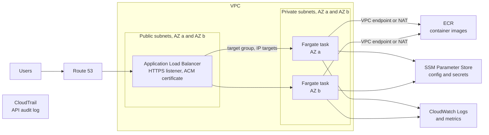

# AWS: Architecture and High Availability

> How core AWS services fit together into secure, scalable, multi-AZ and multi-region architectures, including autoscaling, load balancing, DNS routing, and backup.

## Key Concepts

### Production-Ready Three-Tier Web Architecture

Users resolve through **Route 53** and reach **CloudFront**, then **WAF/Shield**, then an **Application Load Balancer**. The VPC spans multiple Availability Zones, split into three layers:

| Layer | What lives there |
| --- | --- |
| Public subnets | Internet-facing load balancers and NAT gateways |
| Private application subnets | Autoscaled EC2/ECS/EKS workloads, with no direct inbound internet access |
| Isolated/private data subnets | RDS Multi-AZ and ElastiCache replication groups |

A cross-region read replica, or a replicated datastore, is set up separately if you need regional disaster recovery.

**Security groups** reference application tiers instead of opening broad CIDR ranges. The load balancer can reach the application port, and the application can reach only the specific database or cache port it needs — nothing wider than that.

**ACM** provides TLS certificates. **Secrets Manager** and **KMS** protect credentials and keys. **Systems Manager Session Manager** gives audited administrative access without needing public SSH.

**VPC endpoints** give private access to services like S3, DynamoDB, ECR, CloudWatch Logs, Secrets Manager, and Systems Manager. They cut down on NAT and internet dependency, and you can attach endpoint policies to them. Where outbound internet access is still needed, put one NAT gateway per Availability Zone, so one zone's traffic never depends on another zone's NAT gateway.

**S3** stores static artifacts and backups according to policy. **ECR** stores fixed, signed image versions. **CloudWatch** provides metrics, logs, and alarms. **CloudTrail** records API activity. **Config** checks configuration against policy. **Inspector** and **Security Hub** report security findings. **SNS** routes notifications. **SQS** separates producers from background workers. **AWS Backup** applies one central backup policy across services.

A typical **CI/CD flow** looks like: GitHub → GitHub Actions or CodeBuild → ECR → CodeDeploy (blue-green or instance refresh) → CloudWatch verification.

High availability comes down to a few things working together: compute and data spread across Availability Zones, autoscaling, health checks, backups that are actually tested, enough spare capacity in dependencies, and a clear plan for regional failover.

Cost optimization means right-sizing instances, autoscaling instead of over-provisioning, storage lifecycle rules, commitments (like Savings Plans) for steady demand, and tracking cost per transaction so you can see the impact of changes.

### ECS Fargate Behind an ALB

The ALB sits in public subnets in two Availability Zones and sends traffic to Fargate tasks in private subnets. Tasks pull images from ECR, read configuration and secrets from SSM Parameter Store, and send logs to CloudWatch, while CloudTrail records every API call made in the account.



TODO (Siva): replace this generic layout with your real service details, for example the number of services, how they scale, and where the database sits.

## Interview Questions

<details><summary>Q1. [Basic] How do EC2, EKS, ECS, and databases fit together, and how do you interact with an ECS service?</summary>

**Answer:**

EC2 gives you virtual machines. Those machines can run your own applications directly, act as ECS container instances, or serve as EKS worker nodes. ECS is AWS's own container orchestrator. EKS gives you a managed Kubernetes control plane instead.

Databases like RDS usually live in private subnets. They only accept traffic from the specific application security group, on the database port. Load balancers expose the services you actually want reachable. IAM roles for tasks, or for service accounts in EKS, give each workload its own identity.

For ECS, I use the AWS CLI or API — there's no concept of "logging into ECS":

```bash
aws ecs list-clusters
aws ecs list-services --cluster production
aws ecs describe-services --cluster production --services payments
aws ecs execute-command --cluster production --task <task-id> \
  --container payments --interactive --command '/bin/sh'
```

ECS Exec needs SSM integration, IAM authorization, and logging set up, and it only works against a running, supported task. I'd rather rely on logs and metrics than interactive access, and I never expose a database directly to the public internet.

I check DNS, security group references, TLS, credentials, connection pools, health checks, and how things fail across AZs.

</details>

<details><summary>Q2. [Advanced] Design a secure, scalable, highly available AWS architecture for a global SaaS product and explain regional failover.</summary>

**Answer:**

I start by understanding the tenancy model, data classification and residency requirements, expected traffic, SLOs, recovery targets (RTO/RPO), consistency needs, and compliance rules. Route 53 or Global Accelerator sends users to the nearest region's CloudFront, WAF, and load balancer or API endpoints.

Each region gets multiple AZs, private application subnets, autoscaled compute on ECS or EKS, controlled outbound traffic, its own workload identity, KMS encryption, centralized logs and security findings, and no databases exposed publicly.

Tenant isolation isn't just network boundaries — it's enforced in identity, authorization, data keys or partitions, quotas, and audit logging too.

How you handle data decides how failover works. DynamoDB Global Tables, or another datastore built for multiple regions, can give you active-active behavior. Relational databases usually use cross-region replicas with a single write region instead.

Object storage gets replicated wherever the recovery point objective requires it. Infrastructure and policy come from versioned infrastructure-as-code so they're reproducible. Secrets and certificates exist independently in each region, and dependencies have enough capacity in each region too.

During an actual outage: declare the incident, stop any risky deployments, confirm the failure and check replication lag, promote or fence the data according to the runbook, scale up the recovery region, verify transactions are working internally, then shift traffic over gradually using weighted routing. Avoiding a split-brain situation matters more than failing over quickly.

Afterward I watch errors, latency, data correctness, queue depth, and business metrics. I keep clear rollback criteria, and before failing back I reconcile — make actual state match desired state — the data. Regular game days are how you prove your real RTO and RPO, not just the numbers on paper.

</details>

<details><summary>Q3. [Advanced] Design a highly available, scalable microservices architecture on AWS (auto-scaling + DR) <em>(asked in interview round)</em></summary>

- Default to **multi-AZ**; add **multi-region** for disaster recovery.
- **Ingress path:** Route 53 (with health checks, latency-based or failover routing) → CloudFront/WAF → ALB.
- **Compute:** EKS or ECS Fargate, with HPA and Cluster Autoscaler/Karpenter spread across AZs. Keep services stateless.
- **Data:** Aurora Multi-AZ with a cross-region replica, DynamoDB global tables, and ElastiCache. Handle anything async through SQS, SNS, or Kafka.
- **DR strategy:** Pick one based on your recovery targets — backup-and-restore, pilot light, warm standby, or active-active. Define how much downtime and data loss you can tolerate (RTO/RPO), automate the failover, replicate both data and infrastructure code to the DR region, and actually test failover on a regular schedule.
- **Observability and resilience:** Centralize logs, metrics, and traces. Add circuit breakers and retries, pod disruption budgets, and keep infrastructure defined in Terraform so it's reproducible.

</details>

<details><summary>Q4. [Advanced] Design an auto-scaling strategy for a high-traffic app <em>(asked in interview round)</em></summary>

- **Compute:** Use Auto Scaling Groups for EC2, or HPA plus Cluster Autoscaler/Karpenter for EKS. Put an ALB or NLB in front, spread across multiple AZs.
- **Scaling policies:** Start with target-tracking as the baseline — for example, keep CPU near 60%, or track ALB requests per target. Add step scaling for sudden bursts, scheduled scaling for predictable peaks, and predictive scaling for known daily patterns.
- **Keep the app tier stateless** so instances are disposable. Store sessions in Redis or DynamoDB instead of on the instance.
- **Downstream:** Scale the data layer too — RDS read replicas or Aurora Auto Scaling, DynamoDB on-demand. Add CloudFront plus caching, and use SQS to absorb traffic spikes.
- **Guardrails:** Set min/max bounds, use warm pools so scale-out is fast, add health checks, and set cost alarms.

</details>

<details><summary>Q5. [Basic] What is the difference between an ALB and an NLB?</summary>

**Answer:**

An Application Load Balancer works at Layer 7 — it understands HTTP/HTTPS and can route by host, path, header, or method, terminate TLS, and integrate with web-focused controls. A Network Load Balancer works at Layer 4 — it forwards TCP/UDP/TLS with very high performance and static IP support, but doesn't understand HTTP.

I use an ALB for web applications and APIs, and an NLB for non-HTTP protocols, very low-latency TCP/UDP, when I need to preserve the client's IP address, or when I need a static IP. Either way, you still need healthy targets, sensible timeouts, security groups where relevant, observability, and a design that spans multiple AZs.

</details>

<details><summary>Q6. [Intermediate] How do Route 53 routing policies reduce latency or improve availability?</summary>

**Answer:**

Latency-based routing sends users to whichever healthy AWS region responds fastest. Weighted routing lets you shift traffic gradually. Failover routing gives you active-passive recovery. Geolocation or geoproximity routing handles location or data-residency needs. Multivalue answers return several healthy records at once. Simple routing is just a single record with no logic.

I pick the policy based on the traffic pattern, how consistent the data needs to be, and the failover design. I set up health checks where they're needed, keep TTLs realistic, and actually test that failover works.

DNS routing on its own doesn't replicate data, and it doesn't prevent a split-brain situation.

</details>

<details><summary>Q7. [Intermediate] How do you back up and restore an EC2 workload?</summary>

**Answer:**

I make sure the application can be recovered — I don't treat a single running instance as the only copy of anything. Infrastructure gets rebuilt from infrastructure-as-code. Data gets backed up at the database or application level. EBS volumes get scheduled, encrypted snapshots, with retention rules and cross-account or cross-region copies when needed.

An AMI can preserve a tested machine image, but it's not a substitute for backing up application data properly. A restore runbook launches or rebuilds the instance, restores the data, checks security settings, DNS, and secrets, and confirms the application actually works end to end.

I test restores regularly against the recovery time and recovery point targets we've agreed on.

</details>
