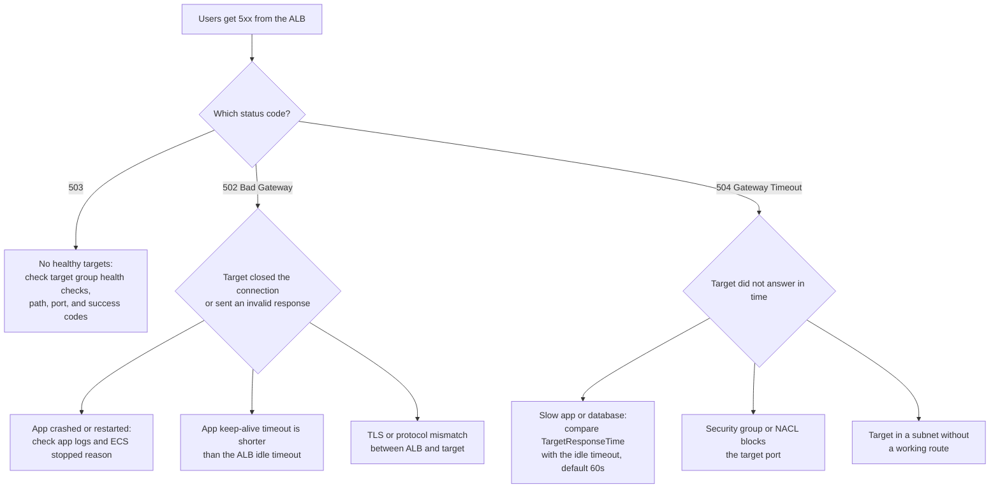

# AWS: Monitoring and Troubleshooting

> Using CloudWatch and CloudTrail in production, investigating EC2 high CPU, and debugging failed S3 log uploads.

## Key Concepts

### EC2 High-CPU Investigation

Start with CloudWatch: CPU utilization, instance status checks, traffic, deployment and configuration history, and network/disk I/O. Install the CloudWatch Agent if you need memory or process-level metrics.

For burstable T-series instances, check the CPU credit balance and figure out whether sustained demand is burning through it.

On the host itself, find the responsible process and the type of pressure before you touch capacity:

```bash
top
ps -eo pid,ppid,user,%cpu,%mem,etime,cmd --sort=-%cpu | head
pidstat -u 1
```

Compare what you see against application and system logs, I/O wait, recent releases, scheduled jobs, and dependency latency. To stabilize things, use a safe rollback, a traffic shift, a rate limit, autoscaling, or terminate a process you've confirmed is safe to kill.

Then fix the actual root cause — inefficient code or a bad query, a background job, a capacity mismatch, the burst-credit model, or unexpected traffic — and confirm both user-facing latency/errors and CPU recover. Scaling out without diagnosing the cause just hides the problem and costs more.

### ALB 502/504 Decision Tree

First find out who produced the error. `HTTPCode_ELB_5XX_Count` means the load balancer itself returned it, while `HTTPCode_Target_5XX_Count` means your application did. ALB access logs show the target that was used and how long it took to respond.



## Interview Questions

<details><summary>Q1. [Basic] What do you use AWS CloudWatch and CloudTrail for in production?</summary>

**Answer:**

CloudWatch is where operational monitoring data lives: AWS service metrics, custom metrics, logs, dashboards, alarms, traces, synthetic checks, and event-driven actions.

I use it to watch EC2 and container resource usage, application signals, Lambda errors/duration/throttling, load balancer status and latency, and queue depth and age, and to run log queries. I build SLO dashboards and route alarms through SNS or incident tooling so they actually get acted on.

CloudTrail records AWS API activity — who or which role called an action, when, from where, against which resource, and whether it succeeded.

I centralize the organization's trails in a protected security account, turn on the right management and data events, encrypt and retain the logs, and alert on high-risk actions: policy changes, a trail getting disabled, public exposure, key changes, or an unusual role assumption.

During an incident I compare what CloudWatch shows against deployment or config changes and CloudTrail's API evidence. Neither tool replaces application tracing or full OS-level metrics. CloudTrail is an audit trail, not a real-time performance monitor.

</details>

<details><summary>Q2. [Intermediate] An EC2 instance reaches 100% CPU. How do you investigate and recover it?</summary>

**Answer:**

First I check how long this has been happening, whether customers are actually affected, the instance status checks, the current load, any recent deploys, autoscaling activity, and — if it's a burstable (T-series) instance — whether it has run out of CPU credits.

Then I connect through SSM or SSH and run `uptime`, `top`, `ps`, and `pidstat`, along with application metrics, to figure out what's actually using the CPU: user time, system time, steal time, I/O wait, a runaway process, garbage collection, a traffic spike, a cron job, an agent, or possibly a compromise.

To stabilize things, I shift traffic away, scale out, rate-limit, stop a runaway process I've confirmed is safe to stop, or roll back a bad release. I avoid rebooting first unless the host is truly unrecoverable — a reboot destroys the evidence I need and often just moves the problem elsewhere.

If there's any sign of compromise, I isolate the host and start incident response instead of just restarting it.

The real fix might be profiling the application, improving a query or cache, setting resource limits, fixing a scheduled job, autoscaling on a better signal, choosing a different instance type, or general capacity planning.

Afterward I confirm latency, errors, and CPU actually recover under real load, and I add alerts for saturation — how close the resource is to its limit — plus credit exhaustion, queueing, and scaling failures.

</details>

<details><summary>Q3. [Intermediate] A server is healthy and has network connectivity, but logs are not uploading to an S3 bucket. What do you investigate?</summary>

**Answer:**

I break the problem into pieces: is the log agent reading files correctly, is it authenticated, does it have permission on the bucket, and is the upload itself actually succeeding?

First I check the log agent. Is it reading the right path? Does it have permission on the files? Is it stuck behind a lock or a full spool disk? Are there any recent errors in its own logs?

Next I test the AWS identity directly. I run `aws sts get-caller-identity`, then try a small test upload to the exact bucket and prefix, without printing the credentials.

Common causes I look for: an expired or wrong credential, the wrong instance profile or region, a missing `s3:PutObject` permission, an explicit deny somewhere (bucket policy, SCP, or permissions boundary), a required object tag or ACL condition, a KMS key policy that's missing `kms:Encrypt` or `kms:GenerateDataKey`, Object Lock, a wrong prefix, clock skew, a failed multipart upload, or a storage-class/lifecycle rule getting in the way.

CloudTrail data events and S3's own server-side logs show whether AWS actually received the request and denied it, or never saw it at all.

Once I find the real cause, I fix that one thing — the policy, the key permission, the agent config, the disk space, or file ownership — and then confirm a new object actually lands, with the right encryption and metadata, and that downstream systems pick it up.

Going forward, I use an instance role that only has the permissions it needs, watch agent health and backlog metrics, set limits on any dead-letter or spool queue, and alert if uploads get too old or start failing.

</details>
