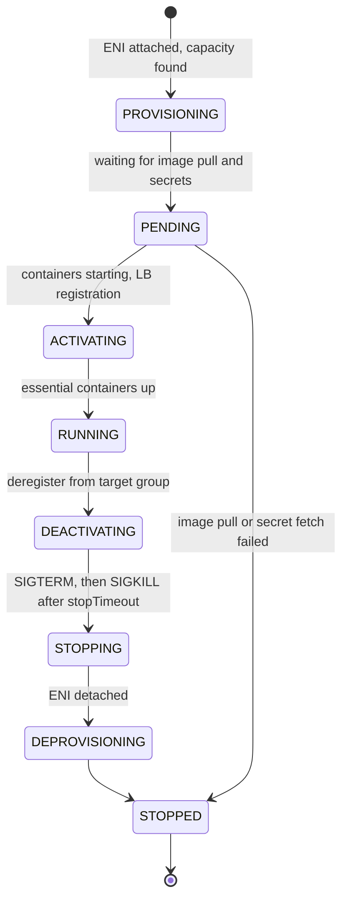

# AWS: ECS and Fargate

> Clusters, task definitions, services, launch types and capacity providers, IAM roles, awsvpc networking, auto scaling, deployments, logging, ECS Exec, and troubleshooting tasks that stop or fail health checks.

## Key Concepts

### ECS Building Blocks

Amazon ECS is AWS's own container orchestrator. You describe what to run, and ECS places and keeps the containers running. For the full ALB + Fargate + ECR + SSM layout, see the diagram in [ECS Fargate Behind an ALB](01-architecture-and-high-availability.md#ecs-fargate-behind-an-alb).

| Object | What it is |
| --- | --- |
| Cluster | A logical group of capacity and services. With Fargate it is only a namespace. |
| Task definition | A versioned JSON blueprint: images, CPU and memory, ports, env vars, secrets, roles, logging. Each change creates a new revision, for example `payments:42`. |
| Task | One running copy of a task definition. It holds one or more containers that share a network namespace. |
| Service | Keeps N tasks running, replaces failed ones, registers them with a load balancer, and runs deployments. |
| Container instance | An EC2 host that runs the ECS agent. Only used with the EC2 launch type or EC2 capacity providers. |

A task moves through these states. The `stoppedReason` you see at the end is the most useful clue when a task dies.



### Launch Types and Capacity Providers

- **Fargate:** AWS runs the hosts. You pick task CPU and memory, from 0.25 vCPU up to 16 vCPU. You pay per task for vCPU, memory, and extra ephemeral storage. No SSH to the host, no daemons, no GPUs.
- **EC2:** you run an Auto Scaling group of container instances. You manage AMIs, patching, and bin packing, but you get GPUs, daemon tasks, host volumes, and Reserved Instance or Savings Plan pricing on the hosts.
- **ECS Managed Instances (since September 2025):** ECS provisions and patches EC2 instances in your account for you. It sits between Fargate and self-managed EC2.

A **capacity provider strategy** says where a service's tasks go. `base` is the minimum number of tasks on a provider, and `weight` splits the rest. `FARGATE_SPOT` runs tasks on spare capacity at a discount. AWS can reclaim it with a two-minute warning, sent to the task as a `SIGTERM`.

```json
"capacityProviderStrategy": [
  { "capacityProvider": "FARGATE",      "base": 2, "weight": 1 },
  { "capacityProvider": "FARGATE_SPOT", "base": 0, "weight": 3 }
]
```

With this strategy the first 2 tasks are on-demand Fargate. After that, 3 out of every 4 extra tasks go to Spot.

### Task Role vs Execution Role

These two roles are the most common ECS interview trap.

| | Execution role | Task role |
| --- | --- | --- |
| Used by | The ECS agent / Fargate, before and around your container | Your application code inside the container |
| Typical permissions | `ecr:GetAuthorizationToken`, ECR layer pulls, `logs:CreateLogStream` and `logs:PutLogEvents`, `ssm:GetParameters`, `secretsmanager:GetSecretValue`, `kms:Decrypt` for secrets | `s3:GetObject` on one bucket, `sqs:SendMessage`, `dynamodb:PutItem`, and `ssmmessages:*` for ECS Exec |
| Field | `executionRoleArn` | `taskRoleArn` |
| Symptom when wrong | Task never starts: `CannotPullContainerError`, `ResourceInitializationError` | Task runs, but the app logs `AccessDenied` |

### Networking with awsvpc

Fargate supports only the `awsvpc` network mode. Each task gets its own ENI, a private IP from the subnet, and its own security groups. That means:

- The target group must use target type `ip`, not `instance`.
- Security groups work per task. The task SG should allow the app port only from the ALB security group.
- Every task uses one IP in the subnet. Size subnets for peak task count plus deployment surge.
- A task in a private subnet needs a NAT gateway or VPC endpoints (ECR API, ECR DKR, S3 gateway, CloudWatch Logs, SSM or Secrets Manager) to start. A task in a public subnet without NAT needs `assignPublicIp=ENABLED`.

```bash
aws ecs create-service --cluster prod --service-name payments \
  --task-definition payments:42 --desired-count 3 \
  --network-configuration 'awsvpcConfiguration={subnets=[subnet-a,subnet-b],securityGroups=[sg-app],assignPublicIp=DISABLED}' \
  --load-balancers 'targetGroupArn=arn:aws:elasticloadbalancing:...:targetgroup/payments/abc,containerName=app,containerPort=8080' \
  --health-check-grace-period-seconds 60
```

### Deployments

| Strategy | How it works | Rollback |
| --- | --- | --- |
| Rolling update (default) | ECS starts new tasks and stops old ones within `minimumHealthyPercent` (default 100) and `maximumPercent` (default 200) | Deployment circuit breaker with `rollback: true`, or CloudWatch alarm-based rollback |
| ECS blue/green (native, since July 2025) | ECS starts a full green set behind a second target group, can send test traffic first, shifts production traffic, waits a bake time, then removes blue. Linear and canary shifting were added in October 2025. | Automatic during bake time, or from Lambda lifecycle hooks |
| CodeDeploy blue/green | Older approach. Service uses `deploymentController: CODE_DEPLOY` and an AppSpec. Configs such as `CodeDeployDefault.ECSCanary10Percent5Minutes`. | CodeDeploy rollback on alarms or failure |
| External | A third-party controller manages task sets | Your tool's logic |

The **deployment circuit breaker** watches new tasks during a rolling deployment. If too many fail to start or fail health checks, it marks the deployment `FAILED` and, with rollback on, goes back to the last completed deployment. By default the threshold is half the desired count, with a floor of 3 and a cap of 200. Since July 2026 you can also set a fixed count or a percentage.

### Service Auto Scaling

ECS services scale through **Application Auto Scaling**. You register the service as a scalable target with min and max, then add policies:

- **Target tracking:** keep `ECSServiceAverageCPUUtilization` near 60%, or keep `ALBRequestCountPerTarget` near a value you load-tested.
- **Step scaling:** react in steps to a custom alarm, for example SQS queue depth.
- **Scheduled scaling:** raise the minimum before a known peak.
- **Predictive scaling:** forecasts load from history for regular daily patterns.

Service auto scaling changes the task count. On Fargate that is enough. On EC2 you also need cluster capacity, which managed scaling on an ASG capacity provider adds.

### Logging, Metrics, and ECS Exec

- **awslogs driver:** sends stdout and stderr to CloudWatch Logs. Simple and the default choice.
- **FireLens:** a Fluent Bit sidecar that routes logs to other places, for example Splunk HEC, OpenSearch, or S3, with filtering.
- **Container Insights:** task and service level CPU, memory, network, and restart metrics in CloudWatch.
- **ECS Exec:** opens a shell or runs a command in a running container through SSM Session Manager. No SSH and no open ports. Commands can be logged to CloudWatch Logs or S3.

TODO (Siva): add how your current ECS services are set up, for example cluster layout, how many services, Fargate vs Fargate Spot split, and which log path you use.

## Interview Questions

<details><summary>Q1. [Basic] What is the difference between an ECS cluster, a task definition, a task, and a service?</summary>

**Answer:**

- A **task definition** is the blueprint. It is versioned, so `payments:41` and `payments:42` can exist side by side.
- A **task** is one running copy of that blueprint. It can hold several containers, for example the app and a log sidecar.
- A **service** keeps a desired number of tasks running, replaces ones that die, attaches them to a target group, and runs deployments.
- A **cluster** groups services and capacity. With Fargate it holds no servers. It is just a boundary for services, capacity providers, and settings like Container Insights.

```bash
aws ecs describe-task-definition --task-definition payments:42
aws ecs list-tasks --cluster prod --service-name payments
aws ecs describe-services --cluster prod --services payments \
  --query 'services[0].{desired:desiredCount,running:runningCount,deployments:deployments[].{status:status,rollout:rolloutState,td:taskDefinition}}'
```

**Pitfall:** A standalone task started with `run-task` is not replaced if it dies. Only a service self-heals. Use `run-task` for one-off jobs like migrations.

</details>

<details><summary>Q2. [Basic] When would you choose Fargate over the EC2 launch type?</summary>

**Answer:**

I start with Fargate for most web services and workers. There are no hosts to patch, no AMIs, no cluster capacity to manage, and each task is isolated in its own micro VM.

I move to EC2 capacity (self-managed, or ECS Managed Instances) when I need:

- GPUs or special instance types.
- Daemon tasks on every host, or host-level agents.
- Very steady, dense workloads where bin packing many small tasks on reserved hosts is cheaper.
- Privileged containers or kernel settings Fargate does not allow.

| | Fargate | EC2 |
| --- | --- | --- |
| Host management | AWS | You (or ECS Managed Instances) |
| Network mode | awsvpc only | awsvpc, bridge, host |
| Scaling | Task count only | Task count and instance count |
| Cost model | Per task vCPU and GB-hour | Per instance, whether full or not |

**Pitfall:** Fargate is not always more expensive. Once you count patching, idle headroom, and engineer time, it often wins for spiky or small fleets.

</details>

<details><summary>Q3. [Basic] What is the difference between the task execution role and the task role?</summary>

**Answer:**

The **execution role** is used by ECS itself to start the task. It pulls the image from ECR, writes logs to CloudWatch, and fetches secrets from SSM Parameter Store or Secrets Manager.

The **task role** is what the application code uses. The AWS SDK inside the container gets temporary credentials for it from the container credentials endpoint.

```json
{
  "family": "payments",
  "executionRoleArn": "arn:aws:iam::111122223333:role/payments-exec",
  "taskRoleArn": "arn:aws:iam::111122223333:role/payments-task",
  "requiresCompatibilities": ["FARGATE"],
  "networkMode": "awsvpc",
  "cpu": "512",
  "memory": "1024"
}
```

**How to verify:** If the task never reaches `RUNNING` and the stopped reason mentions pulling images, logs, or secrets, check the execution role. If the task runs but the app logs `AccessDenied`, check the task role. Inside the container, `aws sts get-caller-identity` shows the task role ARN.

**Pitfall:** Do not put app permissions on the execution role. Every container in every task using that role could reach them, and the separation for audit is lost.

</details>

<details><summary>Q4. [Intermediate] How does a Fargate task in a private subnet pull its image and reach AWS services?</summary>

**Answer:**

The task ENI lives in a private subnet with no public IP, so it needs one of two paths:

1. **NAT gateway:** the private route table sends `0.0.0.0/0` to a NAT gateway in the same AZ. Simple, but NAT data processing costs add up for big images.
2. **VPC endpoints:** private access without internet.

| Endpoint | Type | Why |
| --- | --- | --- |
| `com.amazonaws.<region>.ecr.api` | Interface | ECR auth and API calls |
| `com.amazonaws.<region>.ecr.dkr` | Interface | Docker registry API |
| `com.amazonaws.<region>.s3` | Gateway | Image layers are stored in S3 |
| `com.amazonaws.<region>.logs` | Interface | awslogs driver |
| `ssm`, `secretsmanager`, `kms` | Interface | Secrets in the task definition |
| `ssmmessages` | Interface | ECS Exec |

The interface endpoints need private DNS enabled and a security group that allows 443 from the task security group.

**How to verify:** From a task with ECS Exec, run `nslookup api.ecr.<region>.amazonaws.com`. It should return a private IP from your VPC when endpoints are used.

**Pitfall:** Forgetting the S3 gateway endpoint. Auth works, then layer downloads hang and the task stops with `CannotPullContainerError`.

</details>

<details><summary>Q5. [Intermediate] Explain <code>minimumHealthyPercent</code>, <code>maximumPercent</code>, and the deployment circuit breaker in a rolling update.</summary>

**Answer:**

For a service with 4 tasks:

- `minimumHealthyPercent: 100` means ECS must keep 4 healthy tasks during the deploy, so it starts new ones before stopping old ones.
- `maximumPercent: 200` means it may run up to 8 tasks during the deploy.
- `minimumHealthyPercent: 50` with `maximumPercent: 100` replaces in place, 2 at a time, with no extra capacity. This is useful when subnets or quotas are tight, but you lose half your capacity during the deploy.

```json
"deploymentConfiguration": {
  "minimumHealthyPercent": 100,
  "maximumPercent": 200,
  "deploymentCircuitBreaker": { "enable": true, "rollback": true },
  "alarms": { "alarmNames": ["payments-5xx-high"], "enable": true, "rollback": true }
}
```

The circuit breaker counts new tasks that fail to start or fail health checks. When the count passes the threshold, the deployment is marked `FAILED` and ECS rolls back to the last completed deployment. Alarm-based rollback covers the other case: tasks are healthy, but the app is returning errors.

**How to verify:** `aws ecs describe-services` shows `deployments[].rolloutState` as `IN_PROGRESS`, `COMPLETED`, or `FAILED`. Service events explain each step.

**Pitfall:** Without the circuit breaker, a broken image makes ECS retry forever. The deploy looks "in progress" for hours while it keeps launching tasks that crash.

</details>

<details><summary>Q6. [Advanced] How would you do blue/green deployments for an ECS service, and would you use CodeDeploy or ECS native blue/green? <em>(scenario)</em></summary>

**Answer:**

I want blue/green when I need a full green environment, a test endpoint before real users hit it, and a one-step cutover with instant rollback.

**ECS native blue/green** (since July 2025) is the default choice for new services:

- The service gets `strategy: BLUE_GREEN` and two target groups behind the ALB.
- ECS starts the full green task set and attaches it to the alternate target group.
- An optional test listener rule (for example a header or a test port) sends test traffic to green.
- Lambda lifecycle hooks can run smoke tests at stages and stop the rollout.
- ECS shifts production traffic. Since October 2025 it can also do it in linear or canary steps.
- During the **bake time**, both sets stay up. A failure or alarm sends traffic back to blue at once.

**CodeDeploy blue/green** is the older path. It needs a CodeDeploy app and deployment group, an AppSpec, and `deploymentController: CODE_DEPLOY`. Many existing pipelines still use it, and AWS publishes a migration guide to the native version.

What I check either way:

- The ALB listener rules point at the right target groups, and IaC does not fight the controller over which target group is live. In Terraform this usually means `ignore_changes` on the listener's forward action.
- Bake time and alarms are long enough to catch real errors.
- Database migrations are backward compatible, because blue and green run at the same time.
- Capacity: green doubles task count for a while, so subnets need free IPs.

TODO (Siva): say which deployment strategy your team uses on ECS today and why.

</details>

<details><summary>Q7. [Intermediate] How do you set up auto scaling for an ECS service?</summary>

**Answer:**

```bash
aws application-autoscaling register-scalable-target \
  --service-namespace ecs \
  --resource-id service/prod/payments \
  --scalable-dimension ecs:service:DesiredCount \
  --min-capacity 3 --max-capacity 30

aws application-autoscaling put-scaling-policy \
  --service-namespace ecs \
  --resource-id service/prod/payments \
  --scalable-dimension ecs:service:DesiredCount \
  --policy-name cpu60 --policy-type TargetTrackingScaling \
  --target-tracking-scaling-policy-configuration '{
    "TargetValue": 60,
    "PredefinedMetricSpecification": {"PredefinedMetricType": "ECSServiceAverageCPUUtilization"},
    "ScaleOutCooldown": 60, "ScaleInCooldown": 300 }'
```

How I choose the metric:

- CPU-bound API: CPU target tracking.
- I/O-bound API: `ALBRequestCountPerTarget`, with a target from a load test.
- Queue worker: a custom metric like backlog per task, from SQS `ApproximateNumberOfMessagesVisible` divided by running tasks.

**How to verify:** `aws application-autoscaling describe-scaling-activities --service-namespace ecs` shows each scale event and why it happened.

**Pitfalls:**

- If a deploy pipeline sets `desiredCount` on every run, it can undo auto scaling. In Terraform, use `ignore_changes = [desired_count]`.
- Min capacity of 1 means one AZ. Use at least 2, and spread across AZs.
- Scale-in that is too fast causes flapping. Keep a longer scale-in cooldown.

</details>

<details><summary>Q8. [Advanced] How would you use Fargate Spot safely for a production service? <em>(scenario)</em></summary>

**Answer:**

Fargate Spot is cheaper but AWS can take the capacity back with a two-minute warning. I use it only for stateless, interruption-tolerant tasks, and never for 100% of a critical service.

Design:

1. **Mixed strategy:** a `base` of on-demand `FARGATE` tasks that covers minimum safe capacity, and `weight` that sends extra tasks to `FARGATE_SPOT`.
2. **Handle SIGTERM:** the app stops taking new work, finishes in-flight requests, and exits. Set `stopTimeout` to match (default 30 seconds, maximum 120 on Fargate).
3. **Fast deregistration:** set the target group deregistration delay to a value shorter than the warning, for example 30 to 60 seconds, so the ALB stops sending new requests in time.
4. **Workers:** make jobs idempotent and use SQS visibility timeouts, so an interrupted job is picked up again.
5. **Observe:** an EventBridge rule on ECS task state changes where `stopCode` is `SpotInterruption`, to count interruptions.

**Pitfall:** Spot capacity can be short in one AZ or Region at the same time for everyone. If all tasks are on Spot, the service can drop to zero and ECS cannot place replacements. The on-demand base protects you from that.

</details>

<details><summary>Q9. [Intermediate] How do you get logs out of ECS tasks, and when would you use FireLens instead of awslogs?</summary>

**Answer:**

The default is the `awslogs` driver to CloudWatch Logs:

```json
"logConfiguration": {
  "logDriver": "awslogs",
  "options": {
    "awslogs-group": "/ecs/payments",
    "awslogs-region": "us-east-1",
    "awslogs-stream-prefix": "app",
    "mode": "non-blocking",
    "max-buffer-size": "25m"
  }
}
```

I move to **FireLens** (a Fluent Bit sidecar) when logs need to go somewhere else directly, for example Splunk HEC, or when I want to parse, filter, or drop noisy lines before paying to store them. Another common pattern is awslogs to CloudWatch, then a subscription filter to Firehose, then Splunk.

**How to verify:** `aws logs tail /ecs/payments --follow`. If nothing arrives, check the execution role has `logs:CreateLogStream` and `logs:PutLogEvents`, and the log group exists.

**Pitfalls:**

- Blocking mode can stall the app if the log destination is slow. Non-blocking mode drops logs when the buffer fills. Since June 2025 non-blocking is the ECS default, and the `defaultLogDriverMode` account setting can change it. Set `mode` explicitly so the choice is on purpose.
- Set a retention period on log groups. The default is never expire.
- Log in JSON so CloudWatch Logs Insights and Splunk can parse fields.

</details>

<details><summary>Q10. [Intermediate] How do you set up ECS Exec, and what do you check when it fails?</summary>

**Answer:**

ECS Exec uses SSM Session Manager to open a session into a running container.

Setup:

1. Turn it on for the service: `aws ecs update-service --cluster prod --service payments --enable-execute-command --force-new-deployment`. Only tasks started after this have the SSM agent wired in.
2. The **task role** (not the execution role) needs `ssmmessages:CreateControlChannel`, `CreateDataChannel`, `OpenControlChannel`, and `OpenDataChannel`.
3. The task needs a path to SSM: NAT or an `ssmmessages` VPC endpoint.
4. Your laptop or CI needs the Session Manager plugin and `ecs:ExecuteCommand` permission.

```bash
aws ecs execute-command --cluster prod --task <task-id> \
  --container app --interactive --command "/bin/sh"
```

When it fails, I check:

- `aws ecs describe-tasks` shows `enableExecuteCommand: true` and the `ExecuteCommandAgent` status is `RUNNING`.
- The task role permissions, and any KMS key used for session encryption.
- The container image has a shell. Distroless images do not.
- AWS publishes the `amazon-ecs-exec-checker` script, which tests all of these.

**Pitfall:** ECS Exec gives a shell into production. Limit `ecs:ExecuteCommand` with IAM conditions on cluster or tags, turn on command logging to S3 or CloudWatch Logs, and treat it as break-glass.

</details>

<details><summary>Q11. [Intermediate] An ECS task keeps stopping right after it starts. How do you troubleshoot it? <em>(scenario)</em></summary>

**Answer:**

First I read why it stopped. Stopped tasks stay visible for a short time only, so I check quickly or capture them with an EventBridge rule on task state changes.

```bash
aws ecs list-tasks --cluster prod --service-name payments --desired-status STOPPED
aws ecs describe-tasks --cluster prod --tasks <task-arn> \
  --query 'tasks[].{stopCode:stopCode,reason:stoppedReason,containers:containers[].{name:name,exit:exitCode,reason:reason}}'
aws ecs describe-services --cluster prod --services payments --query 'services[0].events[:10]'
```

| What you see | Likely cause |
| --- | --- |
| `CannotPullContainerError` | Wrong image tag, no network path to ECR, missing S3 endpoint, or execution role cannot pull |
| `ResourceInitializationError: unable to pull secrets` | Execution role lacks `ssm:GetParameters`, `secretsmanager:GetSecretValue`, or `kms:Decrypt`, or no endpoint to SSM |
| `Essential container in task exited`, exit code 1 | The app crashed. Read its logs in CloudWatch. |
| Exit code 137 with `OutOfMemoryError` | Container hit its memory limit. Raise memory or fix the leak. |
| Exit code 139 | Segmentation fault, often a wrong CPU architecture image (arm64 vs x86_64) |
| `Task failed ELB health checks` | See the next question |
| `exec format error` in logs | Image built for the wrong platform |

Then I fix the one cause, deploy, and watch `runningCount` reach `desiredCount` and stay there.

**Pitfall:** Raising memory or CPU without reading the reason first. Most stopped tasks are config or permission problems, not capacity.

</details>

<details><summary>Q12. [Advanced] ECS tasks start, run for a minute, then get replaced with "failed ELB health checks". The app works when you curl it with ECS Exec. What is wrong? <em>(scenario)</em></summary>

**Answer:**

The app works locally, so the problem is between the ALB and the task. I check in this order:

1. **Target health reason:**
   ```bash
   aws elbv2 describe-target-health --target-group-arn <tg-arn> \
     --query 'TargetHealthDescriptions[].{ip:Target.Id,state:TargetHealth.State,reason:TargetHealth.Reason,desc:TargetHealth.Description}'
   ```
   - `Target.Timeout`: the ALB cannot reach the port. Usually the task security group does not allow the port from the ALB security group, or the app listens on `127.0.0.1` instead of `0.0.0.0`.
   - `Target.ResponseCodeMismatch`: the path returns 301, 401, or 404. For example `/health` redirects to `/health/`, or auth middleware protects it.
2. **Health check settings:** port should be "traffic port", path correct, matcher `200` or `200-399` if redirects are expected.
3. **Slow start:** the app needs 90 seconds to warm up, but the ALB marks it unhealthy after 2 failed checks. Set `healthCheckGracePeriodSeconds` on the service longer than startup time.
4. **Container health check:** if the task definition has a `healthCheck` that uses `curl` and the image has no `curl`, the container is marked unhealthy and ECS replaces it. This looks like an ELB problem but is not.
5. **Deep health checks:** if `/health` calls the database, a slow database makes every task fail at once.

**Pitfall:** Making the health check "always return 200" to stop the loop. That hides real failures. Fix the path, port, or grace period instead.

</details>

<details><summary>Q13. [Advanced] A deployment has been "in progress" for an hour and the new tasks never become steady. How do you handle it? <em>(scenario)</em></summary>

**Answer:**

**Stabilize first.** If old tasks are still serving, users may be fine. I check the ALB 5xx and latency. If users are hurt, I roll back by updating the service to the previous task definition revision.

```bash
aws ecs update-service --cluster prod --service payments --task-definition payments:41
```

**Then find out why it is stuck.** I read the service events:

- `unable to place a task because no container instance met all of its requirements`: EC2 capacity, ports, or placement constraints.
- `insufficient free addresses in subnet`: no free IPs for the surge. `maximumPercent: 200` doubles IP use.
- `service was unable to place a task ... RESOURCE:FARGATE`: a Fargate capacity or quota limit.
- Tasks start and stop in a loop: see Q11 and Q12.
- Tasks are healthy but old tasks will not drain: long deregistration delay on the target group, or long-lived connections like WebSockets.

**Make it not happen again:**

- Turn on the circuit breaker with rollback, and alarm-based rollback.
- Alarm on deployment duration with an EventBridge rule on ECS deployment state change events.
- Right-size subnets, and check Fargate vCPU quotas before big launches.

TODO (Siva): add a real stuck-deployment incident you handled, if you have one.

</details>

<details><summary>Q14. [Advanced] How do you secure ECS workloads when many teams share one AWS account or cluster?</summary>

**Answer:**

- **Identity:** one task role and one execution role per service, with least privilege. No shared "ecs-admin" role. Scope `iam:PassRole` so a team can only pass its own roles.
- **Network:** each service has its own security group. Inbound only from the ALB SG or from specific caller SGs. Tasks in private subnets.
- **Images:** pull from ECR by digest or immutable tag, with scanning turned on. Block deploys with critical findings.
- **Runtime:** run as non-root (`user` in the container definition), `readonlyRootFilesystem: true`, no privileged mode, drop Linux capabilities on EC2 launch type.
- **Secrets:** inject from SSM Parameter Store or Secrets Manager with `secrets`, never as plain `environment` values. Plain env vars are visible to anyone who can describe the task definition.
- **Access:** limit `ecs:ExecuteCommand` and `ecs:UpdateService` by tag or cluster with IAM conditions.
- **Detection:** CloudTrail for API calls, GuardDuty Runtime Monitoring for ECS, and Security Hub findings.
- **Separation:** for strong isolation between teams or environments, separate AWS accounts beat separate clusters.

**How to verify:** IAM Access Analyzer on the roles, an AWS Config rule or policy check that rejects task definitions with privileged mode or plain-text secrets, and periodic review of who can run ECS Exec.

</details>

See also: [ALB](06-application-load-balancer.md), [ECR](07-ecr.md), [SSM Parameter Store](08-ssm-parameter-store.md), [Docker security and deployments](../docker/05-security-ci-cd-and-deployments.md), [deployment strategies](../ci-cd/04-deployment-strategies-and-rollback.md).
