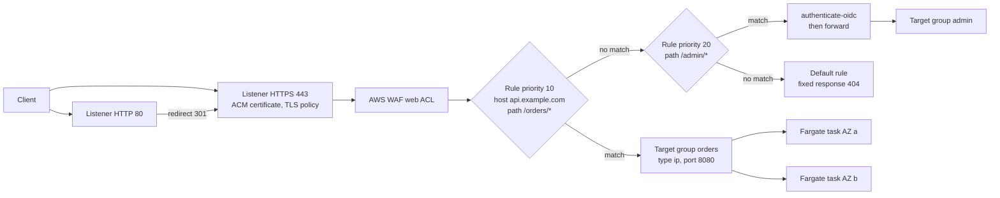

# AWS: Application Load Balancer

> Listeners, rules, target groups, health checks, ALB vs NLB vs GWLB, TLS with ACM, timeouts and keep-alive, sticky sessions, WAF, access logs, CloudWatch metrics, and 502/503/504 troubleshooting.

## Key Concepts

### How a Request Flows Through an ALB

An ALB is a Layer 7 load balancer. It runs nodes in each enabled AZ, terminates the client connection, picks a target, and opens a separate connection to that target. The client-to-ALB side is the **front-end** connection. The ALB-to-target side is the **back-end** connection.

The request below is matched against listener rules in priority order. The first rule that matches wins, and the default rule catches everything else.



For the full VPC layout with ECS behind the ALB, see [ECS Fargate Behind an ALB](01-architecture-and-high-availability.md#ecs-fargate-behind-an-alb).

### Listeners, Rules, and Target Groups

- **Listener:** a protocol and port, HTTP or HTTPS. HTTPS listeners hold certificates and a TLS security policy.
- **Rule:** conditions plus actions. Conditions can match host header, path, HTTP method, HTTP header, query string, and source IP. Actions are `forward` (to one target group or weighted across several), `redirect`, `fixed-response`, and `authenticate-oidc` or `authenticate-cognito`.
- **Target group:** a set of targets plus a health check and attributes such as deregistration delay, stickiness, and the routing algorithm.

| Target type | Registers | Use it for |
| --- | --- | --- |
| `instance` | EC2 instance ID and port | EC2 Auto Scaling groups, ECS on EC2 with bridge mode |
| `ip` | Private IP and port | ECS Fargate and anything in `awsvpc` mode, on-premises IPs over VPN or Direct Connect, peered VPCs |
| `lambda` | One Lambda function | Serverless HTTP backends. Request and response bodies are limited to 1 MB. |

Weighted forward actions let you split traffic, for example 90/10 between two target groups, for a simple canary.

### Health Checks

Each ALB node checks each target. Defaults for `instance` and `ip` targets:

| Setting | Default | Range |
| --- | --- | --- |
| Interval | 30 seconds | 5 to 300 |
| Timeout | 5 seconds | 2 to 120 |
| Healthy threshold | 5 checks | 2 to 10 |
| Unhealthy threshold | 2 checks | 2 to 10 |
| Success codes | `200` | 200 to 499 |
| Path | `/` | |

So with defaults a new target needs about 2.5 minutes to become healthy, and a failing one is removed after about 1 minute.

**Fail open:** if every target in a target group is unhealthy, the ALB sends traffic to all of them anyway. It assumes the health check is wrong rather than the whole fleet being down.

### ALB vs NLB vs GWLB

| | ALB | NLB | GWLB |
| --- | --- | --- | --- |
| Layer | 7, HTTP/HTTPS, gRPC, WebSockets | 4, TCP, UDP, TLS | 3, IP packets over GENEVE port 6081 |
| Routing | Host, path, header, method, query | Port and protocol only | Sends flows to appliances, then back |
| Static IP | No, use DNS name. Put Global Accelerator or an NLB in front if needed. | Yes, one per AZ, Elastic IP optional | Not a client-facing endpoint |
| Client source IP | In `X-Forwarded-For` | Preserved in supported modes | Preserved |
| Typical use | Web apps, APIs, microservices | Non-HTTP, very high throughput, static IPs, PrivateLink services | Third-party firewalls and IDS inline |

aws/03 covers ALB vs NLB in more depth: [ALB vs NLB](03-networking-security-and-iam.md#application-load-balancer-vs-network-load-balancer).

### TLS, Timeouts, and Keep-Alive

- **ACM certificates** attach to HTTPS listeners. ACM renews them for free when DNS validation records stay in place. One listener can hold several certificates, and the ALB picks the right one by SNI.
- **Security policy** sets TLS versions and ciphers, for example a TLS 1.3 policy such as `ELBSecurityPolicy-TLS13-1-2-2021-06`.
- **Idle timeout** (`idle_timeout.timeout_seconds`): default 60 seconds, up to 4000. If no bytes move on a connection for this long, the ALB closes it.
- **HTTP client keep-alive** (`client_keep_alive.seconds`): default 3600 seconds. The longest time the ALB keeps a client connection open, however busy.
- **Target keep-alive rule:** the app's keep-alive timeout must be **longer** than the ALB idle timeout. Otherwise the app closes an idle connection just as the ALB reuses it, and the client gets a 502.

### Stickiness, Routing, and Draining

- **Sticky sessions:** duration-based (ALB cookie `AWSALB`) or application-based (your own cookie). They pin a client to one target.
- **Routing algorithm:** round robin (default), least outstanding requests, or weighted random with automatic target weights, which can move traffic away from a target that returns more errors.
- **Slow start:** ramps up traffic to a new target over a set time, useful for JVM apps that need warm-up.
- **Deregistration delay:** default 300 seconds. How long the ALB lets in-flight requests finish on a target that is leaving.

### Logs and Metrics

- **Access logs** go to S3 every 5 minutes. Each line has the client, target, status codes, and three timings: `request_processing_time`, `target_processing_time`, `response_processing_time`.
- **Connection logs** record TLS details per connection. **Health check logs** record each health check result.

| Metric | What it tells you |
| --- | --- |
| `HTTPCode_ELB_5XX_Count` | The ALB itself produced the error |
| `HTTPCode_Target_5XX_Count` | Your app returned the error |
| `TargetResponseTime` | Time from request sent to target until response headers back. Watch p99, not average. |
| `HealthyHostCount` / `UnHealthyHostCount` | Per target group and AZ |
| `TargetConnectionErrorCount` | ALB could not connect to targets |
| `RejectedConnectionCount` | ALB hit its connection limit |
| `RequestCountPerTarget` | Good signal for auto scaling |

For the 502/503/504 flow chart, see [ALB 502/504 Decision Tree](04-monitoring-and-troubleshooting.md#alb-502504-decision-tree).

## Interview Questions

<details><summary>Q1. [Basic] What are listeners, rules, and target groups on an ALB?</summary>

**Answer:**

A **listener** waits for connections on a port and protocol, for example HTTPS on 443. Each listener has **rules**. A rule has conditions such as host or path, and an action such as forward, redirect, or fixed response. Rules are checked by priority, lowest number first, and the default rule handles anything that did not match.

A **target group** is where traffic goes. It holds the targets, the health check, and settings like deregistration delay and stickiness. One target group can be used by several rules or listeners.

```bash
aws elbv2 describe-listeners --load-balancer-arn <alb-arn>
aws elbv2 describe-rules --listener-arn <listener-arn> \
  --query 'Rules[].{prio:Priority,cond:Conditions[].Values,action:Actions[0].Type}'
aws elbv2 describe-target-health --target-group-arn <tg-arn>
```

**Pitfall:** A target in a target group that no rule points to shows `unused` and gets no traffic and no health checks.

</details>

<details><summary>Q2. [Basic] Which target type do you use for ECS Fargate, and why?</summary>

**Answer:**

Target type `ip`. Fargate tasks use `awsvpc` mode, so each task has its own ENI and private IP. There is no EC2 instance ID to register. ECS registers and deregisters task IPs in the target group as tasks start and stop.

`instance` is for EC2 targets, including ECS on EC2 with bridge networking and dynamic host ports. `lambda` invokes a function per request.

**How to verify:** `aws elbv2 describe-target-health` lists task IPs and port 8080, not instance IDs.

**Pitfall:** You cannot change the target type of an existing target group. Create a new one and switch the listener rule. Terraform will try to replace the target group, so use `create_before_destroy` or a new name.

</details>

<details><summary>Q3. [Basic] When would you choose an ALB, an NLB, or a Gateway Load Balancer?</summary>

**Answer:**

- **ALB** for HTTP-based apps. I need host and path routing, TLS termination with ACM, WAF, OIDC auth, or many services behind one endpoint.
- **NLB** for anything not HTTP, like TCP databases, MQTT, or gRPC with end-to-end TLS. Also when clients need a static IP to allow-list, when I want to expose a service through PrivateLink, or for extreme connection counts.
- **GWLB** to put a fleet of third-party firewall or inspection appliances inline. Traffic is routed through it by route tables, using GENEVE.

A common combination: an NLB with static IPs in front of an ALB (target type `alb`) when a partner needs fixed IPs but you still want Layer 7 routing.

See also [ALB vs NLB](03-networking-security-and-iam.md#application-load-balancer-vs-network-load-balancer) in aws/03.

</details>

<details><summary>Q4. [Intermediate] How do you route several microservices through one ALB using host and path rules?</summary>

**Answer:**

```hcl
resource "aws_lb_listener_rule" "orders" {
  listener_arn = aws_lb_listener.https.arn
  priority     = 10

  condition {
    host_header { values = ["api.example.com"] }
  }
  condition {
    path_pattern { values = ["/orders", "/orders/*"] }
  }

  action {
    type             = "forward"
    target_group_arn = aws_lb_target_group.orders.arn
  }
}

resource "aws_lb_listener" "https" {
  load_balancer_arn = aws_lb.main.arn
  port              = 443
  protocol          = "HTTPS"
  ssl_policy        = "ELBSecurityPolicy-TLS13-1-2-2021-06"
  certificate_arn   = aws_acm_certificate.api.arn

  default_action {
    type = "fixed-response"
    fixed_response {
      content_type = "text/plain"
      message_body = "not found"
      status_code  = "404"
    }
  }
}
```

Points I mention:

- Path patterns are case sensitive, and `/orders/*` does not match `/orders` itself. Add both.
- The ALB does not strip the path. The app behind `/orders/*` must expect the `/orders` prefix.
- Leave gaps in priorities (10, 20, 30) so you can insert rules later.
- A default rule that returns 404 is safer than forwarding unknown traffic to some service.

**How to verify:** `curl -sv https://api.example.com/orders/123` and check the response comes from the right service, and the access log shows the expected target group.

</details>

<details><summary>Q5. [Intermediate] How do you set up HTTPS on an ALB with ACM, and how do you avoid certificate outages?</summary>

**Answer:**

1. Request a public ACM certificate in the **same Region** as the ALB, with DNS validation.
2. Create the validation CNAME in Route 53. Leave it there forever, because ACM uses it for automatic renewal.
3. Add an HTTPS 443 listener with the certificate and a TLS 1.2+ or TLS 1.3 security policy.
4. Change the HTTP 80 listener to a `redirect` action to HTTPS with status `HTTP_301`.
5. For more domains, add certificates to the same listener. The ALB picks one by SNI.

```bash
aws acm describe-certificate --certificate-arn <arn> \
  --query 'Certificate.{status:Status,renewal:RenewalSummary.RenewalStatus,notAfter:NotAfter}'
```

**How to avoid outages:**

- Alarm on the ACM `DaysToExpiry` metric, for example below 30 days.
- Never delete the DNS validation record.
- Imported certificates (not issued by ACM) do not renew automatically. Track them separately.

**Pitfall:** The ALB's own DNS name `*.elb.amazonaws.com` can never match a public certificate. Clients must use your custom domain, or they get a name mismatch error.

</details>

<details><summary>Q6. [Intermediate] How do you design a good ALB health check?</summary>

**Answer:**

- Use a dedicated endpoint such as `/healthz` that returns 200 fast and needs no auth.
- Make it check the process is able to serve: the web server is up, the thread pool is not exhausted. Do **not** make it fail when a shared dependency like the database is slow. If it does, every target fails together and you lose the whole service, or the ALB fails open.
- Keep a separate deep check (`/ready` or synthetic monitoring) for dependency health, with alerts, not traffic removal.
- Tune timing: interval 10 to 15 seconds, healthy threshold 2 to 3, for faster recovery than the defaults.
- On ECS, set the service `healthCheckGracePeriodSeconds` longer than app startup.

```bash
aws elbv2 modify-target-group --target-group-arn <tg-arn> \
  --health-check-path /healthz --health-check-interval-seconds 15 \
  --healthy-threshold-count 2 --unhealthy-threshold-count 3 --matcher HttpCode=200
```

**How to verify:** `describe-target-health` shows `healthy`. If not, the `Reason` field (`Target.Timeout`, `Target.ResponseCodeMismatch`) tells you whether it is network or app.

**Pitfall:** The health check sends a `Host` header with the target's private IP. Apps with strict virtual host or allowed-host settings (for example Django `ALLOWED_HOSTS`) reject it with 400.

</details>

<details><summary>Q7. [Advanced] All targets in a target group show unhealthy, but users still get responses. How is that possible, and what do you do? <em>(scenario)</em></summary>

**Answer:**

The ALB **fails open**. When all targets in a target group are unhealthy, it routes to all of them, because it is more likely the health check is broken than the whole fleet. That explains why traffic still flows.

This also means a 503 from an ALB usually does **not** mean "all targets unhealthy". It means the target group has **no registered targets**, or all are in the `unused` state, for example the AZ is not enabled or no rule points to the group.

What I do:

1. Treat it as urgent anyway. Failing open means the ALB cannot avoid bad targets any more.
2. Read the reason codes. If they are all the same, for example `Target.ResponseCodeMismatch` with 404, someone changed the health check path or the app route.
3. Check recent changes: a deploy that moved the health endpoint, a security group change, a new auth middleware.
4. Fix the check or the app, and confirm targets go `healthy`.
5. Add an alarm on `UnHealthyHostCount > 0` for a few minutes, and on `HealthyHostCount` below the minimum you need.

</details>

<details><summary>Q8. [Intermediate] After moving an app behind the ALB you see a few random 502 errors per hour, with no app errors in the logs. What is the likely cause? <em>(scenario)</em></summary>

**Answer:**

The classic cause is a **keep-alive mismatch**. The ALB reuses back-end connections. If the app's keep-alive timeout is shorter than the ALB idle timeout (60 seconds by default), the app closes an idle connection at the same moment the ALB sends a request on it. The ALB gets a TCP FIN or RST and returns 502. The app never saw the request, so its logs are clean.

Defaults that cause this:

- Node.js `http.Server` `keepAliveTimeout` is 5 seconds.
- Gunicorn `--keep-alive` is 2 seconds.

Fix: set the app keep-alive higher than the ALB idle timeout.

```js
server.keepAliveTimeout = 65000;  // 65 s, more than the ALB 60 s idle timeout
server.headersTimeout   = 66000;  // must be larger than keepAliveTimeout
```

**How to verify:** in access logs the 502 lines show `target_status_code` as `-` and `target_processing_time` as `-1`, meaning the target never answered. After the fix, `HTTPCode_ELB_502_Count` drops to near zero.

Other 502 causes to rule out: the app crashed or restarted, TLS handshake failure to an HTTPS target, a malformed or oversized response header, or a Lambda target error. Full list in the [decision tree in aws/04](04-monitoring-and-troubleshooting.md#alb-502504-decision-tree).

</details>

<details><summary>Q9. [Intermediate] When would you use sticky sessions, and why do you usually avoid them?</summary>

**Answer:**

Sticky sessions pin a client to one target with a cookie. I use them only when an app keeps session state in memory and cannot be changed quickly, for example a legacy app during a migration.

```bash
aws elbv2 modify-target-group-attributes --target-group-arn <tg-arn> --attributes \
  Key=stickiness.enabled,Value=true \
  Key=stickiness.type,Value=lb_cookie \
  Key=stickiness.lb_cookie.duration_seconds,Value=3600
```

Why I avoid them:

- Load becomes uneven. A few heavy clients overload one target.
- Scale-out does not help existing users, because they stay on old targets.
- When a target dies, its users lose their sessions anyway.
- Deployments drain slower.

The better fix is a stateless app with sessions in ElastiCache, DynamoDB, or a signed token.

</details>

<details><summary>Q10. [Intermediate] Users see errors during every ECS deployment. How do you make deploys clean? <em>(scenario)</em></summary>

**Answer:**

Errors during deploys usually come from the old tasks stopping before the ALB stops sending them traffic, or new tasks getting traffic before they are ready.

Shutdown side:

1. ECS deregisters the task from the target group, then waits for the **deregistration delay**, then sends `SIGTERM`.
2. The app must handle `SIGTERM`: stop accepting, finish in-flight requests, then exit before `stopTimeout`.
3. Set deregistration delay to a bit more than your longest normal request, for example 30 to 60 seconds, instead of the 300 second default. Long delays just make deploys slow.

Startup side:

1. Use a health check path that only passes when the app is warmed up.
2. Use **slow start** on the target group for JVM or cache-heavy apps.
3. Use `minimumHealthyPercent: 100` so capacity does not drop.

**How to verify:** run a load test (for example `hey` or `k6`) against the endpoint during a deploy, and watch `HTTPCode_ELB_5XX_Count` and `HTTPCode_Target_5XX_Count`. Both should stay flat.

</details>

<details><summary>Q11. [Intermediate] How do you protect an ALB with AWS WAF without breaking real traffic?</summary>

**Answer:**

1. Create a regional web ACL and associate it with the ALB.
2. Start with AWS managed rule groups: Core rule set, Known bad inputs, SQL database, IP reputation list.
3. Add a **rate-based rule**, for example block an IP above 2000 requests in 5 minutes on `/login`.
4. Put new rules in **Count** mode first. Turn on WAF logging to CloudWatch Logs, S3, or Firehose, and look at what would be blocked.
5. Add scoped exclusions for false positives, for example a body-size rule on a file upload path.
6. Switch to **Block**.

```bash
aws wafv2 associate-web-acl --web-acl-arn <web-acl-arn> --resource-arn <alb-arn>
aws wafv2 get-web-acl-for-resource --resource-arn <alb-arn>
```

**Pitfalls:**

- Blocked requests return 403 from the ALB, counted in `HTTPCode_ELB_4XX_Count`. Teams often think the app is broken.
- `waf.fail_open.enabled` is `false` by default, so if the ALB cannot reach WAF, requests are not forwarded. Decide on purpose.
- If CloudFront is in front, put WAF on CloudFront and lock the ALB to CloudFront (managed prefix list plus a secret header), or attackers can skip CloudFront and hit the ALB directly.

</details>

<details><summary>Q12. [Intermediate] How do you turn on ALB access logs and use them to find slow or failing requests?</summary>

**Answer:**

```bash
aws elbv2 modify-load-balancer-attributes --load-balancer-arn <alb-arn> --attributes \
  Key=access_logs.s3.enabled,Value=true \
  Key=access_logs.s3.bucket,Value=my-alb-logs \
  Key=access_logs.s3.prefix,Value=prod-alb
```

The bucket policy must allow the Elastic Load Balancing log delivery principal to write. Logs arrive about every 5 minutes, so they are for investigation, not live alerting.

Then I query with Athena (AWS documents a ready-made `CREATE TABLE` for ALB logs):

```sql
SELECT elb_status_code, target_status_code, target_ip, count(*) AS hits,
       approx_percentile(target_processing_time, 0.99) AS p99
FROM alb_logs
WHERE day = '2026/10/01' AND elb_status_code >= 500
GROUP BY 1, 2, 3
ORDER BY hits DESC
LIMIT 20;
```

How I read it:

- `elb_status_code` 502 or 504 with `target_status_code` `-`: the target did not answer.
- 5xx in both fields: the app returned it.
- Errors on one `target_ip` only: one bad task or instance.
- High `request_processing_time`: slow clients or WAF inspection of big POST bodies.

**Pitfall:** set an S3 lifecycle rule on the bucket. Access logs grow fast on busy ALBs.

</details>

<details><summary>Q13. [Advanced] Users report a mix of 502, 503, and 504 errors from the ALB. Walk through your triage. <em>(scenario)</em></summary>

**Answer:**

**1. Who produced the error?** Compare `HTTPCode_ELB_5XX_Count` with `HTTPCode_Target_5XX_Count`. If it is target 5xx, it is an app problem and I go to app logs and traces.

**2. Split by code** (use `HTTPCode_ELB_502_Count`, `503`, `504`):

| Code | Main causes |
| --- | --- |
| 502 | Target reset or closed the connection (crash, keep-alive mismatch), malformed response, TLS handshake error to target, Lambda error, request still running when deregistration delay ended |
| 503 | No registered targets, or all targets `unused`. Note: all-unhealthy fails open, so it is usually not that. |
| 504 | Could not connect to target within 10 seconds (security group, NACL, routing), or target took longer than the idle timeout to respond |
| 460 | Client gave up before the response. Client timeout shorter than server time. |

The visual flow is in the [ALB 502/504 Decision Tree in aws/04](04-monitoring-and-troubleshooting.md#alb-502504-decision-tree).

**3. Narrow scope.** One AZ? One target? One path? Check per-AZ metrics, access logs grouped by `target_ip` and path, and whether it started with a deploy, a scaling event, or a network change.

**4. Common combined story:** a deploy shrinks capacity, `TargetResponseTime` climbs, slow requests hit the idle timeout (504), tasks run out of memory and restart (502), and for a moment a target group has no registered targets (503). One root cause, three codes.

**5. Stabilize, then fix.** Roll back or scale out first. Then fix the root cause and add alarms on each code and on p99 `TargetResponseTime`.

</details>

<details><summary>Q14. [Advanced] Many teams want to put their services behind ALBs. Would you use one shared ALB or one per service? <em>(scenario)</em></summary>

**Answer:**

There is no single right answer. I weigh it like this:

| Shared ALB | ALB per service or per team |
| --- | --- |
| Lower cost: one hourly charge, shared LCUs | Clear ownership and blast radius |
| One certificate set, one WAF, one DNS entry | Each team changes its own rules safely |
| Risk: one bad rule or WAF change hits everyone | More ALBs to patch policies on and monitor |
| Quotas: rules, certificates, and target groups per ALB are limited, check Service Quotas | Easier per-team cost tagging |

What I usually recommend:

- One internet-facing ALB per environment and domain group, owned by the platform team, with rules managed in IaC through a shared module. Teams submit their rule as code, and priorities are allocated in ranges per team.
- Internal ALBs for service-to-service traffic, or ECS Service Connect or VPC Lattice instead.
- Separate ALBs for anything with different security needs, for example admin tools, partner APIs, or PCI scope.
- Task security groups only allow traffic from the ALB security group.
- Per-target-group alarms so each team gets paged only for its own service.

TODO (Siva): describe how ALBs are shared or split in your current environment, if you can.

</details>

See also: [ECS and Fargate](05-ecs-and-fargate.md), [monitoring and troubleshooting](04-monitoring-and-troubleshooting.md), [AWS and Azure monitoring](../monitoring-tools/08-aws-and-azure-monitoring.md).
