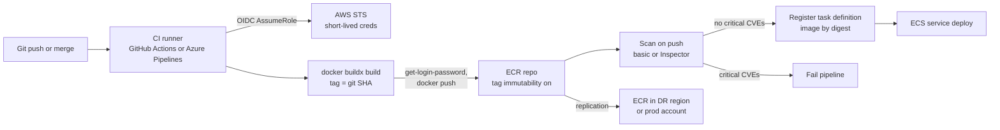

# AWS: Elastic Container Registry (ECR)

> Repositories, authentication, tags vs digests, tag immutability, lifecycle policies, image scanning, replication, pull-through cache, private pulls through VPC endpoints, and the CI/CD push flow.

## Key Concepts

### Registry, Repository, and Image

Each AWS account has one private **registry** per Region. Inside it you create **repositories**, usually one per application or image. An image is stored as a manifest plus layers, and is addressed by a tag or a digest.

```text
111122223333.dkr.ecr.us-east-1.amazonaws.com/payments:1.4.2
|  account  |        |  region  |              | repo  | tag |

111122223333.dkr.ecr.us-east-1.amazonaws.com/payments@sha256:3f1c...
                                                       | digest |
```

Repository settings that matter: tag mutability, scan on push, encryption (AES-256 by default, or KMS), a repository policy for cross-account access, and a lifecycle policy. Image layers live in S3 managed by ECR, which is why private pulls need an S3 endpoint.

### Authentication

Docker cannot use IAM directly. `aws ecr get-login-password` swaps your IAM credentials for a registry token that is valid for **12 hours**, and Docker uses it as a password.

```bash
aws ecr get-login-password --region us-east-1 \
  | docker login --username AWS --password-stdin 111122223333.dkr.ecr.us-east-1.amazonaws.com
```

| Who | Needs |
| --- | --- |
| CI that pushes | `ecr:GetAuthorizationToken` (resource `*`), plus on the repo: `ecr:BatchCheckLayerAvailability`, `ecr:InitiateLayerUpload`, `ecr:UploadLayerPart`, `ecr:CompleteLayerUpload`, `ecr:PutImage` |
| ECS, EKS, EC2 that pull | `ecr:GetAuthorizationToken`, `ecr:BatchGetImage`, `ecr:GetDownloadUrlForLayer`. For ECS this is the **execution role**. |
| Terraform or OpenTofu that manages repos | `ecr:CreateRepository`, `ecr:PutLifecyclePolicy`, and so on. It does not log Docker in. See aws/02 [Terraform and Amazon ECR](02-compute-storage-and-serverless.md#terraform-and-amazon-ecr). |

ECS, EKS (kubelet credential provider), and Lambda handle the token for you. Only CI and humans run `get-login-password`.

### Tags, Digests, and Immutability

- A **tag** is a movable name, like `1.4.2` or `latest`.
- A **digest** is the SHA-256 of the image manifest. It never changes. Same digest means same bytes.
- **Tag immutability** (`IMMUTABLE`) blocks pushing an existing tag again. The push fails with `ImageTagAlreadyExistsException`.
- **`IMMUTABLE_WITH_EXCLUSION`** (since July 2025) keeps most tags immutable but lets up to 5 wildcard filters stay mutable, for example `latest` or `dev-*`.

### Lifecycle Policies

A lifecycle policy is a set of rules that expire (delete) images, or move them to the **archive** storage class (since November 2025). Rules match by tag status (`tagged`, `untagged`, `any`) and tag prefix or wildcard, and count by `imageCountMoreThan` or `sinceImagePushed`. Archive rules can also use `sinceImagePulled`. Lower `rulePriority` numbers are checked first.

```json
{
  "rules": [
    {
      "rulePriority": 1,
      "description": "Delete untagged images after 7 days",
      "selection": { "tagStatus": "untagged", "countType": "sinceImagePushed", "countUnit": "days", "countNumber": 7 },
      "action": { "type": "expire" }
    },
    {
      "rulePriority": 2,
      "description": "Keep the last 50 release images",
      "selection": { "tagStatus": "tagged", "tagPatternList": ["v*"], "countType": "imageCountMoreThan", "countNumber": 50 },
      "action": { "type": "expire" }
    }
  ]
}
```

### Scanning

| | Basic scanning | Enhanced scanning |
| --- | --- | --- |
| Engine | AWS native (the old Clair-based scanner was retired in February 2026) | Amazon Inspector |
| What it finds | OS package CVEs | OS packages and language packages (npm, pip, Maven, Go, and others) |
| When | On push, or manual | On push and continuously as new CVEs are published |
| Cost | Free | Inspector pricing per image scanned |
| Where findings go | ECR API and console | Inspector, Security Hub, EventBridge |

### Replication, Pull-Through Cache, and Signing

- **Replication** is configured at registry level. It copies images to other Regions and other accounts, filtered by repository prefix. Only images pushed **after** you turn it on are copied.
- **Pull-through cache** creates a local ECR copy of images from an upstream registry the first time you pull them, then keeps them in sync. Upstreams include ECR Public, Docker Hub, Quay, GitHub Container Registry, GitLab, Azure Container Registry, the Kubernetes registry, Chainguard, and another ECR registry.
- **Managed signing** (since November 2025) signs images on push using an AWS Signer profile, so clusters can check signatures before running them.

### CI/CD Push Flow

The pipeline below builds once, pushes by an immutable tag, waits for the scan, and deploys by digest. The same digest is then promoted to later environments.



TODO (Siva): add how your pipelines tag and promote images today, for example tag format, and whether dev and prod use the same registry account.

## Interview Questions

<details><summary>Q1. [Basic] What is Amazon ECR, and how is it organized?</summary>

**Answer:**

ECR is AWS's managed container registry. It stores Docker and OCI images and other OCI artifacts like Helm charts. It integrates with IAM for access, KMS for encryption, and ECS, EKS, and Lambda for pulls.

Each account has one private registry per Region at `<account>.dkr.ecr.<region>.amazonaws.com`. Inside it are repositories, and inside those are images, addressed by tag or digest. There is also **ECR Public** (`public.ecr.aws`) for images anyone can pull.

```bash
aws ecr create-repository --repository-name payments \
  --image-tag-mutability IMMUTABLE \
  --image-scanning-configuration scanOnPush=true \
  --encryption-configuration encryptionType=KMS
aws ecr describe-images --repository-name payments \
  --query 'sort_by(imageDetails,&imagePushedAt)[-5:].{tags:imageTags,digest:imageDigest,pushed:imagePushedAt}'
```

</details>

<details><summary>Q2. [Basic] How does Docker authenticate to ECR, and why does a pipeline suddenly get "no basic auth credentials"?</summary>

**Answer:**

`aws ecr get-login-password` uses your IAM identity to get a token from `ecr:GetAuthorizationToken`. The token is valid for 12 hours. Docker stores it and sends it on push and pull.

```bash
aws ecr get-login-password --region us-east-1 \
  | docker login --username AWS --password-stdin 111122223333.dkr.ecr.us-east-1.amazonaws.com
```

"no basic auth credentials" or "authorization token has expired" usually means:

- The login was done in another job, container, or user, so this Docker client has no token.
- The token is older than 12 hours, for example on a long-lived build agent.
- The login was done for a different Region or account than the push target.

**Fixes:** log in inside the same job, right before push. On long-lived agents, use the `amazon-ecr-credential-helper` so Docker fetches tokens itself.

**Pitfall:** never use the old `aws ecr get-login` command (removed in AWS CLI v2), and never put the password on the command line where it ends up in shell history or logs. Always use `--password-stdin`.

</details>

<details><summary>Q3. [Basic] What is the difference between an image tag and an image digest, and which should you deploy?</summary>

**Answer:**

A tag is a label that can point to different images over time. A digest (`sha256:...`) is a hash of the image manifest, so it always means exactly the same image.

I deploy by **digest**, or by an immutable tag such as the git SHA. Then what was tested is what runs, and a rollback really goes back to the same bytes.

```bash
DIGEST=$(aws ecr describe-images --repository-name payments \
  --image-ids imageTag=3f1c2ab --query 'imageDetails[0].imageDigest' --output text)
echo "111122223333.dkr.ecr.us-east-1.amazonaws.com/payments@${DIGEST}"
```

ECS also resolves a tag to a digest when a deployment starts, so all tasks in one deployment run the same image even if the tag moves later.

**Pitfall:** a multi-arch image has an index digest and one digest per platform. Pin the index digest so each host still gets its own architecture.

</details>

<details><summary>Q4. [Intermediate] Why turn on tag immutability, and how do you handle tags like <code>latest</code>?</summary>

**Answer:**

With mutable tags, anyone with push rights can overwrite `1.4.2`. Then production can quietly change on the next task restart, and an audit cannot tell what was running. Immutability makes a tag a promise.

```bash
aws ecr put-image-tag-mutability --repository-name payments --image-tag-mutability IMMUTABLE
```

For `latest` or `dev-*` style tags, I either:

- Stop using them in pipelines and use git SHA plus semantic version tags only, or
- Use `IMMUTABLE_WITH_EXCLUSION` with a filter for `latest` so only that tag can move.

**How to verify:** push the same tag twice. The second push fails with `ImageTagAlreadyExistsException`.

**Pitfall:** CI pipelines that rebuild and re-push the same version on retry will now fail. Make the tag unique per build (git SHA plus build number), or skip the push if the tag already exists.

</details>

<details><summary>Q5. [Intermediate] How do you write an ECR lifecycle policy, and how do you avoid deleting an image that is still in use?</summary>

**Answer:**

I keep a small number of rules: delete untagged images after a few days, keep the last N release tags, keep feature-branch images for 14 days. (Example JSON is in Key Concepts.)

Always preview before applying:

```bash
aws ecr start-lifecycle-policy-preview --repository-name payments \
  --lifecycle-policy-text file://lifecycle.json
aws ecr get-lifecycle-policy-preview --repository-name payments
aws ecr put-lifecycle-policy --repository-name payments \
  --lifecycle-policy-text file://lifecycle.json
```

**The big risk:** ECR does not know what ECS or EKS is running. If a rule deletes the image a service uses, everything keeps running until a task restarts or scales out. Then new tasks fail with `CannotPullContainerError`, often at night.

How I avoid it:

- Count-based rules with a generous number, larger than releases you might roll back to.
- Separate tag prefixes for releases (`v*`) and throwaway builds (`pr-*`), with different rules.
- For images that are rarely pulled but must be kept, transition them to archive with `sinceImagePulled` instead of deleting.
- Prod repos in a separate account, with stricter rules than dev.

</details>

<details><summary>Q6. [Intermediate] Basic or enhanced scanning? How do you use scan results to gate a pipeline?</summary>

**Answer:**

Basic scanning is free and covers OS packages on push. Enhanced scanning uses Amazon Inspector, covers language packages too, and rescans continuously, so an image pushed last month gets flagged when a new CVE appears today. For production I choose enhanced, at least for prod repositories.

Gating in CI after the push:

```bash
aws ecr wait image-scan-complete --repository-name payments --image-id imageTag=$GIT_SHA
CRIT=$(aws ecr describe-image-scan-findings --repository-name payments --image-id imageTag=$GIT_SHA \
  --query 'imageScanFindings.findingSeverityCounts.CRITICAL' --output text)
if [ "$CRIT" != "None" ] && [ "$CRIT" -gt 0 ]; then echo "critical CVEs"; exit 1; fi
```

Many teams also scan **before** push with Trivy or Grype, so the developer gets feedback faster, and use ECR or Inspector as the record of truth.

**Pitfalls:**

- With enhanced scanning, finding details come from Inspector. The shape of the results differs from basic, so test the gate script.
- Gating on "zero CVEs" blocks every build. Gate on critical with a fix available, and track the rest with an SLA.
- Continuous findings on running images need an owner. Route Inspector findings through EventBridge to the team's ticket queue.

</details>

<details><summary>Q7. [Advanced] How do you let workloads in other AWS accounts pull from a central ECR registry? <em>(scenario)</em></summary>

**Answer:**

Cross-account pulls need **both** sides to allow it:

1. A **repository policy** on the central repo that allows the other accounts (or the whole AWS Organization).
2. An **IAM policy** on the pulling role (for example the ECS execution role) that allows the ECR pull actions on the central repo ARN.
3. If the repo uses a customer managed **KMS key**, the key policy must allow `kms:Decrypt` for those roles too.

```json
{
  "Version": "2012-10-17",
  "Statement": [{
    "Sid": "OrgPull",
    "Effect": "Allow",
    "Principal": "*",
    "Action": ["ecr:BatchGetImage", "ecr:GetDownloadUrlForLayer", "ecr:BatchCheckLayerAvailability"],
    "Condition": { "StringEquals": { "aws:PrincipalOrgID": "o-abc123" } }
  }]
}
```

`ecr:GetAuthorizationToken` is always called against the **puller's own** account, so it stays in the IAM policy, not the repo policy.

Design choices I mention:

- A central "shared services" or "artifacts" account owns repos. Only CI in that account can push.
- Use `aws:PrincipalOrgID` or OU-path conditions so new accounts work without editing every policy.
- Pulls across Regions add latency and data transfer cost. Replicate to the Region where workloads run instead.

**How to verify:** from the consumer account, `aws ecr batch-get-image --registry-id <central-account> --repository-name payments --image-ids imageTag=...`. An `AccessDenied` from the repo policy and one from IAM look the same, so check both. CloudTrail in the central account shows the denied call.

</details>

<details><summary>Q8. [Advanced] How do you set up ECR for multi-region disaster recovery? <em>(scenario)</em></summary>

**Answer:**

Images must already be in the DR Region before the outage, because the primary Region's ECR may be what is down.

```json
{
  "rules": [{
    "destinations": [
      { "region": "us-west-2", "registryId": "111122223333" }
    ],
    "repositoryFilters": [{ "filter": "prod/", "filterType": "PREFIX_MATCH" }]
  }]
}
```

```bash
aws ecr put-replication-configuration --replication-configuration file://replication.json
```

What to know:

- Only images pushed after the rule exists are replicated. Backfill old images by re-pushing them, or by a script that copies them.
- Lifecycle policies, repository policies, and scanning settings are **not** copied. Use repository creation templates or IaC to keep both Regions the same.
- Task definitions in the DR Region must reference the DR Region's registry URI. Keep the digest the same, only the host name changes.
- Alarm on replication failures. Replication status is visible per image with `describe-image-replication-status`.

**How to verify in a game day:** start the service in the DR Region from scratch and check it pulls only from the local registry.

</details>

<details><summary>Q9. [Intermediate] What is pull-through cache, and why would you use it for Docker Hub images?</summary>

**Answer:**

A pull-through cache rule maps a prefix in your registry to an upstream registry. The first pull goes to the upstream and stores a copy in ECR. Later pulls come from ECR, and ECR refreshes the copy from the upstream.

```bash
aws secretsmanager create-secret --name ecr-pullthroughcache/dockerhub \
  --secret-string '{"username":"myuser","accessToken":"<token>"}'
aws ecr create-pull-through-cache-rule --ecr-repository-prefix dockerhub \
  --upstream-registry-url registry-1.docker.io \
  --credential-arn arn:aws:secretsmanager:us-east-1:111122223333:secret:ecr-pullthroughcache/dockerhub-AbCd
docker pull 111122223333.dkr.ecr.us-east-1.amazonaws.com/dockerhub/library/nginx:1.27
```

Why:

- Avoids Docker Hub rate limits and outages during scale-out.
- Private subnets can pull public base images through ECR endpoints, without internet access.
- Cached images get ECR scanning and lifecycle policies.

**Pitfalls:** the secret name must start with `ecr-pullthroughcache/`. Docker Hub official images need the `library/` path. The pulling role needs `ecr:CreateRepository` and `ecr:BatchImportUpstreamImage` the first time an image is cached, unless a creation template exists.

</details>

<details><summary>Q10. [Intermediate] Fargate tasks in private subnets fail with <code>CannotPullContainerError</code> after the NAT gateway was removed. How do you fix it? <em>(scenario)</em></summary>

**Answer:**

Without NAT, the tasks need VPC endpoints for every service involved in a pull:

1. Interface endpoint `com.amazonaws.<region>.ecr.api` (auth and API).
2. Interface endpoint `com.amazonaws.<region>.ecr.dkr` (registry calls).
3. **Gateway** endpoint `com.amazonaws.<region>.s3` on the private route tables, because layers are downloaded from S3.
4. Interface endpoint for `logs` if the task uses awslogs, and `ssm` or `secretsmanager` if it has secrets. Otherwise the task fails a step later.

Check each endpoint:

- Private DNS is enabled on the interface endpoints.
- The endpoint security group allows TCP 443 from the task security group.
- The task security group allows outbound 443.
- Endpoint policies, if any, allow ECR actions and the S3 bucket ECR uses (`prod-<region>-starport-layer-bucket`).

**How to verify:** with ECS Exec on a working task, or an EC2 test instance in the same subnet, run `nslookup <account>.dkr.ecr.<region>.amazonaws.com`. It should return private IPs. Then run a new task and check it reaches `RUNNING`.

**Pitfall:** a restrictive S3 gateway endpoint policy that only allows your own buckets blocks the ECR layer bucket.

</details>

<details><summary>Q11. [Intermediate] How does a CI pipeline push to ECR without long-lived AWS keys?</summary>

**Answer:**

Use **OIDC federation**. The CI system gets a signed token for the job, and AWS STS exchanges it for short-lived credentials of a role whose trust policy only accepts that repo and branch.

GitHub Actions:

```yaml
permissions:
  id-token: write
  contents: read
jobs:
  build:
    runs-on: ubuntu-latest
    steps:
      - uses: actions/checkout@v4
      - uses: aws-actions/configure-aws-credentials@v4
        with:
          role-to-assume: arn:aws:iam::111122223333:role/ci-ecr-push-payments
          aws-region: us-east-1
      - id: ecr
        uses: aws-actions/amazon-ecr-login@v2
      - run: |
          IMAGE=${{ steps.ecr.outputs.registry }}/payments:${GITHUB_SHA}
          docker build -t "$IMAGE" .
          docker push "$IMAGE"
```

In Azure DevOps the same idea uses an AWS service connection with OIDC (workload identity federation) where your toolkit supports it.

The push role should only have push actions on its own repository ARN. A different role, in the deploy stage, updates the ECS service.

**Pitfall:** a trust policy that checks only the audience, not the `sub` claim, lets any repo in the GitHub org assume the role.

</details>

<details><summary>Q12. [Advanced] How would you harden the container supply chain around ECR for production?</summary>

**Answer:**

- **Build:** pinned base images (by digest), pulled through a pull-through cache or a curated base-image repo. Multi-stage builds, minimal or distroless runtime images.
- **Push:** only CI roles can push, through OIDC. Humans have read-only access. Tag immutability on.
- **Scan:** enhanced scanning with Inspector, gate on critical CVEs with fixes, continuous findings routed to owners.
- **Sign:** ECR managed signing or Notation with AWS Signer, and verify signatures at deploy time (for EKS, an admission controller such as Kyverno or the Ratify project).
- **SBOM:** generate an SBOM in CI (for example with Syft) or export one from Inspector, and store it with the image.
- **Promote:** the same digest moves from dev to staging to prod, copied to a prod account repo only after tests pass. No rebuilds between environments.
- **Run:** task definitions reference digests. AWS Config or a policy check alerts on images from outside your registry.
- **Audit:** CloudTrail records `PutImage`, `BatchDeleteImage`, policy changes. Alert on deletes and on policy changes in prod repos.

**How to verify:** pick a running task and trace it back: digest, then the CI run that pushed it, then the commit, scan result, and signature.

See also [artifact security and signing](../artifact-repositories/06-security-signing-and-access-control.md) and [Docker security and CI/CD](../docker/05-security-ci-cd-and-deployments.md).

</details>

See also: [ECS and Fargate](05-ecs-and-fargate.md), [pipeline artifacts and promotion](../artifact-repositories/05-pipeline-artifacts-versioning-and-promotion.md), [Azure Container Registry](../azure/02-compute-and-app-hosting.md).
