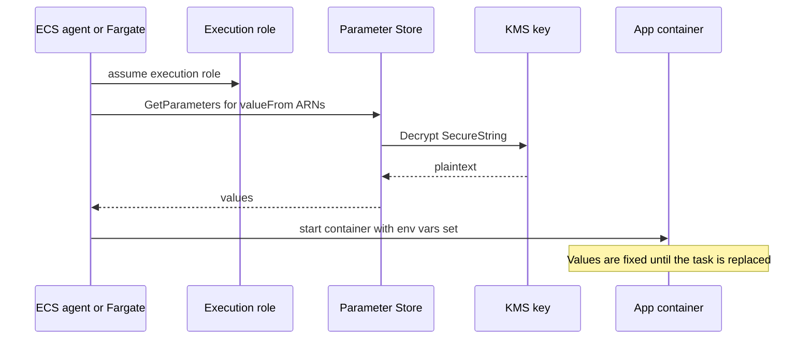

# AWS: Systems Manager and Parameter Store

> A short Systems Manager overview, then Parameter Store in depth (tiers, types, KMS, hierarchies, IAM, vs Secrets Manager, ECS injection), plus Session Manager, Run Command, and Patch Manager.

## Key Concepts

### Systems Manager in One Minute

AWS Systems Manager (SSM) is a group of tools for managing config and servers. The ones that come up most in DevOps interviews:

| Tool | What it does |
| --- | --- |
| Parameter Store | Stores config values and secrets in a path hierarchy |
| Session Manager | Shell or port forwarding to EC2, on-prem, and ECS (through ECS Exec), with no SSH or open ports |
| Run Command | Runs a command or script on many managed nodes at once |
| Patch Manager | Scans and installs OS patches using patch baselines |
| State Manager | Keeps nodes in a defined state on a schedule |
| Automation | Runbooks for multi-step ops tasks, for example AMI builds or restarts |

A **managed node** is any EC2 instance or on-prem server running the SSM Agent, with an IAM role (for EC2 usually `AmazonSSMManagedInstanceCore`) and a network path to the `ssm`, `ssmmessages`, and `ec2messages` endpoints.

### Parameter Store Tiers

| | Standard | Advanced |
| --- | --- | --- |
| Parameters per account and Region | 10,000 | 100,000 |
| Max value size | 4 KB | 8 KB |
| Parameter policies (expiration, notifications) | No | Yes |
| Share with other accounts (AWS RAM) | No | Yes |
| Cost | No extra charge | Charged per parameter per month |
| Change tier | Can upgrade to Advanced | Cannot downgrade. Delete and recreate instead. |

**Throughput** is a separate setting. By default `GetParameter`, `GetParameters`, and `GetParametersByPath` share 40 TPS per account and Region. With higher throughput turned on (charged), `GetParameter` goes up to 10,000 TPS. `PutParameter` is only 3 TPS by default.

Parameter Store keeps the last 100 versions of each parameter. You can read a version with `name:3` or attach a label like `name:prod-approved`.

### Parameter Types and KMS

- **String:** plain text, for example `/payments/prod/log_level = INFO`.
- **StringList:** comma-separated values, for example `us-east-1,us-west-2`.
- **SecureString:** encrypted with KMS. Use the AWS managed key `alias/aws/ssm` for simple cases, or a **customer managed key** when you need a key policy you control, cross-account access, or separation between teams.

Parameter Store passes an encryption context of `PARAMETER_ARN` to KMS. You can use it in key policy conditions so a role can decrypt only certain parameters.

```bash
aws ssm put-parameter --name /payments/prod/db_password --type SecureString \
  --key-id alias/payments-prod --value 'S3cr3t!' --tier Standard
aws ssm get-parameter --name /payments/prod/db_password --with-decryption \
  --query Parameter.Value --output text
```

### Hierarchies and IAM per Path

Name parameters as paths, like `/<app>/<env>/<key>`. Then IAM can allow a whole subtree with one ARN.

```json
{
  "Version": "2012-10-17",
  "Statement": [
    {
      "Effect": "Allow",
      "Action": ["ssm:GetParameter", "ssm:GetParameters", "ssm:GetParametersByPath"],
      "Resource": "arn:aws:ssm:us-east-1:111122223333:parameter/payments/prod/*"
    },
    {
      "Effect": "Allow",
      "Action": "kms:Decrypt",
      "Resource": "arn:aws:kms:us-east-1:111122223333:key/1234abcd-...",
      "Condition": {
        "StringLike": { "kms:EncryptionContext:PARAMETER_ARN": "arn:aws:ssm:us-east-1:111122223333:parameter/payments/prod/*" }
      }
    }
  ]
}
```

AWS also publishes **public parameters**, for example the latest Amazon Linux AMI ID at `/aws/service/ami-amazon-linux-latest/al2023-ami-kernel-default-x86_64`.

### Parameter Store vs Secrets Manager

| | Parameter Store | Secrets Manager |
| --- | --- | --- |
| Best for | Config values, and simple secrets you rotate by hand | Database passwords, API keys, anything that must rotate |
| Rotation | None built in. You build it with Lambda and EventBridge. | Built-in scheduled rotation with Lambda, managed rotation for RDS and others |
| Cost | Standard tier free | Charged per secret per month plus per API call |
| Size | 4 KB or 8 KB | 64 KB |
| Cross-account | Advanced tier with RAM sharing | Resource policy on the secret |
| Multi-Region | You copy it yourself | Built-in replica secrets |

You can read a Secrets Manager secret through Parameter Store with the path `/aws/reference/secretsmanager/<secret-name>`, which helps tools that only speak Parameter Store.

### Injecting Parameters into ECS Tasks

ECS fetches secrets **once, when the task starts**, using the **execution role**, and sets them as environment variables in the container. The app code never calls SSM itself.



```json
"containerDefinitions": [{
  "name": "app",
  "image": "111122223333.dkr.ecr.us-east-1.amazonaws.com/payments@sha256:...",
  "environment": [ { "name": "LOG_LEVEL", "value": "INFO" } ],
  "secrets": [
    { "name": "DB_PASSWORD", "valueFrom": "arn:aws:ssm:us-east-1:111122223333:parameter/payments/prod/db_password" },
    { "name": "API_KEY",     "valueFrom": "arn:aws:secretsmanager:us-east-1:111122223333:secret:payments/prod/api-AbCdEf:api_key::" }
  ]
}]
```

The execution role needs `ssm:GetParameters`, `secretsmanager:GetSecretValue` for Secrets Manager entries, and `kms:Decrypt` on any customer managed key. If the parameter is in the same Region and account, `valueFrom` can be just the name. Use the full ARN otherwise.

### Session Manager, Run Command, and Patch Manager

- **Session Manager** replaces SSH and bastions. Access is by IAM, there are no inbound ports, sessions can be logged to S3 or CloudWatch Logs, and every `StartSession` is in CloudTrail. It also does port forwarding, for example to reach a private RDS from your laptop.
- **Run Command** runs SSM documents like `AWS-RunShellScript` on nodes chosen by tag, with rate control (`--max-concurrency`, `--max-errors`).
- **Patch Manager** uses patch baselines (which patches are approved, auto-approval delays) and runs scans or installs on a schedule through maintenance windows or a Quick Setup patch policy. Results show up as compliance data.

TODO (Siva): add how your team names parameters (path convention) and whether you use Parameter Store, Secrets Manager, or both for ECS secrets.

## Interview Questions

<details><summary>Q1. [Basic] What is AWS Systems Manager, and which parts of it do you use most?</summary>

**Answer:**

Systems Manager is a set of AWS tools to manage config and servers without logging into them one by one. The parts I use most:

- **Parameter Store** for app config and secrets, read by ECS, Lambda, CI pipelines, and Terraform.
- **Session Manager** for shell access with no SSH keys and no open port 22.
- **Run Command** to run a script on a fleet, for example restart an agent on all hosts with a tag.
- **Patch Manager** for OS patching on EC2.

For a node to be managed, it needs the SSM Agent running, an instance profile with `AmazonSSMManagedInstanceCore`, and a network path to the SSM endpoints (NAT or VPC endpoints).

```bash
aws ssm describe-instance-information \
  --query 'InstanceInformationList[].{id:InstanceId,ping:PingStatus,agent:AgentVersion,os:PlatformName}'
```

**Pitfall:** an instance missing from that list is usually a missing instance profile or no route to the `ssm` endpoints, not a broken agent.

</details>

<details><summary>Q2. [Basic] What is the difference between the Standard and Advanced tiers in Parameter Store?</summary>

**Answer:**

Standard is free, holds up to 10,000 parameters per account and Region, and values up to 4 KB. Advanced costs money per parameter, allows 100,000 parameters and 8 KB values, and adds parameter policies and cross-account sharing.

I use Standard by default. I use Advanced only for a parameter that needs:

- A value bigger than 4 KB, like a certificate bundle.
- An expiration policy or a "not changed in 90 days" notification.
- Sharing with another account through AWS RAM.

**Pitfall:** you can upgrade a parameter to Advanced but never downgrade it. If someone sets the account default tier to Advanced or Intelligent-Tiering, new parameters may become Advanced and start costing money. Check with `aws ssm get-service-setting`.

Do not confuse tiers with **throughput**. The 40 TPS default applies to both tiers. Higher throughput is a separate, paid setting.

</details>

<details><summary>Q3. [Basic] What are String, StringList, and SecureString parameters, and which KMS key should SecureString use?</summary>

**Answer:**

- `String` is plain text.
- `StringList` is comma-separated values, returned as one string.
- `SecureString` is encrypted at rest with KMS and decrypted only when you call with `--with-decryption` and have `kms:Decrypt`.

For the key:

- `alias/aws/ssm` (AWS managed) is fine for one account and simple setups. You cannot edit its key policy and cannot use it across accounts.
- A **customer managed key** is what I use in production. I can limit decrypt to certain roles, use the `PARAMETER_ARN` encryption context, share across accounts, and see every decrypt in CloudTrail.

**How to verify:** `aws ssm get-parameter --name ... --with-decryption` from the app's role should work. From another role it should fail with `AccessDeniedException` from KMS.

**Pitfall:** `SecureString` hides the value, not the name. Do not put secrets in parameter names or descriptions.

</details>

<details><summary>Q4. [Intermediate] How do you structure parameter names and IAM so each team and environment can only read its own values?</summary>

**Answer:**

I use a fixed path layout: `/<app>/<env>/<key>`, for example `/payments/prod/db_host`. Then:

- The payments prod task role gets `ssm:GetParameter*` on `parameter/payments/prod/*` only.
- `kms:Decrypt` is limited with the `kms:EncryptionContext:PARAMETER_ARN` condition to the same path.
- CI for the payments repo can `ssm:PutParameter` on `/payments/dev/*`, but prod writes need a separate role with approval.
- I can also use one KMS key per environment, so a dev role can never decrypt prod values.

```bash
aws ssm get-parameters-by-path --path /payments/prod --recursive --with-decryption \
  --query 'Parameters[].{name:Name,ver:Version}'
```

**How to verify:** use the IAM policy simulator, or test with `aws sts assume-role` into a dev role and try to read a prod path. It must fail.

**Pitfall:** `ssm:DescribeParameters` cannot be limited by path in the same way, so a role with it can list names in the account. Names must never contain secrets.

</details>

<details><summary>Q5. [Basic] When would you use Parameter Store, and when would you use Secrets Manager?</summary>

**Answer:**

I use **Parameter Store** for configuration: feature flags, URLs, log levels, AMI IDs, and simple secrets that change rarely and are rotated by a person. It is free on the Standard tier and works everywhere.

I use **Secrets Manager** for credentials that should **rotate**: database passwords, third-party API keys, anything an auditor will ask about. It has built-in rotation with Lambda (and managed rotation for RDS), versions with stages like `AWSCURRENT` and `AWSPREVIOUS`, resource policies for cross-account use, and replica secrets in other Regions.

A common split:

- `/payments/prod/db_host` in Parameter Store.
- `payments/prod/db` (username and password JSON) in Secrets Manager, with 30-day rotation.

Both can be injected into ECS with the same `secrets` block in the task definition.

</details>

<details><summary>Q6. [Intermediate] How do you inject SSM parameters into an ECS task, and what permissions are needed?</summary>

**Answer:**

In the container definition, use `secrets` instead of `environment`:

```json
"secrets": [
  { "name": "DB_PASSWORD", "valueFrom": "arn:aws:ssm:us-east-1:111122223333:parameter/payments/prod/db_password" }
]
```

The **execution role** (not the task role) needs:

```json
{
  "Effect": "Allow",
  "Action": ["ssm:GetParameters", "kms:Decrypt"],
  "Resource": [
    "arn:aws:ssm:us-east-1:111122223333:parameter/payments/prod/*",
    "arn:aws:kms:us-east-1:111122223333:key/1234abcd-..."
  ]
}
```

Why not just `environment`? Plain environment values are stored in the task definition, so anyone with `ecs:DescribeTaskDefinition` can read them, and they show up in IaC diffs and CloudTrail. `secrets` only stores the ARN.

**How to verify:** the task reaches `RUNNING`. Inside the container, check the variable exists (without printing it): `test -n "$DB_PASSWORD" && echo set`.

**Pitfall:** for Secrets Manager you can pick one JSON key with `secret-arn:json-key::`. A typo in the key name fails the task at start, not at runtime.

</details>

<details><summary>Q7. [Advanced] You rotated a database password in Parameter Store, but the ECS service still uses the old one and then starts failing. What happened, and how do you design for rotation? <em>(scenario)</em></summary>

**Answer:**

ECS reads `secrets` only at **task start**. Running tasks keep the old value in their environment until they are replaced. If the old password was revoked at the same time, every running task starts failing database logins. New tasks work, old ones break.

Short-term fix:

```bash
aws ecs update-service --cluster prod --service payments --force-new-deployment
```

This replaces all tasks so they read the new value.

Better design for rotation:

1. **Dual credentials:** keep the old password valid until all tasks are restarted. Secrets Manager rotation does this with `AWSCURRENT` and `AWSPREVIOUS`, or with alternating users (two DB users, rotate one at a time).
2. **Trigger a deploy on change:** an EventBridge rule on the parameter change event, or on the Secrets Manager rotation event, starts a `force-new-deployment`.
3. **Or read at runtime:** the app fetches the secret through the SDK (or the AWS Parameters and Secrets Lambda Extension for Lambda) with a short cache, and retries with a fresh value on auth failure.
4. Move rotating credentials to Secrets Manager, or to IAM database authentication where the engine supports it, which removes the static password.

**How to verify:** run a rotation in staging and watch error rates during the change. Zero failed logins is the target.

</details>

<details><summary>Q8. [Intermediate] An ECS task fails with <code>ResourceInitializationError: unable to pull secrets or registry auth</code>. How do you troubleshoot it? <em>(scenario)</em></summary>

**Answer:**

The task could not fetch secrets before starting the container. I check in order:

1. **Execution role** has `ssm:GetParameters` on the exact parameter ARN (and `secretsmanager:GetSecretValue` for Secrets Manager entries).
2. **KMS:** the execution role has `kms:Decrypt` on the customer managed key, and the key policy does not block it.
3. **Parameter exists** in the same Region the task runs in, with the exact name. Names are case sensitive.
4. **Network:** in a private subnet, there is a NAT route or VPC endpoints for `ssm` (and `secretsmanager`, `kms`) with private DNS and 443 allowed from the task security group.
5. **Wrong ARN format**, for example a Secrets Manager JSON key with the wrong number of colons.

```bash
aws ssm get-parameters --names /payments/prod/db_password --with-decryption \
  --query 'InvalidParameters'
aws cloudtrail lookup-events --lookup-attributes AttributeKey=EventName,AttributeValue=GetParameters \
  --max-results 5 --query 'Events[].CloudTrailEvent'
```

CloudTrail shows whether the call reached SSM and was denied (permission) or never arrived (network).

**Pitfall:** the error message mentions "registry auth" too, so people often chase ECR. Read the full message: it names the parameter or secret that failed.

</details>

<details><summary>Q9. [Advanced] How do you manage SecureString parameters with Terraform or OpenTofu without leaking secrets into state? <em>(scenario)</em></summary>

**Answer:**

The problem: if Terraform creates a parameter with `value = var.db_password`, the plaintext goes into the state file. Anyone who can read the state bucket can read the secret.

Options, best first:

1. **Write-only arguments** (Terraform 1.11+ with AWS provider support): `value_wo` plus `value_wo_version`. The value is sent to AWS but never stored in state or plan. Bump the version to update it.
   ```hcl
   resource "aws_ssm_parameter" "db_password" {
     name             = "/payments/prod/db_password"
     type             = "SecureString"
     key_id           = aws_kms_key.payments.arn
     value_wo         = var.db_password
     value_wo_version = 2
   }
   ```
2. **Let AWS generate it:** use Secrets Manager rotation or RDS `manage_master_user_password = true`, so the secret never passes through Terraform.
3. **Create the parameter with a placeholder** and `lifecycle { ignore_changes = [value] }`, then set the real value out of band. The placeholder is in state, the real value is not.
4. **Protect state anyway:** encrypted S3 backend with a KMS key, strict bucket policy, versioning. OpenTofu (1.7+) also has client-side state encryption.

Check which versions your Terraform or OpenTofu and AWS provider support for write-only arguments before relying on them.

**How to verify:** `terraform state pull | grep -c "S3cr3t"` should return 0.

</details>

<details><summary>Q10. [Intermediate] Why use Session Manager instead of SSH through a bastion host?</summary>

**Answer:**

| | SSH through a bastion | Session Manager |
| --- | --- | --- |
| Inbound ports | 22 open on the bastion | None |
| Credentials | SSH keys to share and rotate | IAM and SSO, with MFA |
| Audit | Bastion logs if you set them up | CloudTrail `StartSession`, plus full session logs to S3 or CloudWatch Logs |
| Access control | Who has the key | IAM conditions on tags, for example only `Env=dev` nodes |
| Extra host to patch | Yes, the bastion | No |

```bash
aws ssm start-session --target i-0abc123
# Port forward to a private RDS through an instance
aws ssm start-session --target i-0abc123 \
  --document-name AWS-StartPortForwardingSessionToRemoteHost \
  --parameters '{"host":["payments-db.abc.us-east-1.rds.amazonaws.com"],"portNumber":["5432"],"localPortNumber":["15432"]}'
```

**Pitfall:** you still need the Session Manager plugin on your laptop, and the instance needs a path to `ssmmessages`. If the agent cannot reach SSM, there is no fallback, so keep EC2 Serial Console or a break-glass process documented.

</details>

<details><summary>Q11. [Advanced] How do you lock down and audit Session Manager for a regulated production environment?</summary>

**Answer:**

1. **Preferences document** (`SSM-SessionManagerRunShell`): send session logs to an encrypted S3 bucket and CloudWatch Logs, turn on KMS encryption for session data, set the idle timeout (default 20 minutes, 1 to 60), and set a max session duration.
2. **Run As:** sessions run as a named OS user instead of the default `ssm-user` with sudo. Map users with the `SSMSessionRunAs` tag on the IAM role or user.
3. **IAM:** allow `ssm:StartSession` only on instances with certain tags, and only with approved documents. Deny `AWS-StartPortForwardingSession` for most people.
4. **Just-in-time access:** grant the permission through an SSO permission set that needs approval, or a time-limited group membership.
5. **Detection:** alert on `StartSession` in prod from unexpected principals using CloudTrail and EventBridge.
6. **Network:** use VPC endpoints for `ssm`, `ssmmessages`, `ec2messages`, and S3/logs, so sessions do not need internet egress.

**How to verify:** start a session as a normal engineer and confirm you land as your mapped user, the session log appears in S3, and a session on an untagged prod instance is denied.

**Pitfall:** session logging does not capture port forwarding traffic or what happens inside a forwarded database connection. Control those separately.

</details>

<details><summary>Q12. [Intermediate] How do Run Command and Patch Manager work, and how would you patch a fleet safely?</summary>

**Answer:**

**Run Command** sends an SSM document to many nodes by tag:

```bash
aws ssm send-command --document-name AWS-RunShellScript \
  --targets Key=tag:Role,Values=web --max-concurrency 10% --max-errors 1 \
  --parameters 'commands=["sudo systemctl restart nginx"]' \
  --cloud-watch-output-config CloudWatchOutputEnabled=true
```

`max-concurrency` and `max-errors` stop a bad command from hitting the whole fleet.

**Patch Manager** uses a **patch baseline** (for example, approve security patches 7 days after release) and the `AWS-RunPatchBaseline` document with `Scan` or `Install`. I patch safely like this:

1. Scan everything daily, to see compliance without changing anything.
2. Install in dev first, then prod a week later, in maintenance windows.
3. In prod, patch a small percentage at a time, behind the load balancer, so health checks catch problems.
4. For Auto Scaling groups and ECS on EC2, prefer replacing instances with a new patched AMI over patching in place.

**How to verify:** `aws ssm list-compliance-summaries` and the Patch Manager dashboard show compliant and non-compliant nodes.

</details>

<details><summary>Q13. [Intermediate] Your app gets <code>ThrottlingException</code> from <code>GetParameter</code> during scale-out. What do you do? <em>(scenario)</em></summary>

**Answer:**

By default, `GetParameter`, `GetParameters`, and `GetParametersByPath` share **40 TPS** per account and Region. A big scale-out where every new task or Lambda reads 10 parameters at start hits that fast.

Fixes, cheapest first:

1. **Batch:** use `GetParameters` (up to 10 names) or `GetParametersByPath` instead of one call per value.
2. **Cache:** read once at start and cache in memory. For Lambda, the AWS Parameters and Secrets Lambda Extension caches for you.
3. **Use ECS `secrets`:** values are fetched by ECS at task start, which still counts against the quota but in one batched call per task.
4. **Retry with backoff and jitter:** the AWS SDKs do this, but check the retry mode is `standard` or `adaptive`.
5. **Turn on higher throughput** (charged) if the steady load really needs it:
   ```bash
   aws ssm update-service-setting \
     --setting-id arn:aws:ssm:us-east-1:111122223333:servicesetting/ssm/parameter-store/high-throughput-enabled \
     --setting-value true
   ```

**Pitfall:** for SecureString, KMS has its own request quota, so higher Parameter Store throughput may then hit KMS throttling. Caching fixes both.

</details>

See also: [ECS and Fargate](05-ecs-and-fargate.md), [IAM and secrets best practices](03-networking-security-and-iam.md), [Kubernetes secrets](../kubernetes/06-security-rbac-secrets.md), [Azure DevOps secrets](../azure-devops/05-security-and-secrets.md), [Terraform state](../terraform/03-state-and-backends.md).
