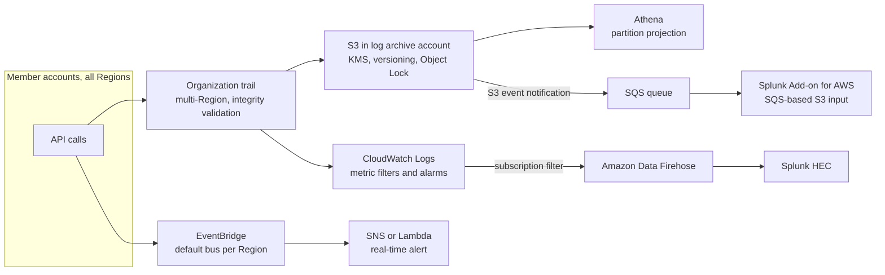

# AWS: CloudTrail

> Event types, trails vs event data stores, organization trails, log integrity, delivery to S3 and CloudWatch Logs, Athena queries, common investigations, alerting on risky API calls, shipping to Splunk, and how CloudTrail differs from CloudWatch and Config.

## Key Concepts

### What CloudTrail Records

CloudTrail records API calls made in an AWS account: from the console, CLI, SDKs, and AWS services acting for you. Each event says **who** (`userIdentity`), **what** (`eventSource`, `eventName`), **when** (`eventTime`), **from where** (`sourceIPAddress`, `userAgent`), **on what** (`requestParameters`, `resources`), and **result** (`errorCode`, `errorMessage`).

```json
{
  "eventTime": "2026-10-01T09:14:22Z",
  "eventSource": "s3.amazonaws.com",
  "eventName": "DeleteBucket",
  "awsRegion": "us-east-1",
  "sourceIPAddress": "203.0.113.10",
  "userIdentity": {
    "type": "AssumedRole",
    "arn": "arn:aws:sts::111122223333:assumed-role/AdminSSO/jane@example.com",
    "sessionContext": { "sessionIssuer": { "arn": "arn:aws:iam::111122223333:role/AdminSSO" } }
  },
  "requestParameters": { "bucketName": "payments-exports" },
  "errorCode": null
}
```

**Event history** is on by default in every account. It keeps 90 days of management events per Region, free, searchable in the console or with `lookup-events`. For anything longer, or for data events, you need a trail.

### Event Types

| Type | What it covers | Default | Cost |
| --- | --- | --- | --- |
| Management events | Control plane: `CreateBucket`, `RunInstances`, `PutRolePolicy`, `ConsoleLogin`, `AssumeRole` | Logged by a trail. Read and write events can be split. | First copy of management events per Region is free |
| Data events | Resource-level, high volume: S3 `GetObject` and `PutObject`, Lambda `Invoke`, DynamoDB item calls, and more | Off. Turn on per resource type with advanced event selectors. | Charged per event |
| Network activity events | API calls through a VPC endpoint, including ones denied by the endpoint policy | Off | Charged |
| Insights events | Unusual **API call rate** or **API error rate** compared with a baseline | Off. Turn on per trail. | Charged per events analyzed |

### Trails, Organization Trails, and Event Data Stores

- **Trail:** delivers events as gzipped JSON files to an S3 bucket, usually about 5 minutes after the call. It can also send to CloudWatch Logs. Make trails **multi-Region** so a Region you do not use cannot hide activity.
- **Organization trail:** created in the management account or a delegated admin account. It logs every member account, and member accounts cannot change or delete it. New accounts are covered automatically.
- **Event data store (CloudTrail Lake):** a managed store you query with SQL. **AWS closed CloudTrail Lake to new customers on May 31, 2026.** Existing customers can keep using it, and AWS points new users to CloudWatch for the same job. Trails and Insights are not affected.

### Integrity and Protection

- **Log file integrity validation** writes a digest file every hour. It holds SHA-256 hashes of each log file and is signed with a private key. `aws cloudtrail validate-logs` checks that no file was changed or deleted.
- Send logs to a **separate log archive account**, encrypt them with a KMS key, turn on S3 versioning and Object Lock, and block deletes with a bucket policy.
- Use an **SCP** to deny `cloudtrail:StopLogging`, `DeleteTrail`, `UpdateTrail`, and `PutEventSelectors` for everyone except a break-glass role.

### Where CloudTrail Events Go

Most teams send the same events to several places: S3 for long-term evidence, CloudWatch Logs or EventBridge for alerts, Athena for ad-hoc search, and a SIEM such as Splunk for the security team.



### CloudTrail vs CloudWatch vs AWS Config

| | CloudTrail | CloudWatch | AWS Config |
| --- | --- | --- | --- |
| Question it answers | Who did what, when, from where? | How is it performing, and is it healthy? | What does this resource look like now and before, and is it compliant? |
| Data | API call events | Metrics, logs, alarms, traces | Configuration items and history per resource |
| Example | "Who opened port 22 on sg-123?" | "CPU at 95% on the payments service" | "sg-123 allows 0.0.0.0/0 on port 22, non-compliant since Tuesday" |

They work together. Config shows the change, CloudTrail shows who made it, CloudWatch shows the impact.

TODO (Siva): add how CloudTrail is set up where you work, for example organization trail or per-account trails, and whether it goes to Splunk.

## Interview Questions

<details><summary>Q1. [Basic] What is AWS CloudTrail, and what is the difference between event history and a trail?</summary>

**Answer:**

CloudTrail is the audit log of AWS API calls. It tells you who called which API, on which resource, from which IP, and whether it worked.

- **Event history** is always on. It shows the last 90 days of management events in one Region, for free. It is good for a quick "who did this yesterday" look.
- A **trail** delivers events to S3 (and optionally CloudWatch Logs) for as long as you keep them, across all Regions, with data events and Insights if you turn them on.

```bash
aws cloudtrail lookup-events --region us-east-1 \
  --lookup-attributes AttributeKey=EventName,AttributeValue=DeleteBucket \
  --start-time 2026-09-30T00:00:00Z --max-results 20
```

**Pitfall:** event history is per Region and has no data events. If you rely on it alone, you cannot see S3 object reads or anything older than 90 days.

</details>

<details><summary>Q2. [Basic] What is the difference between management, data, and Insights events?</summary>

**Answer:**

- **Management events** are control plane changes and reads: create, delete, and modify resources, IAM changes, `AssumeRole`, console sign-in. These are what most investigations need.
- **Data events** are operations on the data inside resources: S3 object `GetObject` and `PutObject`, Lambda `Invoke`, DynamoDB item reads and writes. They are very high volume, off by default, and charged.
- **Insights events** are generated by CloudTrail when the rate of API calls or API errors is far from the normal baseline, for example a sudden spike in `DeleteObject` calls or `AccessDenied` errors.

I turn on data events selectively with advanced event selectors, for example only `PutObject` and `DeleteObject` on buckets holding sensitive data:

```json
[{
  "Name": "Sensitive S3 writes",
  "FieldSelectors": [
    { "Field": "eventCategory", "Equals": ["Data"] },
    { "Field": "resources.type", "Equals": ["AWS::S3::Object"] },
    { "Field": "readOnly", "Equals": ["false"] },
    { "Field": "resources.ARN", "StartsWith": ["arn:aws:s3:::payments-pii/"] }
  ]
}]
```

**Pitfall:** turning on all S3 data events for all buckets can cost more than the workload itself.

</details>

<details><summary>Q3. [Basic] How is CloudTrail different from CloudWatch and AWS Config?</summary>

**Answer:**

- **CloudTrail** answers "who did what". It records API calls.
- **CloudWatch** answers "how is it running". It holds metrics, logs, and alarms.
- **Config** answers "what does it look like and is it allowed". It records resource configuration over time and checks it against rules.

Example: a security group suddenly allows SSH from anywhere.

1. A Config rule flags the security group as non-compliant and shows the before and after config.
2. CloudTrail shows `AuthorizeSecurityGroupIngress` by a specific role, from a specific IP, at a specific time.
3. CloudWatch (or GuardDuty) shows whether anyone then connected.

None of them replace each other. In a mature account all three are on and sent to a central place.

</details>

<details><summary>Q4. [Intermediate] What is CloudTrail Lake, and would you use it for a new setup today?</summary>

**Answer:**

CloudTrail Lake stores events in **event data stores** and lets you query them with SQL, without building S3 plus Athena yourself. It also took events from outside AWS.

For a new setup today I would **not** start with it. AWS closed CloudTrail Lake to new customers on May 31, 2026. Existing customers keep using it, but it only gets critical fixes, and AWS recommends CloudWatch as the alternative. Existing users with only account-level event data stores should also know that new member accounts are not covered unless they have an organization event data store.

What I would build instead:

- An **organization trail** to S3 in a log archive account, which is the long-term source of truth.
- **Athena** with partition projection for SQL search over S3.
- **CloudWatch** (Logs and its newer CloudTrail ingestion) for alerting and fast queries.
- A **SIEM** such as Splunk if the security team already uses one.

**Pitfall:** do not mix up "CloudTrail Lake closed to new customers" with "CloudTrail closed". Trails, event history, and Insights are fully supported.

</details>

<details><summary>Q5. [Advanced] Design CloudTrail logging for an AWS Organization with 50 accounts. <em>(scenario)</em></summary>

**Answer:**

1. **One organization trail**, multi-Region, created from the management account or a delegated admin (often the security account). It covers every current and future account.
2. **Destination:** an S3 bucket in a dedicated **log archive** account. Bucket policy allows only CloudTrail to write, using `aws:SourceArn` for the trail. Versioning on, Object Lock in compliance mode for the retention period the auditors need, and lifecycle to cheaper storage classes.
3. **Encryption:** a customer managed KMS key in the log archive account. Key policy lets CloudTrail encrypt and only the security team and Athena roles decrypt.
4. **Integrity:** log file validation on.
5. **Event selection:** all management events. Data events only for sensitive buckets, Lambda in prod, and similar. Insights on the org trail.
6. **Protection:** SCP denying `StopLogging`, `DeleteTrail`, `UpdateTrail`, `PutEventSelectors`, and S3 deletes on the log bucket.
7. **Consumers:** Athena for search, CloudWatch Logs or EventBridge for alerts, and an SQS feed for Splunk or another SIEM.
8. **Monitoring the monitor:** alarm if no new log files arrive for an hour, and alert on any CloudTrail configuration change.

```bash
aws cloudtrail create-trail --name org-trail --s3-bucket-name org-cloudtrail-logs-111122223333 \
  --is-multi-region-trail --is-organization-trail --enable-log-file-validation \
  --kms-key-id arn:aws:kms:us-east-1:111122223333:key/...
aws cloudtrail start-logging --name org-trail
aws cloudtrail get-trail-status --name org-trail --query '{logging:IsLogging,lastDelivery:LatestDeliveryTime,err:LatestDeliveryError}'
```

**Pitfall:** member account admins cannot see or edit the org trail, so they may create their own trails "to be safe". That doubles management event cost, because only the first copy is free.

</details>

<details><summary>Q6. [Intermediate] How does log file integrity validation work, and how do you check it?</summary>

**Answer:**

With validation on, CloudTrail writes a **digest file** every hour for each Region. The digest lists the SHA-256 hash of every log file delivered in that hour, plus the hash of the previous digest, so the digests form a chain. Each digest is signed with a CloudTrail private key.

```bash
aws cloudtrail validate-logs \
  --trail-arn arn:aws:cloudtrail:us-east-1:111122223333:trail/org-trail \
  --start-time 2026-09-01T00:00:00Z --end-time 2026-10-01T00:00:00Z --verbose
```

The output says, for each file, whether it is valid, modified, or missing.

What it proves: a log file was not changed or deleted after CloudTrail delivered it. That matters for audits and legal evidence.

What it does not do: it does not stop someone deleting files. That is the job of Object Lock, bucket policies, and a separate account. Validation only tells you afterwards.

</details>

<details><summary>Q7. [Intermediate] How do you query CloudTrail logs in S3 with Athena?</summary>

**Answer:**

The CloudTrail console can create the Athena table for you. For large buckets I use a table with **partition projection** on account, Region, and date, so I do not need to run `MSCK REPAIR` or add partitions by hand.

Example: find all delete calls on S3 or EC2 in the last week.

```sql
SELECT eventtime,
       useridentity.arn       AS who,
       eventsource,
       eventname,
       sourceipaddress,
       errorcode,
       json_extract_scalar(requestparameters, '$.bucketName') AS bucket
FROM cloudtrail_logs
WHERE account = '111122223333'
  AND region = 'us-east-1'
  AND date >= '2026/09/24'
  AND eventname IN ('DeleteBucket', 'TerminateInstances', 'DeleteDBInstance')
ORDER BY eventtime DESC
LIMIT 100;
```

**Tips:**

- Always filter on partition columns first, or Athena scans the whole bucket and the query is slow and costly.
- `requestparameters` and `responseelements` are JSON strings. Use `json_extract_scalar`.
- Save common queries as named queries for the on-call runbook.

</details>

<details><summary>Q8. [Intermediate] An S3 bucket was deleted in production. How do you find out who did it? <em>(scenario)</em></summary>

**Answer:**

1. **Event history first** (fast, last 90 days). `DeleteBucket` is a management event in the bucket's Region.
   ```bash
   aws cloudtrail lookup-events --region us-east-1 \
     --lookup-attributes AttributeKey=ResourceName,AttributeValue=payments-exports \
     --query 'Events[].{time:EventTime,name:EventName,user:Username}'
   ```
2. **Read the full event.** Look at `userIdentity.type` and `arn`. For `AssumedRole`, the session name often shows the human (SSO email) or the pipeline. `sessionContext.sessionIssuer` shows the role. `sourceIPAddress` and `userAgent` show whether it was the console, Terraform, or a script.
3. **Follow the chain.** If the role was assumed by another role, search for the `AssumeRole` event that created that session (match the access key ID in `userIdentity.accessKeyId`) to find the original caller.
4. **Check what happened just before.** A bucket can only be deleted when empty, so look for `DeleteObject` data events or a lifecycle rule, and `PutBucketPolicy` changes.
5. **Recover and prevent.** Restore from replication or backups. Add an SCP or bucket policy that denies `s3:DeleteBucket` on prod buckets, and alert on it.

**Pitfall:** if the deletion came from Terraform in CI, the "who" is the CI role. Then go to the pipeline logs and the commit that changed the plan.

</details>

<details><summary>Q9. [Intermediate] A pipeline fails with <code>AccessDenied</code> on <code>sts:AssumeRole</code>. How do you use CloudTrail to find out why? <em>(scenario)</em></summary>

**Answer:**

The `AssumeRole` event is logged in the account that owns the **target role**, and for most failures it includes `errorCode: AccessDenied`.

```sql
SELECT eventtime, useridentity.arn, sourceipaddress, errorcode, errormessage,
       json_extract_scalar(requestparameters, '$.roleArn') AS target_role
FROM cloudtrail_logs
WHERE eventsource = 'sts.amazonaws.com'
  AND eventname IN ('AssumeRole', 'AssumeRoleWithWebIdentity')
  AND errorcode IS NOT NULL
  AND date >= '2026/10/01'
ORDER BY eventtime DESC;
```

Then I check, in this order:

1. **Trust policy** of the target role: is the caller's role ARN, account, or OIDC `sub` claim allowed? For GitHub OIDC, a branch or environment mismatch in `sub` is the most common cause.
2. **Caller's identity policy:** does it allow `sts:AssumeRole` on that role ARN?
3. **Conditions:** `sts:ExternalId`, `aws:MultiFactorAuthPresent`, source IP, or required session tags.
4. **SCPs or permission boundaries** in either account that deny STS.
5. **Regional STS:** if regional STS endpoints are turned off for that Region in the account, calls fail there.

**Pitfall:** look in the right account and Region. The event shows up where the role lives and in the Region of the STS endpoint that was called, not always where the pipeline runs.

</details>

<details><summary>Q10. [Advanced] How do you detect and alert on root account sign-in? <em>(scenario)</em></summary>

**Answer:**

Root use should be rare and always a surprise worth paging on.

**Option 1: EventBridge rule** (near real time):

```json
{
  "detail-type": ["AWS Console Sign In via CloudTrail", "AWS API Call via CloudTrail"],
  "detail": { "userIdentity": { "type": ["Root"] } }
}
```

Target an SNS topic or a Lambda that posts to the incident tool. Sign-in and IAM-related events often land in us-east-1, so I create the rule there and in the Regions we use, or forward events from all Regions to one bus.

**Option 2: CloudWatch Logs metric filter** on the trail's log group (this is a CIS benchmark control):

```text
{ $.userIdentity.type = "Root" && $.userIdentity.invokedBy NOT EXISTS && $.eventType != "AwsServiceEvent" }
```

Then a CloudWatch alarm with threshold 1 on that metric.

**Prevention around it:** MFA on root (hardware key), no root access keys, root credentials in a sealed break-glass process, and in AWS Organizations centralized root access management so member accounts have no root password at all.

**How to verify:** test in a sandbox account. Sign in as root and confirm the alert fires within minutes.

</details>

<details><summary>Q11. [Advanced] Which risky API calls would you alert on, and how do you avoid alert fatigue?</summary>

**Answer:**

High-signal calls I alert on:

| Area | Events |
| --- | --- |
| Logging tampering | `StopLogging`, `DeleteTrail`, `UpdateTrail`, `PutEventSelectors`, `DeleteFlowLogs`, GuardDuty `DeleteDetector` |
| Identity | `CreateUser`, `CreateAccessKey`, `AttachUserPolicy` or `PutRolePolicy` with admin, `UpdateAssumeRolePolicy` on sensitive roles, root activity |
| Exposure | `PutBucketPolicy` or `PutBucketAcl` making data public, `DeletePublicAccessBlock`, `AuthorizeSecurityGroupIngress` with `0.0.0.0/0` on admin ports |
| Keys and data | KMS `ScheduleKeyDeletion`, `DisableKey`, `DeleteDBSnapshot`, `ModifySnapshotAttribute` sharing snapshots outside the org |
| Spend and abuse | `RunInstances` in Regions you do not use, large GPU instance launches |
| Auth failures | Bursts of `AccessDenied` or failed `ConsoleLogin` |

Avoiding fatigue:

- Page only on tampering, root, and public exposure in prod. Send the rest to a ticket queue or a daily report.
- Filter out known automation roles, but alert if those roles act from an unexpected IP or user agent.
- Use Insights events and GuardDuty for "unusual" patterns instead of hand-tuned thresholds.
- Prefer **preventing** with SCPs over alerting. An SCP that denies `StopLogging` beats an alert after the fact.

TODO (Siva): list any CloudTrail-based alerts you have built or tuned in your current role.

</details>

<details><summary>Q12. [Intermediate] How do you ship CloudTrail logs to Splunk?</summary>

**Answer:**

Shipping CloudTrail into Splunk is a common pattern, because the security team already searches and alerts there. Two main designs:

**1. Pull from S3 with SQS (most common for org trails):**

- The org trail writes to S3 in the log archive account.
- S3 event notifications (directly or through SNS) go to an SQS queue, with a dead-letter queue.
- The **Splunk Add-on for AWS** uses the "SQS-based S3" input. It reads a message, downloads the new log file, and indexes it as `sourcetype=aws:cloudtrail`.
- The Splunk side uses an IAM role that can read the bucket, decrypt with the KMS key, and receive and delete SQS messages.

**2. Push through Firehose:**

- The trail sends to CloudWatch Logs.
- A subscription filter sends to Amazon Data Firehose.
- Firehose delivers to a Splunk HTTP Event Collector (HEC) endpoint, with failed records backed up to S3.

| | SQS-based S3 | Firehose to HEC |
| --- | --- | --- |
| Latency | Minutes (S3 delivery delay plus polling) | Lower, but CloudWatch Logs adds cost |
| Scale | Add more inputs or workers | Firehose scales itself |
| Replay | Easy, files stay in S3 | From the S3 backup |

Example search once data is in:

```text
index=aws sourcetype=aws:cloudtrail eventName=StopLogging OR eventName=DeleteTrail
| table _time userIdentity.arn sourceIPAddress awsRegion recipientAccountId
```

**Pitfalls:** watch the SQS queue age and DLQ depth so you notice when ingestion stops. Filter or route noisy read-only events, because Splunk licensing is usually by ingested volume.

See also [logging tools](../monitoring-tools/04-logging.md).

</details>

<details><summary>Q13. [Advanced] An access key was leaked on GitHub. How do you use CloudTrail to scope the damage? <em>(scenario)</em></summary>

**Answer:**

**Contain first:** deactivate the key (`aws iam update-access-key --status Inactive`), do not delete it yet, so its ID stays easy to search for. If it belongs to a role session, revoke active sessions for that role.

**Then investigate with CloudTrail**, across all Regions, from the time the key was exposed:

```sql
SELECT eventtime, awsregion, eventsource, eventname, sourceipaddress, useragent, errorcode
FROM cloudtrail_logs
WHERE useridentity.accesskeyid = 'AKIAEXAMPLE123'
  AND date >= '2026/09/28'
ORDER BY eventtime;
```

What I look for:

- **Recon:** `GetCallerIdentity`, `ListBuckets`, `DescribeInstances`, often with `AccessDenied` errors.
- **Persistence:** `CreateUser`, `CreateAccessKey`, `CreateLoginProfile`, new roles, or changed trust policies. These must be removed too, or the attacker stays in.
- **Abuse:** `RunInstances` (crypto mining) in Regions you do not normally use.
- **Data access:** S3 `GetObject` data events, if they were turned on. If not, you may not be able to prove what was read, which is a strong argument for data events on sensitive buckets.
- **Pivoting:** `AssumeRole` calls from this key, and then the activity of those sessions.

**Close out:** remove everything the attacker created, rotate anything the key could read, check GuardDuty findings and billing, write the timeline, and fix the root cause (secret scanning in CI, no long-lived keys, OIDC for pipelines).

</details>

<details><summary>Q14. [Intermediate] Why didn't an EventBridge rule fire for a CloudTrail event you expected?</summary>

**Answer:**

Things I check:

1. **Region:** EventBridge gets CloudTrail events in the Region where the call was made. Global services like IAM report in us-east-1. A rule in eu-west-1 will not see them.
2. **Read-only events:** `Get`, `List`, and `Describe` calls are not matched by a normal rule. The rule state must be `ENABLED_WITH_ALL_CLOUDTRAIL_MANAGEMENT_EVENTS`.
3. **Data events:** these only reach EventBridge if a trail logs them.
4. **Pattern mistakes:** `detail-type` must be exactly `AWS API Call via CloudTrail`, and field names are case sensitive.
5. **Target permissions:** SNS topic or Lambda resource policy must allow `events.amazonaws.com`. Check the rule's `FailedInvocations` metric.

**How to verify:** use `aws events test-event-pattern` with a real event copied from CloudTrail, then trigger the API call in a sandbox.

</details>

See also: [monitoring and troubleshooting](04-monitoring-and-troubleshooting.md), [AWS and Azure monitoring](../monitoring-tools/08-aws-and-azure-monitoring.md), [IAM best practices](03-networking-security-and-iam.md), [SSM and Session Manager](08-ssm-parameter-store.md).
