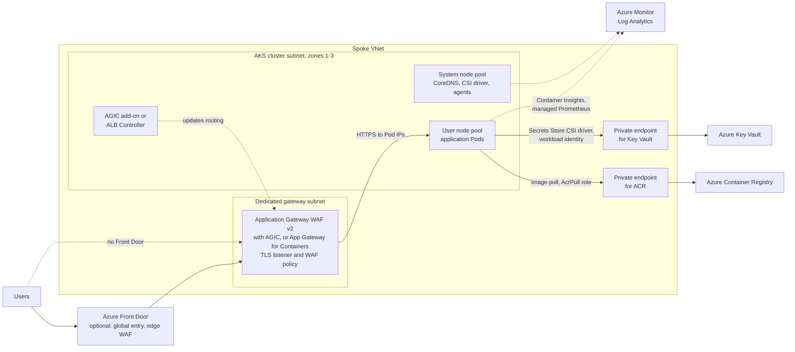

# Azure: Compute and Application Hosting

> App Service and App Service Plans, Azure Functions and triggers, virtual machines and scale sets, Azure Container Registry, and running microservices on AKS.

## Key Concepts

### Azure App Service Web Apps

Azure Web Apps is a managed platform for building, deploying, and scaling web applications and APIs.

**Key capabilities**

- Supports common runtimes such as .NET, Java, Node.js, Python, and PHP.
- Supports deployment from GitHub, Azure DevOps, local Git, and other CI/CD systems.
- Provides custom domains, TLS, authentication integration, deployment slots, monitoring, scaling, and backups depending on the plan.
- Integrates with Visual Studio and Visual Studio Code.

**Common use cases**

- Business web applications and REST APIs
- E-commerce applications
- Blogs and content-management systems

**Interview summary:** Choose Web Apps when an HTTP application needs a continuously available managed hosting environment. Choose Functions when execution is primarily event-driven and can be broken into individual operations.

### Azure Functions

Azure Functions is an event-driven compute service. A function runs code in response to an event without requiring the application team to manage servers.

**Good use cases**

- Lightweight APIs and webhooks
- Queue and event processing
- Scheduled background work
- File and image processing
- Data validation and transformation
- Small integration components

**Advantages**

- Automatic or elastic scaling, depending on the hosting plan
- Consumption-based options for intermittent workloads
- Fast development for small, event-focused components
- Native integration with many Azure services

**Considerations**

- Cold starts may affect latency on some hosting plans.
- Execution and timeout behavior depends on the chosen plan.
- Stateful or long-running workflows need an appropriate pattern, such as Durable Functions.
- Distributed functions need good logging, correlation, retries, and idempotency — meaning it's safe to run the same operation more than once.

**Example flow:** A user uploads a photo to Blob Storage. A Function is triggered, validates or transforms the image, calls an API, and writes metadata to a database.

### Common Azure Function Triggers

#### HTTP trigger

Runs when the function receives an HTTP request.

- Use for APIs, webhooks, and synchronous actions.
- Example: an HR application calls `/api/send-welcome-email` when an employee joins.

#### Timer trigger

Runs according to a schedule.

- Use for cleanup, synchronization, reporting, and recurring maintenance.
- Example: synchronize data from an external API to SQL every night.

#### Queue trigger

Runs when a message is available in an Azure Storage Queue.

- Use for asynchronous background processing.
- Example: process an invoice message and send a billing email.

#### Blob trigger

Runs when a blob is created or updated in a monitored container.

- Image/video processing: generate thumbnails, compress, or transcode.
- Data ingestion: process uploaded CSV or JSON files.
- Document processing: run OCR or extract invoice fields.
- Backup or replication: copy new files to another location.
- Event automation: generate alerts or start downstream work.

**Combined onboarding example**

1. An HTTP-triggered Function accepts a new employee request.
2. It places a message in a welcome-email queue.
3. A queue-triggered Function sends the email asynchronously.
4. A timer-triggered Function checks incomplete onboarding tasks nightly.

### When Serverless Is a Good Fit

Use serverless for event-driven systems, variable or intermittent workloads, automation, small APIs, and independently scalable processing steps.

Consider another hosting model when workloads require consistently low latency, long-running processes, extensive local state, or predictable sustained compute where another pricing model is more economical.

### Azure Functions and Virtual Machines

**Azure Functions** is event-driven serverless compute. Common triggers are HTTP, timer, Blob, queue, and Event Grid.

It's a strong fit for short-lived APIs, automation, scheduled work, notifications, and event processing. Choose the plan, timeout, memory, concurrency, retry and dead-letter behavior, identity, secret access, and observability deliberately — don't just take the defaults.

It's not automatically the best fit for anything long-running, stateful, or connection-heavy.

**Azure Virtual Machines** give you operating-system control, for legacy applications, custom software, migration workloads, self-managed tools, and development environments.

They need patching, image management, endpoint protection, backup, monitoring, least-privilege access, and capacity planning.

Use private IPs by default, and reach VMs through Azure Bastion or controlled just-in-time administration instead of exposing RDP or SSH publicly. Use VM Scale Sets when you're scaling identical instances horizontally.

A VM that's just stopped can still cost you in compute charges. **Stopped (deallocated)** actually releases that compute allocation — though disks and other attached resources still cost money on their own.

### Virtual Machine Scale Sets

VM Scale Sets run a group of identically configured VMs, and tie into load balancing, health checks, autoscale, and rolling upgrades. Scaling out adds instances once demand crosses a threshold you've set; scaling in removes the extra capacity once things settle down.

A production setup needs minimum, maximum, and default capacity, health probes, a zone or fault-domain strategy, instance repair, graceful termination, image versioning, health gates during rolling upgrades, and enough time for the application to actually start up.

Autoscaling won't fix inefficient code or an overloaded database. Check end-to-end latency, queue depth, dependency limits, and cost after scaling, not just before. For events you can predict, scheduled scaling can add capacity ahead of the traffic instead of reacting to it.

### AKS Microservices Reference Architecture

An Azure microservices platform can use Azure DevOps to build, test, scan, and publish container images to Azure Container Registry (ACR). Each image is immutable — once published, it never changes; a new version just gets a new tag. AKS pulls those images using a managed identity or workload identity with the narrow `AcrPull` permission.

Helm packages the Kubernetes manifests and environment values. A deployment pipeline or GitOps controller then promotes that same chart and image digest through each environment.

```text
developer -> Azure DevOps CI -> ACR
                              -> Helm/GitOps -> AKS
internet -> Front Door/WAF or Application Gateway -> AKS ingress/Gateway -> Services -> Pods
Pods -> Key Vault / Cosmos DB / Redis / Service Bus through private networking
Pods -> Azure Monitor, Log Analytics and Application Insights
```

Use an AKS-supported CNI and data-plane configuration and enforce NetworkPolicy, but check what Cilium and policy features are actually supported for the AKS version you're running.

Keep secrets in Key Vault and pull them in through workload identity, the CSI driver, or an approved external-secrets pattern. Don't store long-lived cloud credentials in Helm values.

A production design also needs resource requests and limits, probes, autoscaling, PodDisruptionBudgets, an image-signing and scanning policy, RBAC, backup and recovery, and a rollback path that's actually been tested.

### AKS Microservices Architecture

**Core components:**

- **AKS cluster:** A managed Kubernetes control plane, with node pools sized and separated to match each workload's needs.
- **Virtual Network:** The private network boundary for nodes, Pods, private endpoints, and any controlled connection back to on-premises systems.
- **Azure Container Registry:** Private storage for container images that have been scanned and signed. AKS pulls them using managed identity and RBAC.
- **Ingress and Azure Load Balancer/Application Gateway:** Handles external entry, TLS termination, routing, health checks, and an optional web application firewall.
- **Azure Pipelines:** Builds, tests, and scans the code, publishes an image that won't change once tagged, and promotes releases that have passed review.
- **Helm:** Packages Kubernetes resources and environment-specific values, and keeps a versioned history so upgrades and rollbacks are possible.
- **Azure Monitor:** Collects monitoring data from the control plane, nodes, containers, applications, logs, metrics, and traces.

**Deployment flow:**

1. Provision the VNet, AKS, ACR, identity, private DNS, ingress, monitoring, and policies through reviewed infrastructure-as-code.
2. Build and scan each microservice image, then push its digest (a fixed, unchangeable reference to that exact image) to ACR.
3. Validate and deploy versioned Helm charts, with readiness and startup probes and realistic resource requests.
4. Send a small amount of traffic to the new version, run smoke and business tests, and watch errors, latency, how close resources are to their limits, and the health of dependencies.
5. Either promote gradually, or roll back the traffic and the release if the health checks fail.

A production setup also needs zone distribution, autoscaling, PodDisruptionBudgets, NetworkPolicies, workload identity, secrets pulled from an external store, backup and restore, certificate rotation, cost controls, and a regional recovery plan that's actually been tested.

### AKS Behind Application Gateway with WAF

Application Gateway WAF v2 is the public HTTPS entry point. It ends TLS, checks every request against the WAF policy, and sends clean traffic straight to Pod IPs in AKS. The AGIC add-on (or the ALB Controller, if you use the newer Application Gateway for Containers resource) watches Ingress or Gateway API objects and keeps the gateway routing in sync with the cluster. Front Door is optional and adds a global entry point, CDN, and edge WAF in front of one or more regions.



Keep the system node pool for cluster add-ons only (use the `CriticalAddonsOnly` taint) and run application Pods on user node pools, so a noisy app cannot starve CoreDNS or the CSI driver.

## Interview Questions

<details><summary>Q1. [Intermediate] How do you deploy applications to Azure Kubernetes Service?</summary>

**Answer:**

My delivery flow:

1. Build and test the application.
2. Create a minimal container image, generate an SBOM (a list of everything that went into the image), and scan it.
3. Push a digest — a fixed reference to that exact image — to Azure Container Registry.
4. Deploy to AKS using Helm, plain manifests, or GitOps with Flux or Argo CD.
5. Use workload identity and the Key Vault CSI driver for Azure access and secrets.
6. Set requests and limits, probes, Pod security, NetworkPolicy, horizontal autoscaling, and a PodDisruptionBudget.
7. Wait for the rollout, run smoke tests, and watch for errors and latency.

If a rollout fails, I check `kubectl describe`, the events, current and previous logs, whether the image pulled, configuration, probes, scheduling, and dependencies. If user impact is growing, I roll back the traffic or the release, keep the evidence, fix it in a lower environment, then redeploy a fresh, unchanged version.

</details>

<details><summary>Q2. [Basic] What is Azure Container Registry?</summary>

**Answer:**

ACR is a private registry for container images and related artifacts. It supports repositories, geo-replication on the right tiers, build tasks, webhooks, retention and isolation features, and integration with Azure identity.

CI builds and scans an image, pushes it with a digest (a fixed reference that always points to that exact image) using workload identity, signs it, and deployments reference that digest directly. AKS pulls it through managed identity with the `AcrPull` role — nobody shares the registry's admin password.

I restrict public and network access where needed, apply repository permissions, retention rules, auditing, and a vulnerability-scanning workflow. When I see `ImagePullBackOff`, I check the image tag and digest, the registry login and role, network and private DNS settings, node architecture, and the pod's events.

</details>

<details><summary>Q3. [Basic] What are Azure Virtual Machines?</summary>

**Answer:**

Azure VMs are infrastructure-as-a-service compute. Azure runs the physical hardware and the hypervisor; I manage the guest OS, patches, software, configuration, identity, disks, and recovery of the workload itself. VMs attach network interfaces to a VNet and use managed disks for storage.

I reach for VMs when I need legacy software, control over the OS or kernel, an unsupported runtime, or a straightforward lift-and-shift. In production I use Availability Zones or sets as needed, load balancing, backups, monitoring, patch management, managed identity, and infrastructure-as-code. A single VM is a single point of failure.

When something's wrong, I start with Azure's own resource and boot diagnostics and the Activity Log, then move into guest-level CPU, memory, disk, network, and service logs. I always separate "Azure itself has a problem" from "the OS or app has a problem" before I reach for a reboot.

</details>

<details><summary>Q4. [Intermediate] How do you secure Azure Virtual Machines?</summary>

**Answer:**

I keep VMs private and reach them through Bastion, VPN, ExpressRoute, or another controlled jump path. I never expose RDP or SSH to the open internet. Network security groups and firewalls only allow the traffic that's actually needed. Signing in through Entra with managed identity, plus RBAC scoped to the minimum needed, cuts down on stored credentials.

I use hardened images, keep patches and updates current, encrypt disks, turn on Secure Boot and vTPM where supported, run endpoint protection or Defender, scan for vulnerabilities, take backups, and send logs somewhere central. Secrets come from Key Vault, not from the VM itself.

I watch for privileged sign-ins, changes to network security group rules, new public IPs, malware alerts, and patch compliance. I also test that recovery actually works.

If I suspect a VM has been compromised, I cut off its network access, preserve evidence following the incident procedure, rotate any credentials it could reach, rebuild from a trusted image, and investigate properly — I don't just reboot it and hope.

</details>

<details><summary>Q5. [Basic] How do you resize an Azure VM, and does it require a reboot?</summary>

**Answer:**

In the portal, select the VM, open **Size** under Availability + scale, pick a compatible size, and apply it — the same thing can be done through the CLI or infrastructure-as-code. A resize normally restarts the VM.

If the size you want isn't available on the current hardware cluster, Azure may need to stop and deallocate the VM first, which releases any dynamic public IP unless it's set up as static.

Before resizing, I check the application's maintenance windows, disk and network compatibility, availability-set or zone constraints, capacity, cost, backups, and how to roll back if needed.

</details>

<details><summary>Q6. [Basic] Can an OS disk be removed from an Azure VM?</summary>

**Answer:**

You can't just detach the OS disk from a running VM the way you'd detach an ordinary data disk. Azure supports an OS-disk swap for a stopped VM in supported scenarios, and you can build a replacement VM from a managed-disk snapshot or image.

I take an application-consistent backup first, confirm what the actual recovery goal is, and use the documented swap or rebuild process rather than attempting a destructive detach.

</details>

<details><summary>Q7. [Basic] Are you charged for an Azure VM that is stopped but not deallocated?</summary>

**Answer:**

Yes. A VM that's stopped from inside the guest OS, or that shows as **Stopped**, can still hold onto its compute allocation and keep incurring compute charges. **Stopped (deallocated)** actually releases that allocation and stops the compute charges — though managed disks, snapshots, public IPs, and other attached resources can still cost money.

I use scheduled deallocation for non-production workloads, and I check the actual power state and the cost of anything still attached, rather than assuming "stopped" means "not costing anything."

</details>

<details><summary>Q8. [Basic] What is Azure App Service?</summary>

**Answer:**

App Service is a managed platform for hosting web apps and APIs. Azure runs the OS and runtime; teams deploy their code or container and configure the plan, scaling, domains and TLS, identity, networking, diagnostics, and application behavior.

In production I use multiple instances or zones where they're available, a health check, autoscale, managed identity with Key Vault references, VNet integration or private endpoints as needed, deployment slots, and Application Insights.

I deploy to a slot, warm it up and test it, then swap it into production — keeping database changes backward-compatible so the swap doesn't break anything. When something fails, I check deployment logs, app logs, instance health, configuration, identity, DNS and networking, dependencies, and platform metrics before I roll back or swap.

</details>

<details><summary>Q9. [Basic] What is the difference between App Service, App Service Plan and Web App?</summary>

This is one of the most common Azure interview questions. Many people confuse these three terms because they are closely related.

Think of it like an apartment building:

- **App Service Plan** = the building (CPU, RAM, OS, pricing tier)
- **Web App** = your apartment (your application)
- **App Service** = the overall Azure platform that hosts web applications, APIs, mobile backends, etc.

#### 18.1 Azure App Service

App Service is Microsoft's PaaS (Platform as a Service) offering for hosting web applications. It provides everything required to run an application without managing servers.

It includes features like:

- Auto scaling
- Load balancing
- SSL certificates
- Deployment slots
- Authentication
- Custom domains
- Backup and restore
- Monitoring
- CI/CD integration

So App Service is the service itself.

Instead of creating VMs, installing IIS or Nginx, configuring networking, and maintaining the OS, Azure App Service handles all of that.

#### 18.2 App Service Plan

The App Service Plan defines the infrastructure on which your applications run.

It decides:

- CPU
- RAM
- OS (Windows / Linux)
- Region
- Pricing tier
- Number of instances
- Scaling

Think of it as: *"How much hardware do I want?"*

Example:

```
App Service Plan

Premium V3
Linux
East US
4 CPUs
16 GB RAM
```

Every Web App inside this plan shares these resources.

**One App Service Plan can host multiple apps**

```
App Service Plan
Premium V3
Linux
4 CPU
16 GB RAM

        |
        +-- Web App A
        +-- Web App B
        +-- API App
        +-- Function App (Premium)
```

All these applications share the same compute resources.

#### 18.3 Web App

A Web App is the actual application you deploy.

Examples:

- Company website
- React application
- Angular application
- ASP.NET application
- Node.js application
- Java application
- Python Flask application

When you open:

```
https://mycompany.azurewebsites.net
```

you're accessing a Web App.

#### 18.4 Real-world example

Suppose your company has three applications: Customer Portal, Admin Portal and a REST API.

You create:

```
App Service Plan
Premium V3
8 GB RAM
Linux

        |
        +-- Customer Portal (Web App)
        +-- Admin Portal (Web App)
        +-- Orders API (Web App)
```

All three apps run on the same App Service Plan and share the same compute resources.

**If one app uses high CPU?**

```
Customer Portal
CPU = 90%
```

Since all apps share the same App Service Plan:

- Admin Portal performance may degrade.
- API performance may also degrade.

That's why production workloads often use separate App Service Plans for critical applications.

#### 18.5 Common follow-up questions

**Can one App Service Plan have apps from different subscriptions?**

No. Apps in an App Service Plan must belong to the same subscription.

**Can multiple App Service Plans exist?**

Yes.

```
Development Plan
B1

Testing Plan
S1

Production Plan
Premium V3
```

Each plan has different resources and pricing.

**Can two Web Apps share one App Service Plan?**

Yes. Multiple Web Apps can share a single App Service Plan, and they share the underlying compute resources (CPU, memory, and storage). This is cost-effective, but heavy resource usage by one app can affect the others.

#### 18.6 Scaling

**Scale Up** - increase VM size.

```
B1
 |
S1
 |
P1V3
 |
P2V3
```

More CPU and RAM.

**Scale Out** - increase the number of instances.

```
Instance 1
Instance 2
Instance 3
```

Azure's load balancer distributes traffic across them.

#### 18.7 Quick comparison

| Feature | App Service | App Service Plan | Web App |
|---|---|---|---|
| What is it? | Azure hosting platform | Compute resources | Your application |
| Contains | Web Apps, API Apps, etc. | CPU, RAM, OS, pricing | Application code |
| Billing | Through the plan | Yes | No separate compute charge |
| Scaling | Supported | Defines scale | Uses the plan's resources |
| Multiple apps? | Yes | Yes | One application |

#### 18.8 Easy way to remember

Imagine renting office space:

- **App Service** = the business park that provides facilities and management.
- **App Service Plan** = the office building you rent (size, capacity, cost).
- **Web App** = your company's office operating inside that building.

The building determines how much space and power you have, while your office is the actual business running inside it.

</details>

<details><summary>Q10. [Basic] What are Azure Functions?</summary>

**Answer:**

Azure Functions runs code in response to events — HTTP requests, timers, queues, blobs, Event Grid, Service Bus, and more. Bindings handle a lot of the input and output plumbing for you. The hosting plan you pick determines scaling, cold-start behavior, networking, run duration, and cost.

For example: a blob upload triggers a Function that validates and processes it, writes a status to a database, and sends failures to a dead-letter path. Because events can be delivered more than once, the function is written so that running it twice causes no harm, and any external calls it makes use limited retries and correlation IDs.

I configure managed identity, Key Vault access, Application Insights, timeouts, concurrency, alerts, and failure handling. Durable Functions is the right tool when the workflow needs orchestration or state.

</details>

<details><summary>Q11. [Basic] What is the difference between App Service and Azure Functions?</summary>

**Answer:**

App Service hosts a web app or API that runs continuously, with its own application process and plan. Functions organizes code around triggers and events, and can scale execution up or down based on those events. Both are managed platforms, and they share some capabilities and plans under the hood.

I choose App Service for a full web application or API that needs to always be on, with routing, slots, and longer-lived requests. I choose Functions for queue, timer, blob, or event handlers, or a small API where scaling by trigger makes sense.

I weigh cold start, run duration, state, networking, runtime, throughput, and cost.

An architecture can use both at once: App Service serves the API, while queue-triggered Functions handle the asynchronous work behind it.

</details>
