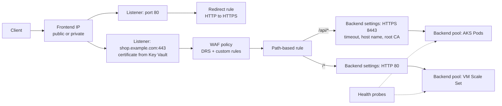

# Azure: Application Gateway and WAF

> How Application Gateway v2 routes HTTP(S) traffic, how TLS and health probes work, how to run a WAF v2 policy safely, how it fits with AKS and Front Door, and how to read WAF logs with KQL.

## Key Concepts

### Building blocks of Application Gateway v2

Application Gateway is a regional Layer-7 load balancer. It lives in its own dedicated subnet inside your VNet. A request passes through these parts in order:

- **Frontend IP:** a public IP, a private IP, or both.
- **Listener:** a frontend IP + port + protocol, and for HTTPS a certificate. A **basic** listener accepts any host name. A **multi-site** listener matches one or more host names, so many apps can share one gateway.
- **Routing rule:** links a listener to a backend. A **basic** rule sends everything to one pool. A **path-based** rule uses a URL path map, for example `/api/*` to one pool and `/*` to another. Rules have a priority (1 = highest).
- **Backend pool:** the targets. VMs, VM Scale Sets, App Service, IP addresses, or FQDNs (for example AKS Pod IPs added by a controller).
- **Backend settings:** how the gateway talks to the pool: protocol, port, request timeout (default 20 seconds), cookie affinity, connection draining, host name override, and the trusted root certificate for HTTPS.
- **Health probe:** checks every backend. The default probe calls `/` and expects a status from 200 to 399. A custom probe lets you set the path, host, interval, and the status codes to accept.
- **Rewrite rules and redirects:** change headers or URLs, or redirect HTTP to HTTPS.



### SKUs and sizing

Use the **Standard_v2** or **WAF_v2** SKU. The v1 SKUs are retired. v2 gives autoscaling, zone redundancy, a static public IP, Key Vault certificates, header rewrites, and better performance.

- Set a **minimum instance count** so the gateway is warm before a traffic spike. Autoscale adds capacity units, but it takes a few minutes.
- Microsoft recommends a **/24 subnet** for v2 so the gateway has room to scale and to upgrade. Nothing else may live in that subnet.
- Deploy across **zones 1, 2, 3** in regions that have zones.

### TLS termination and end-to-end TLS

- **TLS termination (offload):** the client's TLS session ends at the gateway. The gateway sees the plain request, so the WAF can inspect it. Traffic to the backend can be HTTP.
- **End-to-end TLS:** the gateway ends the client TLS session, inspects the request, then opens a **new** TLS session to the backend. The backend settings must use HTTPS, and the backend certificate must chain to a trusted root CA. If the backend uses a private CA, upload that root CA to the backend settings.
- **SNI and host name:** the gateway sends a host name (SNI) to the backend. The backend certificate's CN or SAN must match it. Use "override with specific domain name" or "pick host name from backend target" in backend settings.
- **TLS policy:** choose a predefined or custom policy with TLS 1.2 as the minimum (TLS 1.3 is supported on v2).
- **Certificates from Key Vault:** give the gateway a user-assigned managed identity with the `Key Vault Secrets User` role. Reference the secret ID without a version, so the gateway picks up renewed certificates automatically.

### WAF v2 policy

A WAF policy is a separate resource. You can link it to the whole gateway, to one listener, or to one path. A more specific policy wins.

- **Managed rule sets:** Microsoft's **Default Rule Set (DRS)** is based on the OWASP Core Rule Set (CRS). DRS 2.2 is the current recommended version (built on OWASP CRS 3.3.4); DRS 2.1 is still common. Older CRS 3.x versions are legacy. You can also add the **Bot Manager** rule set.
- **Anomaly scoring:** in DRS 2.x and CRS 3.x, one matched rule does not block a request by itself. Each match adds points (Critical 5, Error 4, Warning 3, Notice 2). If the total reaches 5, the request is blocked.
- **Detection vs Prevention mode:** Detection logs what would be blocked and lets the request through. Prevention blocks and returns 403. Start in Detection, tune, then switch to Prevention.
- **Custom rules:** your own rules that run **before** managed rules. Use them for IP allow/block lists, geo filtering, rate limiting, or blocking a bad header. Lower priority number runs first.
- **Exclusions:** skip a specific request field (for example a `RequestCookieNames` value) for one rule or rule group. Keep them narrow.
- **Request body limits:** body inspection and size limits are set per policy.

### Application Gateway for Containers vs AGIC

Both connect AKS to an Azure Layer-7 load balancer, but they are different products.

| Point | AGIC (add-on or Helm) | Application Gateway for Containers (AGC) |
| --- | --- | --- |
| Data plane | A normal Application Gateway v2 | A separate resource built for Kubernetes |
| Kubernetes API | Ingress API | Gateway API and Ingress API |
| Controller | AGIC Pod rewrites the gateway's full config | ALB Controller in the cluster, near real-time updates |
| Traffic splitting, header routing | Limited | Built in (weighted routes, header matching) |
| WAF | WAF_v2 policy on the gateway | WAF policy linked through a `WebApplicationFirewallPolicy` custom resource; DRS 2.1 only today |
| Status | Supported, but Microsoft recommends planning a move | The recommended path for new AKS ingress |

### Front Door vs Application Gateway

| Point | Azure Front Door | Application Gateway |
| --- | --- | --- |
| Scope | Global, runs at Microsoft edge locations | Regional, runs in your VNet |
| Main use | Global entry, multi-region failover, CDN caching, edge WAF | Regional Layer-7 routing to private backends |
| Backend reach | Public origins, or private origins through Private Link (Premium) | Private IPs inside the VNet or peered VNets |
| WAF | Front Door WAF policy (different resource type) | Application Gateway WAF policy |

Many production designs use both: Front Door for global routing and edge WAF, and Application Gateway in each region in front of AKS or VMs. Lock the gateway so it only accepts traffic from Front Door: allow the `AzureFrontDoor.Backend` service tag in the NSG, and check the `X-Azure-FDID` header with a WAF custom rule.

### Diagnostics and WAF logs

Turn on diagnostic settings for the gateway and send them to Log Analytics. Pick **resource-specific** tables where available:

- `AGWAccessLogs` – every request, status code, backend, and time taken.
- `AGWFirewallLogs` – WAF matches with rule ID, action, and message.
- Metrics such as `UnhealthyHostCount`, `FailedRequests`, `ResponseStatus`, and `BackendLastByteResponseTime`.

Older setups use the shared `AzureDiagnostics` table with `Category == "ApplicationGatewayFirewallLog"`.

```kusto
// Top WAF rules that blocked requests in the last 24 hours
AGWFirewallLogs
| where TimeGenerated > ago(24h)
| where Action == "Blocked"
| summarize hits = count() by RuleId, Message, RequestUri
| top 20 by hits
```

## Interview Questions

<details><summary>Q1. [Basic] What are the main components of Azure Application Gateway?</summary>

**Answer:**

- **Frontend IP:** where clients connect (public, private, or both).
- **Listener:** IP + port + protocol, plus a certificate for HTTPS. Multi-site listeners match host names.
- **Routing rule:** connects a listener to backend settings and a backend pool. Can be basic or path-based.
- **Backend pool:** VMs, scale sets, App Service, IPs, or FQDNs.
- **Backend settings:** protocol, port, timeout, affinity, host name, and trusted root certificate.
- **Health probe:** removes unhealthy targets from rotation.

The gateway sits in its own subnet. Nothing else can be deployed in that subnet.

</details>

<details><summary>Q2. [Basic] What is the difference between a basic listener and a multi-site listener?</summary>

**Answer:**

A **basic** listener accepts every request on its IP and port, whatever the host name is. A **multi-site** listener only accepts requests whose `Host` header matches the host names you set (wildcards like `*.example.com` are allowed).

With multi-site listeners, one gateway can serve many apps on port 443. Each listener has its own certificate and its own rule. Give multi-site rules a higher priority (lower number) than a basic catch-all rule, or the catch-all will take the traffic first.

</details>

<details><summary>Q3. [Basic] What is the difference between WAF Detection mode and Prevention mode?</summary>

**Answer:**

- **Detection:** the WAF checks every request and writes matches to the firewall log, but it lets the request through.
- **Prevention:** the WAF blocks requests whose anomaly score reaches the threshold and returns HTTP 403.

The safe rollout is: start in Detection, watch the logs with real traffic for some days, fix false positives with narrow exclusions or app changes, then switch to Prevention. Keep watching the logs after the switch.

</details>

<details><summary>Q4. [Intermediate] How do you set up end-to-end TLS on Application Gateway?</summary>

**Answer:**

1. Create an HTTPS listener with the public certificate, stored in Key Vault and read by a user-assigned managed identity.
2. In the backend settings, choose HTTPS and the backend port.
3. If the backend certificate comes from a well-known public CA, v2 trusts it. If it comes from a private CA, upload the private **root CA** certificate to the backend settings.
4. Make sure the host name the gateway sends (SNI) matches the backend certificate's CN or SAN. Use "override with specific domain name" or "pick host name from backend target".
5. Use a custom HTTPS probe with the same host name.

```bash
az network application-gateway http-settings update \
  --resource-group rg-app --gateway-name agw-prod --name be-https \
  --protocol Https --port 8443 \
  --host-name api.internal.example.com \
  --root-certs private-root-ca
```

**How to verify:** backend health shows Healthy. If it shows a certificate error, the message tells you whether the problem is trust or name mismatch.

</details>

<details><summary>Q5. [Intermediate] How do you store and rotate Application Gateway certificates with Key Vault?</summary>

**Answer:**

1. Create a user-assigned managed identity and attach it to the gateway.
2. Give it `Key Vault Secrets User` on the vault (RBAC model).
3. Add the listener certificate by Key Vault secret ID **without a version**.
4. Renew the certificate in Key Vault (or let Key Vault auto-renew it from an integrated CA).

The gateway polls Key Vault about every four hours and picks up the new version without downtime. If the vault uses a private endpoint or firewall, make sure the gateway can still reach it, or the certificate goes into a failed state.

</details>

<details><summary>Q6. [Intermediate] How do you handle a WAF false positive without turning the WAF off? <em>(scenario)</em></summary>

**Answer:**

1. Find the blocked request in the WAF log: rule ID, the field that matched, and the URI.
2. Check if it is really a false positive. A real attack must stay blocked.
3. Fix it in the narrowest way:
   - Change the app if it sends odd data (for example SQL-like text in a cookie).
   - Add an **exclusion** for that one field and that one rule.
   - Use a **per-URI policy** if only one path needs a looser policy.
   - Disable one rule only as a last resort, and write down why.
4. Test again in Detection mode on a lower environment, then roll the change through IaC.

```kusto
AGWFirewallLogs
| where TimeGenerated > ago(1h) and Action == "Blocked"
| where RequestUri has "/api/checkout"
| project TimeGenerated, ClientIp, RuleId, Message, DetailedMessage, DetailedData
```

</details>

<details><summary>Q7. [Intermediate] What are WAF custom rules, and when do you use them?</summary>

**Answer:**

Custom rules are your own match conditions with an action (Allow, Block, Log). They run **before** the managed rule set, in priority order.

Common uses:

- Block or allow IP ranges.
- Geo filtering, for example allow only some countries on an admin path.
- **Rate limiting:** block a client IP that sends more than N requests in one or five minutes.
- Only accept traffic that carries your Front Door ID in `X-Azure-FDID`.

An **Allow** custom rule stops further checks for that request, including managed rules. So use Allow rules with care.

</details>

<details><summary>Q8. [Intermediate] What is the difference between AGIC and Application Gateway for Containers?</summary>

**Answer:**

**AGIC** is a controller that reads Kubernetes Ingress objects and rewrites the config of a normal Application Gateway v2. It works, but large configs update slowly and it only supports the Ingress API.

**Application Gateway for Containers** is a newer, separate load balancer built for AKS. The ALB Controller in the cluster programs it from **Gateway API** or Ingress objects. It updates faster and supports traffic splitting and header-based routing. A WAF policy is attached through a `WebApplicationFirewallPolicy` custom resource.

Microsoft recommends AGC for new AKS ingress and suggests that AGIC users plan a migration. Before moving, check feature gaps, for example AGC WAF only supports DRS 2.1 today.

</details>

<details><summary>Q9. [Intermediate] When would you use Front Door, and when would you use Application Gateway?</summary>

**Answer:**

- **Front Door:** the app has users around the world, runs in more than one region, needs global failover, or needs CDN caching and edge WAF.
- **Application Gateway:** one region, private backends in a VNet, path-based routing to AKS or VMs, end-to-end TLS inside the VNet.
- **Both together:** Front Door at the edge and Application Gateway in each region. Then lock the gateway so only Front Door can reach it (service tag `AzureFrontDoor.Backend` plus a custom rule on `X-Azure-FDID`).

Do not run the full WAF rule set twice without a reason. Many teams run managed rules at Front Door and keep only custom rules and app-specific rules at the regional gateway.

</details>

<details><summary>Q10. [Advanced] Users get 502 errors only during AKS deployments behind Application Gateway. How do you fix it? <em>(scenario)</em></summary>

**Answer:**

**Cause:** during a rolling update, Kubernetes kills old Pods. The gateway still has the old Pod IPs in its backend pool for a short time, because the controller needs time to update it. Requests sent to a dead Pod IP return 502.

**Fix:**

1. Add a `preStop` hook that sleeps for some seconds, so the Pod keeps serving while the gateway removes it.
2. Set `terminationGracePeriodSeconds` longer than the sleep plus the time needed to finish requests.
3. Turn on **connection draining** in backend settings.
4. Use readiness probes so new Pods only get traffic when ready.
5. Use `maxUnavailable: 0` and a `maxSurge` in the Deployment strategy, plus a PodDisruptionBudget.

```yaml
lifecycle:
  preStop:
    exec:
      command: ["sleep", "30"]
terminationGracePeriodSeconds: 60
```

**How to verify:** run a load test during a deployment. In `AGWAccessLogs`, filter `HttpStatus == 502` and look at `ServerRouted` (the Pod IP used) and `ErrorInfo`. After the fix, no 502s should point to old Pod IPs.

</details>

<details><summary>Q11. [Advanced] How do you design a secure and highly available Application Gateway setup for production? <em>(scenario)</em></summary>

**Answer:**

- **SKU and zones:** WAF_v2 across zones 1, 2, 3, autoscale with a minimum instance count sized for normal peak.
- **Network:** dedicated /24 subnet. NSG allows client ports, `GatewayManager` on 65200-65535, and `AzureLoadBalancer`. No forced tunneling of 0.0.0.0/0 to a firewall on the gateway subnet (not supported on v2 unless you use the private deployment feature).
- **TLS:** TLS 1.2+ policy, certificates in Key Vault through a managed identity, end-to-end TLS to backends that hold sensitive data.
- **WAF:** policy in Prevention mode with the current DRS, Bot Manager, rate-limit custom rules, and per-site policies where needed.
- **Backends:** custom probes on a real `/healthz` endpoint that checks key dependencies lightly.
- **IaC:** the gateway and policy in Bicep or Terraform, with changes reviewed in a pull request. Manual portal edits cause drift.
- **Monitoring:** diagnostic settings to Log Analytics, alerts on `UnhealthyHostCount > 0`, 5xx rate, backend response time, and a spike in WAF blocks.

TODO (Siva): add the real gateway layout you ran (number of apps, listeners, and how you deployed it).

</details>

<details><summary>Q12. [Advanced] How do you roll out a WAF rule set upgrade, for example to a newer DRS version, without breaking users?</summary>

**Answer:**

1. Create a **new** WAF policy with the new DRS version and the same custom rules and exclusions. Rule IDs can change between versions, so review each exclusion.
2. Link it first to a test listener or a lower environment, in **Detection** mode.
3. Run regression tests and replay normal traffic. Compare WAF log matches between old and new policy.
4. Fix new false positives with narrow exclusions.
5. Switch the production listener to the new policy in Prevention mode during a quiet window, with the old policy kept for fast rollback.
6. Watch 403 rates and WAF logs closely for the first hours.

All of this goes through IaC so the rollback is one pipeline run.

</details>

<details><summary>Q13. [Advanced] How do you use KQL to investigate an attack or a spike in WAF blocks? <em>(scenario)</em></summary>

**Answer:**

First, see the shape of the spike: which rules, which clients, which paths.

```kusto
AGWFirewallLogs
| where TimeGenerated > ago(6h) and Action == "Blocked"
| summarize blocks = count() by bin(TimeGenerated, 5m), RuleId
| render timechart
```

```kusto
AGWFirewallLogs
| where TimeGenerated > ago(6h) and Action == "Blocked"
| summarize blocks = count(), rules = make_set(RuleId, 10) by ClientIp
| top 20 by blocks
```

Then decide:

- Many IPs, same rule, same path → probably a real scan. The WAF is doing its job. Add rate limiting or geo rules if the volume hurts the backend.
- One normal client, one rule, normal-looking payload → likely a false positive after a release.
- Also check `AGWAccessLogs` for 5xx: an attack that passes the WAF but hurts the backend is the bigger risk.

Create a log search alert on blocks per 5 minutes so the team hears about it before users do.

</details>
