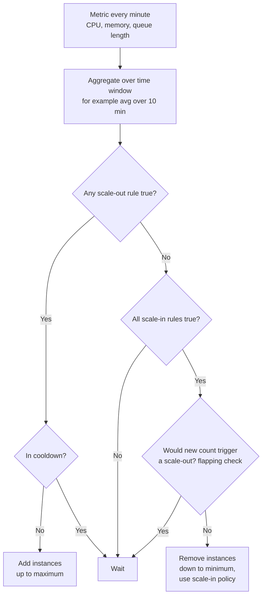

# Azure: VM Scale Sets and Autoscale

> How VM Scale Sets run and update groups of VMs: orchestration modes, autoscale rules, scale-in, rolling and OS upgrades, health monitoring, instance repair, zones, images, and when to pick VMSS over AKS or App Service.

## Key Concepts

### Uniform vs Flexible orchestration

A scale set has an **orchestration mode** that you pick at creation. You cannot change it later.

| Point | Flexible (recommended) | Uniform |
| --- | --- | --- |
| VM type | Normal Azure VMs (`Microsoft.Compute/virtualMachines`) | Scale-set-only VMs, managed through the VMSS VM API |
| Mix sizes, OS, Spot + regular | Yes | No, all instances identical |
| Add an existing VM | Yes | No |
| Azure Backup and Site Recovery per VM | Yes | No |
| Health monitoring | Application Health extension | Application Health extension or a Load Balancer probe |
| Automatic OS image upgrade | No (use Auto VM guest patching) | Yes |
| Used by | Most new VM workloads | AKS node pools and Service Fabric |

Flexible needs **explicit outbound access** (NAT Gateway, Load Balancer outbound rules, or a public IP). It has no default outbound internet.

### Autoscale

Autoscale is an Azure Monitor setting attached to the scale set. It has one or more **profiles** (default, recurring schedule, or fixed date). Each profile has:

- **Capacity:** minimum, maximum, and default instance count. The default is used when metrics are missing.
- **Rules:** metric, statistic (average, max), time window (5 minutes or more), operator, threshold, and action (add or remove N instances, or a percentage).
- **Cooldown:** how long to wait after a scale action before the next one. Default is 5 minutes. Set it longer than the boot plus app warm-up time.

Important behavior:

- **Scale out** when **any** scale-out rule is true.
- **Scale in** only when **all** scale-in rules are true.
- **Flapping protection:** before a scale-in, autoscale checks whether the new, smaller count would trigger a scale-out right away. If yes, it skips the scale-in. Leave a gap between the thresholds, for example out at 70% CPU and in at 30%.
- **Metric sources:** host metrics such as `Percentage CPU` and `Available Memory Bytes`, guest OS counters sent by the Azure Monitor Agent, Application Insights metrics, or a metric from another resource, such as Service Bus `ActiveMessages`.
- **Predictive autoscale:** learns CPU patterns and scales out before a known daily peak. It works with CPU only.



### Scale-in policy and instance protection

The **scale-in policy** decides which VMs are removed:

- **Default:** keep zones and fault domains balanced, then remove the VM with the highest instance ID.
- **NewestVM:** remove the newest VMs first (keeps the warm, old ones).
- **OldestVM:** remove the oldest VMs first (helps roll old images out).

**Instance protection** keeps a chosen VM safe from scale-in, or from all scale set actions. **Terminate notifications** (through Scheduled Events) give the VM a few minutes to drain work before deletion.

### Upgrade policy and rolling upgrades

The upgrade policy decides how existing VMs get a new **model** (new image, size, extension, or custom data):

- **Manual:** nothing changes until you upgrade instances yourself. New VMs get the new model.
- **Automatic:** all VMs may update at once. Fine for dev, risky for production.
- **Rolling:** VMs update in batches with health checks. This is the production choice.

Rolling settings:

- `maxBatchInstancePercent` – share of VMs updated per batch (default 20%).
- `maxUnhealthyInstancePercent` – stop if too many VMs in the whole set are unhealthy.
- `maxUnhealthyUpgradedInstancePercent` – stop if too many **upgraded** VMs are unhealthy. This catches a bad image.
- `pauseTimeBetweenBatches` – wait time between batches (ISO 8601, for example `PT2M`).
- `prioritizeUnhealthyInstances` – fix broken VMs first.
- `maxSurge` – create new VMs before deleting old ones, so capacity never drops.

Rolling upgrades need health monitoring: the Application Health extension (Flexible and Uniform) or a Load Balancer probe (Uniform only).

### Health, automatic OS upgrades, and instance repair

- **Application Health extension:** runs inside each VM and calls a local endpoint such as `http://localhost:8080/healthz` (or a TCP port). With **rich health states**, the app returns `Healthy` or `Unhealthy` in JSON, and VMs start in `Initializing` during a grace period.
- **Automatic OS image upgrades (Uniform):** when the publisher releases a new image version, the scale set rolls it out in batches and stops if VMs turn unhealthy. Works with platform images and Azure Compute Gallery images. For Flexible, use **Auto VM guest patching** or a new image version rolled out through the upgrade policy.
- **Automatic instance repair:** if a VM stays unhealthy after a grace period (default 30 minutes), the scale set repairs it. The repair action can be **Replace** (default), **Restart**, or **Reimage**.

### Zones, images, and boot diagnostics

- **Zones:** spread instances across zones 1, 2, 3 for a 99.99% VM SLA. Use **zone balance** so no zone gets too many VMs. Put the front-end load balancer or Application Gateway in zone-redundant mode too.
- **Images:** build a golden image with Packer or Azure VM Image Builder and publish it as a version in an **Azure Compute Gallery**. Replicate the version to every region you use. Point the scale set to a specific version, or to `latest` if you want automatic pickup.
- **Boot diagnostics:** keeps the serial log and a screenshot of each VM boot. Use the managed storage option. With it you can use the **Serial Console** to fix a VM that has no network.

### VMSS vs AKS vs App Service

| Need | Best fit |
| --- | --- |
| Full OS control, legacy app, custom agent, Windows services | VM Scale Set |
| Many containerized microservices, Helm, GitOps | AKS |
| Web app or API, no OS work, quick deploy slots | App Service |
| Short event-driven jobs | Azure Functions |

## Interview Questions

<details><summary>Q1. [Basic] What is a Virtual Machine Scale Set?</summary>

**Answer:**

A VM Scale Set (VMSS) runs a group of VMs from one model: image, size, network, and extensions. It can add or remove VMs by itself (autoscale), spread them across zones, roll out updates in batches, and replace broken VMs.

You put a Load Balancer or Application Gateway in front of it so traffic reaches only healthy VMs.

</details>

<details><summary>Q2. [Basic] What is the difference between Uniform and Flexible orchestration?</summary>

**Answer:**

- **Uniform:** all VMs are identical and you manage them through the scale set VM API. It supports automatic OS image upgrades. AKS node pools use it.
- **Flexible:** VMs are normal Azure VMs. You can mix sizes, mix Spot and regular VMs, add existing VMs, and use Azure Backup per VM. Microsoft recommends Flexible for new workloads.

You pick the mode at creation and cannot change it.

</details>

<details><summary>Q3. [Basic] What does the autoscale cooldown do?</summary>

**Answer:**

After a scale action, autoscale waits for the cooldown time before it acts again. The default is 5 minutes.

New VMs need time to boot and warm up. During that time CPU is still high on the old VMs. Without cooldown, autoscale would keep adding VMs again and again. Set the cooldown at least as long as boot time plus app warm-up.

</details>

<details><summary>Q4. [Intermediate] How do you configure autoscale on CPU for a scale set?</summary>

**Answer:**

```bash
az monitor autoscale create \
  --resource-group rg-app --name as-web \
  --resource vmss-web --resource-type Microsoft.Compute/virtualMachineScaleSets \
  --min-count 2 --max-count 10 --count 2

# Scale out by 2 when average CPU > 70% for 10 minutes
az monitor autoscale rule create \
  --resource-group rg-app --autoscale-name as-web \
  --condition "Percentage CPU > 70 avg 10m" --scale out 2 --cooldown 10

# Scale in by 1 when average CPU < 30% for 15 minutes
az monitor autoscale rule create \
  --resource-group rg-app --autoscale-name as-web \
  --condition "Percentage CPU < 30 avg 15m" --scale in 1 --cooldown 10
```

Scale out fast and scale in slowly. Keep a wide gap between the two thresholds, so the set does not flap. In real projects this goes into Bicep or Terraform, not CLI.

</details>

<details><summary>Q5. [Intermediate] How do you autoscale on memory or on a custom metric?</summary>

**Answer:**

- **Memory:** use the host metric `Available Memory Bytes` where it is available, or install the **Azure Monitor Agent** with a data collection rule that sends guest memory counters (for example used-memory percent) to Azure Monitor Metrics. Then use that metric in the rule.
- **Custom metric:** an app can publish a metric to Application Insights, and autoscale can use it.
- **Other resources:** a worker set can scale on Service Bus queue length (`ActiveMessages`). This is often better than CPU for background workers because it shows real waiting work.

Test the rule with a load test before production. A rule that never fires is worse than none.

</details>

<details><summary>Q6. [Intermediate] What is a scale-in policy, and when do you change it?</summary>

**Answer:**

It decides which VMs are deleted on scale-in.

- **Default:** balance zones and fault domains, then delete the highest instance ID.
- **NewestVM:** keeps old, warm VMs. Good when new VMs have empty caches.
- **OldestVM:** removes old VMs first. Good to cycle out VMs built from an old image.

Add **instance protection** to a VM that runs a long job, and use **terminate notifications** so the app can finish requests before the VM is deleted.

</details>

<details><summary>Q7. [Intermediate] How does a rolling upgrade work on a scale set?</summary>

**Answer:**

You change the model (for example a new Compute Gallery image version). With `upgradePolicy.mode = Rolling`, the scale set:

1. Takes a batch (default 20% of VMs).
2. Upgrades or reimages them. With `maxSurge`, it creates new VMs first.
3. Waits for them to report healthy through the Application Health extension or Load Balancer probe.
4. Pauses `pauseTimeBetweenBatches`, then goes to the next batch.
5. Stops if unhealthy VMs pass `maxUnhealthyUpgradedInstancePercent` or `maxUnhealthyInstancePercent`.

In Rolling mode the upgrade starts by itself after the model update. Check its progress:

```bash
az vmss rolling-upgrade get-latest --resource-group rg-app --name vmss-web
```

</details>

<details><summary>Q8. [Intermediate] What is automatic instance repair, and what does it need?</summary>

**Answer:**

Instance repair replaces, restarts, or reimages a VM that stays unhealthy after a grace period. The default action is **Replace**, and the default grace period is 30 minutes.

It needs health monitoring, either the Application Health extension or (Uniform only) a Load Balancer probe. The health endpoint must test the app, not just that the VM is on.

Be careful: if a shared dependency (like the database) is down, every VM looks unhealthy. Make the health check light, so instance repair does not replace good VMs for a problem they cannot fix.

</details>

<details><summary>Q9. [Advanced] Autoscale keeps adding and removing VMs every few minutes. How do you fix it? <em>(scenario)</em></summary>

**Answer:**

This is **flapping**. Common causes and fixes:

1. **Thresholds too close:** out at 60% and in at 50%. Widen the gap, for example 70% out and 30% in.
2. **Short time window:** 5-minute spikes trigger actions. Use 10–15 minutes for scale-in.
3. **Cooldown shorter than warm-up:** new VMs are not serving yet, so CPU stays high. Raise the cooldown and use the Application Health extension so VMs only get traffic when ready.
4. **Scaling in by a big step:** remove 1 VM at a time.
5. **Wrong metric:** CPU may not show the real load. Use requests per instance or queue length.

**How to verify:** check the autoscale run history in the Activity Log and the `AutoscaleEvaluationsLog` and `AutoscaleScaleActionsLog` diagnostic logs. They show which rule fired and why.

</details>

<details><summary>Q10. [Advanced] A rolling upgrade with a new image stopped halfway. What do you do? <em>(scenario)</em></summary>

**Answer:**

1. Check the rolling upgrade status: `az vmss rolling-upgrade get-latest`. It shows how many VMs failed and why the upgrade stopped.
2. Look at the upgraded VMs: boot diagnostics, the serial log, extension status, and app logs.
3. Common causes: the new image misses a package or config, the health endpoint path changed, the app needs more time than the health grace period, or the custom script extension failed.
4. **Roll back:** point the model back to the last good Compute Gallery image version and start a rolling upgrade again. The old VMs stayed on the old image, so users were protected by the health gate.
5. Fix the image in the pipeline, test it on a staging scale set, then roll it out again.

The lesson: keep `maxUnhealthyUpgradedInstancePercent` low so a bad image stops after the first batch.

</details>

<details><summary>Q11. [Advanced] How do you design a zone-resilient, cost-aware VMSS workload?</summary>

**Answer:**

- Flexible scale set across zones 1, 2, 3 with zone balance.
- Zone-redundant Standard Load Balancer or Application Gateway v2 in front.
- Minimum instance count that can survive losing one zone at normal peak.
- Autoscale on CPU plus a business metric, with scheduled profiles for known peaks.
- Base capacity on regular VMs (with reservations or a savings plan), burst capacity on **Spot** VMs in the same Flexible set, if the app can handle Spot eviction.
- Golden images in Azure Compute Gallery, rolled out with a rolling upgrade, `maxSurge`, and health gates.
- Application Health extension, instance repair, and boot diagnostics turned on.
- Everything defined in Bicep or Terraform and deployed through a pipeline.

TODO (Siva): add your real scale set numbers (min/max instances, metrics you scaled on, and what you learned).

</details>

<details><summary>Q12. [Advanced] When would you choose VM Scale Sets instead of AKS or App Service?</summary>

**Answer:**

- **VMSS:** the app needs full OS control, a special agent, a Windows service, GPU drivers, or it is a legacy app that is not containerized. Also good for self-hosted build agents (Azure DevOps scale set agents).
- **AKS:** many containerized microservices, Helm, GitOps, and a team that can run Kubernetes.
- **App Service:** a web app or API where you want no OS work, built-in deployment slots, and easy scaling.

The trade-off is control vs work. VMSS gives the most control and needs the most patching, image building, and monitoring work.

</details>
