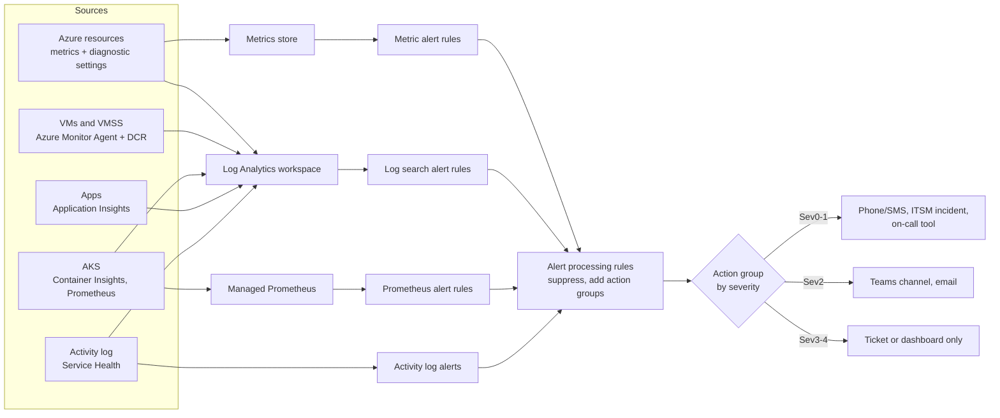

# Azure: Azure Monitor, KQL, and Alerting

> How Azure Monitor collects metrics and logs, how to query Log Analytics with KQL, how to build metric, log, and activity log alerts with action groups and severity routing, and how to keep monitoring cost under control.

## Key Concepts

### Metrics vs logs

| Point | Metrics | Logs |
| --- | --- | --- |
| Shape | Numbers over time, with dimensions | Rows with many columns (events, traces, records) |
| Store | Azure Monitor Metrics database | Log Analytics workspace |
| Query | Metrics explorer, PromQL for Prometheus metrics | KQL |
| Speed | Near real time, cheap | Small ingestion delay (usually a few minutes) |
| Retention | Platform metrics kept 93 days | Set per table, up to 12 years with long-term retention |
| Best for | Fast alerts on CPU, 5xx count, queue length | Root cause, correlation, audit, complex conditions |

Rule of thumb: alert on **metrics** when you can (fast and cheap), and investigate with **logs**.

### How data gets in

- **Platform metrics:** every Azure resource sends them automatically.
- **Resource logs:** not collected until you create a **diagnostic setting** on the resource. A diagnostic setting sends chosen log categories and metrics to a Log Analytics workspace, a Storage account (archive), or Event Hubs (to a SIEM such as Splunk).
- **Activity log:** subscription-level control plane events (who changed what). Send it to the workspace with a subscription diagnostic setting.
- **VM guest data:** the **Azure Monitor Agent (AMA)** with a **data collection rule (DCR)** collects performance counters, syslog, and Windows events. The old Log Analytics agent (MMA) is retired.
- **Applications:** **Application Insights** (workspace-based) through the Azure Monitor OpenTelemetry Distro or SDK. Data lands in tables like `AppRequests`, `AppDependencies`, and `AppExceptions`.
- **AKS:** **Container Insights** for logs and inventory (`ContainerLogV2`, `KubePodInventory`, `KubeEvents`), and **Azure Monitor managed service for Prometheus** for metrics, often shown in **Azure Managed Grafana**.

Use **resource-specific** tables (for example `AGWAccessLogs`) instead of the old shared `AzureDiagnostics` table when the resource supports it. They are easier to query and cheaper to filter.

### From signal to the person on call



### KQL basics

KQL reads top to bottom. Each `|` passes the result to the next step.

| Operator | Use |
| --- | --- |
| `where` | Filter rows. Put the time filter first. |
| `project` / `extend` | Pick columns / add calculated columns |
| `summarize ... by` | Count, average, percentiles per group |
| `bin(TimeGenerated, 5m)` | Group into time buckets for charts |
| `join` | Combine two tables (filter both sides first) |
| `parse` / `extract` | Pull values out of text |
| `make-series` | Build a time series with zeros where there is no data |
| `render timechart` | Draw a chart |

```kusto
// Failed requests and p95 latency per app role, last hour
AppRequests
| where TimeGenerated > ago(1h)
| summarize total = count(),
            failed = countif(Success == false),
            p95ms = percentile(DurationMs, 95)
  by AppRoleName
| extend failRate = round(100.0 * failed / total, 2)
| order by failRate desc
```

```kusto
// Pods that restarted in the last 30 minutes
KubePodInventory
| where TimeGenerated > ago(30m)
| summarize restarts = max(ContainerRestartCount) by Namespace, Name
| where restarts > 0
| order by restarts desc
```

### Alert types

- **Metric alert:** checks a metric every 1–15 minutes. Supports **static** thresholds and **dynamic** thresholds (machine learning learns the normal pattern). One rule can watch many resources of the same type and split by dimension.
- **Log search alert:** runs a KQL query on a schedule (frequency and window). Fires when the result count, or a measured value, crosses a threshold. Use it when the condition needs joins, text, or many sources.
- **Activity log alert:** fires on control plane events (for example someone deleted a Key Vault), **Service Health** events (Azure incident or maintenance in your regions), or **Resource Health** (a resource became unavailable).
- **Prometheus alert rules:** PromQL rules in a rule group, for AKS clusters that use managed Prometheus.

Each rule has a **severity**: Sev0 (critical) to Sev4 (verbose). Metric alerts are **stateful** and resolve by themselves when the condition clears.

### Action groups and alert processing rules

- **Action group:** a reusable list of who to tell and what to run: email, SMS, voice, Azure app push, webhook, Logic App, Function, Automation runbook, ITSM, or Event Hubs. Use a few shared action groups (for example `ag-oncall-critical`, `ag-team-warning`) instead of one per alert.
- **Alert processing rule:** works on alerts **after** they fire. It can **suppress** notifications (for a planned maintenance window) or **add** action groups to every alert in a scope, filtered by severity, resource type, or alert rule name. This is how you do severity routing at scale.

### Application Insights availability tests

- **Standard test:** sends one HTTP request from several Azure locations on a schedule (for example every 5 minutes from 5 locations). It checks status code, response time, content, and the TLS certificate expiry. The old URL ping test was retired on 30 September 2026.
- **Custom TrackAvailability test:** your own code (often an Azure Function) runs a multi-step check and reports the result.
- Alert when **several locations** fail at the same time (for example 3 of 5), so one bad probe location does not page anyone.

### Workbooks and dashboards

**Workbooks** combine KQL queries, metrics, text, and parameters into interactive reports. Use them for service health views, post-incident reviews, and cost views. Store them as code (ARM/Bicep) so every environment has the same view. **Azure Managed Grafana** is a good fit when the team already uses Grafana and Prometheus.

### Cost control

Log Analytics cost is mostly **ingestion volume** plus **retention**.

- Check what is big first with the `Usage` table.
- Send only the log categories you need. Do not turn on "all logs" everywhere.
- Use **DCR transformations** to drop noisy rows or columns before ingestion.
- Use the **Basic** or **Auxiliary** table plan for verbose logs that you search rarely (cheaper ingestion, limited query features).
- Use **commitment tiers** when daily volume is steady and high.
- Turn on **sampling** in Application Insights for high-traffic apps.
- Set a **daily cap** only as a safety net, because when it hits, you lose data.

```kusto
// Billable GB per table, last 30 days
Usage
| where TimeGenerated > ago(30d) and IsBillable == true
| summarize GB = round(sum(Quantity) / 1024, 2) by DataType
| order by GB desc
```

## Interview Questions

<details><summary>Q1. [Basic] What is the difference between Azure Monitor metrics and logs?</summary>

**Answer:**

**Metrics** are numbers over time, like CPU percent or 5xx count. They are near real time, cheap, and good for fast alerts. **Logs** are detailed records stored in a Log Analytics workspace and queried with KQL. They are good for root cause analysis and complex conditions.

I alert on metrics where possible and use logs to find out why.

</details>

<details><summary>Q2. [Basic] What is a diagnostic setting, and why do you need one?</summary>

**Answer:**

Most Azure resources do not save their resource logs anywhere by default. A **diagnostic setting** tells a resource which log categories and metrics to send, and where: a Log Analytics workspace, a Storage account, or Event Hubs.

Without it, you cannot query Application Gateway access logs, Key Vault audit logs, or AKS control plane logs. I deploy diagnostic settings with Bicep or Terraform, and use an Azure Policy (`DeployIfNotExists`) so new resources get them automatically.

</details>

<details><summary>Q3. [Basic] What is an action group?</summary>

**Answer:**

An action group is a reusable list of notifications and actions that an alert triggers: email, SMS, voice call, push, webhook, Logic App, Function, Automation runbook, or ITSM. Many alert rules can share one action group, so when the on-call phone number changes, you change it in one place.

```bash
az monitor action-group create \
  --resource-group rg-ops --name ag-oncall-critical --short-name oncall \
  --action email oncall oncall@example.com
```

</details>

<details><summary>Q4. [Intermediate] How do you write a KQL query to find the top errors in an application?</summary>

**Answer:**

```kusto
AppExceptions
| where TimeGenerated > ago(24h)
| summarize count_ = count(), lastSeen = max(TimeGenerated)
  by AppRoleName, ProblemId, OuterMessage
| top 10 by count_
```

Steps I follow: filter time first, filter the app, group by a stable key (`ProblemId`), then sort. To see if errors started after a release, add `bin(TimeGenerated, 15m)` and `render timechart`, then compare with the deployment time.

</details>

<details><summary>Q5. [Intermediate] When do you use a metric alert and when a log search alert?</summary>

**Answer:**

- **Metric alert:** the signal is already a metric (CPU, `UnhealthyHostCount`, queue length). It is fast (1-minute checks), cheap, and auto-resolves.
- **Log search alert:** the condition needs text, joins, or several tables. For example "more than 20 `OutOfMemory` lines in `ContainerLogV2` in 10 minutes" or "a failed login from a new country".

Log alerts cost more per rule and are a bit slower because of ingestion delay. I do not use a log alert for something a metric can already tell me.

</details>

<details><summary>Q6. [Intermediate] How do you create a log search alert from a KQL query?</summary>

**Answer:**

```bash
az monitor scheduled-query create \
  --resource-group rg-ops --name "aks-oomkilled" \
  --scopes "$WORKSPACE_ID" \
  --condition "count 'q1' > 5" \
  --condition-query q1="KubePodInventory | where ContainerLastStatus has 'OOMKilled'" \
  --evaluation-frequency 5m --window-size 15m \
  --severity 2 --action-groups "$AG_TEAM_ID"
```

Key settings:

- **Window size:** how much data the query looks at.
- **Frequency:** how often it runs.
- **Threshold and number of violations:** to avoid one-off noise.
- **Severity and action group:** who gets told.

Test the query in Log Analytics first and check how many rows it returns in a normal week.

</details>

<details><summary>Q7. [Intermediate] What are Application Insights availability tests, and how do you alert on them?</summary>

**Answer:**

An availability test calls your public URL from several Azure locations on a schedule. A **standard test** checks the status code, response time, expected content, and TLS certificate expiry. For multi-step flows, use a custom `TrackAvailability` test from an Azure Function.

For the alert, use "fire when N of M locations fail", for example 3 of 5. One location failing is often a network blip; many locations failing means real users are hurt. Route it to the critical action group.

TODO (Siva): add the real endpoints you monitored with availability tests and how they were routed.

</details>

<details><summary>Q8. [Intermediate] What is Container Insights, and what do you look at for AKS?</summary>

**Answer:**

Container Insights collects AKS node and Pod inventory, Kubernetes events, and container logs into Log Analytics. Managed Prometheus collects metrics, and Managed Grafana shows them.

Daily checks:

- Pods restarting or in `CrashLoopBackOff` (`KubePodInventory`).
- Warning events like `FailedScheduling` or `BackOff` (`KubeEvents`).
- Node CPU and memory pressure (Prometheus or `InsightsMetrics`).
- App errors in `ContainerLogV2`.

```kusto
KubeEvents
| where TimeGenerated > ago(1h) and KubeEventType == "Warning"
| summarize count() by Reason, Namespace
| order by count_ desc
```

</details>

<details><summary>Q9. [Advanced] How do you route alerts by severity across many teams and subscriptions? <em>(scenario)</em></summary>

**Answer:**

1. **Define severities** with the teams: Sev0–1 = users hurt now, page on call; Sev2 = degraded, Teams and email in working hours; Sev3–4 = ticket only.
2. **Create a few shared action groups** per team and severity.
3. **Alert rules do not carry action groups** themselves. Instead, use **alert processing rules** at subscription or resource group scope with a filter on severity (and resource tags or names) to add the right action group.
4. Add alert processing rules that **suppress** notifications during planned maintenance windows.
5. Deploy all alerts, action groups, and processing rules as code (Bicep or Terraform module) so every environment gets the same baseline.
6. Review noisy alerts each month: tune, merge, or delete.

TODO (Siva): describe your real routing (which tools received Sev0–Sev2 alerts and how on-call worked).

</details>

<details><summary>Q10. [Advanced] The team complains about alert fatigue. What do you change? <em>(scenario)</em></summary>

**Answer:**

- **Measure first:** count alerts per rule for the last 30 days (Azure Resource Graph `alertsmanagementresources`, or the alert history). Find the top 10 noisy rules.
- **Alert on symptoms, not causes:** "error rate above 2% for 10 minutes" instead of "CPU above 80% on one VM".
- **Use dynamic thresholds** for metrics with daily patterns.
- **Require several violations** or a longer window to skip short spikes.
- **Group by resource** and use stateful alerts that auto-resolve.
- **Lower severity** of alerts that never need action at night.
- **Delete** alerts nobody acts on.
- Every paging alert must have a runbook link in its description.

The goal: every page is real and actionable.

</details>

<details><summary>Q11. [Advanced] Log Analytics cost doubled this month. How do you find and fix it? <em>(scenario)</em></summary>

**Answer:**

1. Find the table that grew with the `Usage` table (billable GB by `DataType`, by day).
2. Find which resource sends it: `summarize sum(_BilledSize) by _ResourceId` on that table.
3. Typical causes: debug logging left on after an incident, a new diagnostic setting with "all logs", verbose container logs, or `AzureDiagnostics` with categories nobody reads.
4. Fix:
   - Turn off categories that nobody uses.
   - Add a **DCR transformation** to drop noisy rows (for example health check 200s).
   - Move verbose tables to the **Basic** or **Auxiliary** plan.
   - Turn on App Insights **sampling**.
   - Pick a **commitment tier** if volume is steady.
5. Add an alert on daily ingestion so it is caught early next time.

</details>

<details><summary>Q12. [Advanced] How do you monitor a full AKS application end to end on Azure?</summary>

**Answer:**

- **Users:** Application Insights standard availability tests from several locations.
- **Edge:** Application Gateway or Front Door metrics and access/WAF logs (5xx rate, latency, WAF blocks).
- **App:** Application Insights with OpenTelemetry for requests, dependencies, exceptions, and distributed traces.
- **Cluster:** Container Insights plus managed Prometheus and Grafana for node and Pod health.
- **Data:** PostgreSQL metrics (CPU, connections, storage, replication lag) and logs.
- **Platform:** Activity log and Service Health alerts for the regions in use.
- **Alerts:** a small set of SLO-based alerts (availability and latency), routed by severity.
- **Workbook:** one service view that links all of these for incidents.

TODO (Siva): add how this setup supported your 99.9% AKS availability target.

</details>

<details><summary>Q13. [Advanced] How do you make sure every new resource sends logs to the right workspace?</summary>

**Answer:**

- Use the built-in **Azure Policy** initiatives that deploy diagnostic settings (`DeployIfNotExists`) for each resource type, assigned at management group scope, with the central workspace as a parameter.
- Run **remediation tasks** for resources that already exist.
- Use **DCRs** and policy to install the Azure Monitor Agent on VMs and scale sets.
- Enable Container Insights and managed Prometheus in the AKS Bicep or Terraform module.
- Check compliance in the Policy dashboard, and fail the pipeline if a template turns monitoring off.

This way, monitoring does not depend on each engineer remembering a checkbox.

</details>
