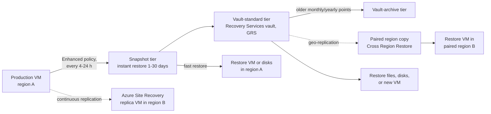
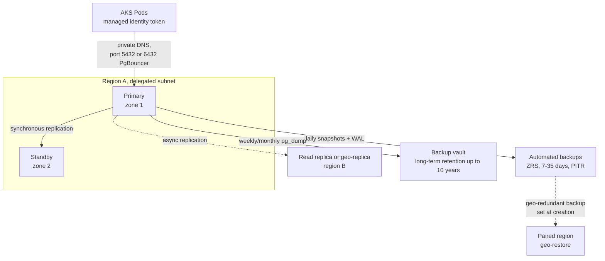

# Azure: Backup, Recovery, and PostgreSQL Flexible Server

> How Azure Backup protects VMs and other resources with Recovery Services vaults and Backup vaults, how cross-region restore and Site Recovery fit in, and how to run Azure Database for PostgreSQL Flexible Server with HA, backups, private access, Entra auth, tuning, and maintenance.

## Key Concepts

### Recovery Services vault vs Backup vault

Azure Backup uses two kinds of vaults. Which one you need depends on what you protect.

| Point | Recovery Services vault | Backup vault |
| --- | --- | --- |
| Protects | Azure VMs, SQL Server and SAP HANA in VMs, Azure Files, on-premises (MARS agent, MABS) | Azure Disks, Azure Blobs, AKS, PostgreSQL Flexible Server long-term retention, and other newer workloads |
| Also used by | Azure Site Recovery | – |
| Policy style | Backup policy per workload type | Backup policy per datasource type |

Both vaults support:

- **Storage redundancy:** LRS, ZRS, or GRS. Set it **before** you protect the first item; after that it is locked.
- **Soft delete:** deleted backup data is kept for 14 days by default (you can extend it), so an attacker or a mistake cannot wipe backups at once.
- **Immutability:** stops anyone from shortening retention or deleting recovery points early. Once **locked**, it cannot be turned off.
- **Multi-user authorization (MUA):** critical operations (like disabling soft delete) need approval through a **Resource Guard** owned by a different team.
- **Private endpoints and RBAC:** use roles like `Backup Operator` and `Backup Reader` instead of Owner.

### Azure VM backup policies and retention tiers

- **Standard policy:** one backup a day. The instant restore snapshot is kept 1–5 days (default 2).
- **Enhanced policy:** several backups a day (every 4, 6, 8, 12, or 24 hours), instant restore snapshots for 1–30 days, and support for Trusted Launch VMs and newer disk types. Use it for production.
- **Retention:** daily, weekly, monthly, and yearly points (grandfather-father-son). For example 30 daily, 12 weekly, 12 monthly, 7 yearly.
- **Consistency:** Windows uses VSS for application-consistent backups. Linux is file-system consistent by default; add pre/post scripts to make databases application-consistent.

Recovery points live in tiers:

1. **Snapshot tier:** incremental disk snapshots kept in a resource group in your subscription. Fastest restore (instant restore).
2. **Vault-standard tier:** copied into the vault, isolated from the VM's subscription changes.
3. **Vault-archive tier:** cheap long-term storage for older monthly and yearly points. Restore is slower and needs rehydration.



### Cross Region Restore and restore drills

**Cross Region Restore (CRR)** lets you restore a VM in the **paired region** from the geo-replicated copy. The vault must use **GRS** and have CRR turned on. You can use it any time, for a drill or a real regional outage. The secondary copy lags a bit behind the primary, so the newest recovery point may not be there yet.

A backup you never restored is only a hope. A **restore drill** should:

- Restore to an isolated VNet so it does not clash with production.
- Measure the real restore time and check data age against the RPO.
- Boot the app and run smoke tests, not just "VM started".
- Write down the steps and gaps, then fix them.

### Azure Site Recovery basics

**Azure Site Recovery (ASR)** keeps a **replica** of a VM in another region with continuous replication. It is for **disaster recovery** (fast failover, minutes of RPO), while Azure Backup is for **restore** from a point in time (hours of RPO, protection against deletion and corruption). Most production VMs need both.

- **Recovery points:** crash-consistent every few minutes, application-consistent at a frequency you set.
- **Recovery plans:** group VMs, set the boot order, and run scripts or Automation runbooks (for example update DNS).
- **Test failover:** brings replicas up in an isolated VNet with no impact on production.
- **Flow:** failover → commit → re-protect → fail back.

### PostgreSQL Flexible Server: compute and high availability

Compute tiers: **Burstable** (dev/test), **General Purpose**, and **Memory Optimized**.

- **Zone-redundant HA:** a warm standby in another availability zone. Writes are replicated **synchronously**, so there is no data loss on failover. Automatic failover usually takes 60–120 seconds.
- **Same-zone HA:** standby in the same zone. Protects against server failure, not zone failure. Use it where zones are not available or latency must be minimal.
- HA is not supported on Burstable.
- The server name (DNS) stays the same after failover. Apps must **retry** connections, because open connections drop.
- **Read replicas** are asynchronous copies for read scaling or for DR in another region. **Virtual endpoints** give a stable read-write and read-only host name that follows a promotion.



### PostgreSQL Flexible Server: backups and PITR

- Automatic backups: a daily snapshot plus WAL (transaction log) archiving. RPO for PITR is usually up to about 5 minutes.
- **Retention:** 7 days by default, up to 35 days.
- **Point-in-time restore (PITR)** always creates a **new server**. It never overwrites the old one. You then switch the app to it.
- Server parameters, firewall rules, private endpoints, and HA are **not** copied to the restored server. Re-apply them with IaC.
- **Geo-redundant backup** can only be chosen **at creation**. Geo-restore goes to the paired region with an RPO of up to 1 hour.
- **Long-term retention:** Azure Backup with a Backup vault keeps logical (`pg_dump`) backups for up to 10 years.
- Add a **resource lock** on the server: deleting the server deletes its automated backups.

### PostgreSQL Flexible Server: networking and identity

Two network modes, chosen at creation:

- **Private access (VNet integration):** the server is placed in a **delegated subnet** and gets a private IP. Name resolution uses a **private DNS zone** linked to the VNets that need access.
- **Public access:** a public endpoint with firewall rules. You can add **private endpoints** to it and then disable public network access, which gives private connectivity with more flexible networking (for example from peered hubs).

**Microsoft Entra authentication:** turn on Entra auth, set an Entra admin, and create roles for groups or managed identities. Apps use a managed identity (or AKS workload identity) to get a token and use it as the password. No stored database password.

```sql
-- Run as the Entra admin, in the postgres database
SELECT * FROM pgaadauth_create_principal('mi-orders-api', false, false);
GRANT CONNECT ON DATABASE orders TO "mi-orders-api";
```

### PostgreSQL Flexible Server: performance and maintenance

- **Connection pooling:** enable the built-in **PgBouncer** (port 6432). Many small app connections otherwise use a lot of memory. Not available on Burstable.
- **Query Store** and **Query Performance Insight** show slow and frequent queries. **Intelligent tuning** can adjust some autovacuum and write settings.
- **Server parameters:** tune `work_mem`, `maintenance_work_mem`, autovacuum, and `max_connections` with care. Some need a restart.
- **Storage:** turn on storage autogrow. Watch IOPS and storage percent; Premium SSD v2 lets you set IOPS and throughput separately.
- **Maintenance:** Azure applies minor version updates and patches in a **maintenance window**. Use a **custom window** in your quiet hours and test the same patch in non-prod first. Major version upgrades are done in place, but you test them on a restored copy first.

## Interview Questions

<details><summary>Q1. [Basic] What is the difference between a Recovery Services vault and a Backup vault?</summary>

**Answer:**

Both store backups, but for different workloads.

- **Recovery Services vault:** Azure VMs, SQL Server or SAP HANA in VMs, Azure Files, on-premises servers with MARS or MABS, and Azure Site Recovery.
- **Backup vault:** newer workloads such as Azure Disks, Azure Blobs, AKS, and long-term retention for PostgreSQL Flexible Server.

Pick the vault type the workload needs. Set storage redundancy (LRS, ZRS, GRS) before you protect anything.

</details>

<details><summary>Q2. [Basic] What is the difference between Azure Backup and Azure Site Recovery?</summary>

**Answer:**

- **Azure Backup** keeps point-in-time copies. Use it to restore after deletion, corruption, or ransomware. RPO is usually hours.
- **Azure Site Recovery** keeps a live replica in another region. Use it to fail over a whole app when a region fails. RPO is minutes.

Replication is not backup. If data gets corrupted, ASR copies the corruption to the replica. So production VMs usually need both.

</details>

<details><summary>Q3. [Basic] What does point-in-time restore do in PostgreSQL Flexible Server?</summary>

**Answer:**

It restores the server to any second within the retention period (7–35 days). Azure takes the last daily snapshot before that time and replays WAL logs up to the chosen time.

It always creates a **new server**. You then point the app to it, or copy the lost rows back to the original. Re-apply server parameters, firewall rules, and private endpoints, because they are not copied.

```bash
az postgres flexible-server restore \
  --resource-group rg-data --name pg-orders-restored \
  --source-server pg-orders \
  --restore-time "2026-10-02T09:15:00Z"
```

</details>

<details><summary>Q4. [Intermediate] How do you design a VM backup policy for production?</summary>

**Answer:**

1. Agree on RPO, RTO, and retention with the app owner and compliance.
2. Use the **Enhanced policy**: for example a backup every 4 hours, instant restore snapshots for 7 days.
3. Set retention with GFS: for example 30 daily, 12 weekly, 12 monthly, 7 yearly. Move old monthly and yearly points to the archive tier.
4. Vault with **GRS** and Cross Region Restore, soft delete, immutability, and MUA.
5. Assign the policy with Azure Policy so new VMs with the right tag are protected automatically.
6. Alert on failed backup jobs through Azure Monitor and an action group.
7. Run restore drills every quarter.

TODO (Siva): add the real retention numbers and vault setup you used.

</details>

<details><summary>Q5. [Intermediate] How does Cross Region Restore work, and when would you use it?</summary>

**Answer:**

With a GRS vault and CRR turned on, the backup data is copied to the paired region. You can restore a VM or disks **in the paired region** from that copy.

Use it:

- In a real regional outage, when no ASR replica exists.
- For DR drills, to prove you can bring the app up in the other region.
- For audits that ask for a second-region copy.

The secondary copy lags behind the primary, so the newest point may be missing. The target region also needs a VNet, subnets, and quota ready, or the restore fails.

</details>

<details><summary>Q6. [Intermediate] How do you run a restore drill, and what do you measure?</summary>

**Answer:**

1. Pick a production VM or database and a recovery point.
2. Restore into an **isolated VNet** (no route to production) or a separate subscription.
3. Start the app and run smoke tests: login, a read, a write.
4. Measure: time from start to working app (real RTO), age of the restored data (real RPO), and manual steps that slowed you down.
5. Write a short report with gaps and fixes, and update the runbook.
6. Delete the restored resources to stop cost.

Doing this every quarter turns "we have backups" into "we can recover".

</details>

<details><summary>Q7. [Intermediate] How do you connect an AKS app privately to PostgreSQL Flexible Server?</summary>

**Answer:**

- **Option 1, private access:** create the server in a **delegated subnet** of the spoke VNet. Link its private DNS zone (a name ending in `private.postgres.database.azure.com`) to the AKS VNet.
- **Option 2, private endpoint:** create the server with public access mode, add a private endpoint in the spoke, link the `privatelink.postgres.database.azure.com` DNS zone, then disable public network access.
- Allow port 5432 (or 6432 for PgBouncer) from the AKS subnet with NSG rules.
- Use **Entra authentication** with AKS workload identity, so Pods get a token instead of a stored password.

**How to verify:** from a debug Pod, `nslookup <server>.postgres.database.azure.com` must return a private IP, and `psql` must connect.

</details>

<details><summary>Q8. [Intermediate] How do you use Microsoft Entra authentication with PostgreSQL Flexible Server?</summary>

**Answer:**

1. Set the authentication mode to "PostgreSQL and Microsoft Entra" (or Entra only).
2. Add an Entra admin (a group is best).
3. As the Entra admin, create a role for each app identity with `pgaadauth_create_principal`, then grant only the needed permissions.
4. In the app, get a token for the Azure Database for PostgreSQL scope with the managed identity, and use it as the password.

```bash
# Test as a signed-in user
export PGPASSWORD=$(az account get-access-token \
  --resource-type oss-rdbms --query accessToken -o tsv)
psql "host=pg-orders.postgres.database.azure.com dbname=orders user=dba-group sslmode=require"
```

Tokens are short-lived (up to about an hour), so the app or the driver must refresh the token for new connections.

</details>

<details><summary>Q9. [Advanced] How do you design HA and DR for PostgreSQL Flexible Server? <em>(scenario)</em></summary>

**Answer:**

- **Zone failure:** zone-redundant HA (General Purpose or Memory Optimized). Synchronous standby, automatic failover in about 1–2 minutes, no data loss.
- **Bad data or deletion:** PITR with 35 days of retention, plus on-demand backups before risky changes.
- **Region failure:** a **geo-replica** in another region with a virtual endpoint (RPO of seconds to minutes, manual promotion), or **geo-redundant backup** with geo-restore (RPO up to 1 hour, slower RTO). Geo-redundant backup must be chosen at creation.
- **Compliance:** long-term retention in a Backup vault (up to 10 years).
- **App side:** connection retry with backoff, short DNS caching, and PgBouncer.
- **Protection:** resource lock on the server, because deleting the server deletes its backups.
- **Proof:** a failover test and a geo-restore drill, with measured RTO and RPO.

TODO (Siva): add the real HA and backup settings of your PostgreSQL servers.

</details>

<details><summary>Q10. [Advanced] After an HA failover, the app shows errors for several minutes even though the database is back. Why? <em>(scenario)</em></summary>

**Answer:**

The database failed over in about 1–2 minutes, but the app did not recover on its own. Common reasons:

1. **Stale connections:** the connection pool keeps dead connections. Use pool settings that test or recycle connections, and retry on connection errors.
2. **DNS caching:** the app or JVM caches the old IP for a long time. Lower the DNS cache TTL.
3. **No retry logic:** the first error crashes the request or the Pod. Add retry with exponential backoff.
4. **Connection storm:** all Pods reconnect at once and hit `max_connections`. Use PgBouncer and jitter in retries.

**How to verify:** trigger a **planned forced failover** in non-prod and watch app errors and recovery time.

```bash
az postgres flexible-server restart \
  --resource-group rg-data --name pg-orders \
  --failover Forced
```

</details>

<details><summary>Q11. [Advanced] PostgreSQL CPU is at 95% and the API is slow. How do you troubleshoot it? <em>(scenario)</em></summary>

**Answer:**

1. Check metrics: CPU, memory, active connections, IOPS, storage percent. Check whether it started after a release.
2. Use **Query Store** or `pg_stat_statements` to find the top queries by total time.
3. Look for missing indexes (sequential scans on big tables) with `EXPLAIN (ANALYZE, BUFFERS)`.
4. Check for long-running or blocked queries in `pg_stat_activity`, and table bloat when autovacuum falls behind.
5. Check connection count: too many connections waste CPU. Turn on PgBouncer.
6. Short-term relief: scale up compute (a short restart is needed), or kill a runaway query.
7. Long-term: fix the query or index, tune autovacuum, and add a read replica for reporting.

```sql
SELECT query, calls, round(total_exec_time) AS total_ms, round(mean_exec_time) AS mean_ms
FROM pg_stat_statements
ORDER BY total_exec_time DESC
LIMIT 10;
```

</details>

<details><summary>Q12. [Advanced] How do you protect backups against ransomware or a malicious admin?</summary>

**Answer:**

- **Soft delete** always on, with a longer retention period.
- **Immutable vault**, locked, so retention cannot be shortened and points cannot be deleted early.
- **Multi-user authorization** with a Resource Guard in a separate subscription owned by the security team.
- **Least privilege:** most engineers get `Backup Operator` or `Backup Reader`, not Owner or Contributor on the vault.
- **Separate subscription** for vaults, with Azure Policy to block risky changes.
- **Alerts** on vault security events (soft delete disabled, policy changed, items stopped).
- **Long-term copies** (archive tier, PostgreSQL LTR) for older points.

Then prove it with a drill: try to delete a backup with a normal admin account and confirm it is blocked.

</details>

<details><summary>Q13. [Intermediate] How do you handle PostgreSQL Flexible Server maintenance and version upgrades?</summary>

**Answer:**

- Set a **custom maintenance window** in low-traffic hours. Use different days for non-prod and prod, so patches hit non-prod first.
- Subscribe to **Service Health** planned maintenance alerts with an action group.
- Make sure apps retry connections, because maintenance causes a short restart.
- For a **major version upgrade**: restore a copy with PITR, run the in-place upgrade on the copy, run app tests, then upgrade production in a planned window. Take an on-demand backup just before.
- Keep all settings in Bicep or Terraform so a restored or upgraded server gets the same parameters.

</details>
