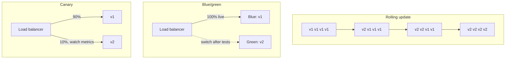

# CI/CD: Deployment Strategies and Rollback

> Continuous delivery end to end, zero-downtime rolling, blue-green and canary releases, high-frequency deploys, and rollback design.

## Key Concepts

### Rolling vs. Blue/Green vs. Canary

All three strategies replace version 1 with version 2 without downtime; they differ in how much traffic is at risk and how fast you can go back. Rolling is the cheapest, blue/green gives the fastest rollback, and canary limits the blast radius best.

| Strategy | Extra capacity | Rollback speed | Users exposed to a bad version |
| --- | --- | --- | --- |
| Rolling | Small (`maxSurge`) | Slow: roll back Pod by Pod | Grows as the rollout progresses |
| Blue/green | Double, for a short time | Instant: switch traffic back | All users, after the switch |
| Canary | Small | Fast: send the canary's traffic back to v1 | Only the canary share, for example 10% |

## Interview Questions

### 1. Explain a complete CD process.

**Answer:**

CD starts from an approved, versioned artifact. The system deploys it to a lower environment, runs schema and policy checks plus integration and smoke tests, then promotes that same digest through each protected environment.

Production uses rolling, canary, or blue-green delivery depending on the risk.

Health gates watch readiness, error rate, latency, saturation — meaning how close a resource is to its limit — and key business transactions. Every deployment record includes the artifact digest, configuration version, approver, and a link to the change. If any limit is exceeded, traffic stops or rolls back.

Database changes stay backward compatible and are kept separate from any destructive cleanup step. After deploying, I watch a defined observation window, complete the audit trail, and keep a tested failback path ready.

### 2. Zero-downtime deployments in Jenkins / GitHub Actions *(asked in interview round)*

- **Rolling update** (the Kubernetes default): new pods come up and pass their readiness check before old pods are terminated. `maxUnavailable` and `maxSurge` control how aggressive this is. Use PodDisruptionBudgets too.
- **Blue/Green:** stand up the new version next to the old one, then switch traffic over once it's healthy. Rollback is instant — just switch back.
- **Canary:** send a small percentage of traffic to the new version, watch the metrics, then ramp up gradually.
- **What actually enables this, regardless of tool:** readiness and liveness probes, graceful shutdown (handling SIGTERM and using `preStop`), backward-compatible database migrations (the expand/contract pattern), and only promoting once health checks pass. The CI tool just triggers these steps — the real zero-downtime behavior lives in how the deployment target is set up.

### 3. How do you implement zero-downtime deployments in Jenkins or GitHub Actions?

**Answer:**

The pipeline picks rolling, blue-green, or canary delivery. The workload needs multiple replicas spread across failure domains — groups of resources that could fail together — realistic readiness and startup probes, enough spare capacity, graceful shutdown, and connection draining.

New versions need backward-compatible APIs, config, and database schema.

The pipeline deploys to a small slice first, runs smoke and synthetic tests, and watches error rate, latency, saturation, and business metrics. Traffic only increases once those checks pass. If they decline, it stops and routes back to the previous version.

I load-test the strategy itself and simulate a failed readiness check and a rollback. "Zero downtime" is an availability goal that the architecture has to support — adding a deploy command alone doesn't guarantee it.

### 4. How do you implement rolling updates with minimum downtime? *(scenario)*

**Answer:** Configure the Kubernetes deployment strategy, and set `maxUnavailable=0` and `maxSurge=1`.

**Detailed interview approach:**
I use a Deployment strategy with realistic readiness and startup probes, graceful shutdown, and enough spare capacity. `maxUnavailable` and `maxSurge` are chosen based on the replica count and the availability target — setting zero unavailable only makes sense if the cluster can actually host the surge.

I deploy an image by its fixed digest, so the version can't shift underneath the rollout. I watch `kubectl rollout status`, Pod events, error rate, latency, and business checks, and pause if the new ReplicaSet looks unhealthy. Rolling back means either `kubectl rollout undo deployment/<name>` or a Git revert in a GitOps setup, followed by verification.

PodDisruptionBudgets, spreading pods across multiple zones, backward-compatible configuration and database changes, and a tested rollback path are what actually make the update low-risk.

### 5. Blue/Green vs Canary — when to choose which *(asked in interview round)*

- **Blue/Green:** you run two full environments and cut traffic over all at once. Choose this when you need an instant rollback and can afford double the capacity — for example, major releases where testing on a full parallel environment matters. Downside: cost, and all users move at the same time.
- **Canary:** you gradually shift a small slice of traffic to the new version while watching metrics. Choose this when you want to limit the blast radius, validate against real production traffic, and roll changes out gradually. It needs good metrics and automation to work well. Downside: more complex routing, and a slower full rollout.
- Rule of thumb: canary for continuous, risk-managed delivery of high-traffic services; blue-green for big-bang releases that need an instant switch.

### 6. How do you manage blue-green deployments for APIs? *(scenario)*

**Answer:** Run two versions behind a load balancer, route traffic gradually, and use Apigee or Azure API Gateway for traffic splitting.

**Detailed interview approach:**
I pick a delivery strategy based on risk: rolling for routine stateless changes, canary when I want metric-based exposure, or blue-green when I need a fast traffic switch. Whichever one I use, the artifact itself never changes once built.

The pipeline runs prechecks, deploys to a small or no-traffic target, runs readiness and business smoke tests, then advances gradually while watching error rate, latency, saturation — meaning how close a resource is to its limit — and the SLO or error budget.

If any threshold fails, it stops traffic and rolls back to the previous artifact or config. Database changes use the expand-and-contract pattern, because rolling back the application can't undo a destructive schema change. I verify recovery, record what happened, and improve whichever test or guard should have caught the failure earlier.

### 7. What deployment strategies have you used (e.g., Blue-Green, Canary, Rolling updates)? *(scenario)*

**Answer:** Rolling updates for stateless apps. Blue-green, switching a Service selector, for critical services. Canary with ALB traffic splitting for high-traffic services. ArgoCD's progressive sync with automatic rollback on top of all of it.

**Detailed interview approach:**
In EKS environments managed by ArgoCD, I mainly use rolling updates for stateless applications, with Kubernetes Deployments backed by proper health checks and readiness probes.

For critical services, I've used blue-green deployments, where a Kubernetes Service switches its selector between two deployment sets once the new one passes health checks.

For high-traffic services, I use canary deployments with traffic splitting through the AWS ALB Ingress Controller — starting at 5% traffic to the new version, and increasing it gradually based on error rates and latency from CloudWatch.

ArgoCD's progressive sync features help automate all of this, with automatic rollback if health checks fail mid-deployment.

### 8. A team deploys 50 times per day. How do you maintain stability without slowing releases?

**Answer:**

I make every change small, independently testable, observable, and reversible. Trunk-based development or short-lived branches, required automated tests, static and security policy checks, immutable artifacts, and reliable ephemeral test environments all give fast feedback.

High-risk code gets separated from the release itself using feature flags, with clear ownership and an expiry date.

Deployment uses canary or progressive rollout, with automated analysis of error rate, latency, saturation, and business metrics, and automatic pause or rollback. Changes keep backward-compatible APIs and expand-and-contract database migrations.

Service ownership, SLOs, error budgets, runbooks, and on-call readiness decide when the release rate is actually safe. A depleted error budget can mean pausing for reliability work — but that shouldn't become a permanent manual gate.

I track change failure rate, lead time, deployment frequency, recovery time, flaky tests, and rollback success. Delivery is fast and stable when the pipeline catches bad changes early and production limits the blast radius — not when reviews or tests get skipped.

### 9. How do you roll back a faulty deployment?

**Answer:**

First I stop the rollout and decide whether rolling back is actually safer than fixing forward. For a stateless application, rollback just points traffic or the deployment controller back at the previous artifact, which stays immutable the whole time.

I check that the old configuration is still compatible, then run smoke tests and watch monitoring.

For canary or blue-green, I shift traffic back quickly. On Kubernetes, I might use a Helm revision or a Deployment rollback. Database and schema changes need their own recovery plan — rolling back the application can't undo a destructive migration.

I preserve the logs and the failed version, communicate status, confirm users have actually recovered, and run a root-cause analysis. Prevention might mean better probes, tighter canary thresholds, backward-compatible schemas, or an integration test we were missing.

### 10. How do you design rollback so it still works when the deployment stage itself fails?

**Answer:**

I design rollback before deployment even happens, and it runs from a separate, protected recovery path — not just as the next command in a job that already failed. I store the last known-good artifact — image, chart, or config version — and its deployment metadata outside the agent's own workspace.

The deployment system uses timeouts and `post`/`finally` handling, but an operator or an automated health controller can also trigger a dedicated rollback job with its own independent credentials.

On Kubernetes I use a Git revert, a Helm rollback, or a progressive-delivery controller. For VM deployments, I keep the previous package or image around and rotate traffic back to it. Database changes use the expand-and-contract pattern, because rolling back application code can't undo an incompatible, destructive schema change.

The recovery workflow is idempotent, meaning it's safe to run more than once. It's also scoped to one environment, audited, and gated by approval for production.

I test failure at checkout, artifact download, partial rollout, health check, and notification stages. After a rollback, I verify the real customer transaction, error and latency metrics, the version running on every instance, database compatibility, and any queue or background workers.

Then I preserve the evidence and fix the failed release properly, rather than just retrying it over and over.

### 11. How do you implement CI/CD rollbacks automatically? *(scenario)*

**Answer:** The pipeline detects the failure, triggers `kubectl rollout undo` or redeploys the last known-good artifact, and notifies the team.

**Detailed interview approach:**
I pick a delivery strategy based on risk: rolling for routine stateless changes, canary when I want metric-based exposure, or blue-green when I need a fast traffic switch. The artifact itself never changes once built.

The pipeline runs prechecks, deploys to a small or no-traffic target, runs readiness and business smoke tests, then advances gradually while watching error rate, latency, saturation, and the SLO or error budget.

If any threshold fails, it stops traffic and rolls back to the previous artifact or config. Database changes use the expand-and-contract pattern, because rolling back the application can't undo a destructive schema change. I verify recovery, record what happened, and improve whichever test or guard should have caught the failure earlier.

### 12. How do you ensure rollback in case of deployment failure? *(scenario)*

**Answer:** Use Terraform's state history and version control for infrastructure. Use ArgoCD's deployment history and automated health checks for applications. Redeploy a known-good SHA-tagged image, and keep database migrations backward compatible.

**Detailed interview approach:**
For infrastructure managed by Terraform, I keep state history and version control, so I can revert to a previous commit and apply it. For Kubernetes applications, ArgoCD keeps a history of successful deployments and their manifests.

I set up automated health checks that ArgoCD uses to judge whether a deployment succeeded. If something fails, I use ArgoCD's rollback feature to go back to the last successful deployment, or trigger a GitHub Actions workflow to reapply a previous infrastructure state.

Because CI tags every image with its Git SHA, redeploying a specific known-good version is straightforward. For database changes, I use migrations that support rollback and stay backward compatible across adjacent versions.
