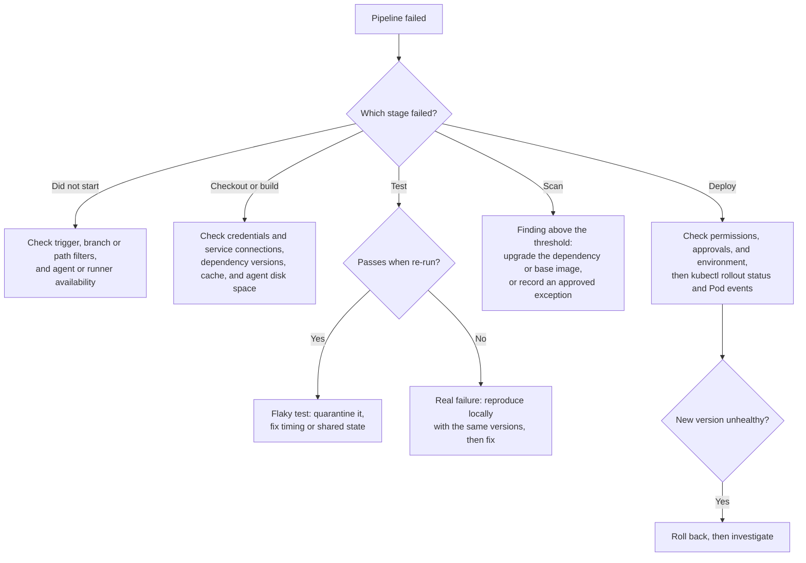

# CI/CD: Troubleshooting, Monitoring, and Operations

> Debugging failed and flaky pipelines, staging-vs-production differences, verifying deployments, notifications, and handling operational tickets.

## Key Concepts

### Failing Pipeline Decision Tree

Read the log of the first failed step, not the last one: later failures are often side effects. Then decide whether the failure is in your code, in the pipeline setup, or in the environment it deploys to.

## Interview Questions

### 1. What happens when a pipeline fails? Give a real example.

**Answer:**

The pipeline stops any dependent stages, records logs and reports, marks the commit status, and notifies the owner. I figure out whether the failure is in the code, the test, the scanner, the runner, the credentials, the artifact, the network, or the target environment.

I don't just rerun it blindly — that hides flaky behavior instead of fixing it.

One real example: Trivy blocked an image because of a critical OpenSSL vulnerability in the base image. I confirmed the CVE and which version fixed it, updated the pinned base image, rebuilt from a clean cache, rescanned, ran regression tests, and published a new immutable digest.

Production was never reached.

Afterward, we scheduled regular base-image updates, assigned ownership for vulnerability exceptions, started retaining SBOMs, and built a dashboard to track aging critical findings.

### 2. How do you debug CI/CD pipeline flakiness? *(scenario)*

**Answer:** Identify the tests that fail unpredictably, add retries with backoff (waiting longer between each retry), isolate shared resources, and watch job history trends.
Mini-case: A flaky integration test broke builds one time in ten. Containerizing the test database eliminated the shared-state issue.

**Detailed interview approach:**
I collect the failure rate by test, stage, agent image, time, and dependency, then reproduce it using the same commit and environment. I look for shared mutable test data, assumptions about timing or order, random seeds, dependence on external APIs, resource pressure, and race conditions.

Logs capture the seed, test ID, and container and dependency versions — but never secrets. I isolate databases and queues per run, freeze or inject time, mock unstable external calls, and wait on health conditions instead of using fixed sleeps.

A small, limited retry can help classify a known temporary issue, but it shouldn't just turn a failing test green without recording it. I only isolate a flaky test with an owner and an expiry date, then fix the real cause and track the flake rate until it hits zero.

### 3. A deployment works in staging but fails in production. What differences do you compare?

**Answer:**

I compare the exact artifact digest and configuration commit first — rebuilding between environments would make this investigation unreliable.

Then I check identity and permissions, secret names and versions, network routes and firewall policy, DNS and certificates, database schema and data volume, feature flags, external endpoints, quotas, resource limits, replica counts, region or zone, runtime versions, admission policies, and any production-only proxy or service mesh.

I preserve the production error, deployment events, logs, metrics, traces, and an audit of what changed, then reproduce the issue with production-like configuration while keeping sensitive values protected. I avoid making random manual changes while investigating.

If the impact is still active, I pause or roll back and confirm recovery before testing any fix.

The long-term fix is environment parity where it's practical, explicit versioned differences where it isn't, promoting one immutable artifact everywhere, testing with production-like load and policy, validating the config schema, running preflight dependency checks, and detecting drift.

### 4. A deployment succeeded, but traffic still reaches the old version. Where do you start?

**Answer:**

First I verify the actual deployed artifact digest, the workload revision, and the real Pod or container image — I don't just trust a "success" message.

Then I trace the request path: DNS and CDN cache, the load balancer or ingress routing, the service selector and EndpointSlices, readiness, the rollout strategy and its traffic weights, service-mesh routing, and client or browser cache.

Common causes are a mutable tag resolving to something unexpected, a deployment template that never actually changed, old endpoints still marked ready, canary or blue-green routing still weighted toward the old revision, cache TTL, or a deploy that went to the wrong cluster or namespace.

I capture evidence, make the smallest reversible fix to routing or rollout, and confirm live requests are hitting the new version — using version headers or metrics — before closing the incident.

### 5. How do you ensure deployments are successful, and what monitoring/logging tools do you use to detect failures? *(scenario)*

**Answer:** ArgoCD monitors resource health. Liveness and readiness probes check the app itself. Prometheus, Grafana, and CloudWatch logs cover monitoring. Alertmanager and PagerDuty handle alerting. Post-deploy synthetic transaction jobs confirm things actually work, and failures trigger an automatic rollback.

**Detailed interview approach:**
Validating a deployment happens in layers. ArgoCD watches Kubernetes resources for a healthy state after applying manifests, and Kubernetes liveness and readiness probes check both infrastructure and application health.

For monitoring, I run Prometheus on EKS with Grafana dashboards for key metrics, while logs are centralized in CloudWatch and processed with CloudWatch Insights. Both the application and infrastructure expose custom metrics for business and technical KPIs.

Alerting is configured in Prometheus Alertmanager, integrated with PagerDuty for critical issues. After deploying, automated Kubernetes Jobs run synthetic transactions to check end-to-end functionality — and if any check fails, ArgoCD automatically rolls back to the last known-good state.

### 6. How do you implement CI/CD notifications? *(scenario)*

**Answer:** Integrate Jenkins or Azure DevOps with Slack, Teams, or email, and send success and failure alerts with logs.

**Detailed interview approach:**
I send notifications from the pipeline's completion or `post` step, and include the status, service, environment, commit, artifact, failed stage, owner, run URL, dashboard link, and next action. Secrets or raw logs never get copied into chat.

Success messages are grouped or limited, while production failures, approval waits, and rollback events route to the owning channel or on-call system based on severity. Webhook credentials live in the secret store, and delivery failures are monitored.

I test notification formatting and deduplication, and link back to the retained evidence. Chat is a communication channel, not the source of truth — the CI system and the change record hold the actual audit data.

### 7. How do you manage a ServiceNow task assigned to you?

**Answer:**

I read the category, impact, urgency, SLA, requester, evidence, dependencies, and any approval requirements. I restate the expected outcome and ask focused questions if something's unclear. I prioritize by user and business impact and the SLA — not just the order tickets arrived in.

I document investigation timestamps, the commands and results I ran (without secrets), the changes made, validation steps, and communication. Risky changes go through change control with a rollback plan.

If I'm blocked, I update the ticket with the owner, the reason, the next action, and an expected time — I don't leave it silent.

I only close a ticket once the requester or a defined test confirms success. I link related incident, problem, or change records, and write a knowledge article or automation if the issue is likely to repeat.
