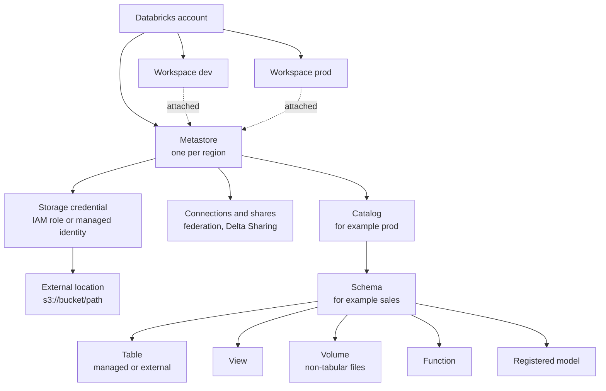

# Databricks: Unity Catalog

> The Unity Catalog metastore and object hierarchy, managed vs external storage, storage credentials and external locations, the GRANT model, workspace binding, lineage and system tables, and migrating from the Hive metastore.

## Key Concepts

### Metastore and the object hierarchy

Unity Catalog (UC) is the governance layer for data and AI assets in Databricks. The top object is the **metastore**. You normally have one metastore per cloud region, and you attach many workspaces in that region to it. Everything is addressed with a three-level name: `catalog.schema.object`.

The diagram shows what lives where. Storage credentials, external locations, connections and shares hang off the metastore. Tables, views, volumes, functions and models live inside a schema.



| Object | What it is |
| --- | --- |
| Catalog | Top-level container. Often one per environment or business domain, for example `dev`, `prod`, `finance` |
| Schema | A database inside a catalog, for example `prod.sales` |
| Table | Delta (or Iceberg) table. Managed or external |
| View | Saved query. Also materialized views and streaming tables from pipelines |
| Volume | Governed path for files such as CSV, images, JARs: `/Volumes/catalog/schema/volume/` |
| Function | SQL or Python UDF governed by UC |
| `hive_metastore` | The legacy per-workspace Hive metastore, shown as a catalog in UC-enabled workspaces |

### Managed vs external tables

- **Managed table:** UC owns the data files and their lifecycle. Files go under the managed storage location of the schema, catalog, or metastore (the most specific one wins). `DROP TABLE` removes the table, and the files are purged after the recovery period. You get features like predictive optimization and `UNDROP`.
- **External table:** UC governs access, but the data lives at a path you choose inside an external location. `DROP TABLE` removes only the metadata. The files stay.

```sql
-- Managed storage per catalog keeps prod data in its own bucket
CREATE CATALOG prod MANAGED LOCATION 's3://acme-uc-prod/managed';

-- Managed table: no LOCATION clause
CREATE TABLE prod.sales.orders (id BIGINT, amount DECIMAL(10,2));

-- External table: path must sit inside an external location
CREATE TABLE prod.raw.events_ext
LOCATION 's3://acme-landing/events/';
```

Default recommendation: use **managed tables**, and use external tables only when other tools must write the same files, or the data must outlive the table.

### Storage credentials and external locations

A **storage credential** wraps a cloud identity: on AWS an IAM role that Databricks assumes, on Azure an access connector managed identity. An **external location** pairs one storage credential with one cloud path. Users never see keys. They get `READ FILES`, `WRITE FILES` or `CREATE EXTERNAL TABLE` on the external location.

```sql
CREATE EXTERNAL LOCATION landing
  URL 's3://acme-landing/'
  WITH (STORAGE CREDENTIAL uc_landing_role)
  COMMENT 'Raw files from upstream systems';

GRANT READ FILES ON EXTERNAL LOCATION landing TO `data-engineers`;
```

Keep external locations from overlapping, and do not grant broad access on the storage credential itself. Grant on the external location.

### Privileges, ownership and inheritance

UC uses SQL `GRANT` / `REVOKE` on securable objects to principals: users, groups, or service principals. Grant to **groups**, not individual users.

- **Inheritance:** a privilege granted on a catalog or schema applies to all current and future children. `GRANT SELECT ON SCHEMA prod.sales` covers every table added later.
- **Usage privileges:** to read `prod.sales.orders` you need `USE CATALOG` on `prod`, `USE SCHEMA` on `prod.sales`, and `SELECT` on the table (or inherited from above).
- **Ownership:** every object has one owner (user, group, or service principal). The owner can grant, alter and drop. Set owners to groups or service principals, not people who may leave.
- **Who can grant:** the owner, a principal with `MANAGE` on the object, or a metastore admin.
- **Discovery:** `BROWSE` lets users see that objects exist and request access without reading data.

| Securable | Common privileges |
| --- | --- |
| Catalog | `USE CATALOG`, `CREATE SCHEMA`, `BROWSE` |
| Schema | `USE SCHEMA`, `CREATE TABLE`, `CREATE VOLUME`, `CREATE FUNCTION` |
| Table / view | `SELECT`, `MODIFY` |
| Volume | `READ VOLUME`, `WRITE VOLUME` |
| Function | `EXECUTE` |
| External location | `READ FILES`, `WRITE FILES`, `CREATE EXTERNAL TABLE`, `CREATE MANAGED STORAGE` |
| Any object | `MANAGE`, `ALL PRIVILEGES` |

Fine-grained control: **row filters** and **column masks** are functions attached to a table, and they apply on every query path.

### Workspace binding

By default a catalog is `OPEN`: every workspace attached to the metastore can use it if the user has grants. Setting the catalog to `ISOLATED` and binding it to chosen workspaces means it is only reachable from those workspaces, even for a user who has grants. A binding can also be **read-only**. The same binding works for external locations, storage credentials and service credentials.

Typical use: `prod` catalog bound read-write to the prod workspace and read-only to an analytics workspace, never visible from dev.

### Lineage, audit and system tables

UC captures table and column lineage automatically for queries that run on UC-enabled compute. Catalog Explorer shows it graphically. For automation, query the `system` catalog:

| System table | Use |
| --- | --- |
| `system.access.audit` | Who did what: grants, logins, table reads, token use |
| `system.access.table_lineage` / `column_lineage` | Upstream and downstream dependencies |
| `system.billing.usage` and `list_prices` | DBU usage and cost by tag, job, warehouse |
| `system.compute.clusters`, `warehouses` | Compute configuration history |
| `system.lakeflow.jobs`, `job_run_timeline` | Job inventory and run results |
| `system.query.history` | SQL warehouse and serverless queries |

Access to system tables is itself governed by UC grants. Most tables keep 365 days of data, and most are regional (billing usage is global).

### Migrating from the Hive metastore

| Method | Use it for | Notes |
| --- | --- | --- |
| `SYNC SCHEMA` / `SYNC TABLE` | HMS external tables, and managed tables stored outside DBFS root | Creates UC **external** tables over the same files. No data copy. `DRY RUN` first |
| Upgrade wizard in Catalog Explorer | Same as SYNC, with a UI | Uses SYNC underneath |
| `CREATE TABLE ... DEEP CLONE` | HMS managed Delta tables, including DBFS root | Copies data and metadata into a UC managed table |
| CTAS | Non-Delta formats or reshaping during migration | You restate properties and partitioning yourself |
| UCX (Databricks Labs) | Whole-workspace assessment and bulk migration | Inventory, group migration, table migration, code linting |
| Hive metastore federation | Govern HMS tables through UC before moving data | A bridge, not the end state |

## Interview Questions

<details><summary>Q1. [Basic] What is Unity Catalog, and what problem does it solve compared to the workspace Hive metastore?</summary>

**Answer:**

Unity Catalog is the central governance layer in Databricks. It holds metadata, permissions, lineage and audit for tables, views, volumes, functions and models, across every workspace attached to the same metastore.

With the legacy Hive metastore each workspace had its own metastore and its own table ACLs. The same table could have different permissions in two workspaces, access to storage was usually done with instance profiles or mounts that bypassed table ACLs, and there was no built-in lineage.

UC fixes that:

- **Define once, enforce everywhere:** one set of grants, applied in every attached workspace.
- **Account-level identities:** users, groups and service principals come from the account, usually synced with SCIM from the identity provider.
- **Governed storage:** storage credentials and external locations replace mounts and keys.
- **Lineage and audit:** captured automatically and queryable in system tables.
- **Three-level namespace:** `catalog.schema.table`.

**How to verify a workspace uses UC:** `SELECT current_metastore();` returns the metastore ID, and Catalog Explorer shows catalogs other than `hive_metastore`.

</details>

<details><summary>Q2. [Basic] What is the difference between a managed table and an external table in Unity Catalog?</summary>

**Answer:**

| | Managed | External |
| --- | --- | --- |
| Who controls files | Unity Catalog | You, at a path in an external location |
| Where files go | Managed location of schema, catalog or metastore | The `LOCATION` you give |
| `DROP TABLE` | Table dropped; files purged after the recovery period | Only metadata dropped; files stay |
| `UNDROP` | Yes, within the recovery period (default 7 days) | No |
| Optimizations | Predictive optimization, automatic maintenance | You run `OPTIMIZE` / `VACUUM` yourself |

I default to managed tables. I use external tables when another system (Spark outside Databricks, an ingestion tool, Athena) has to read or write the same files directly, or when data must survive a table drop.

**Pitfall:** people assume `DROP TABLE` on an external table cleans storage. It doesn't, so you get orphaned data and cost. The opposite mistake is dropping a managed table thinking the data is safe in the bucket.

</details>

<details><summary>Q3. [Basic] What is a volume, and when do you use it instead of a table?</summary>

**Answer:**

A volume is a Unity Catalog object for **non-tabular files**: CSVs before ingestion, images, PDFs, ML artifacts, JAR or wheel files. It lives in a schema, so it is governed by the same grants, and you access it with a path:

```python
df = spark.read.csv("/Volumes/prod/raw/landing/orders/2026-10-01.csv", header=True)
```

```sql
GRANT READ VOLUME ON VOLUME prod.raw.landing TO `data-engineers`;
```

Volumes can be managed (files in UC managed storage) or external (over a path in an external location). They replace DBFS mounts, which are not governed by UC.

Rule of thumb: structured data you query with SQL goes in a table. Raw files, or files that a library reads by path, go in a volume.

</details>

<details><summary>Q4. [Intermediate] A user gets <code>PERMISSION_DENIED</code> querying <code>prod.sales.orders</code> even though you granted SELECT on the table. How do you troubleshoot it? <em>(scenario)</em></summary>

**Answer:**

`SELECT` on the table is not enough. I check the full path and the compute.

1. **Usage privileges on the parents:**

   ```sql
   SHOW GRANTS `analyst@acme.com` ON CATALOG prod;
   SHOW GRANTS `analyst@acme.com` ON SCHEMA prod.sales;
   SHOW GRANTS ON TABLE prod.sales.orders;
   ```

   The user needs `USE CATALOG` on `prod` and `USE SCHEMA` on `prod.sales`.

2. **Group membership:** grants are usually to groups. Confirm the user is in the account-level group, not only a workspace-local group. Workspace-local groups cannot receive UC grants.
3. **Workspace binding:** if `prod` is `ISOLATED` and not bound to this workspace, grants don't help. Check `databricks catalogs get prod` for `isolation_mode`.
4. **Compute:** the cluster must be UC-capable: standard (formerly shared) or dedicated (formerly single user) access mode, on a supported runtime. A "no isolation shared" cluster cannot read UC tables.
5. **View or row filter:** if it is a view, the view owner needs access to the base tables. A row filter function needs `EXECUTE` for its owner path.
6. **Audit log:** `system.access.audit` shows the denied request and the exact privilege missing.

Fix by granting to the group at the right level:

```sql
GRANT USE CATALOG ON CATALOG prod TO `sales-analysts`;
GRANT USE SCHEMA, SELECT ON SCHEMA prod.sales TO `sales-analysts`;
```

**Verify:** run the query as the user, or check `SHOW GRANTS` again.

</details>

<details><summary>Q5. [Intermediate] How does privilege inheritance work, and how do you design grants for a dev, test and prod setup?</summary>

**Answer:**

Grants flow down. A grant on a catalog applies to every schema and object in it, now and in the future. A grant on a schema applies to every table, view, volume and function in it. There is no "deny", so you design by granting at the narrowest level that still stays manageable.

A simple model I would propose:

| Catalog | Engineers group | Analysts group | CI service principal |
| --- | --- | --- | --- |
| `dev` | `ALL PRIVILEGES` | none | `USE CATALOG`, `CREATE SCHEMA` |
| `test` | `USE CATALOG`, `SELECT` | none | owner of schemas it deploys |
| `prod` | `USE CATALOG`, `BROWSE`, `SELECT` on approved schemas | `SELECT` on `gold` schemas | owner of prod schemas and jobs |

```sql
ALTER SCHEMA prod.gold OWNER TO `sp-prod-deployer`;
GRANT USE CATALOG ON CATALOG prod TO `analysts`;
GRANT USE SCHEMA, SELECT ON SCHEMA prod.gold TO `analysts`;
```

Key points:

- Humans don't own prod objects. A deployment service principal or an owning group does.
- Only automation writes to prod (`MODIFY`). Humans get read access and break-glass through a reviewed process.
- Manage grants as code (Terraform `databricks_grants` or SQL in the deploy pipeline), so drift is visible.

**Pitfall:** `ALL PRIVILEGES` on a catalog to a broad group gives `MODIFY` on every future table too.

</details>

<details><summary>Q6. [Intermediate] How do you give Databricks access to an S3 bucket through Unity Catalog?</summary>

**Answer:**

1. Create an IAM role with a policy for the bucket (`s3:GetObject`, `PutObject`, `DeleteObject`, `ListBucket`, `GetBucketLocation`, plus KMS permissions if the bucket uses SSE-KMS).
2. Create the **storage credential** in Databricks with that role ARN. Databricks gives you an external ID. Update the role trust policy to trust the Databricks UC role with that external ID. The role must also be able to assume itself (self-assuming), which the current setup requires.
3. Create an **external location** for the path, using the credential.
4. Grant on the external location, not on the credential.

```hcl
resource "databricks_storage_credential" "landing" {
  name = "uc-landing"
  aws_iam_role {
    role_arn = aws_iam_role.uc_landing.arn
  }
}

resource "databricks_external_location" "landing" {
  name            = "landing"
  url             = "s3://acme-landing/"
  credential_name = databricks_storage_credential.landing.id
}

resource "databricks_grants" "landing" {
  external_location = databricks_external_location.landing.id
  grant {
    principal  = "data-engineers"
    privileges = ["READ FILES", "CREATE EXTERNAL TABLE"]
  }
}
```

**Verify:** "Test connection" on the external location in Catalog Explorer, then `LIST 's3://acme-landing/'` as a granted user.

**Pitfalls:** missing KMS permissions (works for list, fails on read), forgetting the external ID in the trust policy, and overlapping external locations.

</details>

<details><summary>Q7. [Intermediate] What is workspace binding, and when would you use it?</summary>

**Answer:**

Workspace binding limits which workspaces can reach a catalog, external location, or storage credential. By default a catalog is `OPEN` to every workspace on the metastore. After you set it to `ISOLATED`, only bound workspaces can use it, and each binding can be read-write or read-only.

Use cases:

- Keep `prod` data unreachable from the dev workspace, even for a user who has grants in both.
- Give an analytics or BI workspace read-only access to `prod`.
- Isolate a regulated domain (for example PII) to one workspace with stricter network controls.

```bash
databricks catalogs update prod --isolation-mode ISOLATED
databricks workspace-bindings update-bindings catalog prod --json '{
  "add": [
    {"workspace_id": 1111111111111111, "binding_type": "BINDING_TYPE_READ_WRITE"},
    {"workspace_id": 2222222222222222, "binding_type": "BINDING_TYPE_READ_ONLY"}
  ]
}'
```

In Terraform this is `databricks_workspace_binding`.

**Why it matters:** grants answer "who". Binding answers "from where". Both are needed for real environment isolation on a shared regional metastore.

</details>

<details><summary>Q8. [Intermediate] How do you find who accessed or changed a table, and what depends on it?</summary>

**Answer:**

I use system tables, because they are queryable and can feed alerts or Splunk.

```sql
-- Who read or changed a table in the last 7 days
SELECT event_time, user_identity.email, action_name, request_params
FROM system.access.audit
WHERE event_date >= current_date() - 7
  AND service_name = 'unityCatalog'
  AND request_params.full_name_arg = 'prod.sales.orders'
ORDER BY event_time DESC;

-- What reads from this table (downstream)
SELECT DISTINCT target_table_full_name, entity_type
FROM system.access.table_lineage
WHERE source_table_full_name = 'prod.sales.orders'
  AND event_date >= current_date() - 30;
```

Grant changes show up as audit actions such as `updatePermissions`. For impact analysis before a schema change, I check downstream lineage, then the jobs and dashboards that read those tables.

**Pitfalls:** system tables must be readable by you (`USE CATALOG system`, `USE SCHEMA`, `SELECT`). Lineage only covers work run on UC-enabled compute, so external readers of an external table's files are invisible.

TODO (Siva): add whether your team ships Databricks audit data to Splunk and how.

</details>

<details><summary>Q9. [Intermediate] How do you migrate an external Hive metastore table to Unity Catalog with SYNC?</summary>

**Answer:**

`SYNC` creates a UC external table that points to the same files, so there is no data copy and almost no downtime.

```sql
-- 1. Preview what would happen
SYNC SCHEMA prod.sales FROM hive_metastore.sales DRY RUN;

-- 2. Run it, with a group as owner
SYNC SCHEMA prod.sales FROM hive_metastore.sales SET OWNER `data-platform`;

-- Single table
SYNC TABLE prod.sales.orders FROM hive_metastore.sales.orders;
```

Prerequisites: an external location covering the table path, and the target catalog and schema already created.

`SYNC` writes an `upgraded_to` table property on the HMS table, so re-running it is safe and keeps metadata in sync until you cut over.

Then:

1. Re-create grants in UC (HMS table ACLs are not copied).
2. Point jobs and notebooks at `prod.sales.orders` instead of `hive_metastore.sales.orders`.
3. Run old and new paths in parallel for a cycle and compare counts.
4. Make the HMS table read-only or drop its metadata after cutover.

**Limits:** SYNC does not handle managed tables in DBFS root or Hive SerDe tables. Those need deep clone or CTAS.

</details>

<details><summary>Q10. [Advanced] Compare SYNC, deep clone, shallow clone and CTAS for moving managed HMS tables into Unity Catalog. Which do you pick? <em>(scenario)</em></summary>

**Answer:**

| Option | Data copied | Result in UC | Good for | Watch out |
| --- | --- | --- | --- | --- |
| `SYNC` | No | External table | HMS external tables, managed tables outside DBFS root | Not DBFS root, not Hive SerDe |
| `DEEP CLONE` | Yes | Managed table (or external with `LOCATION`) | HMS managed Delta tables | Storage and compute cost for big tables; history is not copied |
| `SHALLOW CLONE` | No, references source files | Same type as source within UC | Fast dev/test copies of UC tables | Breaks when the source files are vacuumed or purged; not a migration |
| CTAS | Yes | Managed table | Non-Delta formats, changing partitioning or types | Must restate properties, comments, constraints |

For managed Delta tables in DBFS root I pick **deep clone**:

```sql
CREATE TABLE prod.sales.orders
DEEP CLONE hive_metastore.sales.orders;

-- Incremental re-run just before cutover copies only new files
CREATE OR REPLACE TABLE prod.sales.orders
DEEP CLONE hive_metastore.sales.orders;
```

Plan for a big estate:

1. **Assess with UCX:** inventory tables, formats, locations, mounts, and code that uses `hive_metastore` or DBFS paths.
2. **Migrate groups** from workspace-local to account groups first, or grants won't map.
3. **Bucket tables:** external ones get SYNC, managed Delta gets deep clone, non-Delta gets CTAS.
4. **Freeze writes** on each table during the final incremental clone, then switch jobs.
5. **Validate:** row counts, checksums on key columns, schema compare.
6. **Decommission:** remove mounts and instance profiles that bypass UC.

**Pitfalls:** clones don't copy table ACLs; streaming checkpoints point to the old table and must be reset or migrated; and shallow clone as a "migration" leaves UC depending on HMS-managed files.

</details>

<details><summary>Q11. [Advanced] How would you run a workspace-wide Hive metastore to Unity Catalog migration with UCX? <em>(scenario)</em></summary>

**Answer:**

UCX is a Databricks Labs tool installed with the CLI. It deploys assessment and migration jobs into the workspace.

```bash
databricks labs install ucx
databricks labs ucx ensure-assessment-run
databricks labs ucx create-account-groups      # account groups matching workspace groups
databricks labs ucx create-table-mapping       # CSV: HMS table -> UC catalog.schema.table
databricks labs ucx create-uber-principal      # temporary identity to read all locations
databricks labs ucx migrate-credentials        # storage credentials from instance profiles
databricks labs ucx migrate-locations          # external locations
databricks labs ucx create-catalogs-schemas
databricks labs ucx migrate-tables
databricks labs ucx lint-local-code            # find hive_metastore, DBFS and RDD usage
```

Group permission migration runs as a UCX workflow (`databricks labs ucx workflows` lists them). Command names change between UCX releases, so I check `databricks labs ucx --help` for the installed version. UCX is a Labs project: useful, but not covered by a Databricks support SLA.

How I would phase it:

1. **Assess:** run the assessment, review the dashboard (incompatible clusters, mounts, init scripts, tables in DBFS root, code issues).
2. **Foundations:** metastore attached, catalogs per environment with managed locations, storage credentials and external locations in Terraform.
3. **Identity:** account groups replace workspace-local groups.
4. **Tables:** edit the mapping file, migrate in waves by domain.
5. **Code:** UCX linting (`lint-local-code`, plus the workspace code assessment) finds `hive_metastore` references, DBFS paths and RDD usage. Fix them in Git, not in the workspace.
6. **Compute:** switch clusters and jobs to standard or dedicated access mode with policies.
7. **Cutover and cleanup:** remove the uber principal, mounts, and instance profiles.

TODO (Siva): if you did a UC migration, add scale (number of tables or workspaces) and the hardest problem you hit.

</details>

<details><summary>Q12. [Advanced] How do you design catalogs, metastores and storage for multiple environments and business units?</summary>

**Answer:**

My starting design on AWS:

- **One metastore per region**, shared by dev, test and prod workspaces in that region. Don't create one metastore per environment: it breaks lineage and sharing, and the account limit is one per region by default anyway.
- **Catalog per environment** (`dev`, `test`, `prod`), or per environment and domain (`prod_finance`) for large orgs.
- **Managed location per catalog** in a separate bucket per environment, each with its own storage credential and KMS key. Prod data never shares a bucket with dev.
- **Workspace binding:** `prod` isolated to the prod workspace (read-write) and BI workspace (read-only).
- **Ownership:** catalogs owned by a platform admin group; prod schemas owned by the deploying service principal.
- **Code is environment-agnostic:** the catalog name is a parameter (`${var.catalog}` in bundles), so the same job runs against `dev` and `prod`.
- **Cross-region:** use Delta Sharing between metastores instead of pointing two regions at one bucket.

| Decision | Trade-off |
| --- | --- |
| Catalog per env vs per domain | Per env is simple; per domain scales ownership but multiplies grants |
| Metastore-level managed storage vs catalog-level | Catalog-level gives physical isolation and per-env KMS keys |
| One prod workspace vs many | More workspaces isolate teams but add binding and policy work |

**Verify:** a test user in dev cannot `SHOW SCHEMAS IN prod`, and `DESCRIBE CATALOG EXTENDED prod` shows the right storage root.

</details>

<details><summary>Q13. [Advanced] How do you implement PII protection with row filters and column masks?</summary>

**Answer:**

Row filters and column masks are UC functions attached to a table. They run on every query, from any workspace, so they are safer than maintaining many filtered views.

```sql
-- Mask email unless the reader is in the pii-readers group
CREATE FUNCTION prod.security.mask_email(email STRING)
RETURN CASE WHEN is_account_group_member('pii-readers') THEN email
            ELSE concat('***@', split(email, '@')[1]) END;

ALTER TABLE prod.crm.customers
  ALTER COLUMN email SET MASK prod.security.mask_email;

-- Only show rows for the user's region
CREATE FUNCTION prod.security.region_filter(region STRING)
RETURN is_account_group_member('global-sales') OR
       is_account_group_member(concat('sales-', region));

ALTER TABLE prod.crm.customers
  SET ROW FILTER prod.security.region_filter ON (region);
```

Points to mention:

- Use `is_account_group_member`, which checks account groups.
- Keep the functions in a locked-down schema; only the security team can change them.
- Tag PII columns (governed tags or data classification) so you can find columns that should have a mask.
- Test both paths: a member sees clear values; a non-member sees masked values.

**Pitfalls:** dedicated (single user) compute on older runtimes could not read tables with filters or masks; check runtime support. Filters also affect performance, so keep them simple.

</details>

<details><summary>Q14. [Advanced] Someone ran <code>DROP TABLE</code> on a production managed table. What do you do? <em>(scenario)</em></summary>

**Answer:**

1. **Stop the damage:** pause jobs that write to or read from the table, so downstream tables don't process empty data.
2. **Check it is recoverable:**

   ```sql
   SHOW TABLES DROPPED IN prod.sales;
   UNDROP TABLE prod.sales.orders;
   -- or by ID if a new table with the same name exists
   UNDROP TABLE WITH ID '<table-id>';
   ```

   Managed tables can be restored within the recovery period, 7 days by default. It can be set at catalog or schema level to 0 or 7 to 30 days.
3. **Find out who and how:** `system.access.audit` for `deleteTable` on that name, with user, time and source IP.
4. **Restore grants and validate:** confirm row counts and the latest version with `DESCRIBE HISTORY`. If data was overwritten rather than dropped, use time travel: `RESTORE TABLE prod.sales.orders TO VERSION AS OF 123`.
5. **Prevent it:** humans should not own or have `MANAGE`/`MODIFY` on prod objects. Only the deploy service principal does. Add an alert on drop events in prod.

For an **external** table, `UNDROP` doesn't apply. The files still exist, so re-create the table over the same `LOCATION`.

</details>

<details><summary>Q15. [Advanced] What are common Unity Catalog pitfalls you would warn a team about?</summary>

**Answer:**

- **Workspace-local groups:** they cannot get UC grants. Use account groups synced by SCIM.
- **Wrong compute:** "no isolation shared" clusters and old runtimes can't use UC. Enforce access mode through cluster policies.
- **Mounts and instance profiles left behind:** they bypass UC governance. Remove them after migration.
- **People as owners:** when someone leaves, objects are orphaned. Use groups or service principals.
- **Broad catalog grants:** `ALL PRIVILEGES` at catalog level leaks `MODIFY` to every future table.
- **Overlapping external locations** and managed storage inside an external location path cause confusing access errors.
- **Hard-coded catalog names** in code make promotion between environments painful. Parameterize them.
- **Expecting DROP on external tables to delete data**, or the reverse for managed tables.
- **Lineage gaps:** anything that touches files directly is not captured.
- **Grants by hand in prod:** they drift. Keep grants in Terraform or the deploy pipeline.

See also [Workspace and cluster management](02-workspace-and-cluster-management.md) and [CI/CD and Asset Bundles](03-cicd-asset-bundles-and-data-platform-devops.md).

</details>
