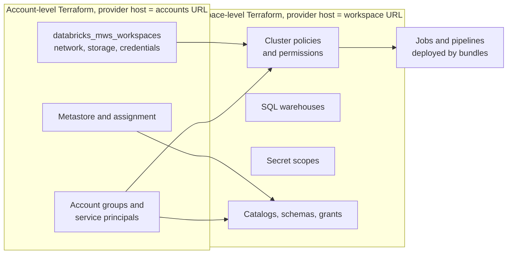

# Databricks: Workspace and Cluster Management

> The account console and workspaces, compute types and access modes, cluster policies, autoscaling, pools, runtimes, secrets, service principals, cost control, and managing it all with Terraform or OpenTofu.

## Key Concepts

### Account console and workspaces

A Databricks **account** is the top level. The account console (on AWS `https://accounts.cloud.databricks.com`, on Azure `https://accounts.azuredatabricks.net`) is where account admins manage workspaces, Unity Catalog metastores, users and groups, service principals, SCIM sync, and billing.

A **workspace** is the environment where people run notebooks, jobs, pipelines and SQL. It has its own URL, its own compute, and its own workspace admins. Identities live at the account level and are assigned to workspaces.

| Level | Typical admin tasks |
| --- | --- |
| Account | Create workspaces, metastores, account groups, service principals, SCIM, budgets, network and private connectivity configs |
| Workspace | Compute and policies, workspace permissions, Git folders, secrets, jobs, SQL warehouses |

On AWS the **control plane** runs in Databricks' account and the **classic compute plane** runs in your VPC. **Serverless** compute runs in Databricks' account, close to your workspace.

### Compute types

| Compute | What it is | Use it for |
| --- | --- | --- |
| All-purpose cluster | Long-running, shared or personal, started by users | Interactive notebooks, development |
| Job cluster | Created for one job run, terminated when it ends | Scheduled production jobs on classic compute |
| SQL warehouse | Compute for SQL only; classic, pro or serverless | BI tools, dashboards, ad-hoc SQL |
| Serverless compute | Databricks-managed, starts in seconds, no cluster config | Notebooks, jobs and pipelines when you don't need custom VMs |

Job clusters are billed at the cheaper jobs compute rate. Running scheduled jobs on an all-purpose cluster costs more and mixes workloads.

### Access modes (naming change)

Access mode decides who can use a cluster and how Unity Catalog isolates users.

| Current name | Former name | API value | Meaning |
| --- | --- | --- | --- |
| **Standard** | Shared | `USER_ISOLATION` | Many users, isolated from each other. Python, SQL, Scala (DBR 13.3+). No R, no RDD API, no ML runtime |
| **Dedicated** | Single user | `SINGLE_USER` | One user, or one group (dedicated group access). Full language and ML support |
| No isolation shared | Same | `NONE` | Legacy. No UC support. Block it with policies |

Databricks recommends **standard** as the default and **dedicated** when a workload needs something standard mode doesn't support (R, RDDs, GPUs, ML runtime, some init scripts).

### Cluster policies

A cluster policy (also called a compute policy) is a JSON set of rules that limits what users can configure. Users can only create compute through policies they have `CAN_USE` on. Policies are the main tool for cost control and security on classic compute.

```json
{
  "data_security_mode": { "type": "fixed", "value": "USER_ISOLATION" },
  "autotermination_minutes": { "type": "range", "minValue": 10, "maxValue": 60, "defaultValue": 30 },
  "spark_version": { "type": "unlimited", "defaultValue": "auto:latest-lts" },
  "node_type_id": { "type": "allowlist", "values": ["m6i.xlarge", "m6i.2xlarge"] },
  "autoscale.max_workers": { "type": "range", "maxValue": 8 },
  "custom_tags.cost_center": { "type": "fixed", "value": "data-platform" },
  "dbus_per_hour": { "type": "range", "maxValue": 20 }
}
```

Policy types: `fixed`, `forbidden`, `allowlist`, `blocklist`, `regex`, `range`, `unlimited`. `cluster_type` is a virtual attribute (`all-purpose`, `job`, `dlt`) to make a policy only apply to one kind of compute. Databricks ships **policy families** (for example Personal Compute, Job Compute) that you can inherit from.

### Autoscaling, auto-termination and pools

- **Autoscaling:** set `min_workers` and `max_workers`. Databricks adds workers under load and removes them when idle. Good for variable batch work. For streaming, use Lakeflow pipelines with enhanced autoscaling instead of classic autoscaling.
- **Auto-termination:** all-purpose clusters stop after N idle minutes. `0` disables it. Job clusters end with the job.
- **Instance pools:** keep idle, ready VMs so clusters start faster. Idle pool instances cost cloud VM money but no DBUs. Set `min_idle_instances` low and an idle timeout. Pools don't apply to serverless.

### Databricks Runtime

The Databricks Runtime (DBR) is the image on cluster nodes: Spark, Delta, Python, libraries. **LTS** releases are supported for about three years. Variants include **ML** (ML libraries, GPU support) and Photon-enabled compute. Pin LTS for production jobs, test upgrades in dev first, and use `auto:latest-lts` in policies only where drifting forward is acceptable.

### Secrets, service principals and Terraform

- **Secret scopes** store credentials. Databricks-backed scopes or, on Azure, Azure Key Vault-backed scopes. Read with `dbutils.secrets.get`. Values are redacted in notebook output.
- **Service principals** are non-human identities for jobs and CI/CD. Use OAuth (client ID and secret, or workload identity federation) instead of personal access tokens.
- **Terraform / OpenTofu:** the `databricks/databricks` provider manages workspaces, UC objects, policies, clusters, jobs, groups and permissions. Use an account-level provider and a workspace-level provider side by side.

The diagram shows how a platform team usually splits ownership between account-level and workspace-level code.



## Interview Questions

<details><summary>Q1. [Basic] What is the difference between the Databricks account console and a workspace?</summary>

**Answer:**

The **account console** is the control centre for the whole Databricks account. Account admins create workspaces, attach Unity Catalog metastores, manage users, groups and service principals (often synced from the identity provider with SCIM), configure networking and private connectivity, and view billing.

A **workspace** is where the work happens: notebooks, jobs, pipelines, SQL warehouses, Git folders and secrets. Workspace admins manage compute, policies and permissions inside one workspace.

Identities are created once at the account level and **assigned** to workspaces with a role (user or admin). Unity Catalog grants also use account-level identities.

**Pitfall:** creating groups inside a workspace (workspace-local groups). They can't receive Unity Catalog grants, so create groups at the account level.

</details>

<details><summary>Q2. [Basic] What is the difference between an all-purpose cluster, a job cluster, a SQL warehouse and serverless compute?</summary>

**Answer:**

- **All-purpose cluster:** created by a user, stays up until terminated or idle timeout, shared for interactive work. Billed at the all-purpose rate.
- **Job cluster:** defined inside a job, created at run start, deleted at run end. Billed at the cheaper jobs rate. Each run gets a clean, isolated environment.
- **SQL warehouse:** SQL-only compute for dashboards, BI tools and SQL queries. Types: classic, pro and serverless. Serverless starts fastest.
- **Serverless compute** for notebooks, jobs and pipelines: no cluster definition, Databricks manages the VMs, quick start, and you pay per usage. You lose control over instance types, init scripts and some Spark configs.

My default for production: serverless jobs where the workload fits, otherwise job clusters through a job policy. All-purpose clusters only for development. SQL warehouses for BI.

**How to verify cost split:** `system.billing.usage` grouped by `sku_name` shows all-purpose vs jobs vs SQL vs serverless spend.

</details>

<details><summary>Q3. [Basic] What are access modes, and what changed in their names?</summary>

**Answer:**

Access mode controls who can attach to a cluster and how Unity Catalog enforces isolation.

- **Standard** (was called **Shared**): many users share the cluster, isolated from each other. Supports Python, SQL and Scala (DBR 13.3+). Doesn't support R, the RDD API, the ML runtime or GPUs.
- **Dedicated** (was called **Single user**): assigned to one user or one group. Supports everything, including ML and R.
- **No isolation shared:** legacy mode with no Unity Catalog support.

In the API and Terraform the older values are still common: `USER_ISOLATION` for standard and `SINGLE_USER` for dedicated.

```hcl
resource "databricks_cluster" "shared_dev" {
  cluster_name            = "shared-dev"
  spark_version           = data.databricks_spark_version.lts.id
  node_type_id            = "m6i.xlarge"
  data_security_mode      = "USER_ISOLATION"   # standard
  autotermination_minutes = 30
  autoscale {
    min_workers = 1
    max_workers = 4
  }
}
```

**Interview tip:** say both names. Older docs, error messages and Terraform code still use "shared" and "single user".

</details>

<details><summary>Q4. [Intermediate] A data scientist's notebook fails on a standard access mode cluster with an RDD or <code>sparkContext</code> error. What do you do? <em>(scenario)</em></summary>

**Answer:**

Standard access mode blocks APIs that would break user isolation: the RDD API, `sc` / `spark.sparkContext` in some languages, and the ML runtime. The error is expected behaviour, not a bug.

Options, in order of preference:

1. **Rewrite to DataFrame APIs.** Most RDD code (`sc.parallelize`, `rdd.map`) has a DataFrame or Spark Connect equivalent. This keeps them on shared, cheaper compute.
2. **Give them dedicated compute.** A cluster in dedicated access mode, assigned to the user or to their team group, through a "data science" policy that fixes node types, max workers and auto-termination.
3. **Use serverless** if the code is DataFrame-based and doesn't need custom libraries.

```bash
databricks clusters get <cluster-id> | jq '.data_security_mode, .single_user_name'
```

**Pitfall:** don't "fix" it by allowing no-isolation clusters. They can't use Unity Catalog, so the user loses data access anyway.

</details>

<details><summary>Q5. [Intermediate] How do you use cluster policies to control cost and enforce security?</summary>

**Answer:**

I create a small set of policies per persona and remove unrestricted cluster creation from regular users.

| Policy | Key rules |
| --- | --- |
| Shared dev | Standard access mode fixed, max 4 workers, auto-terminate 10 to 60 min, allowlisted node types, `cost_center` tag fixed |
| Personal / data science | Dedicated mode, single node or small, ML runtime allowed |
| Job compute | `cluster_type` fixed to `job`, LTS runtime, spot with fallback, required tags |

```hcl
resource "databricks_cluster_policy" "shared_dev" {
  name = "shared-dev"
  definition = jsonencode({
    "data_security_mode"      = { type = "fixed", value = "USER_ISOLATION" }
    "autotermination_minutes" = { type = "range", minValue = 10, maxValue = 60, defaultValue = 30 }
    "autoscale.max_workers"   = { type = "range", maxValue = 4 }
    "custom_tags.cost_center" = { type = "fixed", value = "data-platform" }
    "dbus_per_hour"           = { type = "range", maxValue = 15 }
  })
}

resource "databricks_permissions" "shared_dev" {
  cluster_policy_id = databricks_cluster_policy.shared_dev.id
  access_control {
    group_name       = "data-engineers"
    permission_level = "CAN_USE"
  }
}
```

Then remove the "Allow unrestricted cluster creation" entitlement from the `users` group.

**Verify:** a user in the group sees only allowed fields when creating compute, and `system.compute.clusters` shows the `policy_id` on new clusters.

**Pitfall:** existing clusters are not changed when you edit a policy until they are edited or restarted; check for non-compliant ones.

</details>

<details><summary>Q6. [Intermediate] How do autoscaling, auto-termination and instance pools work together, and when do you use pools?</summary>

**Answer:**

- **Autoscaling** sizes a running cluster between `min_workers` and `max_workers` based on load.
- **Auto-termination** stops an idle all-purpose cluster after N minutes.
- **Instance pools** keep warm VMs so a cluster start or scale-up skips VM provisioning.

I use pools when startup time matters and serverless is not an option: many short job runs, or jobs with tight SLAs. Pool settings:

```hcl
resource "databricks_instance_pool" "jobs" {
  instance_pool_name                    = "jobs-m6i-xlarge"
  node_type_id                          = "m6i.xlarge"
  min_idle_instances                    = 0
  max_capacity                          = 40
  idle_instance_autotermination_minutes = 15
  preloaded_spark_versions              = [data.databricks_spark_version.lts.id]
}
```

Idle pool VMs don't burn DBUs but do cost EC2 money, so keep `min_idle_instances` low outside busy hours.

**Pitfalls:** autoscaling does not help a job that is slow because of skew or a single huge partition; very aggressive auto-termination annoys developers who then ask for exceptions; and pools must match the node type in the cluster spec.

</details>

<details><summary>Q7. [Intermediate] How do you manage secrets in Databricks?</summary>

**Answer:**

I store credentials in **secret scopes** and read them at run time. Nothing goes in notebooks, job parameters or Git.

```bash
databricks secrets create-scope etl-prod
databricks secrets put-secret etl-prod snowflake-password --string-value "$SNOWFLAKE_PASSWORD"
databricks secrets put-acl etl-prod <sp-application-id> READ
databricks secrets list-secrets etl-prod
```

```python
pwd = dbutils.secrets.get(scope="etl-prod", key="snowflake-password")
```

In cluster Spark config or environment variables, reference a secret as `{{secrets/etl-prod/snowflake-password}}`.

Rules:

- One scope per application and environment, with ACLs: `READ` for the job's service principal, `MANAGE` for the platform team.
- Printed secret values show as `[REDACTED]`, but redaction is not a security boundary: anyone who can run code with `READ` can exfiltrate the value. Limit who has `READ`.
- On AWS, prefer IAM roles (instance profiles or UC service credentials) over storing cloud keys at all. On Azure, Key Vault-backed scopes keep the secret in Key Vault.
- Manage scopes and ACLs with Terraform; feed values from your secret manager in CI, never from `.tfvars` in Git.

</details>

<details><summary>Q8. [Intermediate] Why should production jobs run as a service principal, and how do you set it up?</summary>

**Answer:**

If a job runs as a person, it breaks when that person leaves or loses access, and audit logs mix human and automated actions. A service principal is a stable, non-human identity with only the rights the job needs.

Setup:

1. Create the service principal at the account level and assign it to the workspace.
2. Give it UC grants (for example `USE CATALOG`, `USE SCHEMA`, `MODIFY` on the target schema) and `CAN_USE` on the job policy.
3. Create an OAuth secret for CI/CD, or better, a federation policy so CI uses OIDC with no stored secret.
4. Set the job `run_as` to the service principal.

```yaml
# In a bundle target
run_as:
  service_principal_name: "6f1c...-app-id"
```

**Verify:** the job run page shows "Run as" the service principal, and `system.access.audit` shows its application ID for the job actions.

**Pitfall:** users need the "Service principal: User" role on the SP to set it as `run_as`. Grant that only to the CI identity and the platform team.

</details>

<details><summary>Q9. [Intermediate] How do you choose and upgrade Databricks Runtime versions?</summary>

**Answer:**

- Production jobs use an **LTS** runtime, pinned. LTS versions get about three years of support.
- Development can try the latest non-LTS release to test new features early.
- Use the ML runtime only where needed. It is bigger and slower to start.

Upgrade process:

1. Read the release notes and the migration guide for breaking changes (Spark major version, Python version, library versions).
2. Change the runtime in the dev target of the bundle, run the integration tests and a sample of real jobs.
3. Compare output tables and run times.
4. Promote to test and prod through the normal pipeline.
5. Track clusters still on old runtimes with `system.compute.clusters`.

```hcl
data "databricks_spark_version" "lts" {
  long_term_support = true
}
```

**Pitfall:** the data source above resolves to the newest LTS at plan time, so a later `apply` can upgrade production silently. For prod, pin the exact version string.

</details>

<details><summary>Q10. [Advanced] How do you control and report Databricks cost across teams? <em>(scenario)</em></summary>

**Answer:**

I treat cost as three things: attribution, guardrails and review.

**Attribution:**

- Required `custom_tags` (team, cost_center, environment) enforced by cluster policies. Tags flow to cloud billing and to `system.billing.usage`.
- Serverless budget policies to tag serverless usage, since there is no cluster to tag.
- SQL warehouses per team or workload, tagged.

**Guardrails:**

- Policies: auto-termination, max workers, allowlisted node types, `dbus_per_hour` limit.
- Jobs on job clusters or serverless, not all-purpose clusters.
- Spot instances with on-demand fallback for workers on batch jobs (keep the driver on-demand).
- Account budgets with alerts.

**Review:**

```sql
SELECT u.usage_date,
       u.custom_tags['team'] AS team,
       u.sku_name,
       SUM(u.usage_quantity * p.pricing.default) AS est_list_cost
FROM system.billing.usage u
JOIN system.billing.list_prices p
  ON u.sku_name = p.sku_name
 AND u.usage_start_time >= p.price_start_time
 AND (p.price_end_time IS NULL OR u.usage_start_time < p.price_end_time)
WHERE u.usage_date >= current_date() - 30
GROUP BY ALL
ORDER BY est_list_cost DESC;
```

This is list price in DBUs, not your negotiated price, and it does not include cloud VM cost for classic compute. Combine it with AWS Cost Explorer filtered by the same tags.

TODO (Siva): add a real cost saving you delivered, if you have one, with the actual numbers.

</details>

<details><summary>Q11. [Advanced] How do you manage Databricks workspaces with Terraform or OpenTofu?</summary>

**Answer:**

I use the `databricks/databricks` provider with two configurations: one for the account API, one for each workspace.

```hcl
terraform {
  required_providers {
    databricks = { source = "databricks/databricks" }
  }
}

provider "databricks" {
  alias      = "account"
  host       = "https://accounts.cloud.databricks.com"
  account_id = var.databricks_account_id
  # client_id / client_secret from DATABRICKS_CLIENT_ID / DATABRICKS_CLIENT_SECRET
}

provider "databricks" {
  alias = "workspace"
  host  = databricks_mws_workspaces.prod.workspace_url
}

resource "databricks_mws_workspaces" "prod" {
  provider                 = databricks.account
  account_id               = var.databricks_account_id
  workspace_name           = "acme-prod"
  aws_region               = "us-east-1"
  credentials_id           = databricks_mws_credentials.this.credentials_id
  storage_configuration_id = databricks_mws_storage_configurations.this.storage_configuration_id
  network_id               = databricks_mws_networks.this.network_id
}
```

How I structure it:

| Stack (separate state) | Contents |
| --- | --- |
| `account` | Workspaces, network configs, metastore, account groups, service principals |
| `workspace-<env>` | Policies, warehouses, secret scopes, workspace permissions |
| `uc-<env>` | Catalogs, schemas, storage credentials, external locations, grants |
| Bundles (not Terraform) | Jobs and pipelines owned by data teams |

The same code runs with OpenTofu; the provider is published on both registries.

**Pitfalls:**

- `databricks_grants` and `databricks_permissions` are **authoritative**: they remove grants not in code. Use `databricks_grant` (single principal) if other teams also grant on the object.
- A workspace provider whose `host` depends on a resource being created in the same apply can cause plan-time errors. Split account and workspace stacks.
- Don't manage the same job in both Terraform and bundles.

See also [Terraform providers and multi-cloud](../terraform/06-providers-regions-and-multi-cloud.md).

</details>

<details><summary>Q12. [Advanced] A job cluster takes 10 minutes to start and the job misses its SLA. How do you investigate? <em>(scenario)</em></summary>

**Answer:**

1. **Event log:** the cluster event log shows where time went: `CREATING`, waiting for instances, init scripts, library installs, `RUNNING`.
2. **Cloud capacity:** errors like insufficient capacity or spot interruptions. Allow more instance types, use on-demand for the driver, or use another AZ.
3. **Init scripts and libraries:** large `pip install` steps on every start are a common cause. Move them into a wheel, a job environment, or a custom container image, and use workspace files or volumes instead of DBFS.
4. **Network:** VPC endpoints, NAT and DNS. Slow image pulls or package downloads through a congested NAT.
5. **Fixes by impact:**
   - Serverless jobs, if the workload fits: start in seconds.
   - Instance pool with preloaded runtime.
   - Reuse one job cluster across several tasks in the same job instead of one cluster per task.

```bash
databricks clusters events <cluster-id>
```

```sql
SELECT run_id, period_start_time, period_end_time, result_state
FROM system.lakeflow.job_run_timeline
WHERE job_id = '<job-id>' ORDER BY period_start_time DESC LIMIT 20;
```

**Verify:** measure start-to-first-task time before and after, over several runs.

</details>

<details><summary>Q13. [Advanced] How would you secure a Databricks workspace on AWS for a regulated workload?</summary>

**Answer:**

- **Network:** customer-managed VPC, private subnets, secure cluster connectivity (no public IPs on nodes), PrivateLink for the front end and back end, VPC endpoints for S3, STS and Kinesis, and IP access lists for the workspace UI and API.
- **Identity:** SSO with the corporate IdP, SCIM for users and groups, no local users, service principals for automation, PATs disabled or restricted in favour of OAuth.
- **Data:** Unity Catalog only, mounts removed, per-environment buckets with customer-managed KMS keys, catalog binding so prod is only reachable from the prod workspace.
- **Compute:** policies that force standard or dedicated access mode, block no-isolation clusters, and restrict init scripts and libraries to allowlisted UC volumes.
- **Audit:** system tables and audit log delivery to S3, shipped to the SIEM. Alert on admin role changes, token creation and grant changes in prod.
- **Change control:** everything in Terraform and bundles, applied by CI service principals.

TODO (Siva): replace or confirm with the controls your environment actually uses (for example PrivateLink or not).

</details>

<details><summary>Q14. [Advanced] Your team has 300 all-purpose clusters created by hand over years. How do you clean this up? <em>(scenario)</em></summary>

**Answer:**

1. **Inventory:** `system.compute.clusters` for owner, policy, access mode, runtime, tags, and `system.billing.usage` for spend per cluster in the last 90 days.
2. **Classify:** unused (no usage in 30+ days), jobs running on all-purpose clusters, legacy access mode, unsupported runtimes, no policy.
3. **Communicate:** publish the list and a date. Nothing is deleted without notice.
4. **Fix in waves:**
   - Unused: terminate, then delete after a grace period.
   - Scheduled work on all-purpose clusters: move to job clusters or serverless via bundles.
   - Remaining interactive clusters: re-create through standard policies.
5. **Prevent:** remove unrestricted cluster creation, give each team a policy, and add a weekly report of non-compliant clusters.

```bash
databricks clusters list --output json \
  | jq -r '.[] | [.cluster_id, .cluster_name, .creator_user_name, .data_security_mode, .policy_id] | @tsv'
```

**Pitfall:** deleting a cluster that a job still references by `existing_cluster_id`. Check job definitions first.

</details>
