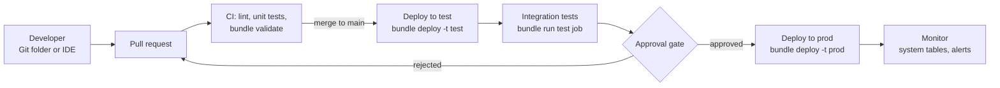

# Databricks: CI/CD, Asset Bundles and Data Platform DevOps

> Asset Bundles (now Declarative Automation Bundles), CLI authentication, Git folders, CI/CD with Azure DevOps or GitHub Actions, promotion across environments, testing, Lakeflow pipelines, job monitoring, and DevOps practices for a data platform.

## Key Concepts

### Bundles: what they are and the name change

A bundle is a folder with a `databricks.yml` file that describes Databricks resources (jobs, pipelines, dashboards, apps, schemas, volumes and more) next to the source code. The Databricks CLI validates the YAML, uploads files, and creates or updates the resources in a target workspace. It is infrastructure as code for data projects.

**Name change:** "Databricks Asset Bundles" (DABs) was renamed **Declarative Automation Bundles** in March 2026. Nothing broke: the `databricks bundle` commands and `databricks.yml` format are the same, and most people still say "DABs" or "bundles".

**Engine change:** bundles originally used Terraform under the hood. A **direct deployment engine** (no Terraform) became generally available in June 2026 and is the default for bundles created with CLI 1.3.0 and later. `databricks bundle deployment migrate` moves an existing bundle to it.

```text
sales-etl/
  databricks.yml          bundle name, variables, targets
  resources/
    sales_job.yml         job definition
    sales_pipeline.yml    Lakeflow pipeline definition
  src/
    sales_etl/            Python package (built into a wheel)
    notebooks/
  tests/                  pytest unit tests
```

### databricks.yml and targets

**Targets** are environments. Each target sets the workspace, the mode, and overrides such as variables, `run_as` and permissions.

```yaml
bundle:
  name: sales_etl

include:
  - resources/*.yml

variables:
  catalog:
    description: Unity Catalog catalog to write to
    default: dev

targets:
  dev:
    mode: development
    default: true
    workspace:
      host: https://dbc-dev.cloud.databricks.com

  test:
    mode: production
    workspace:
      host: https://dbc-test.cloud.databricks.com
    variables:
      catalog: test
    run_as:
      service_principal_name: "<test-sp-application-id>"

  prod:
    mode: production
    workspace:
      host: https://dbc-prod.cloud.databricks.com
    variables:
      catalog: prod
    run_as:
      service_principal_name: "<prod-sp-application-id>"
    permissions:
      - group_name: data-engineers
        level: CAN_VIEW
```

| Mode | What it does |
| --- | --- |
| `development` | Prefixes names with `[dev <user>]`, pauses schedules and triggers, allows concurrent runs, disables the deployment lock, allows `--cluster-id` override |
| `production` | Checks the Git branch, requires pipelines to be `development: false`, expects `run_as` and `permissions` to be explicit (ideally a service principal), blocks cluster overrides |

### Core CLI commands

```bash
databricks bundle init                     # start from a template
databricks bundle validate -t dev          # schema and reference checks
databricks bundle plan -t prod             # preview changes
databricks bundle deploy -t prod           # upload files, create or update resources
databricks bundle run -t prod sales_daily  # run a job or pipeline by resource key
databricks bundle summary -t prod          # deployed resources with URLs
databricks bundle destroy -t dev           # delete what the bundle deployed
databricks bundle generate job --existing-job-id 123   # YAML from a UI-made job
databricks bundle deployment bind sales_daily 123 -t prod   # adopt an existing job
```

### Authentication for automation

Use a **service principal** with **OAuth**, not personal access tokens. Either OAuth M2M with a client secret (`DATABRICKS_HOST`, `DATABRICKS_CLIENT_ID`, `DATABRICKS_CLIENT_SECRET`), or **workload identity federation**, where the CI system's OIDC token is exchanged for a Databricks token and no secret is stored (`DATABRICKS_AUTH_TYPE=github-oidc` or `azure-devops-oidc`). Account-level calls also need `DATABRICKS_ACCOUNT_ID` and the accounts host.

For people: `databricks auth login --host <url>` (OAuth U2M) stores a profile in `~/.databrickscfg`.

### Git folders

Git folders (formerly **Repos**) clone a Git repo into the workspace so people can edit, branch, commit and open pull requests from the UI. They support GitHub, Azure DevOps, GitLab and Bitbucket. Use them for **development**. For **production**, deploy with bundles from CI, so prod runs what was reviewed and built, not what someone pulled into a folder.

### CI/CD flow

Every pull request validates and tests; merge to main deploys to test and runs integration tests; a release or approval promotes the same commit to prod.



### Lakeflow pipelines and jobs

- **Lakeflow Jobs** (formerly Databricks Workflows) orchestrate tasks: notebooks, Python wheels, SQL, pipelines, dbt, and more.
- **Lakeflow Spark Declarative Pipelines** (formerly Delta Live Tables, DLT) define streaming tables and materialized views declaratively, with expectations for data quality. New code uses `from pyspark import pipelines as dp`; old `import dlt` code still works.

### Monitoring

- **Job notifications:** on failure, on duration over a threshold, to email or notification destinations (Slack, Teams, PagerDuty, webhooks).
- **Health rules:** for example `RUN_DURATION_SECONDS` greater than N.
- **System tables:** `system.lakeflow.jobs`, `job_run_timeline`, `job_task_run_timeline`, `pipeline_update_timeline`, plus `system.billing.usage` for cost per job.
- **SQL alerts** on queries against those tables for cross-job reporting.

## Interview Questions

<details><summary>Q1. [Basic] What are Databricks Asset Bundles, and why use them instead of creating jobs in the UI?</summary>

**Answer:**

Bundles let you define jobs, pipelines and other Databricks resources as YAML next to your code, and deploy them with the CLI. They were renamed **Declarative Automation Bundles** in March 2026, but the CLI and file format are unchanged.

Why they beat the UI:

- **Version control and review:** every change to a job is a pull request.
- **Same definition everywhere:** one definition, deployed to dev, test and prod with per-target overrides.
- **Automation:** CI runs `validate`, `deploy` and `run`. No manual clicking in prod.
- **Code and config together:** the wheel, notebooks and job definition ship as one unit at one commit.
- **Repeatable:** you can rebuild a workspace's jobs from Git.

```bash
databricks bundle validate -t dev
databricks bundle deploy -t dev
databricks bundle run -t dev sales_daily
```

**Pitfall:** jobs that were created in the UI and then also defined in a bundle become duplicates. Use `bundle generate` and `bundle deployment bind` to adopt them.

</details>

<details><summary>Q2. [Basic] What is the difference between development and production mode in a bundle target?</summary>

**Answer:**

**Development mode** is for personal iteration. Resources get a `[dev <username>]` prefix so each developer has their own copy, schedules and triggers are paused, concurrent runs are allowed, the deployment lock is off, and you can point jobs at your own cluster with `--cluster-id`.

**Production mode** is for shared environments. It checks you are on the expected Git branch, requires pipelines to have `development: false`, blocks cluster overrides, and expects `run_as` and `permissions` to be set explicitly, ideally to a service principal.

```yaml
targets:
  dev:
    mode: development
    default: true
  prod:
    mode: production
    git:
      branch: main
    run_as:
      service_principal_name: "<prod-sp-application-id>"
```

I also use `mode: production` for test, so test behaves like prod.

</details>

<details><summary>Q3. [Basic] How does the Databricks CLI authenticate in a CI pipeline?</summary>

**Answer:**

With a service principal and OAuth. Two options:

1. **OAuth M2M with a client secret:** set `DATABRICKS_HOST`, `DATABRICKS_CLIENT_ID` and `DATABRICKS_CLIENT_SECRET`. The CLI exchanges them for a one-hour access token automatically. Store the secret in the CI secret store and rotate it. Max secret lifetime is 730 days.
2. **Workload identity federation (OIDC):** no Databricks secret at all. You create a federation policy on the service principal that trusts the CI system's OIDC issuer and a subject (repo and environment, or Azure DevOps pipeline). The CI job sets `DATABRICKS_AUTH_TYPE` to `github-oidc` or `azure-devops-oidc`.

I prefer federation. Nothing long-lived can leak.

**Verify:**

```bash
databricks current-user me
databricks auth describe
```

**Pitfall:** personal access tokens tied to a person. When that person leaves, every pipeline breaks, and the audit log shows a human doing automated work.

</details>

<details><summary>Q4. [Intermediate] Write a GitHub Actions workflow that validates bundles on pull requests and deploys to prod on main.</summary>

**Answer:**

```yaml
name: databricks-bundle
on:
  pull_request:
  push:
    branches: [main]

permissions:
  id-token: write
  contents: read

jobs:
  validate:
    runs-on: ubuntu-latest
    environment: dev
    env:
      DATABRICKS_AUTH_TYPE: github-oidc
      DATABRICKS_HOST: ${{ vars.DATABRICKS_HOST }}
      DATABRICKS_CLIENT_ID: ${{ vars.DATABRICKS_CLIENT_ID }}
    steps:
      - uses: actions/checkout@v4
      - uses: databricks/setup-cli@main   # pin a version in real use
      - run: pip install -r requirements-dev.txt && pytest tests/unit
      - run: databricks bundle validate -t dev

  deploy-prod:
    if: github.ref == 'refs/heads/main'
    needs: validate
    runs-on: ubuntu-latest
    environment: prod            # required reviewers on this environment
    env:
      DATABRICKS_AUTH_TYPE: github-oidc
      DATABRICKS_HOST: ${{ vars.DATABRICKS_HOST }}
      DATABRICKS_CLIENT_ID: ${{ vars.DATABRICKS_CLIENT_ID }}
    steps:
      - uses: actions/checkout@v4
      - uses: databricks/setup-cli@main
      - run: databricks bundle deploy -t prod --fail-on-active-runs
```

Each GitHub environment holds its own host and client ID, and the federation policy subject is scoped to that environment (for example `repo:acme/sales-etl:environment:prod`), so a PR job cannot get a prod token.

**Pitfall:** `@main` on the setup action means the CLI version can change under you. Pin it.

See also [GitHub Actions fundamentals](../github-actions/01-fundamentals-and-workflows.md).

</details>

<details><summary>Q5. [Intermediate] How would you build the same pipeline in Azure DevOps?</summary>

**Answer:**

```yaml
trigger:
  branches: { include: [main] }

variables:
  DATABRICKS_AUTH_TYPE: azure-devops-oidc

stages:
  - stage: Validate
    jobs:
      - job: validate
        pool: { vmImage: ubuntu-latest }
        variables:
          - group: databricks-dev        # DATABRICKS_HOST, DATABRICKS_CLIENT_ID
        steps:
          - script: curl -fsSL https://raw.githubusercontent.com/databricks/setup-cli/main/install.sh | sh
            displayName: Install Databricks CLI
          - script: pip install -r requirements-dev.txt && pytest tests/unit
          - script: databricks bundle validate -t dev
            env:
              SYSTEM_ACCESSTOKEN: $(System.AccessToken)

  - stage: DeployProd
    dependsOn: Validate
    condition: and(succeeded(), eq(variables['Build.SourceBranch'], 'refs/heads/main'))
    jobs:
      - deployment: prod
        environment: databricks-prod     # approvals and checks live here
        pool: { vmImage: ubuntu-latest }
        variables:
          - group: databricks-prod
        strategy:
          runOnce:
            deploy:
              steps:
                - checkout: self
                - script: curl -fsSL https://raw.githubusercontent.com/databricks/setup-cli/main/install.sh | sh
                - script: databricks bundle deploy -t prod --fail-on-active-runs
                  env:
                    SYSTEM_ACCESSTOKEN: $(System.AccessToken)
```

The federation policy on the prod service principal trusts issuer `https://vstoken.dev.azure.com/<org-id>`, audience `api://AzureADTokenExchange`, and subject `p://<org>/<project>/<pipeline>`. If federation isn't set up, put `DATABRICKS_CLIENT_SECRET` in a secret variable group linked to Key Vault instead.

**Pitfall:** `checkout: self` is not automatic in deployment jobs. Without it the bundle folder is empty.

See also [Azure DevOps deployments and approvals](../azure-devops/04-deployments-approvals-and-release-strategies.md).

</details>

<details><summary>Q6. [Intermediate] How do you promote the same job from dev to test to prod without changing code?</summary>

**Answer:**

1. **Parameterize everything that differs:** catalog, schema, storage paths, cluster size, schedule, notification emails. Use bundle variables and target overrides.

   ```yaml
   # resources/sales_job.yml
   resources:
     jobs:
       sales_daily:
         name: sales-daily
         tasks:
           - task_key: transform
             python_wheel_task:
               package_name: sales_etl
               entry_point: main
               parameters: ["--catalog", "${var.catalog}"]
             job_cluster_key: main
             libraries:
               - whl: ../dist/*.whl
         job_clusters:
           - job_cluster_key: main
             new_cluster:
               spark_version: 17.3.x-scala2.13
               node_type_id: m6i.xlarge
               num_workers: ${var.workers}
               policy_id: ${var.job_policy_id}
   ```

   `workers` and `job_policy_id` are declared under `variables:` in `databricks.yml` and overridden per target.

2. **Build once, deploy the same commit:** CI builds the wheel at one commit; test and prod deploy that same commit.
3. **Separate identities:** each target runs as its own service principal with grants only on its own catalog.
4. **Gates:** test deploy is automatic after merge; prod needs approval and passing integration tests.
5. **Schedules:** dev mode pauses them; prod keeps them on.

**Verify:** `databricks bundle summary -t prod` shows what is deployed, and the job's "deployed by" metadata shows the bundle and Git commit.

**Pitfall:** hard-coded `prod.` catalog names in SQL. The job then writes to prod even when deployed to test.

</details>

<details><summary>Q7. [Intermediate] How do you test Databricks notebooks and pipelines?</summary>

**Answer:**

I use layers, like in any software project.

| Layer | What | Where it runs |
| --- | --- | --- |
| Unit | Pure Python functions and DataFrame transformations | CI runner with `pytest` and local PySpark, or Databricks Connect |
| Integration | The real job on a small dataset, in a test catalog | `bundle deploy -t test` then `bundle run -t test` |
| Data quality | Expectations and checks on the output | Inside the pipeline, every run |

Keep logic out of notebooks: put transformations in a Python package, and keep notebooks thin.

```python
# src/sales_etl/transform.py
def add_net_amount(df):
    return df.withColumn("net", df.amount - df.discount)

# tests/unit/test_transform.py
def test_add_net_amount(spark):
    df = spark.createDataFrame([(100.0, 10.0)], ["amount", "discount"])
    assert add_net_amount(df).first().net == 90.0
```

Pipeline expectations:

```python
from pyspark import pipelines as dp

@dp.table
@dp.expect_or_drop("valid_order_id", "order_id IS NOT NULL")
@dp.expect_or_fail("positive_amount", "amount >= 0")
def orders_clean():
    return spark.readStream.table("orders_raw")
```

Integration test pattern in CI:

```bash
databricks bundle deploy -t test
databricks bundle run -t test sales_daily_integration_test
```

**Pitfall:** tests that read prod tables. Use a seeded test catalog, and give the test service principal no grants on prod.

</details>

<details><summary>Q8. [Intermediate] When do you use Git folders and when do you use bundles?</summary>

**Answer:**

- **Git folders** are for people. A developer clones the repo into the workspace, works on a branch, runs notebooks interactively, and commits or opens a pull request.
- **Bundles** are for deployment. CI deploys resources and files at a reviewed commit to a target.

A common older pattern was "prod Git folder updated by CI":

```bash
databricks repos update <repo-id> --branch main
```

It works, but the job definitions are still managed separately, there is no build step for wheels, and anyone with edit rights on that folder can change prod code. I replace it with bundles.

Jobs can also use a `git_source` to pull code from Git at run time. That is fine for simple cases, but the run depends on Git being reachable, and you can't build artifacts.

**Rule I give teams:** develop in Git folders, deploy with bundles, never edit in prod.

</details>

<details><summary>Q9. [Intermediate] A <code>databricks bundle deploy</code> to prod fails. How do you troubleshoot it? <em>(scenario)</em></summary>

**Answer:**

1. **Read the error and re-run with debug:**

   ```bash
   databricks bundle validate -t prod
   databricks bundle deploy -t prod --debug
   ```

2. **Auth:** `databricks auth describe` to see which identity and host the CLI used. Wrong host, missing `DATABRICKS_CLIENT_ID`, or a federation subject that doesn't match the branch or environment.
3. **Permissions:** the deploying service principal needs workspace access, rights to write to the bundle root path, `CAN_USE` on the cluster policy, and the "Service principal: User" role on the `run_as` principal.
4. **Production-mode checks:** wrong Git branch, `run_as` or `permissions` missing, or a pipeline still `development: true`.
5. **Lock:** "deployment lock held" means another deploy is running or crashed. Wait, or use `--force-lock` only after confirming no other deploy is running.
6. **Active runs:** with `--fail-on-active-runs`, a running job blocks deploy. Wait, or cancel if it is safe.
7. **Drift:** someone edited the job in the UI. The deploy overwrites it; if it refused, inspect the change with `bundle plan`.

**Verify:** `databricks bundle summary -t prod` after the fix, and check the job definition in the UI.

</details>

<details><summary>Q10. [Advanced] How do you monitor production jobs and pipelines across many teams? <em>(scenario)</em></summary>

**Answer:**

Three layers: per-job alerts, platform-wide reporting, and cost.

**Per job (in the bundle, so every job has it):**

```yaml
email_notifications:
  on_failure: ["data-oncall@acme.com"]
health:
  rules:
    - metric: RUN_DURATION_SECONDS
      op: GREATER_THAN
      value: 3600
webhook_notifications:
  on_failure:
    - id: "<notification-destination-id>"   # Slack, Teams or PagerDuty
```

**Platform-wide (system tables plus a SQL alert):**

```sql
SELECT j.name, r.job_id, r.run_id, r.result_state, r.period_end_time
FROM system.lakeflow.job_run_timeline r
JOIN system.lakeflow.jobs j
  ON r.workspace_id = j.workspace_id AND r.job_id = j.job_id
WHERE r.period_end_time >= current_timestamp() - INTERVAL 1 DAY
  AND r.result_state IN ('FAILED', 'TIMED_OUT', 'ERROR')
QUALIFY ROW_NUMBER() OVER (PARTITION BY j.workspace_id, j.job_id ORDER BY j.change_time DESC) = 1;
```

A SQL alert on that query pages the platform team when failures spike, and a dashboard shows failure rate, duration trend and cost per job (join `system.billing.usage` on `usage_metadata.job_id`).

**Data freshness:** a job can succeed and still write nothing. Add checks on row counts or last update time of key tables, or use data quality monitoring.

**Central logging:** ship audit and job logs to the SIEM or log platform if the company uses one.

TODO (Siva): add how your team routes Databricks job failures (for example to Splunk or a chat channel), if that applies.

**Pitfall:** relying only on email to the job owner. Owners change; route to a team destination.

</details>

<details><summary>Q11. [Advanced] How do you design CI/CD for a data platform with many teams and many bundles?</summary>

**Answer:**

**Ownership split:**

| Layer | Owner | Tool |
| --- | --- | --- |
| Workspaces, metastore, networking, policies | Platform team | Terraform / OpenTofu |
| Catalogs, external locations, base grants | Platform team | Terraform / OpenTofu |
| Schemas, jobs, pipelines, dashboards | Domain teams | Bundles |

**Standards from the platform team:**

- A **custom bundle template** (`databricks bundle init <template-url>`) with targets, `run_as`, permissions, notifications, tags and CI files already set.
- A **shared CI template** (GitHub reusable workflow or Azure DevOps template) so every repo runs the same validate, test, deploy steps.
- **One service principal per team per environment** with federation, so teams can deploy only their own catalogs and schemas.
- **Policy IDs and catalog names as variables**, never hard-coded.

**Guardrails:**

- Prod deploys only from `main`, through an environment with approvals.
- No human has `CAN_MANAGE` on prod jobs; humans get `CAN_VIEW`.
- Weekly drift check: jobs in prod not deployed by any bundle (from `system.lakeflow.jobs` metadata or the jobs API).

**Trade-off:** mono-repo vs repo-per-team. A mono-repo makes shared code and cross-team changes easy, but needs path-filtered pipelines. Repo-per-team gives clear ownership and simpler permissions.

</details>

<details><summary>Q12. [Advanced] Should you manage Databricks jobs with Terraform or with bundles?</summary>

**Answer:**

Both can create jobs. I split by **who owns the change** and **how often it changes**.

| | Terraform / OpenTofu provider | Bundles |
| --- | --- | --- |
| Best for | Platform resources: workspaces, metastore, policies, warehouses, grants | Application resources: jobs, pipelines, dashboards, apps |
| Users | Platform / infra team | Data engineers |
| Code packaging | None; you upload artifacts separately | Builds and uploads wheels, notebooks, files with the job |
| Dev workflow | Plan and apply | `[dev user]` copies, run from IDE, quick iteration |
| State | Your backend (S3 with locking) | Managed by the CLI in the workspace |

My rule: platform foundations in Terraform/OpenTofu, data workloads in bundles. **Never** manage the same job in both, or each tool will overwrite the other.

**Edge case:** a bundle needs a policy ID or SQL warehouse ID created by Terraform. Pass it as a bundle variable (or look it up by name with a `lookup` variable) instead of hard-coding IDs.

</details>

<details><summary>Q13. [Advanced] A production pipeline wrote bad data to a gold table after a deploy. How do you respond and roll back? <em>(scenario)</em></summary>

**Answer:**

1. **Contain:** pause the job schedule and downstream jobs, so the bad data doesn't spread.
2. **Find the change:** compare the deployed commit with the last good one. The bundle deployment metadata on the job and the CI run show which commit went out.
3. **Roll back code:** revert the commit in Git and let CI deploy, or re-run the pipeline for the last good tag:

   ```bash
   git checkout v1.4.2
   databricks bundle deploy -t prod
   ```

   A redeploy of the old commit is the rollback. Don't hand-edit the job in the UI.
4. **Fix data:** Delta time travel on the affected table.

   ```sql
   DESCRIBE HISTORY prod.gold.daily_sales;
   RESTORE TABLE prod.gold.daily_sales TO VERSION AS OF 482;
   ```

   For pipeline-managed tables, a full refresh of the affected tables may be cleaner than restore.
5. **Re-run** the fixed version for the affected dates, validate counts and key metrics, then unpause.
6. **Prevent:** add a data quality expectation or test that would have caught it, and an integration test on a realistic sample in test.

**Pitfall:** `VACUUM` with a short retention removes the files you need for time travel. Keep retention long enough to cover your detection time.

</details>

<details><summary>Q14. [Advanced] What DevOps practices matter most for a data platform compared to an application platform?</summary>

**Answer:**

Most practices are the same: everything as code, pull requests, CI, automated deploys, least privilege, monitoring. The differences are about **data and state**:

- **Data is the state you can't redeploy.** Code rollback is easy. Data rollback needs time travel, backups and replay plans.
- **Schema changes are migrations.** Treat table schema changes like database migrations: additive first, backfill, then remove old columns. Check lineage for downstream readers before changing anything.
- **Environments need data.** Test catalogs need realistic, masked data, or integration tests prove nothing.
- **Success is not just exit code 0.** Monitor freshness, volume and quality, not only job status.
- **Cost is variable.** One bad query or cluster config can cost more than a month of normal runs. Policies, tags and budgets are part of the platform.
- **Governance is code too.** Grants, row filters and masks live in Git, reviewed like application code.

TODO (Siva): add one example from your own platform work that shows one of these points.

See also [Unity Catalog](01-unity-catalog.md) and [Workspace and cluster management](02-workspace-and-cluster-management.md).

</details>
