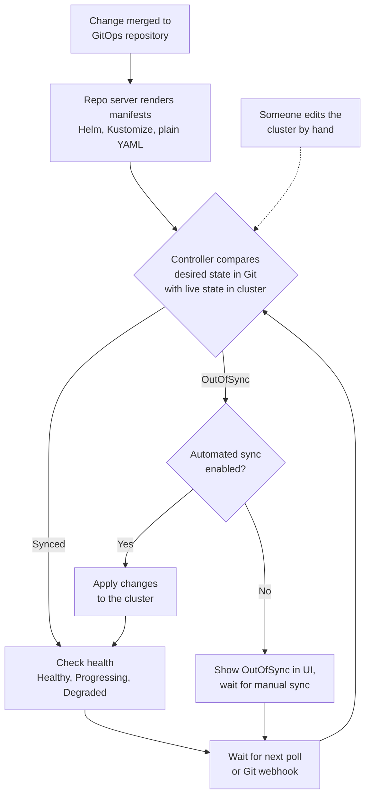

# GitOps: Argo CD

> Argo CD architecture, the end-to-end image-update workflow, app vs. GitOps repositories, drift and self-healing, and Argo CD access control.

## Key Concepts

### Argo CD Architecture and Workflow

**Argo CD** is a pull-based GitOps continuous-delivery controller for Kubernetes.

It's made up of a few pieces: the API server handles the UI, CLI, authentication, and RBAC; the repository server fetches Git/Helm/Kustomize content and renders the manifests; the application controller compares the desired state with the live state and reconciles any difference; Redis caches state; Dex or an external OIDC provider can add SSO; and `ApplicationSet` generates multiple Applications at once.

An application's sync state is either **Synced** or **OutOfSync**, and its health state is one of **Healthy**, **Progressing**, **Degraded**, **Missing**, **Unknown**, or **Suspended**. Automatic sync can also enable self-heal and pruning, but pruning needs protection — deleting an object from Git will delete it from the cluster too.

Argo CD renders Helm templates itself; it doesn't run releases by calling `helm install` inside the cluster.

The end-to-end flow looks like this: a developer makes a change, CI tests, scans, builds, and signs an image, the registry stores that image (the digest never changes after this point), the reviewed GitOps repository gets its manifests or chart values updated, Argo CD detects the commit, compares it to the live state and syncs, Kubernetes reconciles the difference, and then health and SLOs get verified.

Rollback is either a Git revert or a controlled Argo CD rollback, followed by verification.

Public repositories don't need credentials, but you still want to verify where the content came from. Private repositories should use a scoped deploy key, a GitHub App, or a token stored in Argo CD's protected secret mechanism.

### Argo CD GitOps Workflow Overview

GitOps means storing the desired Kubernetes configuration in Git and using a controller such as Argo CD to keep the cluster matched with that configuration.

### End-to-End Flow

```text
Developer pushes application code
        ↓
CI runs tests and security scans
        ↓
CI builds and pushes a container image
        ↓
CI updates the image tag in the GitOps repository
        ↓
The change is reviewed and merged
        ↓
Argo CD notices the Git change
        ↓
Argo CD compares Git with the cluster
        ↓
Argo CD synchronizes Kubernetes
        ↓
Kubernetes performs the rollout
```

### Example Release

Assume the application currently uses:

```yaml
image: myapp:v1
replicas: 3
```

The developer pushes a change. The CI pipeline:

1. Runs unit tests and security scans.
2. Builds `myapp:v2`.
3. Pushes the image to a container registry.
4. Changes the image tag in the GitOps repository from `v1` to `v2`.
5. Opens a pull request or commits through an approved automation process.

After the change is merged, Argo CD detects that Git specifies `v2` while the cluster still runs `v1`. It applies the new configuration through the Kubernetes API. Kubernetes creates the new pods, waits for them to become ready, and removes the old pods during a rolling update.

### Who Commits the Image Change?

Argo CD does not normally write deployment changes back to Git. The CI pipeline or a separate image-automation tool updates the GitOps repository.

The automation uses a bot or service account with limited permission. A simple CI example is:

```bash
git clone https://github.com/company/gitops-repo.git
cd gitops-repo

yq -i '.image.tag = "v2"' environments/dev/values.yaml

git add environments/dev/values.yaml
git commit -m "Deploy myapp v2 to development"
git push origin main
```

Teams can use `yq`, Kustomize, or a Helm values editor instead of a broad text replacement. For production, a pull request and approval are safer than pushing directly to the main branch.

### Why Use Separate Repositories?

#### Application repository

- Application source code
- Tests
- Dockerfile
- CI pipeline definition

#### GitOps repository

- Kubernetes manifests
- Helm values or charts
- Kustomize bases and overlays
- Environment-specific configuration

This separation gives deployment configuration its own permissions, history, reviews, and promotion process. A single repository can also work when the team prefers that structure.

### Desired State, Drift, and Self-Healing

Git is the desired state. The live cluster is the actual state.

If Git says `replicas: 3` and an administrator manually scales the Deployment to 10, Argo CD reports the application as out of sync. If automatic sync and self-healing are enabled, it changes the cluster back to three replicas.

This makes Git the source of truth. Emergency manual changes should therefore be recorded in Git, or Argo CD may reverse them.

### Argo CD Reconcile Loop

Argo CD runs this loop for every Application, by default about every three minutes or straight away when a Git webhook arrives. With automated sync and `selfHeal: true`, a manual `kubectl edit` in the cluster is reverted on the next loop.



### Responsibilities

| Component | Responsibility |
| --- | --- |
| CI system | Test, scan, build, push the image, and propose or make the manifest change |
| Git | Store and review the desired state and its history |
| Argo CD | Compare Git with Kubernetes and reconcile differences |
| Kubernetes | Schedule pods and run the application rollout |

### What Argo CD Can Manage

Argo CD is designed for Kubernetes and can deploy:

- Kubernetes YAML manifests
- Helm charts
- Kustomize applications
- Jsonnet output
- Custom Resources used by operators

It does not directly create a VM, virtual network, S3 bucket, or Azure SQL database through a cloud provider API. Terraform, OpenTofu, Bicep, Pulumi, or CloudFormation are normally used for that work.

Argo CD can manage cloud infrastructure indirectly. For example, it can deploy Crossplane Custom Resources to Kubernetes, and the Crossplane controllers can then create the cloud resources. In that design, Argo CD still talks only to Kubernetes.

### Short Interview Answer: Argo CD Workflow

CI tests the code, builds and pushes the image, and updates its tag in the GitOps repository. Argo CD watches that repository and continuously compares the desired state in Git with the actual Kubernetes state. When they differ, it synchronizes the cluster. Argo CD is Kubernetes-focused; it can manage non-Kubernetes infrastructure only indirectly through Kubernetes controllers such as Crossplane.

## Interview Questions

<details><summary>Q1. [Advanced] What is the difference between RBAC and what Argo CD gives you for access control? Why do most production teams stop using raw RBAC for developer access?</summary>

**Answer:**

This question separates people who have worked in a real team from people who have only worked alone.

The textbook answer: RBAC is Kubernetes-native access control — Roles, ClusterRoles, RoleBindings. Give developers read access to their namespace, DevOps engineers full access, done.

That works on paper. In production with a real team it becomes painful fast.

Suppose you have 20 developers across four teams, each owning two microservices, plus five DevOps engineers who need full cluster access, plus product managers and stakeholders who want visibility without touching anything.

With raw RBAC you must create and manage Roles and RoleBindings for 25 people across multiple namespaces, distribute and manage their kubeconfig files, and repeat the whole dance whenever someone joins, leaves, or changes teams.

Manageable for five people; painful for 25; it does not scale.

The other problem is visibility. A developer who just wants to know whether their deployment went through needs `kubectl` access, which means learning `kubectl`, pod states, and deployment conditions.

Most developers do not want that — they want a dashboard that says green or red.

This is why, in my client's environment, we gave **Argo CD** access to the cluster, not the developers. Argo CD holds the cluster access; developers get access to the Argo CD dashboard only.

They can see their deployments, which version is running, whether a sync failed and why, and trigger a manual sync if needed.

All of that is controlled at the Argo CD level, not Kubernetes RBAC — no kubeconfig distribution, no RoleBinding per person, and stakeholders get read-only Argo CD access with zero Kubernetes exposure.

Argo CD also gives you drift protection that raw RBAC does not. If someone with `kubectl` access manually changes a deployment, raw RBAC leaves you blind until something breaks.

Argo CD immediately marks the app `OutOfSync` and can auto-heal it back to what is in Git. Git is the source of truth and nobody can override it silently.

That is the production answer — not just what RBAC is, but why teams move away from managing it manually and what they use instead.

</details>
