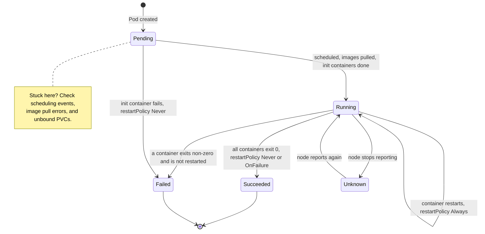

# Kubernetes: Workloads and Pod Lifecycle

> ReplicaSets, Deployments, DaemonSets, Jobs/CronJobs, init containers, multi-container Pods, probes, and self-healing.

## Key Concepts

### Pod Lifecycle

A Pod moves through a small set of phases. `Pending` covers scheduling, image pulls, and init containers. `CrashLoopBackOff` is not a phase: it is a container state inside a `Running` or `Pending` Pod that keeps restarting.



### Workload Controllers

| Object | Purpose |
| --- | --- |
| ReplicaSet | Maintains a desired number of matching Pods |
| Deployment | Manages stateless replicas and declarative rollouts |
| StatefulSet | Provides stable identities, ordered behavior, and per-Pod storage templates |
| DaemonSet | Runs a Pod on every eligible node or selected group of nodes |
| Job | Runs work to completion |
| CronJob | Creates Jobs on a schedule |

Deleting `app-1` from a StatefulSet recreates `app-1`; the other Pods are not renamed. Stable ordinals preserve network and storage identity.

DaemonSet Pods receive tolerations for several node conditions, but scheduling onto control-plane nodes normally requires an explicit toleration for the applicable control-plane taint.

### Jobs and Init Containers

Init containers run sequentially before application containers. If an init container fails with Pod `restartPolicy: Never`, the Pod fails and the main containers never start. A higher-level controller may create another Pod.

A Job maintains the requested parallelism and continues creating Pods until it reaches successful completions or a failure limit such as `backoffLimit`.

### Health Checks, Self-Healing, and Disruptions

- **Startup probe:** Protects slow-starting applications from premature liveness checks.
- **Readiness probe:** Controls whether a Pod receives Service traffic.
- **Liveness probe:** Restarts a container considered unhealthy.
- **PodDisruptionBudget:** Limits voluntary disruption to a replicated workload.

Readiness gates traffic; liveness should detect an unrecoverable process, not temporary dependency slowness. Poor probes are a common source of rollout downtime and restart loops.

## Interview Questions

<details><summary>Q1. [Basic] What is a ReplicaSet and how does it ensure the desired Pod count?</summary>

**Answer:**

A ReplicaSet is defined by a label selector, a Pod template, and a desired replica count. Its controller compares the number of matching, active Pods against that desired count. Too few, and it creates more. Too many, and it deletes the extras.

It keeps reconciling continuously, so if you delete one Pod it manages, a replacement shows up.

In practice I create a Deployment rather than a ReplicaSet directly, because a Deployment adds versioned rollout and rollback and manages multiple ReplicaSets underneath. If replicas aren't appearing, I check the Deployment and ReplicaSet conditions, events, whether the selector matches the template labels, quota, admission, and scheduling:
```bash
kubectl describe deploy api
kubectl describe rs <name>
kubectl get events --sort-by=.metadata.creationTimestamp
```

A correct replica count only proves the Pods exist — not that the application is actually ready. I still have to check readiness and the Service endpoints separately.

</details>

<details><summary>Q2. [Basic] What is the difference between ReplicaSet, Deployment, StatefulSet, and DaemonSet?</summary>

**Answer:**

- A ReplicaSet keeps N interchangeable, matching Pods running.
- A Deployment manages ReplicaSets to give you stateless rolling updates and rollback.
- A StatefulSet gives replicas a stable ordinal name and DNS entry, usually one PVC per Pod, and ordered behavior.
- A DaemonSet runs one Pod per eligible node — typically used for CNI, log collection, metrics, security, or storage agents.

I choose based on identity and lifecycle, not just on whether the workload has data. A stateless API uses a Deployment. A database that needs `db-0` and its own volume might use a StatefulSet, though a managed database service is often the better call. A node-level log collector uses a DaemonSet.

Whatever I pick, it still needs probes, resource limits, security settings, monitoring, and a disruption plan. To verify it's working, I look at the controller's conditions, the desired/current/ready counts, events, and how the workload actually behaves.

</details>

<details><summary>Q3. [Basic] What is the difference between a Deployment and a StatefulSet?</summary>

**Answer:**

Deployment Pods are interchangeable. They get randomly generated names, support flexible parallel rolling updates, and are the right choice for stateless services.

StatefulSet Pods have a stable, ordinal identity, like `db-0`. They get stable DNS through a headless Service, they're created and deleted in order by default, and `volumeClaimTemplates` keeps one PVC tied to each ordinal.

If you delete `db-1`, Kubernetes recreates `db-1` — the other Pods don't get renamed, and its PVC normally stays intact. A StatefulSet by itself doesn't make an application highly available or replicate its data. The database itself still has to handle quorum, replication, and backup.

Before I use a StatefulSet, I check the storage topology, the Pod management and update strategy, failover behavior, backups, and disruption handling. A managed database can reduce a lot of that operational risk.

</details>

<details><summary>Q4. [Intermediate] When should you use a StatefulSet instead of a Deployment?</summary>

**Answer:**

I reach for a StatefulSet when the workload needs a stable member identity, stable per-replica storage, predictable DNS, or an ordered lifecycle. Examples are ZooKeeper, Kafka, or a database cluster where membership depends on ordinal position.

Before choosing it, I ask a few questions. Can replicas be swapped out interchangeably? Does each one need its own volume? Who's responsible for replication, leader election, backup, repair, and upgrades? Would a managed service or operator be safer?

I test what happens when a Pod is deleted or rescheduled, when a zone fails and storage has to reattach, an ordered rollout, scaling up and down, backup and restore, and losing quorum. If the application's state actually lives outside the Pods and the Pods are interchangeable, a Deployment is simpler — even if those Pods mount shared, read-only data.

</details>

<details><summary>Q5. [Basic] What is a DaemonSet and when would you use it?</summary>

**Answer:**

A DaemonSet makes sure one Pod runs on every eligible node, based on labels, affinity, and tolerations. When a node joins the cluster, it gets a Pod. When a node leaves, that Pod goes with it.

Typical uses are Fluent Bit, node-exporter, a CNI or CSI node plugin, a security agent, or anything that needs host networking or storage access.

Because this Pod runs on every node, I always set resource requests and limits for it, restrict hostPath and privileged access, choose the right tolerations, and pick a sensible `maxUnavailable` for updates. A broken DaemonSet can affect the whole cluster at once.

I check the desired, current, ready, and misscheduled counts, events, per-node coverage, logs, and the node-level resource impact. Control-plane nodes need explicit toleration and compatibility — I don't assume every DaemonSet should run there.

</details>

<details><summary>Q6. [Basic] What is a DaemonSet in Kubernetes and when would you use it?</summary>

A **DaemonSet** in Kubernetes ensures that a copy of a specific pod runs on all (or selected) nodes in the cluster. It's used for deploying system-level services that need to run on every node, such as log collectors, monitoring agents, or network plugins.

**Use cases for DaemonSets:**

- **Log Collection:** Deploying log collection agents (e.g., Fluentd, Logstash) on all nodes to gather and forward logs.
- **Monitoring:** Running monitoring agents (e.g., Prometheus Node Exporter, Datadog Agent) on each node to collect metrics.
- **Networking:** Deploying network plugins (e.g., Calico, Weave) that require a pod on every node for network management.
- **Storage:** Running storage daemons (e.g., GlusterFS, Ceph) that need to be present on all nodes for distributed storage.

**Example DaemonSet YAML:**

```yaml
apiVersion: apps/v1
kind: DaemonSet
metadata:
  name: log-collector
spec:
  selector:
    matchLabels:
      app: log-collector
  template:
    metadata:
      labels:
        app: log-collector
    spec:
      containers:
      - name: fluentd
        image: fluent/fluentd:latest
        resources:
          limits:
            memory: "200Mi"
            cpu: "100m"
```

In this example, a DaemonSet named `log-collector` deploys a Fluentd container on every node in the cluster to collect logs.

</details>

<details><summary>Q7. [Intermediate] If you want two Pods per node instead of one, what alternatives to DaemonSet can you use?</summary>

**Answer:**

A single DaemonSet only ever creates one Pod per eligible node. If you genuinely need two independent agents, running two separate DaemonSets is the clearest way to do it.

A Deployment with replicas set to twice the number of eligible nodes, combined with topology spreading, can aim for an even distribution — but it doesn't actually guarantee exactly two Pods per node as nodes come and go.

Before building either, I ask why two are needed. If it's about throughput, one multi-threaded agent might solve it better. If it's about redundancy, a Deployment might be the answer instead. I define `topologySpreadConstraints` by hostname, account for capacity, anti-affinity, and autoscaler behavior, and then test adding, removing, and failing nodes.

The scheduling policy should express the actual requirement, not lean on a replica-count formula that goes stale the moment the cluster changes shape.

</details>

<details><summary>Q8. [Intermediate] Can a DaemonSet Pod be scheduled on a master node that has a <code>NoSchedule</code> taint without explicitly adding tolerations?</summary>

**Answer:**

No, DaemonSet Pods cannot be scheduled on nodes with `NoSchedule` taints unless they have matching tolerations. However, there's an important exception.

The DaemonSet controller automatically adds tolerations for:

- `node.kubernetes.io/not-ready`
- `node.kubernetes.io/unreachable`
- `node.kubernetes.io/disk-pressure`
- `node.kubernetes.io/memory-pressure`
- `node.kubernetes.io/pid-pressure`
- `node.kubernetes.io/network-unavailable`

For master nodes with the `node-role.kubernetes.io/master:NoSchedule` taint, you must explicitly add:

```yaml
spec:
  template:
    spec:
      tolerations:
      - key: node-role.kubernetes.io/master
        operator: Exists
        effect: NoSchedule
```

</details>

<details><summary>Q9. [Basic] What is the difference between a Kubernetes Job and CronJob?</summary>

**Answer:**

A Job runs a one-off task until it reaches the required number of successful completions. It supports parallelism and a `backoffLimit` for retries. A CronJob creates Jobs on a schedule, and adds a `concurrencyPolicy`, a starting deadline, the ability to suspend, and history limits.

For a backup CronJob, I set `concurrencyPolicy: Forbid` so runs don't overlap, pick the right timezone and schedule, set an active deadline and resource requests, and alert on a missed or failed Job.

The task itself needs to be idempotent — safe to run more than once — because retries or duplicate scheduling can happen. I make the output use unique transaction or backup IDs to guarantee that.

I check the CronJob's last schedule time, the Jobs it created, Pod events and logs, exit codes, the timezone, controller availability, and concurrency. A successful Job doesn't prove the backup is restorable — I still need to test restores separately.

</details>

<details><summary>Q10. [Intermediate] How do you manage Kubernetes CronJobs efficiently?</summary>

**Answer:** Set concurrency policy → Use resource limits → Monitor with Prometheus alerts → Clean up old jobs.

**Detailed interview approach:**
I set the schedule, timezone, service account, resource requests and limits, deadline, retry behavior, and history retention deliberately. `concurrencyPolicy: Forbid` prevents overlapping runs of work that isn't safe to run twice at once, while `Replace` only makes sense if a new run should just cancel the old one.

Jobs are idempotent, and use a database or distributed lock whenever duplicate execution would actually cause harm. I check the CronJob and Job Events and logs, missed schedules, the controller's clock, image pulls, quota, and dependency errors.

Success is a business result, not just a completed Pod, so I alert on the last successful timestamp and duration. `ttlSecondsAfterFinished` and history limits clean up old Jobs without deleting evidence I still need for audit.

</details>

<details><summary>Q11. [Intermediate] If you have a Job with <code>parallelism: 3</code> and one Pod fails with <code>restartPolicy: Never</code>, will the Job create a replacement Pod?</summary>

**Answer:**

Yes, the Job controller will create a replacement Pod to maintain the desired parallelism level.

Job behavior with failures:

- **`restartPolicy: Never`:** Failed Pods are not restarted, but new Pods are created.
- **Parallelism maintenance:** The Job ensures the specified number of Pods are running.
- **Completion tracking:** The Job tracks successful completions vs. failures.

Example configuration:

```yaml
spec:
  parallelism: 3
  completions: 10
  template:
    spec:
      restartPolicy: Never
      containers:
      - name: worker
        image: busybox
```

The Job keeps creating new Pods until it reaches the completion count or hits the backoff limit.

</details>

<details><summary>Q12. [Intermediate] If a Pod has initContainers that fail but the main container has <code>restartPolicy: Never</code>, what happens to the Pod status?</summary>

**Answer:**

When an initContainer fails and the Pod has `restartPolicy: Never`, the Pod remains in the `Init:Error` or `Init:CrashLoopBackOff` state permanently. The main container never starts because initContainers must complete successfully before the main containers can begin.
Key points:

- InitContainers run sequentially and must succeed.
- With `restartPolicy: Never`, failed initContainers won't restart.
- The Pod becomes permanently stuck in a failed init state.
- You need to delete and recreate the Pod to resolve this.

```yaml
apiVersion: v1
kind: Pod
spec:
  restartPolicy: Never
  initContainers:
  - name: init-container
    image: busybox
    command: ['sh', '-c', 'exit 1']  # This will fail
  containers:
  - name: main-container
    image: nginx  # This will never start
```

</details>

<details><summary>Q13. [Intermediate] I want to run a one-time database migration task before my application starts. How can I achieve this in Kubernetes?</summary>

Use Init Containers, which run and complete before the main containers start:

```yaml
spec:
  initContainers:
  - name: migration
    image: myapp:migration
    command: ['sh', '-c', 'run-migration.sh']
    env:
    - name: DB_HOST
      value: "postgres-service"
  containers:
  - name: app
    image: myapp:latest
```

Init containers are perfect for migrations, schema updates, or data seeding.

</details>

<details><summary>Q14. [Intermediate] Is it possible for a Pod to have multiple containers sharing the same port on localhost, and what happens if they try to bind simultaneously?</summary>

**Answer:**

No, multiple containers in the same Pod cannot bind to the same port on localhost simultaneously. Since containers in a Pod share the same network namespace, they share the same IP address and port space.

What happens:

- The first container successfully binds to the port.
- The second container gets a "port already in use" error.
- The failing container may crash or go into CrashLoopBackOff.

Solutions:

- Use different ports for each container.
- Use a sidecar proxy pattern.
- Configure one container as the primary port handler.

```yaml
# This will cause conflicts
containers:
- name: app1
  ports:
  - containerPort: 8080
- name: app2
  ports:
  - containerPort: 8080  # Conflict!
```

</details>

<details><summary>Q15. [Basic] What are liveness, readiness, and startup probes?</summary>

**Answer:**

A startup probe gates the liveness and readiness probes for a slow-starting application. Readiness removes an unready Pod from the Service's endpoints without restarting it. Liveness restarts a process that can't recover on its own. All three can use HTTP, TCP, exec, or, where supported, gRPC.

I keep the liveness probe local and conservative. If it checks something like a downstream database that's temporarily down, it can restart every healthy app at once and make the outage worse. Readiness can check whatever's actually needed to serve traffic. I set the thresholds based on measured startup and recovery times, not guesses.

When a probe fails, I check `kubectl describe`, hit the endpoint manually from inside the Pod, check the path, port, and scheme, the bind address, the timing, resource pressure, and the logs. I fix the probe or the application — I don't just disable the probe permanently to force a rollout through.

</details>

<details><summary>Q16. [Advanced] Explain the difference between liveness, readiness, and startup probes. When does getting this wrong take down your production app?</summary>

**Answer:**

Everyone knows the definitions — liveness restarts the container if it fails, readiness removes the pod from Service endpoints if it fails, startup gates the other two until the app has initialized. The interviewer is testing whether you have seen what happens when these are configured wrong in production.

Three real scenarios:

**Scenario 1 — Liveness probe that is too aggressive.** Suppose your Java app takes 90 seconds to start, but the liveness probe begins checking at 10 seconds with a 5-second timeout. The app is still loading, does not respond, and liveness fails.

Kubernetes restarts the container, it starts loading again, liveness fails again, and you are in a `CrashLoopBackOff` that has nothing to do with the application being broken — the probe configuration is wrong.

The fix is a startup probe, which runs first and gives the slow app time to initialize; liveness and readiness only start after it succeeds:

```yaml
startupProbe:
  httpGet:
    path: /health
    port: 8080
  failureThreshold: 30   # 30 x 10s = 5 minutes to start
  periodSeconds: 10
```

**Scenario 2 — Readiness probe checking the wrong endpoint.** Suppose readiness checks `/health`, but the app marks itself ready before it finishes loading configuration from a remote config service.

Traffic starts hitting the pod, which serves requests with incomplete configuration, and users get wrong data or errors.

In production you want readiness to check a deeper endpoint that validates the app is *truly* ready — database connection pool initialized, config loaded, cache warmed — not just that the HTTP server started.

The difference between a shallow health check and a meaningful one is the difference between routing traffic to a broken pod or not.

**Scenario 3 — No readiness probe on a StatefulSet.** Suppose a Postgres StatefulSet with three replicas does a rolling upgrade. `pod-0` goes down, comes back, but has not finished replaying its WAL logs and is not ready for connections.

Without a readiness probe, Kubernetes has no way to know this — it marks the pod ready and routes traffic, and the application gets connection errors while Postgres is still recovering.

A proper readiness probe that checks whether Postgres is accepting connections keeps the pod out of the Service endpoints until it is actually ready.

Probe configuration is not a minor detail. It is what stands between a smooth deployment and a 2am incident.

</details>

<details><summary>Q17. [Intermediate] Kubernetes Probes Killing a Slow-Starting App</summary>

#### The setup

```yaml
livenessProbe:
  httpGet:
    path: /health
    port: 8080
  initialDelaySeconds: 5
  periodSeconds: 5

readinessProbe:
  httpGet:
    path: /health
    port: 8080
```

App takes ~60 seconds to start, but the Pod keeps restarting.

#### What is wrong

`initialDelaySeconds: 5` means Kubernetes starts checking `/health` after only 5 seconds. Since the app takes 60 seconds to be ready, the liveness probe fails repeatedly during startup. Kubernetes treats liveness failures as "the app is broken" and kills/restarts the container — so it never gets the chance to finish starting. This creates an endless restart loop for an app that was never actually broken.

#### The fix

Use a **startupProbe** so the liveness/readiness probes don't even start checking until the app has actually finished booting:

```yaml
startupProbe:
  httpGet:
    path: /health
    port: 8080
  failureThreshold: 30
  periodSeconds: 2   # allows up to 60s (30 x 2) for startup

livenessProbe:
  httpGet:
    path: /health
    port: 8080
  periodSeconds: 5
  failureThreshold: 3

readinessProbe:
  httpGet:
    path: /health
    port: 8080
  periodSeconds: 5
  failureThreshold: 3
```

If a `startupProbe` isn't available/desired, a simpler (older) fix is to just raise `initialDelaySeconds` past the known startup time, e.g. `initialDelaySeconds: 75`, though this wastes time once the app becomes fast to start again in the future.

#### Short interview answer

"The liveness probe starts checking too early — only 5 seconds in — for an app that needs 60 seconds to boot, so Kubernetes kills it mid-startup and it never becomes healthy. The correct fix is to add a `startupProbe` with enough attempts to cover the real startup time, so liveness and readiness checks only begin once the app has actually started."

</details>

<details><summary>Q18. [Intermediate] How does Kubernetes handle self-healing at Pod and node level?</summary>

**Answer:**

At the container level, kubelet restarts it according to the restart policy and probe results. At the Pod level, controllers like ReplicaSet, StatefulSet, or Job create replacements whenever the desired state isn't met.

The scheduler places the new Pods, and Services only send traffic to ready endpoints. When a node stops sending heartbeats, it becomes NotReady or Unreachable, and taint-based eviction combined with tolerations decides when managed Pods actually get replaced.

Self-healing has real limits. A standalone Pod isn't recreated. Persistent volume topology can block scheduling. Not enough capacity or overly strict affinity can leave a Pod Pending. Corrupted data doesn't heal itself. And a single replica still means downtime when it fails.

I validate all this with controlled Pod and node failure tests, watching events, replacement time, readiness, traffic, storage, and SLOs. A PDB protects against voluntary disruption — it does nothing for a node crash.

</details>

<details><summary>Q19. [Basic] What happens when one Pod in a Deployment goes down?</summary>

For normal stateless replicas, pods do not directly coordinate recovery. Kubernetes controllers and Services handle it.

Suppose a Deployment requires three replicas:

```text
Pod 1: Ready
Pod 2: Failed
Pod 3: Ready
```

The recovery flow is:

1. Kubernetes detects that Pod 2 is no longer healthy or running.
2. The Deployment's ReplicaSet sees that only two replicas remain and creates a replacement pod.
3. The Service stops routing new traffic to the failed or unready pod.
4. Pod 1 and Pod 3 continue handling requests.
5. The replacement pod starts and runs its readiness probe.
6. After the readiness probe succeeds, Kubernetes adds it to the Service endpoints and it begins receiving traffic.

Clients should connect through the Service rather than to individual pod IP addresses because pods are temporary and their IP addresses can change.

#### Important distinction

Kubernetes coordinates pod replacement and traffic routing, but it does not manage application data consistency. Stateful or distributed applications may still need their own leader election, replication, quorum, or recovery logic.

#### Short interview answer

When a pod fails, the Deployment creates a replacement to restore the desired replica count. During recovery, the Service routes traffic only to ready pods. Once the new pod passes its readiness probe, it is added to the Service and starts receiving traffic. Distributed applications may also require their own coordination logic for data and leadership.

</details>

<details><summary>Q20. [Intermediate] How do you implement auto-healing in Kubernetes?</summary>

**Answer:** Use liveness probes → If container fails health check, kubelet restarts it → Integrate with Horizontal Pod Autoscaler for scaling.

**Detailed interview approach:**
First I decide whether the demand actually needs more Pods, bigger Pods, or more nodes. I look at request rate, latency, CPU and memory, throttling, Pending Pods, and dependency limits.

HPA needs realistic resource requests or application metrics, and tested min/max and stabilization settings. The node autoscaler supplies capacity for whatever's unschedulable.

For an immediate incident, I might safely scale with `kubectl scale deployment <name> --replicas=<n>` while I investigate the actual traffic or performance cause.

I verify readiness, load distribution, scaling events, dependency health, a graceful scale-down, and cost. Load tests and capacity alerts are what prove the whole path works before the next real peak.

</details>

<details><summary>Q21. [Intermediate] How does Kubernetes handle scaling, rolling updates, and self-healing, and how do you scale a deployment manually and automatically?</summary>

**Answer:** Kubernetes uses controllers to keep actual state equal to desired state. A Deployment declares the required image and replica count, while its ReplicaSet keeps that number of Pods running.

If a container fails, kubelet restarts it according to the Pod policy. If a Pod disappears, the ReplicaSet creates another.

If a node fails, the control plane schedules replacement Pods on healthy nodes when capacity and storage constraints allow it.

For a rolling update, the Deployment creates a new ReplicaSet and gradually adds new Pods while removing old ones. I configure readiness and startup probes so traffic reaches only healthy Pods, and I tune `maxSurge` and `maxUnavailable` to maintain capacity.

I monitor with `kubectl rollout status deployment/<name>` and application metrics. If the release is unhealthy, I stop or reverse it with `kubectl rollout undo deployment/<name>`.

Manual scaling is appropriate for a planned, temporary change:

```bash
kubectl scale deployment api --replicas=6
kubectl get deployment api
kubectl get pods -l app=api
```

For automatic scaling, I configure an HPA using CPU, memory, or application metrics. Resource requests must be realistic because utilization-based HPA calculations depend on them:

```bash
kubectl autoscale deployment api --min=3 --max=20 --cpu-percent=65
kubectl get hpa
kubectl describe hpa api
```

HPA scales Pods, while Cluster Autoscaler or a provider-specific node autoscaler adds nodes when Pods remain Pending because the cluster lacks capacity. I load-test the complete path and verify scale-up time, maximum limits, Pod distribution, graceful scale-down, and cost alerts.

</details>

<details><summary>Q22. [Basic] How do you stop a Pod in Kubernetes?</summary>

**Answer:**

There's no normal "stop and keep" state for a Pod in Kubernetes. Deleting it terminates it, and its controller just recreates it if the desired replica count still says it should exist.

To actually stop a workload, you change its owner instead: scale a Deployment or StatefulSet to zero if that's safe, suspend a CronJob, or delete or update the controller through Git or IaC.

```bash
kubectl get pod <pod> -o jsonpath='{.metadata.ownerReferences}'
kubectl scale deploy/api --replicas=0
```

Before stopping anything in production, I check the traffic it's handling, its PDB, any state or background work it holds, graceful termination, and get approval. For a single unhealthy Pod, deleting it is only a diagnostic step or a fix after I've already captured logs and evidence — then I validate the replacement.

GitOps can revert a manual scale-down on its own, so I either update the actual source of truth or use an approved, temporary override instead.

</details>

<details><summary>Q23. [Basic] How do you stop / delete a pod? <em>(asked in interview round)</em></summary>

```bash
kubectl delete pod <name>            # deletes; a controller (Deployment/RS) recreates it
kubectl scale deploy <name> --replicas=0   # actually stop the workload
kubectl delete deploy <name>         # remove workload entirely
```
If a Deployment manages the pod, deleting the pod alone just triggers a replacement. To actually stop the workload, scale the Deployment to zero replicas or delete the Deployment itself.

</details>

<details><summary>Q24. [Basic] How do you replicate a Pod?</summary>

**Answer:**

You use the controller for this. A Deployment for interchangeable stateless Pods, a StatefulSet for stable identity and storage. You set `spec.replicas` directly, or let an HPA manage it.

```bash
kubectl scale deployment api --replicas=5
kubectl rollout status deployment/api
```

Before scaling, I check requests, node and IP capacity, the Service's selector and readiness, shared dependency or database connection capacity, session and state handling, and licensing. More Pods won't help if the actual bottleneck is a database or something serialized — I load-test to confirm.

For automatic scaling, I configure the metrics, min and max, and behavior settings, plus node autoscaling. I verify the Ready replica count, how endpoints are distributed across zones, latency and error rate, and cost. I also update the Git source so GitOps doesn't quietly undo a manual change.

</details>

<details><summary>Q25. [Basic] How do you replicate a pod? <em>(asked in interview round)</em></summary>

Don't manage pods directly. Use a Deployment (or a ReplicaSet or StatefulSet) and set the replica count:
```bash
kubectl scale deployment <name> --replicas=3
# or in the manifest:  spec.replicas: 3
```
The ReplicaSet controller keeps the pod count at whatever you set. For automatic scaling, use an HPA (see §3.6).

</details>
