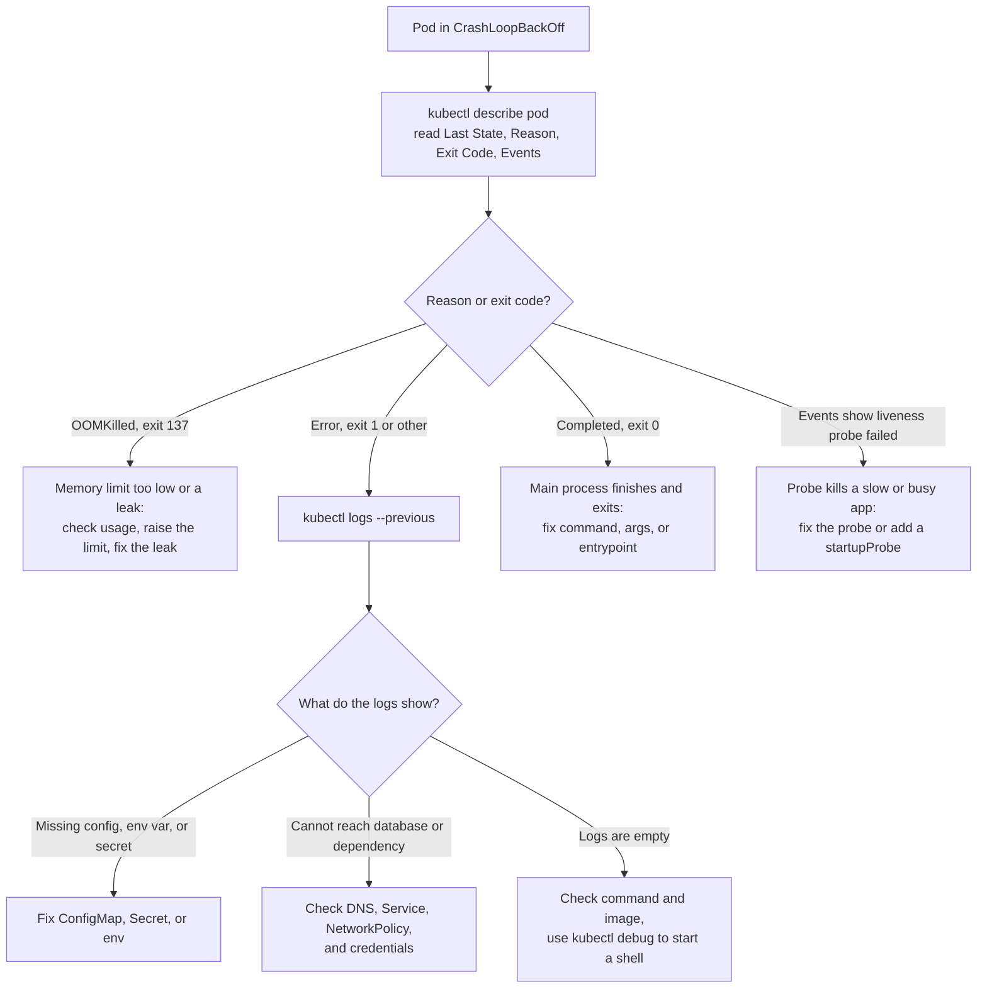

# Kubernetes: Troubleshooting

> A step-by-step order for debugging, plus CrashLoopBackOff, ImagePullBackOff, Pending, restarts, Terminating, NotReady nodes, kubelet, API server, and etcd problems.

## Key Concepts

### Troubleshooting Workflow

Use a consistent order:

```bash
kubectl get pod <pod> -o wide
kubectl describe pod <pod>
kubectl get events --sort-by=.metadata.creationTimestamp
kubectl logs <pod> --all-containers
kubectl logs <pod> --previous
kubectl get deploy,rs,svc,endpointslice,ingress
kubectl top pod
kubectl top node
```

#### CrashLoopBackOff

Check current and previous logs, exit code, events, command/arguments, environment, mounted configuration, dependencies, probes, and OOM status. `kubectl port-forward` is unreliable while the container repeatedly crashes; use logs, an ephemeral debug container, or a stable Service target when appropriate.

#### ImagePullBackOff

Check image name/tag, registry reachability, credentials, pull secrets, ServiceAccount configuration, architecture compatibility, and registry rate limits.

#### Pending Pod

Check scheduling events, requests, affinity, taints, topology spread, quotas, pending PVCs, node selectors, and autoscaler status.

#### Network or 503 Failure

See `03-networking-and-traffic.md` for the investigation flow.

#### NodeNotReady

Check kubelet and runtime health, certificates, disk/memory/PID pressure, CNI state, system logs, control-plane connectivity, and cloud instance health.

### CrashLoopBackOff Decision Tree

Start with `kubectl describe pod`. The last state and exit code of the container tell you which branch to follow. Then confirm the cause with `kubectl logs <pod> --previous`, which shows the output of the crashed container.



### Basic pod troubleshooting command order

Run these commands in order:

```bash
kubectl get pods
kubectl describe pod <pod-name>
kubectl logs <pod-name>
kubectl logs <pod-name> --previous
kubectl get events --sort-by=.metadata.creationTimestamp
```

This can reveal application errors, container crashes, failed image pulls, scheduling problems, and resource shortages. For `CrashLoopBackOff`, previous logs are especially useful because they show what happened before the container restarted.

### Production-issue checklist

Repeated issue charts consolidate to one evidence-based flow:

- CrashLoopBackOff: inspect current/previous logs, exit code, command, configuration, probes, permissions, dependencies, and OOM evidence.
- ImagePullBackOff: verify image digest/tag, registry existence and reachability, architecture, pull secret/service account, CA/proxy, and node disk.
- Pending: read scheduler Events for resource shortage, taints, affinity, quota, topology, or unbound PVC.
- OOMKilled/high CPU or memory: measure Pod and node usage, throttling, requests/limits, GC/query/process behavior, traffic, HPA, and node pressure before scaling or tuning.
- NodeNotReady: inspect Conditions/Events, kubelet/runtime, disk/memory/PID pressure, certificates, time, CNI, and API connectivity; cordon before repair and drain only when safe.
- PVC Pending/mount failure: inspect PVC/PV/StorageClass, access mode, topology, CSI logs, identity, quota, and attachment state before any destructive storage action.

### Workload Failures and Scheduling

- Start with `kubectl describe` Events, then current and previous logs. Distinguish image, configuration, command, dependency, probe, permission, scheduling, and resource failures before changing anything.
- `Pending` Pods require scheduler evidence: CPU or memory shortage, taints, affinity, quota, unbound PVC, topology, or autoscaler limits. Fix the reported constraint rather than deleting the Pod repeatedly.
- `Terminating` Pods require checking finalizers, preStop hooks, grace periods, attached storage, API reachability, and the responsible controller. Force deletion is a last resort after understanding state and data risk.
- For OOM, eviction, restart, and resource-leak incidents, compare requests and limits with observed use, node pressure, throttling, heap or file-descriptor growth, and application metrics. Right-size from load-test evidence and verify after rollout.

### Control Plane and Node Reliability

- For `NodeNotReady`, inspect node Conditions and Events, kubelet/container-runtime status, disk and memory pressure, certificates, time synchronization, CNI state, and API-server reachability. Cordon before repair and drain only when disruption budgets and replacement capacity allow it.
- For API-server overload, compare request latency, inflight requests, audit logs, etcd latency, admission-webhook performance, and noisy controllers. Rate-limit or pause the offending client, then correct its list/watch, cache, pagination, and backoff (increasing wait between retries) behavior.
- For etcd corruption, protect quorum and evidence, use the distribution-supported member replacement or snapshot restore process, and validate API objects and controllers before accepting writes. Velero application backups do not replace etcd snapshots.
- Fleet upgrades should move from a representative staging cluster through controlled production waves. Check removed APIs and add-on compatibility, respect version skew, upgrade node pools gradually, and stop promotion when workload SLOs regress.

## Interview Questions

<details><summary>Q1. [Basic] What does <code>kubectl describe</code> do, and how do you use it during troubleshooting?</summary>

**Answer:**

`kubectl describe <resource> <name>` gives you a human-readable view of the live object: metadata, selected spec and status fields, Conditions, related resources, and recent Events. Common examples are `kubectl describe pod`, `kubectl describe node`, and `kubectl describe pvc`.

For a Pod, I look at the container state, the last termination reason and exit code, the image, mounts, probes, requests and limits, where it's placed, and any scheduling, image-pull, probe, or volume Events.

It doesn't replace logs, metrics, or the full YAML, so I compare it against `kubectl logs --previous`, the sorted Events, `kubectl get -o yaml`, node or runtime logs, and monitoring data.

I fix the cause once I actually have evidence for it, then confirm the Conditions, readiness, and the real application transaction all recover.

</details>

<details><summary>Q2. [Intermediate] What do you do if a Pod is not responding?</summary>

**Answer:**

First clarify where the Pod is not responding: inside the process, through its health endpoint, through the Service, or from outside the cluster.

I check `get` and `describe`, current and previous logs, the restart reason, exit code, OOM events, resource use, probes, the application port, the EndpointSlice, a direct request to the Pod versus one through the Service, DNS, network policy, and dependencies.

Also compare node health with recent deployment or configuration changes.

If there's real user impact, I pull it out of traffic through readiness or a rollback, or scale up a healthy version instead — I don't repeatedly kill it without evidence. An ephemeral debug container or a memory dump can capture a hang or deadlock. A node-level issue might need a cordon, drain, or replacement.

Once it's fixed, I verify the Pod is Ready with stable restarts, the Service endpoints are correct, and a real transaction succeeds with normal latency and error rate. The root-cause review adds a timeout, a probe fix, better monitoring, resource resizing, or a regression test.

</details>

<details><summary>Q3. [Intermediate] A pod is not responding / stuck in Pending — troubleshooting approach <em>(asked in interview round)</em></summary>

Start with this general flow:

```bash
kubectl get pods -o wide
kubectl describe pod <name>     # EVENTS section is the key signal
kubectl logs <name> [--previous]
kubectl get events --sort-by=.lastTimestamp
```

A pod stuck in **Pending** almost always means the scheduler can't place it. Read the events to see why:

- **Insufficient CPU or memory** — no node has room. Add nodes, adjust the requests, or let the cluster autoscaler add capacity.
- **Unschedulable due to taints, affinity, or a nodeSelector** — no node matches the pod's requirements.
- **PVC unbound** — there's no matching PV or StorageClass, or a zone mismatch.
- **ImagePullBackOff** (a different phase) — the image name or tag is wrong, or the registry credentials are missing.

If the pod is running but not responding, or keeps restarting:

- `CrashLoopBackOff` means the app crashes on startup. Check `logs --previous`, the config, missing env vars or secrets, and any failing dependency.
- Failing liveness or readiness probes can restart a healthy app or keep it out of the Service. Check the probe's path, port, and timeout.
- `OOMKilled` (shown by `describe`) means the container ran out of memory. Raise the memory limit or fix the leak.

</details>

<details><summary>Q4. [Intermediate] What are common Kubernetes errors you have faced (like CrashLoopBackOff, ImagePullError) and how did you resolve them?</summary>

**1. CrashLoopBackOff**

- **Cause:** Occurs when a container repeatedly crashes after starting.
- **Resolution:** Check the container logs using `kubectl logs <pod-name>` to identify the root cause. Common issues include application errors, misconfigurations, or missing dependencies. Fix the underlying issue and redeploy the pod.

**2. ImagePullBackOff**

- **Cause:** Occurs when Kubernetes cannot pull the container image from the specified registry.
- **Resolution:** Verify that the image name and tag are correct. Ensure the container registry is accessible and that any required authentication (e.g., image pull secrets) is properly configured. You can also check the events using `kubectl describe pod <pod-name>` for more details.

**3. ErrImageNeverPull**

- **Cause:** Occurs when the `imagePullPolicy` is set to `"Never"` and the image is not present on the node.
- **Resolution:** Change the `imagePullPolicy` to `"IfNotPresent"` or `"Always"` in the pod specification, or ensure the image is pre-pulled on the nodes.

**4. NodeNotReady**

- **Cause:** Indicates that a node is not in a ready state to schedule pods.
- **Resolution:** Check the node status using `kubectl get nodes` and investigate the node logs for issues such as resource exhaustion, network problems, or kubelet failures. Resolve the underlying issue and ensure the node is healthy.

**5. PersistentVolumeClaim (PVC) Pending**

- **Cause:** Occurs when a PVC cannot be bound to a PersistentVolume (PV).
- **Resolution:** Ensure that there are available PVs that match the storage class, access modes, and size requested by the PVC. You can create additional PVs or adjust the PVC specifications as needed.

**6. Unauthorized (401) Errors**

- **Cause:** Occurs when there are authentication or authorization issues.
- **Resolution:** Verify that the kubeconfig file is correctly configured and that the user has the necessary RBAC permissions to perform the requested actions.

**7. DNS Resolution Issues**

- **Cause:** Pods may fail to resolve DNS names, leading to connectivity issues.
- **Resolution:** Check the CoreDNS pods and their logs for errors. Ensure that the DNS configuration is correct and that network policies allow DNS traffic.

By systematically diagnosing and addressing these common errors, you can maintain a healthy and stable cluster environment.

</details>

<details><summary>Q5. [Intermediate] How do you troubleshoot CrashLoopBackOff?</summary>

**Answer:**

CrashLoopBackOff means the container keeps exiting and restarting, and kubelet is deliberately delaying each retry. I preserve the evidence first:

```bash
kubectl describe pod <pod>
kubectl logs <pod> -c <container> --previous
kubectl get pod <pod> -o jsonpath='{.status.containerStatuses[*].lastState}'
```

I look at the exit code and reason — OOMKilled, Error, Completed — the command and arguments, config and Secret mounts, permissions, dependency and DNS reachability, probe failures, the port, the runtime, and any recent image or config change. Exit 0 under a restart policy of `Always` usually means the command was wrong for a long-running workload.

If a recent release caused this, I roll back first. To debug further, I run the same image with a command override or an ephemeral container where that's appropriate. I don't weaken production probes permanently just to make a rollout pass.

Once it's fixed, I verify the restart count is stable, readiness passes, logs and dependency health look normal, and I add a regression or preflight test.

</details>

<details><summary>Q6. [Intermediate] A Pod is stuck in CrashLoopBackOff, but logs show no errors. How do you debug?</summary>

**Answer:**

The current logs can be empty because the container exits before its logger even starts, because it writes to a file instead of stdout, or because the useful output is actually in the previous instance. So I check `--previous`, the termination reason, message, and exit code, along with events and probes.

I compare the image's ENTRYPOINT against the manifest's command and arguments, environment and config mounts, the working directory, user and file permissions, architecture, OOM, and dependency reachability.

I can spin up a temporary debug Pod using the same image but with a `sleep` command instead, then inspect the filesystem and config and manually run the application under approved, non-production conditions. Ephemeral containers help too, as long as the target runs long enough to attach to.

If the process never even starts, I also check the node, runtime, and kubelet logs. The real fix gets codified in the image or manifest, tested, rolled out, and verified — a manual change inside a running Pod is never the permanent fix.

</details>

<details><summary>Q7. [Intermediate] What will you do if a pod is stuck in CrashLoopBackOff?</summary>

**Answer:** Run kubectl describe pod and kubectl logs → Check startup script, image, or config issue → Fix error → Redeploy.

**Detailed interview approach:**
I compare the current and previous container failure using `kubectl describe pod <pod>`, `kubectl logs <pod> -c <container>`, and `kubectl logs <pod> -c <container> --previous`.

I look at the exit code, reason, events, probes, command and arguments, environment, mounted ConfigMaps and Secrets, permissions, and dependency reachability.

Exit code 137 usually points to OOM; a connection or config error needs a different fix. I reproduce the issue with the exact image and configuration in a safe namespace, fix the actual application, config, resource, or probe problem, and deploy a new revision instead of just repeatedly deleting the Pod.

I watch the rollout status, restart count, logs, latency, and error rate afterward, and roll back to the last healthy revision if the impact keeps growing.

</details>

<details><summary>Q8. [Intermediate] I am getting a CrashLoopBackOff error for one of the pods in a namespace. What should be the reason?</summary>

**Common causes:**

- Application exits immediately after startup.
- Missing environment variables or config.
- Resource limits too restrictive.
- Failed liveness probe.
- Image issues or wrong command/args.

**Troubleshooting steps:**

```bash
kubectl describe pod <pod-name>
kubectl logs <pod-name> --previous
kubectl get events --sort-by='.lastTimestamp'
```

Check exit codes, resource requests/limits, and application logs.

</details>

<details><summary>Q9. [Intermediate] How do you troubleshoot Kubernetes CrashLoopBackOff with ConfigMap errors?</summary>

**Answer:** Check mounted config → Validate YAML → Fix key-value mismatches → Restart pod.

**Detailed interview approach:**
I compare the current and previous container failure using `kubectl describe pod <pod>`, `kubectl logs <pod> -c <container>`, and `kubectl logs <pod> -c <container> --previous`.

I look at the exit code, reason, events, probes, command and arguments, environment, mounted ConfigMaps and Secrets, permissions, and dependency reachability.

Exit code 137 usually points to OOM; a connection or config error needs a different fix. I reproduce the issue with the exact image and configuration in a safe namespace, fix the actual application, config, resource, or probe problem, and deploy a new revision instead of just repeatedly deleting the Pod.

I watch the rollout status, restart count, logs, latency, and error rate afterward, and roll back to the last healthy revision if the impact keeps growing.

</details>

<details><summary>Q10. [Intermediate] Can you run <code>kubectl port-forward</code> to a Pod that's in CrashLoopBackOff state, and will it work?</summary>

**Answer:**

It depends on the timing and Pod restart behavior.

- **During the container restart interval:** `kubectl port-forward` may work briefly if you catch the Pod between restarts and the container is temporarily running.
- **When the container is down:** Port-forward fails immediately with connection errors.

Practical approach:

```bash
# This usually fails
kubectl port-forward pod/failing-pod 8080:8080

# Better approach - port-forward to a service
kubectl port-forward service/myapp-service 8080:8080
```

For debugging CrashLoopBackOff:

- Use `kubectl logs pod-name --previous` to see crash logs.
- Check container startup probes and resource limits.
- Consider temporarily removing liveness probes for debugging.

</details>

<details><summary>Q11. [Intermediate] A Pod is stuck in ImagePullBackOff. How do you troubleshoot?</summary>

**Answer:**

`ImagePullBackOff` means the pull failed and kubelet is now backing off between retries. I start by reading the exact event:

```bash
kubectl describe pod <pod>
kubectl get pod <pod> -o jsonpath='{.spec.containers[*].image}'
kubectl get serviceaccount <sa> -o yaml
```

`not found` usually means the wrong repo or tag. `unauthorized` usually means a pull secret or IAM problem. A timeout or DNS error points to networking between the node and the registry. A manifest mismatch can mean a CPU architecture mismatch.

I verify the image and digest actually exist, check credentials such as IRSA or a managed identity, the secret's namespace and the ServiceAccount, registry limits and certificates, and the node's DNS, egress, disk, and runtime logs.

I fix the manifest or the access problem, confirm the image now pulls and starts, and run the application's health checks. To prevent it happening again, I add CI registry validation, digest pinning, credential-expiry monitoring, and a registry path that works across multiple AZs.

</details>

<details><summary>Q12. [Intermediate] How do you troubleshoot “ImagePullBackOff” in Kubernetes?</summary>

**Answer:**
Check if image exists in registry.
Validate credentials/secret for private registry.
Verify image tag.
Fix and redeploy.

**Detailed interview approach:**
`kubectl describe pod <pod>` normally gives me the useful event: unauthorized, manifest not found, a DNS timeout, a certificate failure, a rate limit, or an architecture mismatch.

I verify the image name and digest actually exist, that the node can reach the registry, and that the Pod or its service account references the correct `imagePullSecret`.

I test or rotate credentials without printing them, and check registry IAM, the secret's namespace, proxy and CA trust, egress policy, quota, and node disk. I fix the specific layer that's broken, run a controlled rollout, and confirm new Pods pull successfully and become Ready.

To prevent it recurring, I use workload identity where it's supported, expiring registry credentials, signed and scanned smaller images, registry mirrors, and alerts on image-pull events.

</details>

<details><summary>Q13. [Intermediate] How do you troubleshoot Kubernetes pods not pulling images from private registry?</summary>

**Answer:** Create imagePullSecret → Attach to service account → Validate registry credentials.

**Detailed interview approach:**
`kubectl describe pod <pod>` normally gives me the useful event: unauthorized, manifest not found, a DNS timeout, a certificate failure, a rate limit, or an architecture mismatch.

I verify the image name and digest actually exist, that the node can reach the registry, and that the Pod or its service account references the correct `imagePullSecret`.

I test or rotate credentials without printing them, and check registry IAM, the secret's namespace, proxy and CA trust, egress policy, quota, and node disk. I fix the specific layer that's broken, run a controlled rollout, and confirm new Pods pull successfully and become Ready.

To prevent it recurring, I use workload identity where it's supported, expiring registry credentials, signed and scanned smaller images, registry mirrors, and alerts on image-pull events.

</details>

<details><summary>Q14. [Intermediate] How do you troubleshoot AKS ImagePullBackOff after an identity change?</summary>

`ImagePullBackOff` means Kubernetes cannot pull the container image. When this starts right after an identity change, the first suspect is that the new identity lost registry access - not the image itself.

#### 1. Confirm the error

```bash
kubectl describe pod <pod-name>
```

Check Events for `401 Unauthorized`, `403 Forbidden`, or `failed to pull image`.

#### 2. Verify the managed identity

```bash
az aks show -g <resource-group> -n <cluster-name>
```

Confirm which identity the cluster is actually using now.

#### 3. Check ACR role assignments

```bash
az role assignment list --assignee <managed-identity-id>
```

The identity needs `AcrPull` on the Azure Container Registry. If it was swapped (e.g. Identity A → Identity B) and only Identity A had `AcrPull`, pods lose the ability to authenticate to ACR immediately.

#### 4. Verify the image name and tag

Rule out a genuinely wrong reference before assuming it's purely a permissions issue.

#### 5. Fix and restart

Assign `AcrPull` to the correct identity, then:

```bash
kubectl rollout restart deployment <deployment-name>
```

#### Short interview answer

Since the failure started after an identity change, I'd first verify which managed identity AKS is now using with `az aks show`, then check whether that identity has `AcrPull` on the registry with `az role assignment list`. If it doesn't - which is the common cause after an identity swap - I'd assign the role, confirm the image name/tag are correct, and restart the deployment to force a fresh pull.

</details>

<details><summary>Q15. [Intermediate] Kubernetes ImagePullBackOff</summary>

#### The setup

```yaml
containers:
  - name: payment-api
    image: myacr.azurecr.io/payment-api:v25
```

Status: `ImagePullBackOff`

#### Possible causes

1. **Tag doesn't exist** — `v25` was never pushed to the registry.
2. **Authentication failure** — the cluster has no (or an expired) `imagePullSecret` for a private ACR.
3. **Wrong registry name** — typo in `myacr.azurecr.io`.
4. **Network/firewall issue** — node can't reach the registry (private endpoint, NSG, DNS).
5. **ACR access not granted to AKS** — AKS's managed identity/kubelet identity was never given `AcrPull` role on that ACR.

#### How to troubleshoot

```bash
kubectl describe pod payment-api        # shows the exact pull error message
az acr repository show-tags --name myacr --repository payment-api
az acr show --name myacr --query loginServer
az role assignment list --scope <acr-resource-id>
kubectl get secrets                     # check if an imagePullSecret exists
```

`kubectl describe pod` is the key command — the Events section shows the exact reason (`manifest unknown`, `unauthorized`, `no such host`, etc.), which tells you which of the causes above applies.

#### Short interview answer

"ImagePullBackOff usually means the image tag doesn't exist, the registry credentials are missing or expired, or AKS's identity doesn't have `AcrPull` on that ACR. I'd start with `kubectl describe pod` to see the exact error message, then verify the tag exists in ACR and check the role assignment or imagePullSecret depending on what the error says."

</details>

<details><summary>Q16. [Intermediate] How do you troubleshoot slow image pulls in Kubernetes?</summary>

**Answer:** Check registry health, use image caching on nodes, enable parallel pulls, reduce image size, and use local/private mirrors.
Mini-case: Our pods were delayed by 2 mins due to 3GB images; slimming base images + enabling node cache cut startup time to <20s.

**Detailed interview approach:**
`kubectl describe pod <pod>` normally gives me the useful event: unauthorized, manifest not found, a DNS timeout, a certificate failure, a rate limit, or an architecture mismatch.

I verify the image name and digest actually exist, that the node can reach the registry, and that the Pod or its service account references the correct `imagePullSecret`.

I test or rotate credentials without printing them, and check registry IAM, the secret's namespace, proxy and CA trust, egress policy, quota, and node disk. I fix the specific layer that's broken, run a controlled rollout, and confirm new Pods pull successfully and become Ready.

To prevent it recurring, I use workload identity where it's supported, expiring registry credentials, signed and scanned smaller images, registry mirrors, and alerts on image-pull events.

</details>

<details><summary>Q17. [Intermediate] How do you troubleshoot Kubernetes pods stuck in “Pending”?</summary>

**Answer:** Run kubectl describe pod → Check node resource availability → Verify PVC binding → Ensure taints/tolerations are configured.

**Detailed interview approach:**
I use `kubectl describe pod <pod>` and read the scheduler's Events instead of guessing. They tell me whether it's insufficient CPU or memory, a taint, a node selector or affinity mismatch, an unbound PVC, a topology constraint, pod limits, or quota.

I compare the requests against `kubectl top nodes`, the nodes' allocatable values, taints, labels, quotas, and autoscaler logs. Then I fix whatever's actually blocking the Pod: right-size the requests, add a justified toleration or label, fix the PVC or storage class, relax an overly strict affinity rule, or add node capacity.

I don't remove a protective taint just to get past the problem. I verify scheduling, readiness, distribution across failure domains, and whether the cluster autoscaler will handle the same situation automatically next time.

</details>

<details><summary>Q18. [Intermediate] How do you troubleshoot a pod that is stuck in the 'Pending' state in Kubernetes?</summary>

To troubleshoot a pod stuck in the 'Pending' state, I would follow these steps:

**1. Check pod description:**

```bash
kubectl describe pod <pod-name>
```

Look for events at the bottom of the output for clues (e.g., insufficient resources, scheduling issues).

**2. Check node resources:**

```bash
kubectl get nodes -o wide
kubectl describe node <node-name>
```

Ensure nodes have enough CPU, memory, and disk space to schedule the pod.

**3. Verify resource requests and limits:**

Check if the pod's resource requests exceed available resources on any node.

**4. Check taints and tolerations:**

```bash
kubectl describe node <node-name>
```

- Look for any taints on nodes that might prevent the pod from being scheduled.
- Check if the pod has the necessary tolerations to be scheduled on those nodes.

**5. Check node selectors and affinity rules:**

Ensure the pod's `nodeSelector` or affinity rules match available nodes.

**6. Review Cluster Autoscaler (if applicable):**

If using a cluster autoscaler, check if it's functioning correctly and can scale up nodes if needed.

**7. Check for pending PVCs:**

If the pod uses Persistent Volume Claims (PVCs), ensure they are bound to available Persistent Volumes (PVs).

```bash
kubectl get pvc
```

**8. Review scheduler logs:**

If you have access to the scheduler logs, check for any errors or issues related to pod scheduling.

**9. Look for quotas:**

Check if there are any resource quotas in the namespace that might be preventing the pod from being scheduled.

```bash
kubectl get resourcequota -n <namespace>
```

By systematically going through these steps, I can identify and resolve the issue causing the pod to remain in the 'Pending' state.

</details>

<details><summary>Q19. [Intermediate] A pod is in Pending state after the deployment is done. What can be the reason behind this?</summary>

Check these common issues:

- **Insufficient resources:** No node has enough CPU/memory.
- **Node selector/affinity:** No node matches the constraints.
- **PVC issues:** PersistentVolume not available or bound.
- **Image pull issues:** `imagePullSecrets` missing or wrong image.
- **Taints and tolerations:** Pod can't tolerate node taints.
- **Scheduler issues:** kube-scheduler not running properly.

Use `kubectl describe pod` and check the Events section for specific reasons.

</details>

<details><summary>Q20. [Intermediate] How do you handle Kubernetes pod scheduling failures?</summary>

**Answer:** Run kubectl describe pod → Check taints/tolerations → Check node resources → Add tolerations or scale nodes.

**Detailed interview approach:**
I use `kubectl describe pod <pod>` and read the scheduler's Events instead of guessing. They tell me whether it's insufficient CPU or memory, a taint, a node selector or affinity mismatch, an unbound PVC, a topology constraint, pod limits, or quota.

I compare the requests against `kubectl top nodes`, the nodes' allocatable values, taints, labels, quotas, and autoscaler logs. Then I fix whatever's actually blocking the Pod: right-size the requests, add a justified toleration or label, fix the PVC or storage class, relax an overly strict affinity rule, or add node capacity.

I don't remove a protective taint just to get past the problem. I verify scheduling, readiness, distribution across failure domains, and whether the cluster autoscaler will handle the same situation automatically next time.

</details>

<details><summary>Q21. [Intermediate] How do you troubleshoot high Pod restart counts?</summary>

**Answer:**

First I identify which container, when it first started, how often it's happening, and why: `describe`, `logs --previous`, the container status's `lastState` and exit code, events, and metrics.

I classify the cause: OOM, a failed liveness probe, an application error, a completion under a restart policy of `Always`, a node or runtime issue, a config or Secret problem, a dependency or DNS failure, a permissions issue, or a rollout gone wrong.

I compare against the image, config, node, and an unaffected replica. To mitigate, I roll back, scale, or pull it out of traffic, and for a hang I capture a memory dump before it restarts again. Then I fix the code, config, probe, resources, or dependency, and deploy that fix through the controller.

I confirm the restart count has stabilized — keeping in mind the counter itself persists for the life of the Pod — readiness is good, transactions succeed, and SLOs hold over an observation window. To prevent it recurring, I add an alert on restart rate and reason, tune startup and liveness settings, test for memory leaks, add a dependency timeout or circuit breaker, run a config preflight check, and use a canary rollout.

**Kubernetes Scenario-Based Interview Questions**

The following questions focus on production incidents and design decisions. Each answer explains the investigation flow, likely evidence, corrective action, verification, and preventive measures expected in an interview.

</details>

<details><summary>Q22. [Intermediate] How do you troubleshoot high pod restart counts in Kubernetes?</summary>

**Answer:** • Check pod logs for crash reason.
• Validate resource limits.
• Verify liveness/readiness probes.
• Fix config/secret errors.

**Detailed interview approach:**
I compare the current and previous container failure using `kubectl describe pod <pod>`, `kubectl logs <pod> -c <container>`, and `kubectl logs <pod> -c <container> --previous`.

I look at the exit code, reason, events, probes, command and arguments, environment, mounted ConfigMaps and Secrets, permissions, and dependency reachability.

Exit code 137 usually points to OOM; a connection or config error needs a different fix. I reproduce the issue with the exact image and configuration in a safe namespace, fix the actual application, config, resource, or probe problem, and deploy a new revision instead of just repeatedly deleting the Pod.

I watch the rollout status, restart count, logs, latency, and error rate afterward, and roll back to the last healthy revision if the impact keeps growing.

</details>

<details><summary>Q23. [Advanced] All Pods in one namespace suddenly fail readiness checks. What is your troubleshooting approach?</summary>

**Answer:**

Because this hits one whole namespace at the same time, I suspect a shared change or dependency rather than a bug in one application's code. I pin down the start time and check namespace events, and any recent rollout, config, Secret, NetworkPolicy, ServiceAccount, or quota change, along with the nodes hosting these Pods.

I call the readiness endpoint from inside a failing Pod, then from another Pod, and check the application logs. I test DNS and any shared database, cache, or API, check certificate and secret expiry, service endpoints, egress policy, and resource pressure.

I also compare against a namespace or environment that isn't affected.

For immediate mitigation, I might roll back a config, policy, or release, or restore a broken dependency, while preserving the evidence. Then I confirm the endpoints repopulate and real requests actually succeed.

To prevent a repeat, I add config canaries, secret-expiry alerts, policy tests, synthetic probes on dependencies, and better change correlation.

</details>

<details><summary>Q24. [Intermediate] How do you handle Kubernetes pods stuck in Terminating state?</summary>

**Answer:** Run kubectl delete pod --force --grace-period=0 → Check finalizers → Investigate volumes/network issues.

**Detailed interview approach:**
I check `kubectl describe pod`, the deletion timestamp, finalizers, the owner, node status, volume attachments, and kubelet, CNI, and CSI events. A Pod can get stuck Terminating because a finalizer has unfinished cleanup, the node is unreachable, a preStop hook is taking longer than the grace period, or storage or network teardown is stuck.

I fix whatever's actually responsible — the controller, node, or plugin — and let it delete normally. I only force-delete after confirming the process isn't still serving or writing, and that a stateful volume won't end up attached to two nodes at once. Force deletion removes the API object, but the process could still be running on an unreachable node.

I verify the replacement is healthy and cleanup finished, then fix the underlying finalizer timeout, controller issue, or node fencing so it doesn't happen again.

</details>

<details><summary>Q25. [Intermediate] How do you troubleshoot Kubernetes nodes showing “NotReady”?</summary>

**Answer:** Run kubectl describe node → Check kubelet, docker/containerd logs → Verify network plugins → Restart node or replace if unhealthy.

**Detailed interview approach:**
I first run `kubectl get nodes -o wide` and `kubectl describe node <node>` and read the Conditions, Events, capacity, taints, and lease time.

From console access, I check `systemctl status kubelet`, `journalctl -u kubelet`, containerd, disk and inodes, memory pressure, time sync, certificates, and connectivity to the API server.

I cordon the node to stop new scheduling, and only drain it once disruption budgets and replacement capacity actually allow it.

Then I fix the real cause — disk cleanup, a CNI or runtime repair, certificate renewal, a route or firewall change, or replacing the node — and verify the node comes back Ready, system Pods are healthy, workloads reschedule, and alerts clear.

If this keeps happening, the fix is repairing the node image or node pool, not repeatedly restarting the node.

</details>

<details><summary>Q26. [Intermediate] How do you troubleshoot “Node Not Ready” in Kubernetes?</summary>

**Answer:** Run kubectl describe node → Check kubelet logs → Verify Docker/container runtime → Restart node services → Replace unhealthy node if needed.

**Detailed interview approach:**
I first run `kubectl get nodes -o wide` and `kubectl describe node <node>` and read the Conditions, Events, capacity, taints, and lease time.

From console access, I check `systemctl status kubelet`, `journalctl -u kubelet`, containerd, disk and inodes, memory pressure, time sync, certificates, and connectivity to the API server.

I cordon the node to stop new scheduling, and only drain it once disruption budgets and replacement capacity actually allow it.

Then I fix the real cause — disk cleanup, a CNI or runtime repair, certificate renewal, a route or firewall change, or replacing the node — and verify the node comes back Ready, system Pods are healthy, workloads reschedule, and alerts clear.

If this keeps happening, the fix is repairing the node image or node pool, not repeatedly restarting the node.

</details>

<details><summary>Q27. [Intermediate] One of your worker nodes is not joining the cluster. How would you debug the issue?</summary>

If a worker node isn't joining the cluster, I'd first check the `kubeadm join` token validity, network connectivity to the API server, and kubelet logs for authentication or connection errors.

Then I'd verify kubelet and container runtime status, DNS/hostname resolution, and finally reset and rejoin the node if necessary.
**1. Check the `kubeadm join` command output:**

When you run `kubeadm join`, it provides output that can indicate issues (e.g., token expired, unable to connect to API server).

**2. Verify network connectivity:**

```bash
ping <control-plane-ip>
telnet <control-plane-ip> 6443
```

- From the worker node, try pinging the master node's IP address.
- Use `curl` or `wget` to test connectivity to the API server endpoint (`https://<master-ip>:6443`).

**3. Check kubelet logs:**

On the worker node, check kubelet logs for errors related to authentication or connection issues:

```bash
journalctl -u kubelet -xe
```

**4. Verify kubelet and container runtime status:**

```bash
sudo systemctl status kubelet
sudo systemctl status docker      # or containerd
```

**5. Check DNS and hostname resolution:**

- Ensure the worker node can resolve the master node's hostname if using hostnames instead of IPs.
- Try `nslookup` or `dig` commands to verify DNS resolution.

**6. Reset and rejoin the node:**

```bash
sudo kubeadm token list                        # Check if the token is still valid
sudo kubeadm token create --print-join-command  # Create a new token on the master if expired
sudo kubeadm reset                              # On the worker node, reset the kubeadm state
```

Then rejoin the cluster using the `kubeadm join` command provided by the master node.

</details>

<details><summary>Q28. [Intermediate] Kubelet is constantly restarting on one node. How do you isolate the issue?</summary>

**Answer:**

First I confirm it's really just one node, and cordon or drain it if that's safe to protect the workloads on it, and I preserve the logs. Then I check `systemctl status kubelet`, `journalctl -u kubelet`, the restart count and exit reason, config and flags, certificate expiry, system time, disk, inodes, memory, PIDs, the container runtime, and network, DNS, and firewall access to the API server.

I compare against a healthy node's version and config, and check for any recent image or bootstrap change. CNI errors here could be a symptom or the actual cause. For a managed node group, I usually favor replacing the node from a known-good image once I have evidence, rather than hand-repairing it.

After the fix or replacement, I verify the node is Ready, kubelet, the runtime, and CNI are healthy, test Pod scheduling, networking, volumes, logs, and exec, and then uncordon it. The root-cause review adds image validation, certificate and disk alerts, or a rollout canary.

</details>

<details><summary>Q29. [Intermediate] What happens if kubelet is not running?</summary>

**Answer:**

Kubelet stops sending heartbeats and status, and it stops managing the Pod lifecycle. Existing containers might keep running under the runtime, but no newly assigned Pods will start, and probes, restarts, config updates, and volume operations are no longer reliably handled. Exec and log access through kubelet also fails.

The node becomes NotReady, and managed Pods may eventually get replaced once tolerations expire — though that carries a split-brain risk for stateful workloads if the old process is still actually running.

I cordon the node, check `systemctl` and `journalctl` for kubelet, the runtime, config and certificates, disk and memory, and API connectivity, DNS, networking, and time sync. If it's a fixed, replaceable node image, I preserve the evidence and then replace it.

After recovery, I verify the node is Ready, CNI and CSI are healthy, a test Pod schedules fine, networking, logs, and exec work, and the application itself is healthy. I monitor kubelet's service, certificates, and disk going forward to catch this earlier next time.

</details>

<details><summary>Q30. [Advanced] What do you do when a node hosting critical workloads crashes permanently?</summary>

**Answer:**

First I confirm the cloud instance or node is actually gone and check the user impact, make sure remaining capacity is enough, and stop routing to the unhealthy endpoints — readiness and the node controller normally handle that on their own. Managed, stateless Pods get recreated once the node is marked NotReady and eviction kicks in. I watch scheduling, storage attachment, and SLOs during that.

Stateful workloads need fencing and a clean detach first, to avoid a split-brain situation before anything reattaches.

For a node that's intermittently reachable, I cordon it. For a node that's permanently gone, I remove and replace it through the node group, after confirming there's no recoverable local data or forensic need. I don't rely on a PDB here — a PDB only controls voluntary disruption, not a crash.

Once recovery is done, I verify replicas are spread across zones, data is consistent, endpoints are correct, and the application actually transacts. The root-cause review covers node health, autoscaler capacity, replica spreading, any assumptions about local data, and how long failover took.

</details>

<details><summary>Q31. [Advanced] How do you handle Kubernetes API server overload?</summary>

**Answer:** Scale API servers horizontally, add rate limiting, optimize controller workloads, and increase etcd performance.
Mini-case: Cluster had 50 controllers hammering the API; tuning cache sizes + scaling API server replicas fixed latency.

**Detailed interview approach:**
I confirm API-server latency, error rate, and inflight request metrics, audit volume, etcd latency and space, and control-plane CPU and memory. The API's audit logs and metrics usually point to a specific controller, user, a bad list/watch pattern, or a discovery storm.

To reduce the impact, I rate-limit or scale down the offending client or controller and pause any noisy automation. In a managed cluster, I bring in the provider to scale the control plane itself.

The permanent fix uses shared informers and watches, pagination, client backoff, realistic QPS and burst settings, fewer high-volume audit rules, and a healthy etcd.

Before closing the incident, I verify kubectl latency, controller queues, scheduling, admission webhooks, and any application-side change. Control-plane SLOs and alerts should catch saturation before clients start timing out.

</details>

<details><summary>Q32. [Advanced] Kubernetes etcd performance is degrading. What are root causes and fixes?</summary>

**Answer:**

Symptoms usually show up as API latency, timeouts, or leader changes. I check etcd's own metrics, logs, and member health, leader and quorum status, WAL and backend commit and fsync latency, disk throughput and space, CPU and memory, network latency and loss, DB size, alarms, how much object and event churn there is, and the overall API request load.

For mitigation, I cut down abusive or noisy clients and events, protect the disk, and replace an unhealthy member only through the documented, quorum-safe procedure. Longer term, I look at a dedicated low-latency SSD, an odd number of quorum members on a low-latency network, resource headroom, compaction followed by a controlled defrag of one member at a time per the official guidance, quotas, and better monitoring.

I always snapshot before maintenance and never restart or remove more than one quorum member at a time. Afterward I validate the API's SLOs and controller health. For managed Kubernetes, I escalate to the provider with metrics and a time window, while I check my own client load in parallel.

</details>

<details><summary>Q33. [Advanced] How do you handle Kubernetes etcd datastore corruption?</summary>

**Answer:** Restore from snapshot, rebuild control plane if required, ensure regular backups, and test restore procedure. Mini-case: When an upgrade corrupted etcd, Velero backups allowed full cluster restore in 30 minutes, saving production downtime.

**Detailed interview approach:**
I stop control-plane writes where the recovery procedure requires it, and preserve member logs, health data, disk evidence, and the latest known-good snapshot. I check `etcdctl endpoint health` and `status`, quorum, alarms, disk latency and space, certificates, and whether the corruption affects just one member or the whole cluster.

Recovery uses whatever method the Kubernetes distribution actually supports: replacing one failed member from healthy quorum, or restoring a verified snapshot into a new, consistent cluster and pointing the API servers at it. Velero on its own is not an etcd backup.

I validate API objects, controllers, Nodes, Secrets, and workloads before letting any new changes through. Scheduled, encrypted snapshots stored in a genuinely separate failure domain, and regular restore drills, are what actually prove the RPO and RTO.

</details>

<details><summary>Q34. [Intermediate] Multiple nodes show high disk I/O due to container logs. What do you do?</summary>

**Answer:**

I confirm the actual write source using node and disk metrics and file growth, and compare that against the app's release, its log level, and whether the log agent is duplicating output. For an immediate fix, I reduce a noisy debug log or a runaway loop, or roll back the release, protect node capacity, rotate logs through kubelet or runtime settings, and ship them centrally.

I don't blindly `rm` active log files — a deleted-but-open file still holds onto its disk space, and hand-editing the runtime directory can corrupt its state.

For the long term, I move to structured logs at the right level, add rate limiting or sampling, set size and file retention, tune Fluent Bit's backpressure and buffers, use a separate disk where that's designed in, set ephemeral-storage requests and limits, and add disk and inode forecast alerts.

I confirm the application's logs are still sufficient, the agent delivers them without loss within the required window, node I/O, pressure, and restarts are back to normal, and central log cost and cardinality — meaning the number of unique label combinations being tracked — stay under control.

</details>
