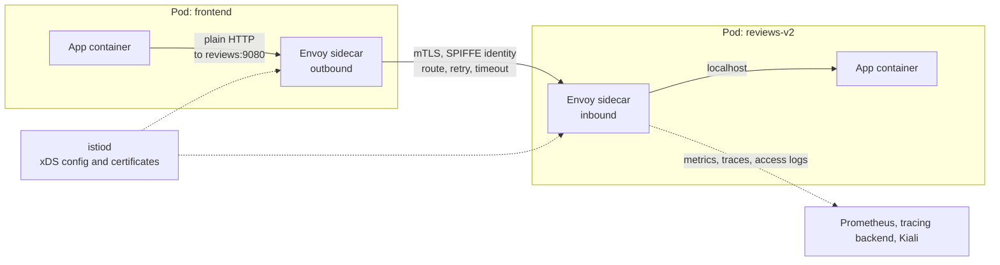

# Kubernetes: Service Mesh with Istio

> Istio in depth: istiod and Envoy sidecars, ambient mode, mTLS, traffic management, AuthorizationPolicy, observability, sidecar cost, troubleshooting with istioctl and Envoy flags, and Istio vs Linkerd vs no mesh.

## Key Concepts

### What a Service Mesh Solves

The short overview and the "when do I need a mesh" patterns are in [Networking and traffic](03-networking-and-traffic.md) (see its service mesh section and Q38–Q40). This file goes deeper into Istio itself.

A mesh moves four jobs out of application code and into the platform: **workload identity and mTLS**, **traffic control** (canary, retries, timeouts, circuit breaking), **service-to-service authorization**, and **uniform telemetry**. It covers east-west traffic between services, not API management for external clients.

### Istio Architecture

- **istiod** is the control plane. It watches Kubernetes and Istio resources, turns them into Envoy config, and pushes it over xDS. It is also the CA that signs short-lived workload certificates (SPIFFE IDs like `spiffe://cluster.local/ns/payments/sa/api`).
- **Sidecar data plane:** an `istio-proxy` (Envoy) container is injected into each Pod. iptables rules (from an init container or the Istio CNI plugin) redirect all inbound and outbound traffic through it.
- **Ambient data plane:** no sidecars. A per-node **ztunnel** DaemonSet handles L4 mTLS, identity, and L4 authorization. An optional **waypoint** Envoy proxy, deployed per namespace or per service, adds L7 features. Ambient mode reached GA (stable) in Istio 1.24 in November 2024. Ambient multi-network multicluster is Beta as of Istio 1.29, so check the feature status page for anything multicluster.

### Request Flow Through Sidecars

The app makes a plain HTTP call to a Service name. The client sidecar picks an endpoint, applies routing and retries, and opens mTLS to the server sidecar, which checks policy before handing the request to the app on localhost.



### Traffic Management Resources

| Resource | Purpose |
| --- | --- |
| **VirtualService** | How requests are routed: match on host, path, headers; weights; retries; timeouts; fault injection |
| **DestinationRule** | What happens after routing: subsets by label, load balancing, connection pools, outlier detection (circuit breaking), TLS mode |
| **Gateway** | Envoy at the mesh edge for ingress or egress. Istio also supports the Kubernetes Gateway API, which is the recommended direction for new setups |
| **ServiceEntry** | Adds external hosts to the mesh registry so you can apply policy to egress |
| **Sidecar** | Limits which services a sidecar gets config for, which cuts memory |

### Security Resources

- **PeerAuthentication** sets mTLS mode for receiving workloads: `PERMISSIVE` (accepts plaintext and mTLS, the default) or `STRICT`.
- **AuthorizationPolicy** allows or denies requests by source identity, namespace, method, path, or JWT claims. If any ALLOW policy selects a workload, everything not allowed is denied.
- **RequestAuthentication** validates end-user JWTs; pair it with AuthorizationPolicy to require them.

### Observability

Envoy emits standard metrics (`istio_requests_total`, `istio_request_duration_milliseconds`) for Prometheus. **Kiali** draws the service graph and validates config. Tracing needs apps to **forward trace headers** (W3C `traceparent` or B3); the mesh cannot join spans by itself.

## Interview Questions

<details><summary>Q1. [Basic] What do istiod, the Envoy sidecar, ztunnel, and a waypoint proxy each do?</summary>

**Answer:**

- **istiod:** the control plane. It does service discovery, turns Istio and Gateway API resources into Envoy config, pushes it over xDS, and acts as the CA for workload certificates.
- **Envoy sidecar:** the data plane in sidecar mode. One per Pod. It does L4 and L7: mTLS, routing, retries, metrics.
- **ztunnel:** the ambient-mode node proxy, one per node. It does L4 only: mTLS with the HBONE tunnel, identity, L4 authorization, and TCP telemetry.
- **Waypoint:** an optional Envoy proxy in ambient mode for L7 features like HTTP routing, retries, and path-based authorization. You deploy it only for namespaces or services that need it.

```bash
istioctl proxy-status                 # every proxy and its config sync state
kubectl get pods -n istio-system      # istiod, gateways, ztunnel in ambient
istioctl waypoint list -A
```

</details>

<details><summary>Q2. [Intermediate] How do you roll out strict mTLS across a cluster without breaking callers? <em>(scenario)</em></summary>

**Answer:**

Istio defaults to `PERMISSIVE`, so meshed clients already use mTLS automatically while plaintext clients still work. I move to `STRICT` per namespace only after I know who the plaintext callers are.

1. Inject sidecars (or enroll in ambient) namespace by namespace.
2. Find plaintext traffic. In Prometheus, `istio_requests_total{connection_security_policy="none"}` on the destination side shows non-mTLS callers. Kiali shows a lock icon on mTLS edges.
3. Mesh or exclude those callers (jobs, monitoring scrapers, health checks from outside).
4. Apply STRICT per namespace, then mesh-wide in `istio-system` last.

```yaml
apiVersion: security.istio.io/v1
kind: PeerAuthentication
metadata:
  name: default
  namespace: payments
spec:
  mtls:
    mode: STRICT
```

**Verify:** `istioctl x describe pod <pod>` shows the effective mTLS mode. A curl from a non-mesh Pod should now fail with a connection reset.

**Pitfalls:** a `DestinationRule` with `tls.mode: DISABLE` overrides auto-mTLS on the client side. Prometheus scraping app ports from outside the mesh breaks unless you use Istio's metrics merging or a port-level exception.

</details>

<details><summary>Q3. [Intermediate] How do you do a weight-based canary with VirtualService and DestinationRule?</summary>

**Answer:**

The DestinationRule defines subsets by Pod label. The VirtualService splits traffic between them. Both Deployments sit behind the same Kubernetes Service.

```yaml
apiVersion: networking.istio.io/v1
kind: DestinationRule
metadata:
  name: reviews
spec:
  host: reviews
  subsets:
    - name: v1
      labels: { version: v1 }
    - name: v2
      labels: { version: v2 }
---
apiVersion: networking.istio.io/v1
kind: VirtualService
metadata:
  name: reviews
spec:
  hosts: ["reviews"]
  http:
    - match:
        - headers:
            x-canary: { exact: "true" }
      route:
        - destination: { host: reviews, subset: v2 }
    - route:
        - destination: { host: reviews, subset: v1 }
          weight: 90
        - destination: { host: reviews, subset: v2 }
          weight: 10
```

I move 10 → 25 → 50 → 100 while watching error rate and p99 latency per version (`destination_version` label). Argo Rollouts or Flagger can automate the steps and roll back on bad metrics.

**Pitfalls:** weights only apply to traffic that passes through a mesh proxy; traffic entering through an ingress outside the mesh is not split. A subset whose labels match no Pods returns 503 `NR` or `UH`. Apply the DestinationRule before the VirtualService references it.

</details>

<details><summary>Q4. [Intermediate] How do you configure retries, timeouts, and circuit breaking, and how do they interact?</summary>

**Answer:**

Retries and timeouts go on the VirtualService. Connection limits and outlier detection (circuit breaking) go on the DestinationRule.

```yaml
# VirtualService http route
      timeout: 3s
      retries:
        attempts: 2
        perTryTimeout: 1s
        retryOn: 5xx,reset,connect-failure
---
# DestinationRule trafficPolicy
  trafficPolicy:
    connectionPool:
      http:
        http1MaxPendingRequests: 100
        maxRequestsPerConnection: 10
    outlierDetection:
      consecutive5xxErrors: 5
      interval: 10s
      baseEjectionTime: 30s
      maxEjectionPercent: 50
```

How they interact: the overall `timeout` caps the whole request, including retries. `attempts × perTryTimeout` should fit inside it. Outlier detection ejects bad endpoints so retries land on healthy ones. Connection pool overflow returns 503 with flag `UO`.

**Pitfalls:** retries on non-idempotent POSTs can double-charge a payment. Retries at every hop multiply load during an outage (2 retries at 3 hops is up to 27 calls). Keep retries at one layer and make the app timeout longer than the mesh timeout so you can tell who timed out.

</details>

<details><summary>Q5. [Intermediate] How do you write AuthorizationPolicy for least-privilege service-to-service access?</summary>

**Answer:**

Start with an allow-nothing policy per namespace, then allow exact callers by their ServiceAccount identity. Identity comes from mTLS, so this needs mTLS to be on.

```yaml
apiVersion: security.istio.io/v1
kind: AuthorizationPolicy
metadata:
  name: allow-nothing
  namespace: payments
spec: {}
---
apiVersion: security.istio.io/v1
kind: AuthorizationPolicy
metadata:
  name: api-from-frontend
  namespace: payments
spec:
  selector:
    matchLabels: { app: payments-api }
  action: ALLOW
  rules:
    - from:
        - source:
            principals: ["cluster.local/ns/web/sa/frontend"]
      to:
        - operation:
            methods: ["GET", "POST"]
            paths: ["/v1/payments/*"]
```

Evaluation order: CUSTOM, then DENY, then ALLOW. If any ALLOW policy selects the workload and no rule matches, the request is denied with **403 RBAC: access denied**.

**Pitfalls:** in ambient mode without a waypoint, ztunnel enforces only L4 rules. A policy with `paths` or `methods` needs a waypoint. Also, an AuthorizationPolicy does not replace NetworkPolicy: NetworkPolicy still blocks non-mesh traffic and traffic that bypasses the proxy.

</details>

<details><summary>Q6. [Intermediate] Requests return 503. How do you read the Envoy response flags like <code>UF</code>, <code>UH</code>, and <code>NR</code>? <em>(scenario)</em></summary>

**Answer:**

Envoy access logs carry a response flag that says why it failed. I turn on access logs (`meshConfig.accessLogFile: /dev/stdout` or the Telemetry API) and read the client and server sidecar logs.

| Flag | Meaning | Usual cause |
| --- | --- | --- |
| `NR` | No route configured | Host not in VirtualService or registry, wrong port name, missing subset |
| `UH` | No healthy upstream | Zero ready endpoints, all ejected by outlier detection, subset labels match nothing |
| `UF` | Upstream connection failure | App not listening, mTLS mismatch (STRICT server with plaintext client), NetworkPolicy blocking |
| `URX` | Upstream retry limit exceeded | Backend keeps failing; retries exhausted |
| `UO` | Upstream overflow | Circuit breaker connection pool limit hit |
| `UC` | Upstream connection terminated | App closed idle keep-alive connections earlier than Envoy expects |
| `DC` | Downstream connection terminated | Client gave up or timed out first |

```bash
kubectl logs deploy/frontend -c istio-proxy | grep ' 503 '
istioctl proxy-config endpoints deploy/frontend --cluster "outbound|9080|v2|reviews.default.svc.cluster.local"
istioctl proxy-config routes deploy/frontend -o json
```

Compare these 503s with the non-mesh 503 causes in [Networking and traffic](03-networking-and-traffic.md) Q15–Q20. `UC` 503s during low traffic are often fixed by making the app's keep-alive timeout longer than Envoy's idle timeout.

</details>

<details><summary>Q7. [Intermediate] What is your standard troubleshooting flow with <code>istioctl</code>?</summary>

**Answer:**

```bash
istioctl analyze -A                          # config errors: missing hosts, conflicting rules, bad selectors
istioctl proxy-status                        # SYNCED vs STALE per proxy; STALE means istiod push trouble
istioctl x describe pod <pod> -n <ns>        # which VS, DR, PeerAuthentication apply to this Pod
istioctl proxy-config listeners|routes|clusters|endpoints <pod> -n <ns>
istioctl proxy-config secret <pod> -n <ns>   # workload cert and its expiry
istioctl proxy-config log <pod> --level debug   # temporarily raise Envoy log level
kubectl get pod <pod> -o jsonpath='{.spec.containers[*].name}'   # is istio-proxy injected?
```

The order I follow: is the Pod injected and the namespace labeled; does `analyze` complain; is the proxy `SYNCED`; does the client proxy have the route, cluster, and healthy endpoints; is the server rejecting on mTLS or AuthorizationPolicy.

Other common causes: Service ports not named or not using `appProtocol` (Istio treats them as plain TCP and skips L7 features), apps binding only to `127.0.0.1`, and containers starting before the sidecar is ready (fix with `holdApplicationUntilProxyStarts` or native sidecars).

</details>

<details><summary>Q8. [Advanced] Sidecars add a lot of CPU and memory across 300 services. How do you reduce mesh cost? <em>(scenario)</em></summary>

**Answer:**

The general analysis is in [Networking and traffic](03-networking-and-traffic.md) Q38. The Istio-specific levers are:

1. **Scope the config.** By default every sidecar gets config for every service in the mesh. A `Sidecar` resource (or `discoverySelectors` in meshConfig) limits each namespace to what it actually calls. This is usually the biggest memory win.

   ```yaml
   apiVersion: networking.istio.io/v1
   kind: Sidecar
   metadata:
     name: default
     namespace: payments
   spec:
     egress:
       - hosts: ["./*", "istio-system/*", "shared/redis.shared.svc.cluster.local"]
   ```

2. **Right-size proxies.** The default request is 100m CPU and 128Mi memory per sidecar. Measure real use and set `sidecar.istio.io/proxyCPU` and `proxyMemory` per workload.
3. **Cut telemetry.** Lower trace sampling, drop high-cardinality metric labels, and turn access logs on only where needed.
4. **Move to ambient** for services that need only mTLS and L4 policy: one ztunnel per node instead of one Envoy per Pod. Add waypoints only where L7 is needed.
5. **Take services out of the mesh** that gain nothing from it, and protect them with NetworkPolicy instead.

**Verify:** compare `container_memory_working_set_bytes{container="istio-proxy"}` before and after, and check `istioctl proxy-config clusters <pod> | wc -l` drops.

</details>

<details><summary>Q9. [Advanced] Sidecar mode or ambient mode for a new platform? <em>(scenario)</em></summary>

**Answer:**

| | Sidecar | Ambient |
| --- | --- | --- |
| Status | Mature, longest production history | GA since 1.24; multicluster still maturing |
| Cost | One Envoy per Pod | One ztunnel per node, waypoints only where needed |
| Upgrades | Restart every Pod to get a new proxy | Upgrade ztunnel and waypoints without restarting apps |
| L7 features | Everywhere by default | Only through a waypoint |
| Blast radius | Proxy failure affects one Pod | ztunnel failure affects the whole node |

I would pick **ambient** for a new single-cluster platform where most services need mTLS and L4 policy, and some need L7 routing. I would stay on **sidecar** if I need a feature or integration not yet supported in ambient, or a multicluster topology still marked alpha for ambient. Before deciding, I check the Istio feature status page for the exact version and run a proof of concept with our CNI (for example, AWS VPC CNI on EKS) and our NetworkPolicies.

Mixed mode is possible: sidecar and ambient workloads can talk to each other in one mesh, so migration can be gradual.

</details>

<details><summary>Q10. [Advanced] How do you upgrade Istio safely in production? <em>(scenario)</em></summary>

**Answer:**

I use **revision-based canary upgrades** instead of in-place.

```bash
istioctl x precheck
istioctl install --set revision=1-30-0 -y          # new istiod runs beside the old one
kubectl label ns payments istio.io/rev=1-30-0 istio-injection- --overwrite
kubectl rollout restart deploy -n payments        # Pods get the new proxy
istioctl proxy-status                              # confirm Pods point to the new revision
```

Better still, use **revision tags** (`istioctl tag set prod --revision 1-30-0`) so namespaces point at a stable tag and you move the tag, not every namespace label.

Rules I follow: upgrade one minor version at a time, read the release notes for deprecated APIs and changed defaults, run `istioctl analyze` after, move a non-critical namespace first, and keep the old revision until every Pod has moved. Proxy and control plane can differ by a limited number of minor versions, so do not leave old Pods unrestarted for months.

TODO (Siva): add whether you have run Istio (or another mesh) in production, and which upgrade method you used.

</details>

<details><summary>Q11. [Advanced] Istio vs Linkerd vs no mesh: how do you decide?</summary>

**Answer:**

| | Istio | Linkerd | No mesh |
| --- | --- | --- | --- |
| Proxy | Envoy (sidecar) or ztunnel and waypoint (ambient) | Rust micro-proxy, sidecar only | None |
| Features | Widest: L7 routing, egress gateways, JWT auth, extensibility, multicluster | mTLS on by default, retries, timeouts, traffic split, policy; smaller surface | NetworkPolicy, app libraries, ingress or Gateway API |
| Ops effort | Highest | Lower | Lowest |
| Licensing | Open source, CNCF graduated | Code open source and CNCF graduated, but since Feb 2024 stable release builds come from vendors such as Buoyant Enterprise; the open-source project ships edge releases | n/a |

**Choose no mesh** when you have a few services and NetworkPolicy plus cloud load balancers plus OpenTelemetry in the app cover your needs. Many ECS or small EKS setups are here. AWS App Mesh was discontinued on 30 September 2026. AWS points ECS users to ECS Service Connect and EKS users to VPC Lattice.

**Choose Linkerd** when you mainly want zero-config mTLS and golden metrics with low overhead, and you accept the release model.

**Choose Istio** when you need advanced L7 traffic control, egress control, end-user JWT policy, or ambient mode to lower cost at scale.

Either way, the mesh becomes tier-zero infrastructure: someone has to own upgrades, certificates, and on-call.

</details>
