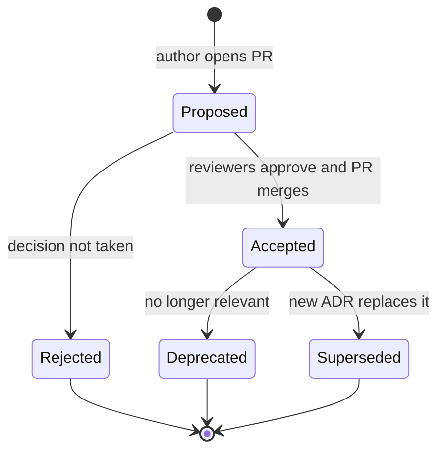

# Leadership: Architecture Decision Records

> What an ADR is, when to write one, a reusable template, the ADR lifecycle, where to store ADRs, and worked DevOps examples such as OpenTofu vs Terraform and ECS vs EKS.

## Key Concepts

### What an ADR Is

An Architecture Decision Record (ADR) is a short document that captures one important technical decision: the context, the choice made, and its consequences. The idea was popularised by Michael Nygard in 2011. An ADR answers the question a new engineer asks six months later: "Why on earth did we do it this way?"

- **One decision per record.** Not a design doc, not a wiki page of everything.
- **Short.** One to two pages. If it needs ten pages, the design doc is separate and the ADR links to it.
- **Immutable once accepted.** You do not rewrite history. You write a new ADR that supersedes the old one.
- **Numbered.** `0001`, `0002`, ... so they can be referenced in PRs and tickets.

### When to Write One

Write an ADR when a decision is **hard to reverse**, **affects more than one team**, or **will be questioned later**. Do not write one for choices that are cheap to change.

| Write an ADR | Skip the ADR |
| --- | --- |
| IaC tool for the whole platform (OpenTofu vs Terraform) | Variable naming inside one module |
| Container platform (ECS Fargate vs EKS) | Which linter rule to enable |
| State backend and locking strategy | A one-off script |
| Secrets store (SSM Parameter Store vs Secrets Manager vs Vault) | A library patch version bump |
| Logging platform and retention policy | Ticket workflow tweaks |
| Branching and release model | Personal editor settings |

A good rule: if you would need a meeting to agree it, it deserves an ADR.

### ADR Template

Keep the template small so people actually use it. This is close to Nygard's original format with a few practical additions.

```markdown
# ADR-0007: Use OpenTofu as the infrastructure-as-code tool

- Status: Proposed | Accepted | Deprecated | Superseded by ADR-00NN
- Date: YYYY-MM-DD
- Deciders: <names or roles>
- Consulted: <security, finance, platform team, ...>
- Related: <tickets, design doc, earlier ADRs>

## Context
What problem are we solving? What forces apply: constraints, deadlines,
skills, cost, licensing, compliance? State facts, not opinions.

## Options considered
1. Option A - short pros and cons
2. Option B - short pros and cons
3. Do nothing - always include this

## Decision
"We will ..." One clear sentence, then the key details.

## Consequences
Positive, negative, and neutral results. What becomes easier, what becomes
harder, what new work it creates, what we must monitor.

## Review / exit criteria (optional)
When should we revisit this? What signal would make us change course?
```

### Lifecycle and Status

An ADR moves through a small number of states. The key rule is that an accepted ADR is never edited to change the decision. Instead a new ADR supersedes it, and both link to each other.



- **Proposed:** open for comment, usually as a pull request.
- **Accepted:** merged; this is now the team's position.
- **Rejected:** kept on record so the same debate is not repeated.
- **Deprecated:** the thing it decided no longer exists.
- **Superseded:** replaced; the header says "Superseded by ADR-0012".

### Where to Store ADRs

Store ADRs **next to the code they govern**, in Git, so they are reviewed in pull requests and versioned with the system.

```text
platform-infra/
  docs/
    adr/
      0001-record-architecture-decisions.md
      0002-use-remote-state-in-s3-with-locking.md
      0003-use-ecs-fargate-for-stateless-services.md
      0004-use-opentofu-instead-of-terraform.md
      README.md      # index table: number, title, status
```

- **Repo per system:** ADRs live in that repo's `docs/adr/`.
- **Cross-cutting decisions:** a central `architecture-decisions` repo, linked from each team's README.
- **Discoverability:** link ADR numbers in PR descriptions and code comments, for example `# See ADR-0004`.
- **Tools:** `adr-tools` (a small shell tool) and the MADR template are common, but a plain Markdown folder works fine.

Wikis like Confluence are fine for visibility, but the Git copy should be the source of truth so it cannot drift silently.

### Example: OpenTofu vs Terraform

In August 2023 HashiCorp moved Terraform from the open-source MPL 2.0 licence to the Business Source License (BSL 1.1). OpenTofu is the community fork of the last MPL-licensed version and is run under the Linux Foundation. This is a classic ADR topic because it touches licensing, tooling, and every pipeline.

| Force | What to write down |
| --- | --- |
| Licensing | Does our use case fit the BSL terms? Legal's view? |
| Compatibility | Providers, modules, and state format compatibility for our current version |
| Features | Features only in one tool, for example OpenTofu state encryption or Terraform Cloud/HCP integration |
| Ecosystem | CI tooling, policy tools, scanners, IDE plugins we rely on |
| Support | Do we need a commercial support contract? |
| Migration cost | Binary swap, lock file, pipeline images, team training |

TODO (Siva): if you made or supported this decision in real life, note the actual drivers and outcome here.

### Example: ECS Fargate vs EKS

| Force | ECS Fargate | EKS |
| --- | --- | --- |
| Operational load | Low: no nodes, no control plane upgrades | Higher: cluster upgrades, add-ons, node groups or Karpenter |
| Portability | AWS-specific APIs | Kubernetes API, portable across clouds |
| Ecosystem | AWS-native integrations | Helm, operators, service meshes, GitOps tools |
| Team skills | Easy to learn | Needs Kubernetes expertise |
| Cost model | Pay per task vCPU and memory | Per-cluster control plane fee plus compute |
| Best fit | Stateless services, small platform team | Many teams, complex workloads, need for K8s tooling |

The ADR records which forces mattered most for *your* team. The same options can lead to different decisions in different companies, and that is exactly why the context section matters.

## Interview Questions

<details><summary>Q1. [Basic] What is an Architecture Decision Record, and why would a DevOps team use one?</summary>

**Answer:**

An ADR is a short, numbered document that records one significant technical decision: the context, the options, the decision, and the consequences. It lives in Git next to the code.

A DevOps team uses ADRs because platform decisions are long-lived and affect many teams. Things like the IaC tool, the container platform, or the state backend get questioned again and again. Without a record, people repeat old debates, or they undo a decision without knowing why it was made.

Benefits I would mention:
- New joiners understand the "why" quickly.
- Reviews in pull requests make decisions visible and inclusive.
- Auditors and security teams get a clear trail.
- When conditions change, you can see exactly which assumption broke.

**Pitfall:** ADRs are not a design doc or a ticket. Keep them short and about one decision.

</details>

<details><summary>Q2. [Basic] What sections does a good ADR contain?</summary>

**Answer:**

The core four are **Context**, **Decision**, **Consequences**, and **Status**. I usually add a few lightweight fields:

- **Title and number:** `ADR-0004: Use OpenTofu instead of Terraform`.
- **Status:** Proposed, Accepted, Rejected, Deprecated, or Superseded by ADR-NNNN.
- **Date and deciders:** who made the call and when.
- **Context:** the problem and the forces, stated as facts.
- **Options considered:** including "do nothing".
- **Decision:** "We will ..." in one clear sentence.
- **Consequences:** good, bad, and neutral, plus follow-up work.
- **Review criteria:** what would make us revisit it.

The **Consequences** section is the one people skip, and it is the most valuable. It shows you thought about the downside, not only the upside.

</details>

<details><summary>Q3. [Basic] What is the lifecycle of an ADR, and what does "superseded" mean?</summary>

**Answer:**

An ADR starts as **Proposed**, usually as a pull request. After review it becomes **Accepted** (merged) or **Rejected** (kept on record). Later it can become **Deprecated** when the thing it covers is gone, or **Superseded** when a newer ADR replaces it.

"Superseded" means we changed our mind for a reason. We do **not** edit the old ADR's decision. We write a new ADR, set the old one's status to "Superseded by ADR-0012", and the new one says "Supersedes ADR-0004". That keeps the history honest: you can see what we believed then and why it changed.

</details>

<details><summary>Q4. [Intermediate] How do you decide whether a decision needs an ADR or not?</summary>

**Answer:**

I ask three questions:

1. **Is it hard or expensive to reverse?** Changing the container platform is; renaming a variable is not.
2. **Does it affect more than one team or system?** Shared modules, pipelines, logging standards.
3. **Will someone question it later?** Anything with trade-offs that are not obvious.

If any answer is yes, I write a short ADR. If it is a cheap, local choice, a good commit message or PR description is enough.

I also watch for signals in conversation: if a decision needs a meeting, or someone says "we tried that before", that is a sign it should be written down.

**Pitfall:** too many ADRs is also a problem. If every small change gets an ADR, people stop reading them.

</details>

<details><summary>Q5. [Intermediate] Where should ADRs be stored, and how do you keep them discoverable?</summary>

**Answer:**

I store them in Git, in the repo of the system they govern, under `docs/adr/`. Cross-cutting platform decisions go into a central architecture repo.

```bash
# Using adr-tools (optional)
adr init docs/adr
adr new "Use ECS Fargate for stateless services"
adr new -s 4 "Use OpenTofu instead of Terraform"   # -s marks ADR 4 as superseded
```

To keep them discoverable:
- A `README.md` index table: number, title, status, date.
- Reference ADR numbers in PR descriptions, module READMEs, and code comments.
- Link the ADR folder from the team onboarding page.
- Mention new ADRs in the team channel or weekly sync.

**Why Git over a wiki:** they go through review, they are versioned with the code, and they cannot be silently edited.

</details>

<details><summary>Q6. [Intermediate] How do you run the review process for a proposed ADR so it does not stall?</summary>

**Answer:**

1. **Author** writes the draft and opens a PR with status `Proposed`.
2. **Name the deciders** up front: who must approve, and who is only consulted (security, finance, a dependent team).
3. **Set a deadline** for comments, for example one week.
4. **Resolve comments** in the PR. For a big disagreement, hold a short meeting and record the outcome in the ADR.
5. **Merge** with status `Accepted`, or close it with status `Rejected` and keep the file.

To stop stalling:
- Make it clear the goal is a good-enough decision, not unanimous agreement ("disagree and commit").
- If the decision owner is unclear, escalate to the tech lead or architect to name one.
- Time-box research spikes and record what was learned.

</details>

<details><summary>Q7. [Intermediate] Write the context and consequences for an ADR that chooses ECS Fargate over EKS. <em>(scenario)</em></summary>

**Answer:**

```markdown
# ADR-0003: Use ECS Fargate for stateless services

Status: Accepted

## Context
- We run about N stateless HTTP services and a few background workers.
- The platform team is small; nobody runs Kubernetes in production today.
- Services already use ALB, ECR, SSM Parameter Store, and CloudWatch.
- We have no need for Kubernetes-only tools such as operators or a service mesh.

## Options considered
1. ECS on Fargate
2. EKS with managed node groups
3. Keep EC2 with Docker and Auto Scaling groups (do nothing)

## Decision
We will run stateless services on ECS Fargate behind an ALB, defined in OpenTofu.

## Consequences
+ No nodes or control plane to patch or upgrade.
+ Native IAM task roles, ALB target groups, and CloudWatch integration.
- Tied to AWS ECS APIs; moving to Kubernetes later means rewriting deployment config.
- Less control over the host (no DaemonSets, limited privileged workloads).
- Fargate per-task cost can be higher than well-packed EC2 nodes at large scale.
Review when: we exceed X services, need K8s-native tooling, or need multi-cloud.
```

The key is the **Review when** line. It shows the decision fits today's context and names the signal to revisit it.

</details>

<details><summary>Q8. [Advanced] Your organisation is deciding between OpenTofu and Terraform. How would you drive and document the decision? <em>(scenario)</em></summary>

**Answer:**

I would treat it as a cross-team decision with legal, security, and every pipeline in scope.

1. **Frame the problem.** The trigger is Terraform's licence change to BSL 1.1 in 2023. The question is what our IaC tool should be for the next few years.
2. **Gather facts:**
   - Ask legal whether our use of Terraform fits the BSL terms.
   - Check provider and module compatibility for our current versions.
   - List the tools in our chain: CI images, policy checks, scanners, state backends.
   - Note features unique to each, for example OpenTofu's client-side state encryption, or Terraform's HCP integration if we use it.
3. **Prove it.** Run a spike: switch one non-production stack to `tofu`, run `tofu init` and `tofu plan`, and confirm the plan shows no changes.
4. **Write the ADR** with options (OpenTofu, Terraform, stay pinned on the last MPL version), decision, consequences, and a migration plan.
5. **Review** with platform engineers, security, and the app teams that run pipelines.
6. **Roll out** in stages and keep the ADR linked from each repo's README.

```bash
# Spike check on a non-prod stack
tofu init -upgrade
tofu plan -detailed-exitcode   # exit code 0 = no changes, 2 = changes
```

**Pitfalls:** switching tools and upgrading versions in the same step (do one at a time); forgetting that state written by a newer tool version may not be readable by an older one; letting different teams drift onto different tools without a record.

TODO (Siva): if you were part of this decision for real, add your role and the outcome.

</details>

<details><summary>Q9. [Advanced] An accepted ADR is now wrong because the context changed. How do you handle it?</summary>

**Answer:**

I do not edit the old decision. I write a new ADR:

1. New ADR, for example `ADR-0015: Move batch workloads from ECS to EKS`.
2. Its context explains **what changed**: more teams, need for operators, cost at scale, a new compliance rule.
3. It says "Supersedes ADR-0003" (or "Partially supersedes" if only part changes).
4. I update only the **status line** of ADR-0003 to "Superseded by ADR-0015".

This matters because the old ADR was right for its time. Keeping it shows how the system evolved, which helps audits and helps people avoid swinging back and forth.

I would also check the old ADR's "Review when" criteria. If it named the signal that has now fired, that is a good sign the process works.

</details>

<details><summary>Q10. [Advanced] How do you introduce ADRs to a team that sees them as bureaucracy?</summary>

**Answer:**

- **Start with one real pain.** Pick a recent debate that repeated itself, write ADR-0001 "Record architecture decisions" and ADR-0002 about that debate. Show the value with a real example.
- **Keep the template tiny.** Context, decision, consequences, status. One page.
- **Make it part of the flow.** A PR checklist item: "Does this change need an ADR?" Not a separate approval process.
- **Write the first few myself** and pair with others on the next ones.
- **Do not demand ADRs for small things.** Over-use kills adoption.
- **Celebrate when it pays off**, for example when a new joiner answers their own question from the ADR folder.

Success signal: people start linking ADR numbers in discussions without being asked.

</details>

<details><summary>Q11. [Advanced] Tell me about a significant technical decision you led. How did you structure it?</summary>

**Answer:**

**How to structure it (STAR):**
- **Situation:** the system and the problem, in two sentences.
- **Task:** what decision you owned and the constraints (time, cost, skills, risk).
- **Action:** options you compared, how you gathered data (spike, cost estimate, security review), who you consulted, how you wrote it up (ADR), and how you handled disagreement.
- **Result:** the measurable outcome and what you would do differently.

**Sample answer skeleton:**

- Situation: TODO (Siva): the system and why a decision was needed.
- Task: TODO (Siva): your role, for example decision owner or main author.
- Action: TODO (Siva): options compared, data gathered, who you consulted, how it was documented.
- Result: TODO (Siva): outcome with a number if possible, for example time saved, cost change, incidents avoided.
- Lesson: TODO (Siva): one thing you learned about decision-making.

**What a strong answer shows:** clear trade-offs, a "do nothing" option, input from other teams, and a written record.

</details>

See also: [SRE practices](../ops/03-sre.md) and [Leading incidents](04-leading-incidents.md).
