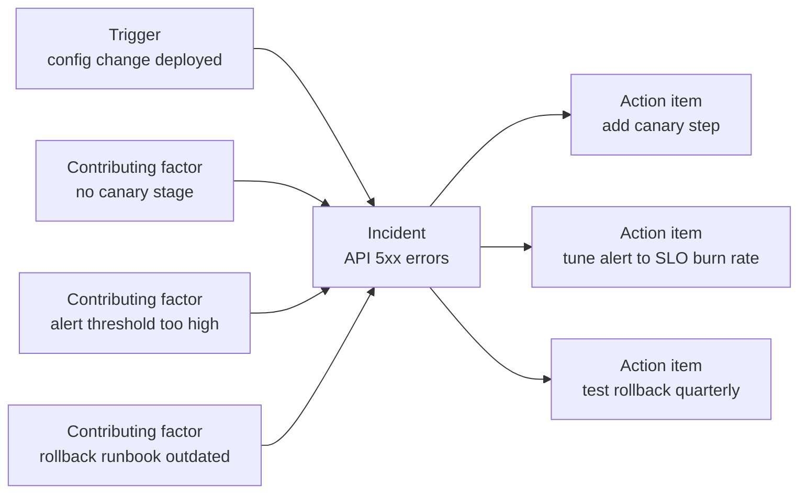

# Leadership: Writing Postmortems

> Blameless culture, postmortem structure, root cause and contributing factors, the 5 whys and its limits, tracking action items, and sharing what the organisation learns.

## Key Concepts

### Blameless Culture

A blameless postmortem assumes people made reasonable decisions with the information and tools they had at the time. The goal is to fix the **system** (process, tooling, guardrails) so the same mistake is hard to make again. If people fear blame, they hide details, and you lose the facts you need.

- **Blameless is not "no accountability".** Owners still own action items. What changes is that we ask "why did the system allow this?" instead of "who did this?".
- **Language matters.** Write "the deploy pipeline allowed an unreviewed change to reach prod", not "the engineer pushed a bad change".
- **Leaders set the tone.** If a manager asks "who did it?" in the review, blamelessness is gone.

### When to Write a Postmortem

Agree the triggers in advance so it is not a judgement call during a stressful week:

- Any SEV1 or SEV2 incident (see [Leading incidents](04-leading-incidents.md)).
- User-visible downtime or data loss beyond an agreed threshold.
- An SLO error budget burn above an agreed amount.
- A security incident.
- A near miss that could have been serious.
- Anyone on the team asks for one.

Aim to publish a draft within a few working days, while memory and logs are fresh.

### Postmortem Structure

| Section | What it holds |
| --- | --- |
| Summary | Two or three sentences: what happened, impact, how it was fixed |
| Impact | Users affected, duration, SLO burn, revenue or data impact, support tickets |
| Timeline | Timestamped facts in one time zone, from first signal to full recovery |
| Root cause and contributing factors | The technical trigger plus the conditions that let it cause harm |
| Detection | How we found out; how long it took; did alerts work? |
| Response and recovery | What we did, what helped, what slowed us down |
| What went well | Things to keep doing |
| Where we got lucky | Things that could have made it worse |
| Action items | Specific, owned, dated, tracked in the ticket system |
| Lessons learned | One to three sentences for the wider org |

### Root Cause and Contributing Factors

Complex systems rarely fail for one reason. The **trigger** is the change or event that started it. **Contributing factors** are the conditions that turned the trigger into an outage: missing tests, a weak alert, a manual step, a single point of failure, unclear ownership.



Each contributing factor should map to at least one action item, or an explicit decision to accept the risk.

### The 5 Whys and Its Limits

The 5 whys asks "why?" repeatedly to move from the symptom towards a systemic cause.

```text
Why did the API return 5xx?        The new task definition had a wrong DB endpoint.
Why was the endpoint wrong?        It was copied by hand from the staging parameter.
Why was it copied by hand?         SSM parameter paths differ between environments.
Why did tests not catch it?        There is no post-deploy smoke test against the DB.
Why is there no smoke test?        The pipeline template predates our DB move; nobody owns it.
```

Limits to mention in an interview:

- **It follows one chain.** Real incidents have several branches. Ask "why" on each contributing factor, not just one line.
- **It can stop at a person.** "Because the engineer made a mistake" is not a root cause. Keep asking why the system allowed it.
- **Five is arbitrary.** Stop when you reach something you can change.
- **Hindsight bias.** It is easy to see the right answer after the fact. Ask what the person knew *at the time*.

### Action Items That Actually Get Done

Bad action item: "Improve monitoring." Good action item: "Add an SLO burn-rate alert for the payments API 5xx rate, owner: platform on-call lead, due: end of next sprint, ticket: OPS-123."

- **Specific and testable:** you can tell when it is done.
- **One owner** (a person, not a team).
- **Priority and due date.** Mark which ones prevent recurrence vs nice-to-have.
- **In the normal backlog** (Jira, Azure Boards), labelled `postmortem`, not just in the document.
- **Reviewed** in a weekly ops review until closed.

```text
# Example Jira JQL to track open postmortem actions
labels = postmortem AND statusCategory != Done ORDER BY priority DESC, duedate ASC
```

### Postmortem Template

```markdown
# Postmortem: <short title>   (INC-<id>)

Status: Draft | In review | Final
Severity: SEV<n>     Date of incident: YYYY-MM-DD
Authors: <names>     Incident commander: <name>
Reviewers: <names>

## Summary
<2-3 sentences: what happened, who was affected, how it was resolved>

## Impact
- Duration: <start - end, time zone> (<total minutes>)
- Users / customers affected: <number or %>
- SLO impact: <error budget consumed>
- Business impact: <orders, revenue, SLA credits, tickets>
- Data impact: <none / delayed / lost>

## Timeline (all times UTC)
| Time  | Event |
|-------|-------|
| 10:02 | Deploy of <service> v1.4.2 starts |
| 10:06 | Alert: 5xx rate above threshold |
| 10:09 | On-call acknowledges, declares SEV2, opens #inc-<id> |
| 10:21 | Rollback started |
| 10:27 | Error rate back to normal; monitoring |
| 11:00 | Incident resolved |

## Root cause and contributing factors
- Trigger: <the change or event>
- Contributing factors: <list>

## Detection
<How we found out. Time to detect. Did the right alert fire?>

## Response and recovery
<What we did. What helped. What slowed us down.>

## What went well
- ...

## Where we got lucky
- ...

## Action items
| # | Action | Type (prevent / detect / mitigate / process) | Owner | Due | Ticket |
|---|--------|------|-------|-----|--------|
| 1 | ...    | prevent | <name> | <date> | OPS-123 |

## Lessons learned
<1-3 sentences for the wider engineering org>
```

### Sharing the Learning

A postmortem nobody reads only half works. Ways to spread it:

- A short review meeting (30 to 45 minutes) with the people involved and a facilitator who was not the IC.
- A searchable postmortem library (a Git repo or Confluence space) tagged by service and failure type.
- A monthly "incident review" or "failure Friday" where one postmortem is presented.
- A short summary in the engineering channel with a link.
- Trend reports each quarter: repeat causes, MTTD and MTTR, action item closure rate.

## Interview Questions

<details><summary>Q1. [Basic] What is a blameless postmortem, and why does it matter?</summary>

**Answer:**

A blameless postmortem is a written review of an incident that focuses on how the system and process allowed the failure, not on who to punish. It assumes people acted reasonably with what they knew at the time.

It matters because:

- People share the full, honest timeline, including their own mistakes.
- You fix the system, so the next person cannot make the same mistake.
- Engineers are not afraid to declare incidents early.

Blameless does not mean no ownership. Action items still have named owners and due dates.

**Pitfall:** writing "human error" as the root cause. That is where the investigation should start, not end.

</details>

<details><summary>Q2. [Basic] What sections should a postmortem include?</summary>

**Answer:**

Summary, impact, timeline, root cause and contributing factors, detection, response and recovery, what went well, where we got lucky, action items with owners, and lessons learned.

The three sections reviewers read most are the **summary**, the **impact**, and the **action items**. Make those very clear. The timeline should be factual, timestamped, and in one time zone.

</details>

<details><summary>Q3. [Basic] What is the difference between a root cause, a trigger, and a contributing factor?</summary>

**Answer:**

- **Trigger:** the event that started the incident, for example a config deploy or a certificate expiring.
- **Contributing factors:** conditions that let the trigger cause harm or made it worse, for example no canary stage, a noisy alert that was ignored, or an outdated runbook.
- **Root cause:** often used to mean the deepest systemic reason. In complex systems there is rarely a single one, so many teams prefer "root cause and contributing factors" or just "contributing factors".

Example: the trigger was an expired TLS certificate. Contributing factors: manual renewal, no expiry alert, and the owner had left the team. Fixing only the certificate would leave all three in place.

</details>

<details><summary>Q4. [Intermediate] How do you use the 5 whys, and what are its limits?</summary>

**Answer:**

I ask "why?" repeatedly, starting from the symptom, until I reach something we can change in the system. I write each step in the postmortem so reviewers can challenge it.

Limits:

- It follows one linear chain, but incidents have many contributing factors. I run it on each branch.
- It can wrongly stop at a person ("because the engineer made a typo"). I keep asking why the system allowed the typo to reach production.
- "Five" is arbitrary. Sometimes three is enough; sometimes you need more.
- Hindsight bias makes the answer look obvious. I ask what the person could see at the time: dashboards, alerts, docs.

I treat it as a conversation tool, not a formal method. For complex incidents, a contributing factors list or a causal diagram works better.

</details>

<details><summary>Q5. [Intermediate] How do you write a good timeline?</summary>

**Answer:**

- **One time zone**, usually UTC, stated at the top.
- **Facts, not opinions:** "10:06 alert fired", not "10:06 we finally noticed".
- **Sources:** alert history, chat channel export, deploy logs, CloudTrail, ticket updates.
- **Key milestones:** start of impact, detection, acknowledgement, incident declared, mitigation started, impact ended, resolved.
- **Decisions and why:** "10:15 chose rollback over hotfix because the change was isolated."

These milestones let you calculate time to detect, time to acknowledge, and time to mitigate, which you can trend over many incidents.

```bash
# Pull deploy events from CloudTrail for the timeline
aws cloudtrail lookup-events \
  --lookup-attributes AttributeKey=EventName,AttributeValue=UpdateService \
  --start-time 2026-01-10T09:30:00Z --end-time 2026-01-10T11:00:00Z
```

</details>

<details><summary>Q6. [Intermediate] What makes a good action item, and how do you make sure they are completed?</summary>

**Answer:**

A good action item is specific, testable, owned by one person, has a due date, and is in the normal ticket system.

| Weak | Strong |
| --- | --- |
| Improve monitoring | Add burn-rate alert on payments 5xx SLO, owner A, due date, OPS-123 |
| Be more careful with deploys | Add canary stage with automatic rollback to the ECS pipeline template |
| Update docs | Rewrite and test the DB failover runbook in a game day |

To get them done:

- Label tickets `postmortem` and review open ones in the weekly ops meeting.
- Agree with the product owner that postmortem fixes get a share of capacity.
- Report the closure rate and overdue items monthly.
- Close the postmortem only when the critical items are done or the risk is formally accepted.

</details>

<details><summary>Q7. [Intermediate] How do you run the postmortem review meeting?</summary>

**Answer:**

1. **Send the draft in advance** so people read before the meeting.
2. **Use a neutral facilitator**, ideally not the incident commander.
3. **Restate the blameless ground rule** at the start.
4. **Walk the timeline** and ask open questions: "What did you see at this point?", "What made that option look best?".
5. **Agree contributing factors**, then **agree action items** with owners.
6. **Time-box** it, about 30 to 45 minutes.
7. **Publish** the final version and share a summary.

I watch for blame language and redirect it: "Let's look at what made that step easy to get wrong."

</details>

<details><summary>Q8. [Intermediate] Write a short postmortem summary and impact section for an incident where a bad ECS deploy caused 20 minutes of 5xx errors. <em>(scenario)</em></summary>

**Answer:**

```markdown
## Summary
On <date> between 10:06 and 10:27 UTC, the orders API returned HTTP 5xx for
about 35% of requests after a deploy pointed new ECS tasks at the wrong
database endpoint. The ALB kept routing to the new tasks because the health
check only tested /ping. We rolled back to the previous task definition.

## Impact
- Duration: 21 minutes of partial outage
- Requests failed: ~35% of orders API traffic in that window
- SLO: consumed ~40% of the monthly error budget
- Customers: checkout failures; 14 support tickets
- Data: no data loss; failed orders were not charged
```

Note the details that lead directly to action items: the shallow health check and the wrong endpoint. The numbers here are illustrative.

</details>

<details><summary>Q9. [Advanced] The same type of incident keeps happening despite postmortems. What do you do? <em>(scenario)</em></summary>

**Answer:**

That means the postmortem process is producing documents, not change. I would:

1. **Look across incidents.** Tag postmortems by failure type and service, then look for themes: bad deploys, expired credentials, capacity, dependency failures.
2. **Check action item follow-through.** Were the earlier items closed? Were they the right items, or only local fixes?
3. **Fix the class, not the instance.** For example, instead of fixing each expired certificate, move to ACM automatic renewal plus an expiry alert for anything external.
4. **Escalate the trend with data:** "Five SEV2s in a quarter from manual deploy steps, ~X hours of impact. We need two sprints to automate this."
5. **Agree capacity** with product leadership for reliability work, for example using an error budget policy.

The message to leadership is a pattern with a cost, not a single story.

</details>

<details><summary>Q10. [Advanced] A senior manager wants to know who caused an outage. How do you respond while keeping the process blameless? <em>(scenario)</em></summary>

**Answer:**

I would answer the real need behind the question, which is usually "will this happen again, and is someone accountable for fixing it?".

- "The change came through our normal pipeline. The pipeline did not have a stage that would have caught it. Here are the three fixes, their owners, and dates."
- I explain, briefly, that naming individuals makes people hide information and slows down future incident response, which costs us more.
- If there is a genuine performance or conduct concern, that is handled separately and privately by the person's manager, not in the postmortem.

I would also make sure the postmortem's action items are visible to that manager, so they see accountability for the fixes.

</details>

<details><summary>Q11. [Advanced] How do you measure whether your postmortem process is working?</summary>

**Answer:**

- **Repeat incidents:** fewer incidents with the same contributing factor over time.
- **Action item closure:** percentage of critical items closed by their due date.
- **Time to publish:** days from incident to draft and to final.
- **MTTD and MTTR trends:** detection and recovery getting faster.
- **Participation:** people outside the incident team reading and attending reviews.
- **Near misses reported:** more near-miss postmortems is a good sign of psychological safety.

I would report these quarterly. A rising number of reported incidents is not always bad; it can mean people trust the process enough to declare them.

</details>

<details><summary>Q12. [Advanced] Tell me about a postmortem you wrote or led. What changed because of it?</summary>

**Answer:**

**How to structure it (STAR):**

- **Situation:** the incident in one or two sentences, with the impact.
- **Task:** your role: incident commander, author, facilitator.
- **Action:** how you gathered the timeline, how you kept it blameless, the contributing factors you found, and how you got action items prioritised.
- **Result:** what concretely changed and how you know it worked, for example no repeat incident in N months.

**Sample answer skeleton:**

- Situation: TODO (Siva): the incident, the affected system, and the impact.
- Task: TODO (Siva): your role in the incident and the postmortem.
- Action: TODO (Siva): how you built the timeline, key contributing factors, how you handled any blame.
- Result: TODO (Siva): the fixes that shipped and the measurable effect.
- Lesson: TODO (Siva): what you now do differently in every postmortem.

**What a strong answer shows:** systemic causes rather than a person, action items that were actually completed, and evidence the fix worked.

</details>

See also: [SRE practices](../ops/03-sre.md) and [Production issues](../repetitive-questions/production-issues.md).
