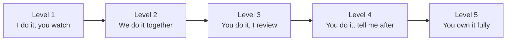

# Leadership: Mentoring and Growing Engineers

> Onboarding, pairing, code review as teaching, delegation, giving feedback with the SBI model, growth plans, handling underperformance, and building on-call confidence.

## Key Concepts

### Onboarding

Good onboarding gets a new engineer to a **first useful change in the first week** and to **independent work in about a quarter**. A plan written before day one removes most of the stress.

| Time | Goal | Examples for a DevOps team |
| --- | --- | --- |
| Day 1 | Access and context | Laptop, SSO, AWS read-only role, Git, chat channels, team charter |
| Week 1 | First small merged PR | Fix a README, add a tag to an OpenTofu module, tidy a pipeline step |
| Weeks 2 to 4 | Learn the main systems | Shadow deploys, walk through the architecture diagram, read ADRs and recent postmortems |
| Month 2 | Own a small piece | A small module or alert end to end, with review |
| Month 3 | Shadow on-call, then reverse-shadow | See "On-call confidence" below |

- **Onboarding buddy:** one named person for daily questions, separate from the manager.
- **Onboarding checklist in Git:** new joiners fix what is out of date, which is a great first PR.
- **Explicit expectations:** what "good" looks like at 30, 60, and 90 days.

### Pairing

Pairing is the fastest way to transfer tacit knowledge, like how you read a Terraform plan or how you debug a failing ECS task.

- **Driver and navigator:** the less experienced person usually drives, so they build muscle memory.
- **Talk through your thinking:** "I check the target group health first because..." is the real lesson.
- **Short sessions:** 60 to 90 minutes with breaks.
- **Let them struggle a little:** ask a question before giving the answer.
- **Remote:** share the terminal or IDE, keep cameras optional, and swap driver often.

### Code Review as Teaching

Code review is the most frequent teaching moment a lead has.

- **Explain the why**, not just the what: "Pin the provider version so a minor release does not change the plan unexpectedly."
- **Label comment weight:** `nit:` (optional), `suggestion:`, `blocking:`. Juniors otherwise treat every comment as a must-fix.
- **Ask questions:** "What happens if this ECS service scales to zero?" teaches more than "add a min capacity".
- **Praise good things** specifically.
- **Big issues in person:** if the design is wrong, talk first, then comment.
- **Rotate reviewers** so knowledge spreads and juniors also review seniors.

### Delegation

Delegation grows people and frees the lead to work on wider problems. The level of delegation should match the person's experience with that type of task.



- **Delegate outcomes, not steps:** "Reduce pipeline time below 10 minutes" instead of a task list.
- **Agree constraints:** budget, deadline, what needs your sign-off.
- **Agree check-ins** up front so you are not micromanaging.
- **Accept a different solution** if it meets the goal.
- **Delegate visible work too**, not only chores. Growth needs stretch work and credit.

### Giving Feedback: the SBI Model

The Situation, Behaviour, Impact model, from the Center for Creative Leadership, keeps feedback factual and specific.

- **Situation:** when and where. "In yesterday's incident call..."
- **Behaviour:** what the person did, something you could observe. "...you posted updates in the channel every 15 minutes..."
- **Impact:** the effect it had. "...so support could answer customers without interrupting the responders."

Then **ask** ("How did it feel from your side?") and agree a next step if needed.

```text
Corrective example:
S: In Tuesday's change review,
B: the OpenTofu plan was shared without the destroy lines highlighted,
I: so reviewers missed that the RDS parameter group would be replaced, and we nearly
   caused a restart in prod.
Ask: What would help make destructive changes stand out next time?
```

Tips: give feedback soon, in private for corrective feedback, regularly for positive feedback, and about behaviour, never personality.

### Growth Plans

A growth plan connects what the person wants with what the team needs.

```markdown
## Growth plan: <name>, <quarter>
Goal (their words): Become confident leading incidents.
Why it matters for the team: More people able to act as IC.
Skills to build:
  - Run an incident call   -> shadow IC on 2 incidents, then lead 1 with backup
  - Write postmortems      -> co-author 1, lead 1
Support from me: pairing, review of drafts, intro to the SRE lead
Evidence of progress: led a SEV3 incident; postmortem published
Check-in: every 2 weeks in 1:1
```

Use the company's career ladder if there is one, so goals map to promotion criteria.

### Handling Underperformance

1. **Check yourself first:** were expectations clear? Do they have the tools, access, and training?
2. **Talk early and privately** using SBI with specific examples.
3. **Find the cause:** skills gap, unclear priorities, personal circumstances, wrong role fit, team conflict.
4. **Agree a written plan:** clear goals, support, and a timeline, typically several weeks.
5. **Check in often** and give feedback on progress, good and bad.
6. **Involve your manager and HR** if there is no progress or if it may become formal.

Never let it drift. The rest of the team notices, and the person deserves a fair chance to fix it.

### Building On-call Confidence

On-call is where many engineers feel the most anxiety. Build confidence step by step:

- **Shadow:** join a full rotation as a second, watching how the primary works.
- **Reverse shadow:** they are primary; an experienced engineer is backup.
- **Runbooks:** every paging alert links to a runbook with checks, commands, and escalation.
- **Game days:** practise realistic failures in non-production, for example kill an ECS task, expire a test certificate, or break a DNS record.
- **Safe escalation:** say clearly, and often, that escalating early is good.
- **Post-shift review:** a short chat after each rotation about what was hard.

## Interview Questions

<details><summary>Q1. [Basic] How do you onboard a new DevOps engineer onto your team?</summary>

**Answer:**

I prepare before day one: accounts, access requests, an onboarding checklist in Git, and a named buddy.

- **Week 1:** access, architecture walkthrough, and a small first PR merged, for example fixing an outdated runbook step.
- **Weeks 2 to 4:** shadow deploys and incidents, read key ADRs and postmortems, pair on real tickets.
- **Month 2:** own a small piece of work end to end, such as a new alert or a module change.
- **Month 3:** shadow on-call, then reverse-shadow.

I set clear 30, 60, and 90 day expectations and check in weekly. I ask them to fix anything in the onboarding docs that was wrong. That improves the docs and gives them an easy early win.

**How I know it worked:** time to first PR, time to first on-call shift, and their own feedback at 30 and 90 days.

</details>

<details><summary>Q2. [Basic] What is the SBI feedback model?</summary>

**Answer:**

SBI stands for **Situation, Behaviour, Impact**. You describe when and where it happened, what the person did that you observed, and the effect it had. Then you ask for their view.

Example: "In Monday's deploy (S), you ran the plan in the shared channel and asked for a second pair of eyes before applying (B). That caught the security group change before it hit prod (I). Thank you."

It works because it is specific and factual. It avoids judging the person's character, which makes them defensive.

</details>

<details><summary>Q3. [Basic] What is the difference between mentoring, coaching, and managing?</summary>

**Answer:**

- **Mentoring:** sharing your experience and advice. "Here's how I approached this."
- **Coaching:** asking questions so the person finds their own answer. "What options do you see?"
- **Managing:** setting goals, priorities, and expectations, and being accountable for performance.

A tech lead uses all three. With a junior on a new topic I mentor more. With an experienced engineer I coach. On deadlines and quality bars I manage. Many leads only mentor because it feels efficient, but coaching builds more independent engineers.

</details>

<details><summary>Q4. [Intermediate] How do you use code review to teach without slowing delivery?</summary>

**Answer:**

- **Mark comment weight:** `nit:`, `suggestion:`, `blocking:`. Only blocking comments stop a merge.
- **Explain the reason**, with a link to docs or an ADR.
- **Ask questions** to make them think: "What happens to this alarm if the metric stops reporting?"
- **Approve with suggestions** when the change is safe, so learning happens without blocking.
- **Move big design issues to a quick call**, then summarise in the PR.
- **Automate the boring parts:** `tofu fmt`, `tflint`, `checkov`, `hadolint` in CI so humans review design, not formatting.

```bash
tofu fmt -check -recursive
tflint --recursive
checkov -d .
```

**Pitfall:** reviewing a junior's PR by rewriting it yourself. They learn nothing and stop trying.

</details>

<details><summary>Q5. [Intermediate] How do you decide what to delegate and to whom?</summary>

**Answer:**

I look at three things: **risk** of the task, **growth value** for the person, and **their current level** on that type of work.

- High risk, new to them: do it together (level 2).
- Medium risk, some experience: they do it, I review (level 3).
- Low risk or they have done it before: they own it (level 4 or 5).

I delegate the **outcome** with constraints, agree check-ins up front, and accept a different approach if it meets the goal. I make sure stretch work and visible projects are shared fairly, not always given to the same person.

What I keep: work only I can do in my role, like cross-team negotiation or final calls on risky trade-offs, until I can grow someone into it.

</details>

<details><summary>Q6. [Intermediate] How do you build on-call confidence in an engineer who is nervous about their first rotation? <em>(scenario)</em></summary>

**Answer:**

1. **Shadow rotation:** they get every page alongside the primary and watch how it is handled.
2. **Runbook review together:** go through the top paging alerts and their runbooks, and fix gaps they spot.
3. **Game day:** in a non-production account, break things on purpose: stop ECS tasks, fill a disk, break a DNS record. They practise with no pressure.
4. **Reverse shadow:** they are primary, I or another senior engineer am backup and reachable.
5. **Clear escalation rule:** "If you are stuck for 15 minutes on a SEV2, escalate. That is expected, not a failure."
6. **Debrief** after the first real shift.

I also make sure the rotation is healthy: noisy alerts are tuned and pages per shift are reasonable. Nervousness is often a sign of a bad on-call setup, not a weak engineer.

</details>

<details><summary>Q7. [Intermediate] How do you create a growth plan with an engineer?</summary>

**Answer:**

1. **Ask what they want** in the next one to two years: deeper technical skill, leadership, a specific area like security or Kubernetes.
2. **Map it to the career ladder** if one exists, so it supports promotion.
3. **Pick two or three goals** for the quarter, each with concrete evidence: "Lead one incident as IC", "Design and ship the new logging module".
4. **Find real work** that builds those skills. Training alone is not enough.
5. **Agree my support:** pairing, introductions, review time.
6. **Review every two weeks** in 1:1s and adjust.

The plan is theirs. I write it down with them and keep it in a shared doc so both of us can track it.

</details>

<details><summary>Q8. [Advanced] A team member's work quality has dropped over the last two months. How do you handle it? <em>(scenario)</em></summary>

**Answer:**

1. **Prepare facts:** two or three specific examples with dates, not a general feeling.
2. **Private conversation, early:** use SBI. "In the last three PRs (S), the plans included unrelated drift that was not explained (B). Reviewers spent extra time and one change was reverted (I). What's going on from your side?"
3. **Listen for the cause:** workload, personal issues, unclear priorities, burnout, conflict, or a skills gap.
4. **Agree support and expectations:** fewer parallel tasks, pairing, training, or adjusted priorities, plus clear goals.
5. **Write it down** and check in weekly.
6. **Recognise progress** quickly when you see it.
7. **Escalate** to my manager and HR if there is no improvement after a fair period, or immediately if there is a conduct issue.

I also check if it is a system problem: if several people are struggling, it is probably workload or process, not individuals.

</details>

<details><summary>Q9. [Advanced] How do you grow a strong senior engineer into a future tech lead?</summary>

**Answer:**

- **Give them ownership of a cross-team problem**, for example the shared pipeline template, with me as backup.
- **Have them write ADRs** and run the review.
- **Let them act as incident commander**, starting with SEV3, with me shadowing.
- **Bring them to stakeholder meetings** and let them present.
- **Coach, not mentor:** I ask "how would you handle it?" before I offer my view.
- **Give credit publicly** so others see them as a leader.
- **Talk about the non-technical parts:** saying no, giving feedback, handling conflict.

I also check they actually want leadership. Some great engineers prefer a staff or principal track, and pushing them into people leadership can lose a great engineer.

</details>

<details><summary>Q10. [Advanced] How do you spread knowledge so the team is not dependent on one or two experts?</summary>

**Answer:**

- **Map the bus factor:** list critical systems and who can operate them. Anything with one name is a risk.
- **Pair and rotate:** rotate tickets on those systems; the expert reviews but does not do the work.
- **Runbooks and ADRs:** make the expert's knowledge searchable.
- **Recorded walkthroughs:** short screen recordings of complex procedures.
- **Rotate on-call** across the whole team, with runbooks linked from every alert.
- **Game days** that force people other than the expert to recover a system.

I also talk to the expert. Some people feel their value is in being the only one who knows. I make it clear that sharing knowledge is part of seniority and is recognised in reviews.

</details>

<details><summary>Q11. [Advanced] Tell me about a time you mentored someone and it made a clear difference.</summary>

**Answer:**

**How to structure it (STAR):**

- **Situation:** who the person was (role, level, not their name), and the gap or goal.
- **Task:** what you were asked to do, or what you chose to take on.
- **Action:** the specific methods: pairing, delegation level, feedback, growth plan, on-call steps.
- **Result:** what they can now do, with evidence: shipped a project, led an incident, got promoted, reduced review cycles.

**Sample answer skeleton:**

- Situation: TODO (Siva): the engineer's starting point and the goal.
- Task: TODO (Siva): your role, formal mentor, buddy, or lead.
- Action: TODO (Siva): two or three concrete things you did and why.
- Result: TODO (Siva): the observable outcome and timeline.
- Lesson: TODO (Siva): what you would do differently with the next person.

**What a strong answer shows:** you adapted to the person, you let them own the work, and the result is about their growth, not your heroics.

</details>

<details><summary>Q12. [Advanced] Tell me about a time you gave difficult feedback.</summary>

**Answer:**

**How to structure it (STAR):**

- **Situation:** the context and why the feedback was needed.
- **Task:** why it was your job to give it.
- **Action:** how you prepared, how you used SBI, how you listened, and the plan you agreed.
- **Result:** how the behaviour changed and how the relationship held up.

**Sample answer skeleton:**

- Situation: TODO (Siva): the context, without naming the person.
- Task: TODO (Siva): your role and the stakes.
- Action: TODO (Siva): what you said using Situation, Behaviour, Impact, and how they reacted.
- Result: TODO (Siva): what changed afterwards.
- Lesson: TODO (Siva): what you learned about giving feedback.

**What a strong answer shows:** you acted early, kept it private and factual, and followed up.

</details>

See also: [Behavioral questions](../others/behavioral/questions.md) and [Leading incidents](04-leading-incidents.md).
