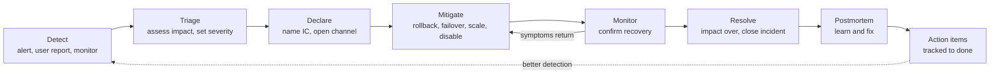

# Leadership: Leading Incidents

> The incident commander role, severity levels, incident roles, the first 15 minutes, deciding under uncertainty, communication cadence, handover, escalation, and what happens after the incident.

## Key Concepts

### Incident Lifecycle

Every incident moves through the same stages, whatever the cause. The goal of incident leadership is to move through **detect, triage, mitigate** as fast as possible, and only then to dig into the full root cause.



**Mitigate first, diagnose later.** Rolling back a bad deploy in five minutes is better than understanding the bug in thirty.

### The Incident Commander

The incident commander (IC) **coordinates**; they do not usually fix things themselves. The model comes from the Incident Command System used by emergency services and was adopted by tech companies for on-call.

The IC:

- Owns the incident until it is handed over or resolved.
- Sets and changes the severity.
- Assigns roles and tasks, and makes sure each task has one owner.
- Makes decisions when the team cannot agree, or when waiting costs more than being wrong.
- Keeps the communication cadence.
- Decides when the incident is mitigated and when it is resolved.

A common mistake is for the most senior engineer to become IC **and** the main debugger. In a big incident, those must be two different people.

### Severity Levels

Define severities **before** incidents happen, based on impact, not on how hard the fix is. A typical scale:

| Severity | Definition | Examples | Response |
| --- | --- | --- | --- |
| SEV1 | Critical: major user-facing outage, data loss, or security breach | Checkout down for all users; customer data exposed | Page IC and on-call immediately, 24x7, exec updates |
| SEV2 | Major: significant degradation or a key feature down for many users | 20% of API calls failing; one region down | Page on-call 24x7, IC assigned, stakeholder updates |
| SEV3 | Minor: limited impact, workaround exists | Slow admin page; one batch job delayed | Business hours, ticket |
| SEV4 | Low: no current user impact | Disk at 75%; a non-critical alert flapping | Normal backlog |

Rules of thumb:

- **When in doubt, go higher.** Downgrading is cheap; under-reacting is expensive.
- **Severity can change** during the incident. Announce it when it does.
- Tie severities to SLOs where possible, for example "error budget burning faster than 10x".

### Incident Roles

| Role | Responsibilities |
| --- | --- |
| Incident commander (IC) | Coordinates, decides, owns severity and cadence |
| Ops lead / technical lead | Leads the hands-on investigation and fixes; directs responders |
| Comms lead | Writes internal and external updates; manages the status page; shields the team from questions |
| Scribe | Keeps a timestamped log of facts, actions, and decisions in the channel or doc |
| Subject matter experts | Join on request for a specific system, such as the DB or network |

In a small incident one person may hold several roles. As the incident grows, the IC **splits** roles out. Say role assignments out loud: naming a specific person, for example "Dana, you are comms lead", is clearer than hoping someone picks it up.

### The First 15 Minutes

```text
0-2 min   Acknowledge the page. Look at the alert and the main dashboard.
2-5 min   Is it real? What is the user impact? Set an initial severity.
5-7 min   Declare: open the incident channel (e.g. #inc-2026-0142), start a bridge,
          announce "I am IC". Page more help if SEV1/SEV2.
7-10 min  Assign roles (ops lead, comms, scribe). First internal update.
10-15 min Check "what changed?" (deploys, config, infra, vendors). Pick the safest
          mitigation: rollback, failover, scale out, feature flag off.
```

Useful "what changed?" commands on AWS:

```bash
# Recent ECS deployments for a service
aws ecs describe-services --cluster prod --services orders \
  --query 'services[0].deployments[].{status:status,taskDef:taskDefinition,created:createdAt,rollout:rolloutState}'

# Recent API changes in the account (last hour)
aws cloudtrail lookup-events --start-time "$(date -u -d '-1 hour' +%FT%TZ)" \
  --query 'Events[].{time:EventTime,name:EventName,user:Username}' --max-results 50

# Is AWS itself having a problem?
aws health describe-events --region us-east-1 --filter eventStatusCodes=open
```

Note: the AWS Health API needs a Business-level or higher AWS Support plan; otherwise check the AWS Health Dashboard in the console.

### Deciding Under Uncertainty

You will rarely have full information. The IC's job is to make a reasonable, reversible decision fast.

- **Prefer reversible actions:** rollback, feature flag off, shift traffic, scale out.
- **State the hypothesis and the test:** "We think it's the 10:02 deploy. Rolling back. If errors don't drop in 5 minutes, we look at the DB."
- **Time-box investigation:** "Ten more minutes on this theory, then we fail over."
- **One change at a time** so you know what worked.
- **Ask for objections, then decide:** "Any reason not to roll back? ... OK, rolling back."
- **Write decisions in the log** with the reason.

### Communication Cadence

Updates should be **regular and predictable**, even if there is no news. Silence makes stakeholders panic and interrupt responders.

| Severity | Internal update | External / status page |
| --- | --- | --- |
| SEV1 | Every 15 to 30 minutes | Within ~15 to 30 minutes of declaring, then regularly |
| SEV2 | Every 30 to 60 minutes | If customers are visibly affected |
| SEV3 | Start and end | Usually none |

A simple update format:

```text
[SEV2] Orders API errors - update #3 - 10:45 UTC
Impact: ~30% of checkout requests failing since 10:06 UTC.
Status: Rolled back release 1.4.2 at 10:21; error rate falling, now ~2%.
Next steps: confirm full recovery; check queued orders.
Next update: 11:15 UTC or sooner if status changes.
IC: <name>   Comms: <name>
```

### Handover

Long incidents need handovers to avoid exhausted responders making mistakes.

- **Plan it:** for SEV1s, rotate IC and ops lead every few hours.
- **Handover brief:** current impact, severity, what is known, what has been tried, current hypothesis, open actions and owners, next update time.
- **Explicit transfer:** "As of 14:00 UTC, Dana is IC." Announce in the channel and update the incident record.
- **Outgoing IC stays** on the call for 10 to 15 minutes to answer questions, then rests.

### When to Escalate

Escalate **early**. Escalating and not needing help is cheap; not escalating and needing it is expensive.

- Impact is growing or severity should go up.
- No working hypothesis after a set time, for example 15 to 30 minutes on a SEV1 or SEV2.
- You need a system owner or vendor you cannot reach.
- Security or data exposure is suspected: bring in the security team immediately.
- A decision needs authority you do not have: taking a region offline, customer comms, legal.

### After the Incident

1. Confirm stability for an agreed time before declaring "resolved".
2. Send a final update with a short summary and next steps.
3. Clean up temporary fixes or put them on a ticket with an owner.
4. Assign the postmortem author and date (see [Writing postmortems](02-writing-postmortems.md)).
5. Thank responders by name in the channel, and check on anyone who worked late.

## Interview Questions

<details><summary>Q1. [Basic] What does an incident commander do?</summary>

**Answer:**

The incident commander coordinates the response. They do not usually debug. They:

- Set and update the severity.
- Assign roles: ops lead, comms lead, scribe, subject matter experts.
- Make sure every task has one owner and a time to report back.
- Make the call when people disagree or when waiting costs too much.
- Keep the communication cadence going.
- Decide when the incident is mitigated, resolved, and handed to postmortem.

The IC keeps the big picture so the people fixing things can focus. In small incidents the IC may also do hands-on work, but as soon as it grows, they step back and coordinate.

</details>

<details><summary>Q2. [Basic] How do you define incident severity levels?</summary>

**Answer:**

By **user and business impact**, not by how hard the fix is. I use four levels:

- **SEV1:** critical outage, data loss, or security breach. All hands, 24x7, exec updates.
- **SEV2:** major degradation or a key feature down for many users. Paged 24x7.
- **SEV3:** minor impact with a workaround. Business hours.
- **SEV4:** no current user impact. Backlog.

They should be written down with examples, agreed with product and support, and linked to SLOs where possible. The rule is "when in doubt, go higher"; you can always downgrade.

</details>

<details><summary>Q3. [Basic] What are the main roles in an incident, and why separate them?</summary>

**Answer:**

- **IC:** coordinates and decides.
- **Ops lead:** leads the technical investigation and fix.
- **Comms lead:** writes updates, runs the status page, handles stakeholder questions.
- **Scribe:** keeps the timestamped log.
- **SMEs:** join for specific systems.

Separating them stops one person from being overloaded. The person debugging should not be answering the VP's messages. The scribe's log also becomes the postmortem timeline for free.

</details>

<details><summary>Q4. [Intermediate] You are paged for a production alert. Walk me through your first 15 minutes. <em>(scenario)</em></summary>

**Answer:**

1. **Acknowledge** so others know someone has it.
2. **Check impact:** dashboards for error rate, latency, traffic. Is it real, and are users affected?
3. **Set severity** based on impact. If SEV1 or SEV2, **declare**: open `#inc-<id>`, start a bridge, say "I am IC".
4. **Get help and assign roles:** ops lead, comms, scribe.
5. **Send the first update** with impact, what we know, next update time.
6. **Ask "what changed?":** recent deploys, config changes, infra changes, vendor status.

```bash
aws ecs describe-services --cluster prod --services orders --query 'services[0].events[:10]'
aws cloudtrail lookup-events --start-time "$(date -u -d '-1 hour' +%FT%TZ)" --max-results 50
```

7. **Choose the safest mitigation:** usually roll back the latest change.

The aim at 15 minutes: everyone knows who is in charge, what the impact is, and what we are trying first.

</details>

<details><summary>Q5. [Intermediate] How often do you send updates during an incident, and what goes in them?</summary>

**Answer:**

On a fixed cadence: about every 15 to 30 minutes for SEV1, every 30 to 60 for SEV2. I always say when the next update will be, and I send it even if there is no news.

Each update has:

- Severity and title
- Current impact and when it started
- What we have done and what we are doing now
- Next steps
- Next update time
- IC and comms contacts

Internal updates can be technical. Status page updates are plain language, focused on what customers see, with no blame on vendors and no guesses about the cause. See [Stakeholder communication](05-stakeholder-communication.md).

</details>

<details><summary>Q6. [Intermediate] How do you hand over an incident to another incident commander?</summary>

**Answer:**

I give a structured brief, live on the call:

- Current severity and user impact
- Timeline highlights and what has been tried
- Current hypothesis and active work, with owners
- Pending decisions and risks
- Stakeholders waiting for updates and the next update time

Then I make the transfer explicit: "As of 02:00 UTC, Dana is IC." It goes in the channel and the incident record. I stay for 10 to 15 minutes for questions, then go offline properly so I can rest and come back fresh.

For long SEV1s, I plan rotations in advance rather than waiting until people are exhausted.

</details>

<details><summary>Q7. [Intermediate] When do you escalate during an incident?</summary>

**Answer:**

- Impact grows or the severity should go up.
- No working hypothesis after a fixed time, for example 15 to 30 minutes on a SEV2.
- We need a system owner, another team, or a vendor.
- Security or data exposure is possible. Then I bring in security straight away and stop making changes that could destroy evidence.
- The decision is above my authority: customer notifications, regional failover, legal or regulatory steps.

I tell teams escalating early is expected. Hero culture, where people try alone for hours, makes incidents longer.

</details>

<details><summary>Q8. [Advanced] Two senior engineers disagree on the fix during a SEV1. One wants to roll back, the other wants to hotfix forward. How do you decide? <em>(scenario)</em></summary>

**Answer:**

1. **Time-box the discussion:** "Two minutes each."
2. **Ask the key questions:**
   - Which option is more **reversible**?
   - Which is faster to reduce user impact?
   - What is the risk of each? Does rollback break a DB migration that already ran?
   - How confident are we in the root cause?
3. **Default to rollback** if it is safe, because it returns to a known-good state. A hotfix is new, untested code under pressure.
4. **Decide and say it clearly:** "We're rolling back. If the migration blocks rollback, we switch to the hotfix. Ops lead owns rollback; the second engineer prepares the hotfix in parallel as plan B."
5. **Log the decision and the reason.**

Running both paths in parallel, with one as backup, often removes the conflict. The postmortem can review the decision later without blame.

</details>

<details><summary>Q9. [Advanced] An incident might be a security breach. How does your incident process change? <em>(scenario)</em></summary>

**Answer:**

- **Bring in the security team immediately** and agree who leads. Usually security leads, with ops supporting.
- **Use a private channel** with need-to-know membership. Do not discuss details in public channels.
- **Preserve evidence:** take snapshots and copy logs before changes; do not terminate instances or delete resources without agreement.

```bash
# Example evidence capture before containment
aws ec2 create-snapshot --volume-id vol-0abc... --description "INC-142 forensic copy"
aws cloudtrail lookup-events --lookup-attributes AttributeKey=AccessKeyId,AttributeValue=AKIA... --max-results 50
```

- **Contain carefully:** for example, deactivate a leaked access key or isolate a security group, in a way agreed with security.
- **Legal and compliance:** may have notification deadlines, for example under GDPR. Comms must go through them.
- **Status page wording** is reviewed by legal and security before publishing.

The usual "fix fast" instinct can destroy evidence, so the IC must slow down and coordinate.

</details>

<details><summary>Q10. [Advanced] How would you set up an incident management process for a team that currently has none?</summary>

**Answer:**

1. **Write severity definitions** with product and support.
2. **Define roles** and a short IC checklist.
3. **Set up tooling:** paging (PagerDuty, Opsgenie, or similar), a channel naming convention, an incident record template, a status page.
4. **On-call rotation** with primary and secondary, and an escalation policy.
5. **Runbooks** for top alerts, linked from the alert itself.
6. **Train:** IC training and game days in non-production.
7. **Postmortem process** with action item tracking.
8. **Review monthly:** number of incidents by severity, MTTA, MTTR, action item closure.

I would start small, with clear severities, an IC role, and a channel template, then add pieces. A lightweight process people actually use beats a perfect one nobody follows.

</details>

<details><summary>Q11. [Advanced] The incident is resolved. What do you do in the next 24 to 48 hours?</summary>

**Answer:**

- **Confirm stability** over an agreed window before calling it resolved.
- **Final update** to stakeholders and on the status page.
- **Clean up** temporary fixes: scaled-up capacity, disabled alerts, feature flags. Each gets a ticket and owner if it cannot be undone right away.
- **Capture the timeline** from the scribe's log, chat, and alert history while fresh.
- **Assign a postmortem author** and a review date.
- **Check on people:** thank responders, make sure anyone who worked overnight takes time off.
- **Customer follow-up** with account managers if SLAs or credits are involved.

</details>

<details><summary>Q12. [Advanced] Tell me about an incident you led. What did you do as the leader?</summary>

**Answer:**

**How to structure it (STAR):**

- **Situation:** the system, the symptom, and the impact, in two sentences.
- **Task:** your role, for example IC, and the pressure: time, customers, visibility.
- **Action:** severity call, roles assigned, how you chose the mitigation, how you communicated, any escalation or handover.
- **Result:** time to mitigate, impact contained, and the main postmortem actions.

**Sample answer skeleton:**

- Situation: TODO (Siva): what broke, when it was detected, and who was affected.
- Task: TODO (Siva): your role and what you were responsible for.
- Action: TODO (Siva): first steps, roles you assigned, the key decision and why, how you kept stakeholders updated.
- Result: TODO (Siva): time to mitigate and resolve, plus follow-up fixes.
- Lesson: TODO (Siva): what you changed in the incident process afterwards.

**What a strong answer shows:** you coordinated rather than doing everything yourself, you made a clear decision with incomplete information, and you communicated on a cadence.

</details>

See also: [Writing postmortems](02-writing-postmortems.md), [SRE practices](../ops/03-sre.md), and [Production issues](../repetitive-questions/production-issues.md).
