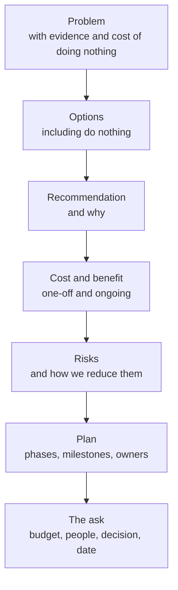

# Leadership: Stakeholder Communication

> Translating technical work for managers and the business, status updates, saying no and negotiating scope, managing expectations during incidents, presenting a proposal or business case, working with security, finance, and product, and writing for executives.

## Key Concepts

### Translating Technical Work

Stakeholders care about **outcomes**: risk, cost, speed, and customer experience. Translate the "what" into the "so what".

| Technical statement | Business translation |
| --- | --- |
| "We moved Terraform state to Azure Storage with blob lease locking." | "Two engineers can no longer accidentally overwrite each other's infrastructure changes, which caused an outage last quarter." |
| "We added canary deploys on AKS." | "Bad releases now affect about 10% of users for a few minutes instead of everyone until someone notices." |
| "We moved batch jobs to Spot node pools on AKS." | "Batch processing costs dropped by roughly X% with no change to delivery times." |
| "We have 200 open CVEs in base images." | "We have known security gaps that an auditor would flag; fixing the top 20 removes most of the real risk." |

A simple pattern: **what we did, why it matters, what it costs or saves, what we need from you.**

### Know Your Audience

| Stakeholder | What they care about | What to bring |
| --- | --- | --- |
| Engineering manager | Delivery, team health, risk | Progress, blockers, capacity trade-offs |
| Product manager | Features, dates, user impact | What it means for the roadmap; options |
| Security | Risk, compliance, evidence | Controls, scope, audit trail, exceptions |
| Finance | Spend, forecasts, commitments | Cost now vs later, savings, trend, renewal dates |
| Executives | Business outcome, risk, money, time | One-page summary, decision needed, recommendation |
| Support / customer success | What to tell customers | Plain impact, ETA, workaround |

### Status Updates

A good status update is short, regular, and honest. Use a fixed structure so people know where to look.

```text
Project: Logging platform migration - week 6 of 10
Status: AMBER (was GREEN)
Done this week: 12 of 20 services sending logs to the new index; dashboards ported.
Next week: remaining 8 services; alert migration.
Risks / blockers: Two services use a custom log format; needs 3 extra days.
Decision needed: Accept a 3-day slip, or drop the legacy-format services from phase 1?
```

- **RAG status** (Red, Amber, Green) with a one-line reason.
- **Bad news early.** An amber this week is better than a surprise red next month.
- **Show the trend:** "was green, now amber".
- **Always end with what you need**, even if it is "nothing".

### Saying No and Negotiating Scope

Saying no well is about **trade-offs, not refusal**. You rarely say "no"; you say "yes, if" or "not now, because".

- **Clarify the real goal:** "What problem does this solve, and by when?"
- **Show the cost:** "Taking this on delays the certificate automation by two weeks."
- **Offer options:**
  1. Do it now and move something else out.
  2. Do a smaller version now, the rest later.
  3. Do it next quarter.
- **Let the right person choose** (often the product or engineering manager) and write the decision down.

```text
"I understand the dashboard is needed for the board review. We can't build the full
version this sprint without dropping the patching work, which has an audit deadline.
Option A: a basic version with the three key metrics by Friday, full version in two weeks.
Option B: full version in two weeks, nothing this Friday.
I'd recommend A. Which works for you?"
```

### Managing Expectations During Incidents

- **Communicate on a cadence**, even with no news (see [Leading incidents](04-leading-incidents.md)).
- **Do not give an ETA you cannot back up.** Say "next update at 11:15" instead of "fixed in 10 minutes".
- **Separate facts from guesses:** "We know X. We think Y. We are testing Y now."
- **Plain language** for non-technical audiences: impact, workaround, next update.
- **One voice:** the comms lead, so different people do not give different stories.
- **Status page** for customers; reviewed wording for security incidents.

### Presenting a Proposal or Business Case



Tips:

- **Lead with the problem and the ask** on the first slide or first paragraph.
- **Quantify** where you honestly can: hours saved per month, incidents avoided, cost per month.
- **Show you considered alternatives**, including doing nothing.
- **Be honest about risks** and say how you will reduce them.
- **Pilot first** if the change is big: a small proof makes the case for you.

### Working with Security, Finance, and Product

- **Security:** involve them early, at design time, not at go-live. Bring a clear data flow, an identity and access model (Entra ID, Azure RBAC, Managed Identity), and a logging plan. Treat their requirements as constraints, not obstacles, and ask "what control would make you comfortable?".
- **Finance:** speak in monthly cost, forecast, and commitments. Tag resources so costs map to teams. Flag renewals and price changes early. Show savings with before and after numbers.
- **Product:** share a reliability roadmap with them. Use SLOs and error budgets to agree when reliability work takes priority over features.

### Writing for Executives

- **Bottom line up front (BLUF):** the first sentence says the conclusion or the decision needed.
- **One page.** Details go in an appendix or link.
- **Numbers over adjectives:** "4 hours of downtime, ~X orders affected" not "a significant outage".
- **Options with a recommendation**, not an open question.
- **No jargon:** say "cloud servers", not "VMs in a VM Scale Set", unless they use those terms.

```text
Subject: Decision needed by Friday - logging platform renewal

Recommendation: Renew for 12 months at the current tier and start a cost-reduction
project; do not move vendors this year.

Why: Moving now would take ~3 months of two engineers' time and risk losing audit
logs during the switch. Reducing ingest volume can cut the bill by an estimated X%.

Ask: Approve the renewal by Friday so the contract does not lapse on <date>.
Details: <link to one-page cost analysis>
```

## Interview Questions

<details><summary>Q1. [Basic] How do you explain a technical change to a non-technical manager?</summary>

**Answer:**

I start with the outcome they care about, not the technology. I use the pattern: **what we did, why it matters, what it costs or saves, what we need from them.**

Example: "We added an automatic check before each release. If a release is bad, only a small share of users see it for a few minutes and it rolls back on its own. Last quarter two bad releases caused 40-minute outages; this would have cut them to minutes."

I avoid jargon, use one simple analogy if it helps, and check understanding by asking what questions they have, not "does that make sense?".

</details>

<details><summary>Q2. [Basic] What makes a good status update?</summary>

**Answer:**

- A fixed structure: status (RAG), done, next, risks, decisions needed.
- Short: readable in under a minute.
- Honest: bad news early, with a reason and a plan.
- Trend: "amber, was green last week".
- An explicit ask, even if the ask is "nothing needed".

Sent on a regular schedule so people stop chasing for updates.

</details>

<details><summary>Q3. [Basic] What does "bottom line up front" mean when writing for executives?</summary>

**Answer:**

It means the first sentence or two says the conclusion or the decision needed. Background and detail come after, or in a link.

Executives read quickly and may stop after the first paragraph. If the ask is in paragraph five, it gets missed.

Example opening: "Recommendation: approve one extra engineer for three months to automate patching; this removes our biggest audit finding before the Q3 audit."

</details>

<details><summary>Q4. [Intermediate] A product manager asks you to add an urgent request to a full sprint. How do you handle it? <em>(scenario)</em></summary>

**Answer:**

1. **Understand the goal and deadline:** what problem it solves, and what happens if it is late.
2. **Make the trade-off visible:** "This is about four days of work. To fit it, we would move out the alert tuning or the module upgrade."
3. **Offer options:** smaller version now, full version later, or swap with an existing item.
4. **Let the PM or manager decide** the priority, since it is their call, and I give my recommendation.
5. **Write the decision down** in the ticket or sprint notes so it is clear later why something slipped.

I do not just say yes and quietly overload the team, and I do not just say no. I make the cost clear and help them choose.

</details>

<details><summary>Q5. [Intermediate] How do you communicate with stakeholders during a major incident?</summary>

**Answer:**

- A named **comms lead** speaks for the incident, so responders can focus.
- **Fixed cadence**, for example every 30 minutes for SEV1, with the next update time in each message.
- **Facts vs guesses:** "We know checkout is failing for about 30% of users. We believe a release caused it. We are rolling back now."
- **No unsupported ETAs.**
- **Different messages for different audiences:** technical in the incident channel, plain language for support and leadership, customer-facing wording on the status page.
- **Final summary** at the end with impact, cause in plain terms, and next steps.

</details>

<details><summary>Q6. [Intermediate] How do you work effectively with a security team that keeps blocking releases? <em>(scenario)</em></summary>

**Answer:**

- **Understand their concerns:** ask which risks they are worried about and what evidence they need.
- **Involve them earlier:** invite them to design reviews and share threat models before build, not at release.
- **Automate their checks in the pipeline:** image scanning, IaC scanning, secret detection, so issues are found at PR time.

```bash
trivy image --severity HIGH,CRITICAL --exit-code 1 my-app:1.4.2
checkov -d infra/ --compact
```

- **Agree an exception process** with time-limited, documented risk acceptance.
- **Agree measurable gates:** for example "no critical CVEs with a fix available" instead of "security approval".

The goal is to turn a manual gate into a shared, automated standard, so both teams get what they need.

</details>

<details><summary>Q7. [Intermediate] How do you work with finance on cloud cost?</summary>

**Answer:**

- **Speak their language:** monthly spend, forecast, variance, commitments, renewal dates.
- **Make costs attributable:** tagging standards (team, service, environment) enforced in IaC, and cost reports by tag.
- **Explain changes before they appear on the bill:** "Spend will rise about X% next month because of the new region; it is in the plan."
- **Bring savings with evidence:** before and after numbers, not estimates only.
- **Plan commitments together:** Savings Plans or reserved capacity need finance sign-off and a usage forecast.

See also [FinOps](../ops/04-finops.md) and [Monitoring cost](../monitoring-tools/10-monitoring-cost-finops.md).

</details>

<details><summary>Q8. [Advanced] You want budget to replace a manual deployment process with a proper pipeline. How do you build the business case? <em>(scenario)</em></summary>

**Answer:**

1. **Problem with evidence:** how many manual deploys per month, hours each, failure rate, incidents caused by manual steps, and lead time for changes.
2. **Cost of doing nothing:** engineer hours times rate, incident impact, audit risk, slower delivery.
3. **Options:** do nothing; partial automation; full pipeline with approvals and rollback.
4. **Recommendation** with cost: engineer weeks, tooling, ongoing maintenance.
5. **Benefit:** hours saved per month, fewer failed changes, faster delivery, audit trail. Show a simple payback period.
6. **Risks and mitigation:** pilot on one service first; keep a manual fallback during rollout.
7. **The ask:** "Two engineers for six weeks, decision by end of month."

I keep the main document to one page and put calculations in an appendix. Where numbers are estimates, I say so and give ranges.

</details>

<details><summary>Q9. [Advanced] Leadership wants a date for a large migration you think is unrealistic. What do you do? <em>(scenario)</em></summary>

**Answer:**

- **Show the reasoning, not just the feeling:** break down the work, dependencies, team capacity, and risks.
- **Offer options:**
  - Keep the date with reduced scope (migrate the critical services first).
  - Keep the scope with a later date.
  - Keep both with extra people or budget, and say what that risks.
- **Give ranges and confidence:** "70% confident in end of Q3, 90% in mid Q4."
- **Name what would change the estimate:** "If the vendor API is ready by month one, we gain two weeks."
- **Agree and write down** the chosen option, then report against it with RAG status.

I would not agree to a date I do not believe in just to avoid a hard conversation. Surprises later damage trust far more.

</details>

<details><summary>Q10. [Advanced] How do you write a one-page update for executives after a major outage?</summary>

**Answer:**

```text
Summary: On <date>, checkout was unavailable for 42 minutes for ~30% of users.
         Service is fully restored. No data was lost.
Impact:  ~X failed orders, Y support tickets, SLA credits for Z customers.
Cause:   A configuration change was released without an automated check that
         would have stopped it.
Fixes:   1) Automated pre-release check - done.
         2) Automatic rollback on error spike - due <date>.
         3) Review of all similar manual steps - due <date>.
Ask:     None / approve two weeks of reliability work in the next sprint.
```

Rules: bottom line first, numbers not adjectives, plain words, no blame on individuals, and a clear list of fixes with dates. Technical details go in the linked postmortem. The numbers above are placeholders.

</details>

<details><summary>Q11. [Advanced] Tell me about a time you had to push back on a stakeholder.</summary>

**Answer:**

**How to structure it (STAR):**

- **Situation:** who the stakeholder was (role, not name), and what they asked for.
- **Task:** why you needed to push back: risk, capacity, cost, compliance.
- **Action:** how you understood their goal, the trade-off you showed, the options you offered, and how the decision was made and recorded.
- **Result:** what was delivered, how the relationship held up, and any measurable outcome.

**Sample answer skeleton:**

- Situation: TODO (Siva): the request and the context.
- Task: TODO (Siva): why it was a problem and what you were responsible for.
- Action: TODO (Siva): the conversation, the options you offered, data you used.
- Result: TODO (Siva): the outcome and the relationship afterwards.
- Lesson: TODO (Siva): what you would do the same or differently.

**What a strong answer shows:** you understood their goal, you offered options rather than a flat no, and you kept the relationship good.

</details>

<details><summary>Q12. [Advanced] Tell me about a proposal you presented that was approved or rejected.</summary>

**Answer:**

**How to structure it (STAR):**

- **Situation:** the problem and why it needed a decision.
- **Task:** your role in building and presenting the case.
- **Action:** how you gathered evidence, the options and costs you compared, how you tailored it to the audience, and how you handled objections.
- **Result:** the decision, what happened after, and what you learned. A rejected proposal can be a strong answer if you show what you learned.

**Sample answer skeleton:**

- Situation: TODO (Siva): the problem and the audience.
- Task: TODO (Siva): what you were asking for.
- Action: TODO (Siva): evidence, options, cost and benefit, how you presented it.
- Result: TODO (Siva): approved or rejected, and the measurable outcome.
- Lesson: TODO (Siva): what you would change next time.

**What a strong answer shows:** a clear problem, honest numbers, alternatives, and a specific ask.

</details>

See also: [Leading incidents](04-leading-incidents.md) and [Architecture decision records](01-architecture-decision-records.md).
