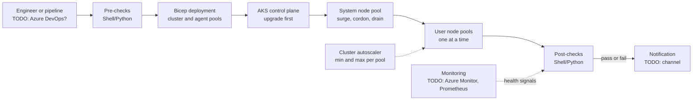

# My Projects: AKS Node Pools and Zero-Downtime Upgrades

> STAR template for the project where you managed AKS node pools, the cluster autoscaler, and rolling, zero-downtime Kubernetes version upgrades with Bicep and Shell/Python scripts, with an architecture sketch and likely follow-up questions.

## Key Concepts

Lines marked **From resume:** repeat a claim that is already on your resume. Everything else is a `TODO (Siva):` for you to fill in with real facts.

### Situation

Guiding prompts: Which clusters and environments were in scope? How were upgrades done before? Were there outages, failed upgrades, or clusters falling out of the supported Kubernetes version window? What kind of workloads ran on the clusters?

- TODO (Siva): which employer (Impressico or Infosys) and roughly when.
- TODO (Siva): the clusters in scope: how many, which environments, how many node pools, what workloads.
- TODO (Siva): how upgrades and node pool changes were done before, and what went wrong (a concrete example helps).
- TODO (Siva): why it mattered: customers affected, support deadlines, audit needs.

### Task

Guiding prompts: What were you asked to do, or what did you take on yourself? What were the constraints: maintenance windows, change approvals, team size, budget?

- **From resume:** manage AKS node pools, the cluster autoscaler, and rolling updates, and run zero-downtime Kubernetes version upgrades.
- TODO (Siva): your exact responsibility vs the rest of the team.
- TODO (Siva): constraints and stakeholders (application teams, change board, on-call).

### Action

Guiding prompts: What did you build or change, step by step? How did the Bicep and the scripts split the work? How did you protect running workloads during node drain? Which options did you reject?

- **From resume:** used Bicep together with Shell/Python scripts to upgrade node pools in a controlled way.
- TODO (Siva): step 1, for example pre-upgrade checks (version support, deprecated APIs, PodDisruptionBudgets, quota).
- TODO (Siva): step 2, for example the order: control plane first, then node pools one at a time, and how the scripts waited and checked health.
- TODO (Siva): step 3, for example surge settings, autoscaler min/max per node pool, and system vs user pools.
- TODO (Siva): step 4, for example testing in a lower environment and the runbook for production.
- TODO (Siva): a trade-off you made (for example in-place upgrade vs a new blue/green node pool) and why.
- TODO (Siva): a problem you hit (for example a drain blocked by a PDB) and how you solved it.

### Result

Guiding prompts: What measurably improved? Think about availability during upgrades, upgrade duration, manual steps removed, failed upgrades, and how far behind the supported versions the clusters were.

- **From resume:** 99.9% availability on AKS.
- TODO (Siva): confirm how the 99.9% was measured: which SLI, over what time window, and from which tool.
- TODO (Siva): other outcomes with a number or honest estimate (upgrade time, manual steps removed).
- TODO (Siva): what you would do differently next time.

### Architecture

The diagram below is a generic skeleton. Replace each placeholder with your real components and remove anything that did not exist.

TODO (Siva): replace this with the real flow and add a two-line explanation of each arrow.

### Tech stack

- **From resume:** AKS, Bicep, Shell, Python.
- TODO (Siva): where the scripts ran (pipeline agent, jump box) and how they authenticated to Azure.
- TODO (Siva): monitoring used to prove the upgrade did not cause downtime.
- TODO (Siva): AKS version range you upgraded between, and the node OS (Ubuntu or Azure Linux).

## Interview Questions

Q1. [Basic] Give me a two-minute overview of this project.

**Answer:**

TODO (Siva): your two-minute STAR summary.

**Hints:** keep Situation and Task short; spend most of the time on what you did and end with the 99.9% availability and how you measured it.

Q2. [Intermediate] Walk me through one node pool upgrade, step by step, as your process ran it.

**Answer:**

TODO (Siva): the real sequence your scripts followed, from pre-checks to post-checks.

**Hints:** a strong answer covers the control plane before node pools, surge nodes added first, each old node cordoned and drained, Pods rescheduled, and health checks before moving to the next pool. Know the difference between a Kubernetes version upgrade and a node image upgrade.

Q3. [Intermediate] Why did you use Bicep plus Shell/Python scripts, instead of only <code>az aks upgrade</code> or an auto-upgrade channel?

**Answer:**

TODO (Siva): explain what Bicep owned and what the scripts owned, and why.

**Hints:** a strong answer says Bicep holds the desired state (for example the version and settings of each agent pool) while scripts handle ordering, waiting, and validation. Mention the options you rejected, such as auto-upgrade channels with a planned maintenance window, and why.

Q4. [Intermediate] How did you make sure applications stayed up while nodes were drained?

**Answer:**

TODO (Siva): the workload rules you required or checked before an upgrade.

**Hints:** mention at least two replicas, PodDisruptionBudgets, readiness probes, and spreading Pods across nodes or zones. Know that a PDB that allows zero disruptions blocks the drain and stalls the upgrade.

Q5. [Intermediate] How did you set up node pools and the cluster autoscaler?

**Answer:**

TODO (Siva): your node pool layout, min and max counts, and any autoscaler profile changes.

**Hints:** cover system vs user node pools, why each pool had its min and max, and how surge nodes during an upgrade relate to subscription quota and the autoscaler.

Q6. [Advanced] An upgrade gets stuck halfway because one node will not drain. What do you do? <em>(scenario)</em>

**Answer:**

TODO (Siva): what you check first and how you recover, ideally from a real case.

**Hints:** a strong answer covers finding the blocking Pod or PDB with <code>kubectl get pdb -A</code> and events, checking the node pool provisioning state, and knowing that a Kubernetes version upgrade cannot be rolled back in place, so the fallback is a fix-forward or a new node pool.

Q7. [Advanced] How did you check for deprecated or removed Kubernetes APIs before a version upgrade?

**Answer:**

TODO (Siva): the checks you ran on manifests, Helm releases, and the live cluster.

**Hints:** mention scanning manifests and Helm releases for removed APIs, reading the AKS release notes, and that AKS can stop an upgrade when it sees recent use of deprecated APIs.

Q8. [Advanced] How exactly did you measure the 99.9% availability?

**Answer:**

TODO (Siva): the SLI, the time window, the data source, and what counted as downtime.

**Hints:** 99.9% over 30 days allows about 43 minutes of downtime. Say whether the number came from synthetic checks, request success rate, or the AKS uptime SLA, and be honest if it is an estimate.

Q9. [Advanced] If you did this project again, what would you change?

**Answer:**

TODO (Siva): one or two honest improvements.

**Hints:** pick a real limitation, for example manual steps that stayed manual or a check you added only after a problem, and say what you learned.

See also: [Kubernetes upgrades and deployments](../kubernetes/07-deployments-upgrades-cicd.md), [Scheduling and autoscaling](../kubernetes/05-scheduling-resources-autoscaling.md), and [Bicep fundamentals](../bicep/01-fundamentals-and-structure.md).
