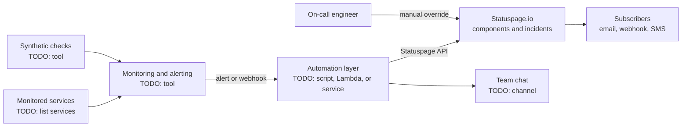

# My Projects: Statuspage.io Monitoring Improvements

> STAR template for the project that improved how service health is monitored and reported through Statuspage.io, with an architecture sketch and likely follow-up questions.

## Key Concepts

### Situation

Guiding prompts: What did status reporting look like before? Who used the status page (customers, internal teams, support)? What was going wrong: late updates, manual updates, wrong component status, noisy or missing alerts?

- TODO (Siva): describe the system and how Statuspage.io was used before the project.
- TODO (Siva): the main problem, with a concrete example if you have one (for example a time the status page was out of date during an incident).
- TODO (Siva): why it mattered to the business or customers.

### Task

Guiding prompts: What exactly were you asked to do, or what did you decide to take on? What were the constraints: time, tools, approvals, team size?

- TODO (Siva): your responsibility and goal.
- TODO (Siva): constraints and who the stakeholders were.

### Action

Guiding prompts: What did you build or change, step by step? Which options did you consider? How did you map monitors to status page components? How did you avoid false status changes? Who did you work with?

- TODO (Siva): step 1, for example how you reviewed existing monitors and components.
- TODO (Siva): step 2, for example the integration or automation you built.
- TODO (Siva): step 3, for example testing, rollout, and runbooks.
- TODO (Siva): a trade-off you made and why.
- TODO (Siva): a problem you hit and how you solved it.

### Result

Guiding prompts: What measurably improved? Think about time to update the status page, number of manual updates, accuracy, support tickets, customer feedback, alert noise.

- TODO (Siva): the main outcome with a number or honest estimate.
- TODO (Siva): adoption or feedback from other teams.
- TODO (Siva): what you would do differently next time.

### Architecture

The diagram below is a generic skeleton. Replace each placeholder with your real components and remove anything that did not exist.

TODO (Siva): replace this with the real flow and add a two-line explanation of each arrow.

### Tech stack

- TODO (Siva): monitoring and alerting tool(s)
- TODO (Siva): automation language or runtime
- TODO (Siva): where the automation runs and how it is deployed
- TODO (Siva): how secrets such as the Statuspage API key are stored
- TODO (Siva): IaC or pipeline used, if any

## Interview Questions

Q1. [Basic] Give me a two-minute overview of this project.

**Answer:**

TODO (Siva): your two-minute STAR summary.

**Hints:** keep Situation and Task short; spend most of the time on what you did and one number in the Result.

Q2. [Intermediate] How did you decide which monitors should change which status page components?

**Answer:**

TODO (Siva): explain your mapping between alerts and components.

**Hints:** a strong answer covers mapping by user-facing impact rather than by internal service, and how partial outages vs degraded performance were distinguished.

Q3. [Intermediate] How did you prevent false or flapping status changes on a customer-facing page?

**Answer:**

TODO (Siva): describe thresholds, delays, confirmation steps, or human approval you used.

**Hints:** mention things like requiring several failed checks or a time window before changing status, and keeping a human in the loop for customer wording.

Q4. [Intermediate] Was the status page updated automatically, manually, or both? Why?

**Answer:**

TODO (Siva): explain the split between automation and human updates.

**Hints:** strong answers explain the trade-off between speed and accuracy, and who owns the wording of incident messages.

Q5. [Intermediate] How did you secure and manage the Statuspage API credentials?

**Answer:**

TODO (Siva): where the key lives, who can access it, and how it is rotated.

**Hints:** mention a secrets store rather than code or pipeline variables in plain text, least privilege, and rotation.

Q6. [Advanced] What happens if your monitoring or automation itself fails during an incident? <em>(scenario)</em>

**Answer:**

TODO (Siva): describe the fallback and how you would notice the automation is broken.

**Hints:** a strong answer covers monitoring the monitor (heartbeat or dead-man alert) and a documented manual process for updating the page.

Q7. [Advanced] How did you measure that the project actually improved things?

**Answer:**

TODO (Siva): the metrics you tracked before and after.

**Hints:** before and after numbers, for example time from incident start to first status update, and how you collected them.

Q8. [Advanced] How did you get support, on-call, and product teams to agree on the new process?

**Answer:**

TODO (Siva): who you involved, any disagreement, and how it was resolved.

**Hints:** show influence: how you gathered input, wrote it down (runbook or ADR), and trained people.

Q9. [Advanced] If you did this project again, what would you change?

**Answer:**

TODO (Siva): one or two honest improvements.

**Hints:** pick a real limitation and say what you learned from it; avoid "nothing".

See also: [Leading incidents](../leadership/04-leading-incidents.md) and [Stakeholder communication](../leadership/05-stakeholder-communication.md).
