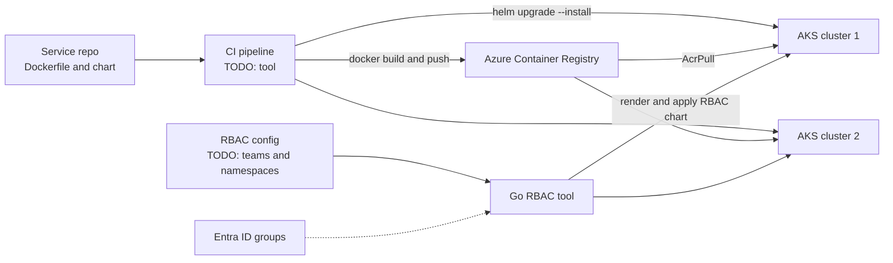

# My Projects: Docker, ACR, and Helm Standards with Go-Based RBAC Automation

> STAR template for the project where you standardised Docker builds, Azure Container Registry, and Helm deployments, and wrote a Go tool that automates Kubernetes RBAC through Helm across clusters, with an architecture sketch and likely follow-up questions.

## Key Concepts

Lines marked **From resume:** repeat a claim that is already on your resume. Everything else is a `TODO (Siva):` for you to fill in with real facts.

### Situation

Guiding prompts: How did teams build images and deploy to Kubernetes before? Were Dockerfiles, tags, and charts different per team? How was access to clusters granted, and what went wrong (too much access, slow requests, drift between clusters)?

- TODO (Siva): which employer (Impressico or Infosys) and roughly when.
- TODO (Siva): how many services, teams, and clusters were involved.
- TODO (Siva): the problem with builds and deployments before standardisation.
- TODO (Siva): the problem with RBAC before the automation (a concrete example helps).

### Task

Guiding prompts: What were you asked to do, or what did you take on? Who had to adopt the standard? What were the constraints?

- **From resume:** standardise Docker, ACR, and Helm usage, and automate Kubernetes RBAC with Helm across clusters using Go.
- TODO (Siva): your exact responsibility vs the rest of the team.
- TODO (Siva): constraints and stakeholders (application teams, security, platform owners).

### Action

Guiding prompts: What did the standard include? What did the Go tool do, step by step? How did it reach each cluster and authenticate? How did you test changes before rollout?

- **From resume:** wrote the Helm-based Kubernetes RBAC automation in Go and ran it across clusters.
- TODO (Siva): step 1, for example the Docker build standard (base images, multi-stage builds, tagging) and the ACR push flow.
- TODO (Siva): step 2, for example a shared Helm chart or library chart and per-environment values.
- TODO (Siva): step 3, what the Go tool read as input (for example a YAML file of teams and namespaces) and how it rendered and applied the RBAC chart.
- TODO (Siva): step 4, how it was run (pipeline, schedule, manual) and how changes were reviewed.
- TODO (Siva): a trade-off you made and why (for example Go vs Bash, or Kubernetes RBAC vs Azure RBAC for Kubernetes).
- TODO (Siva): a problem you hit and how you solved it.

### Result

Guiding prompts: What measurably improved? Think about time to grant access, number of manual RoleBindings removed, onboarding time for a new service, failed deployments, and audit findings.

- TODO (Siva): the main outcome with a number or honest estimate.
- TODO (Siva): adoption: how many teams, services, or clusters used the standard and the tool.
- TODO (Siva): what you would do differently next time.

### Architecture

The diagram below is a generic skeleton. Replace each placeholder with your real components and remove anything that did not exist.

TODO (Siva): replace this with the real flow and add a two-line explanation of each arrow.

### Tech stack

- **From resume:** Docker, Azure Container Registry, Helm, Kubernetes RBAC, Go, AKS.
- TODO (Siva): Go libraries used (for example the Helm Go SDK or client-go), if any.
- TODO (Siva): CI/CD tool that built images and ran the Go tool.
- TODO (Siva): how the tool authenticated to each cluster.

## Interview Questions

Q1. [Basic] Give me a two-minute overview of this project.

**Answer:**

TODO (Siva): your two-minute STAR summary.

**Hints:** split the story clearly into the build and deploy standard and the RBAC automation; spend most of the time on what you did.

Q2. [Intermediate] What did "standardising Docker, ACR, and Helm" mean in practice?

**Answer:**

TODO (Siva): the concrete rules, templates, or shared files you introduced.

**Hints:** a strong answer names specifics, such as approved base images, immutable image tags (for example the Git commit SHA), a shared chart with per-environment values files, and one pipeline template.

Q3. [Intermediate] How did AKS pull images from ACR, and how did pipelines push to it?

**Answer:**

TODO (Siva): the identities and roles used for pull and push.

**Hints:** mention that attaching ACR to AKS gives the kubelet identity the <code>AcrPull</code> role, that pipelines push with an identity holding <code>AcrPush</code>, and that the ACR admin user should stay disabled.

Q4. [Intermediate] Why did you write the RBAC automation in Go instead of Bash or plain Helm commands?

**Answer:**

TODO (Siva): your real reasons and the options you considered.

**Hints:** a strong answer covers trade-offs: a single binary, typed config, better error handling, and running across many clusters in parallel, against the cost of the team needing Go skills to maintain it.

Q5. [Intermediate] Which RBAC objects did the chart create, and how were they mapped to people?

**Answer:**

TODO (Siva): the Roles, ClusterRoles, and bindings, and who they were bound to.

**Hints:** cover namespace-scoped Role and RoleBinding vs cluster-wide ClusterRole and ClusterRoleBinding, and binding to Entra ID group object IDs instead of single users when AKS uses Entra ID integration.

Q6. [Advanced] How did the tool authenticate to many clusters safely?

**Answer:**

TODO (Siva): how credentials were fetched, stored, and limited.

**Hints:** mention getting kubeconfig with <code>az aks get-credentials</code> and kubelogin for Entra ID clusters, a pipeline identity using workload identity federation or a managed identity, disabled local accounts, and least privilege for the tool itself.

Q7. [Advanced] After an RBAC rollout, a team says they lost access. How do you find and fix the cause? <em>(scenario)</em>

**Answer:**

TODO (Siva): your steps, ideally from a real case.

**Hints:** a strong answer uses <code>kubectl auth can-i --as</code> to test, <code>helm history</code> and <code>helm rollback</code> to recover fast, and then adds a check (for example a dry run or diff in the pipeline) so it does not happen again.

Q8. [Advanced] How did you stop people from creating RoleBindings by hand and causing drift?

**Answer:**

TODO (Siva): how you detected and prevented manual changes.

**Hints:** mention that Helm owns the objects, a regular diff or reconcile run, limiting who can create bindings, and policy tools such as Azure Policy for AKS if you used them.

Q9. [Advanced] If you did this project again, what would you change?

**Answer:**

TODO (Siva): one or two honest improvements.

**Hints:** pick a real limitation, for example GitOps instead of a push-based tool, and say what you learned.

See also: [Helm security and CI/CD](../helm/04-security-cicd-and-troubleshooting.md), [Kubernetes RBAC and secrets](../kubernetes/06-security-rbac-secrets.md), and [Docker security and CI/CD](../docker/05-security-ci-cd-and-deployments.md).
