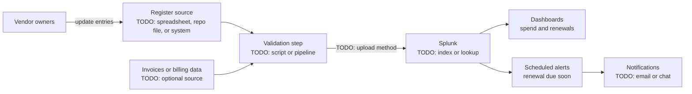

# My Projects: Vendor Cost and Renewal Register Feeding Splunk

> STAR template for the project that built a vendor cost and renewal register and fed it into Splunk for visibility and alerting, with an architecture sketch and likely follow-up questions.

## Key Concepts

### Situation

Guiding prompts: How were vendor costs and renewal dates tracked before? Who needed this information (finance, engineering managers, procurement)? Were renewals ever missed, or costs surprising?

- TODO (Siva): describe how vendor and tool costs were tracked before the project.
- TODO (Siva): the main pain, for example a renewal noticed too late or no single view of spend.
- TODO (Siva): why it mattered: money, risk, or audit.

### Task

Guiding prompts: What were you asked to build, or what did you propose? Who were the users of the register? What constraints did you have?

- TODO (Siva): your responsibility and goal.
- TODO (Siva): stakeholders and constraints, for example data sensitivity or who can see costs.

### Action

Guiding prompts: Where did the source data come from? How was it structured and validated? How did it reach Splunk? What dashboards and alerts did you build? How did you keep it up to date?

- TODO (Siva): how you designed the register (fields, owner, format).
- TODO (Siva): how data is loaded into Splunk and how often.
- TODO (Siva): dashboards and alerts you built, for example upcoming renewals.
- TODO (Siva): a trade-off you made and why.
- TODO (Siva): a problem you hit and how you solved it.

### Result

Guiding prompts: Did any renewal get caught in time? Did you find savings? How many people or teams use it? Did it reduce manual work?

- TODO (Siva): the main outcome with a number or honest estimate.
- TODO (Siva): adoption and feedback.
- TODO (Siva): what you would do differently.

### Architecture

The diagram below is a generic skeleton. Replace each placeholder with your real components and remove anything that did not exist.

TODO (Siva): replace this with the real flow and explain how often each step runs.

### Tech stack

- TODO (Siva): where the register lives and its format
- TODO (Siva): how data gets into Splunk, for example lookup file, HEC, or forwarder
- TODO (Siva): automation language and where it runs
- TODO (Siva): Splunk dashboards and alert types used
- TODO (Siva): access control for cost data

## Interview Questions

Q1. [Basic] Give me a two-minute overview of this project.

**Answer:**

TODO (Siva): your two-minute STAR summary.

**Hints:** lead with the business problem (missed renewals or unclear spend), then what you built, then one number.

Q2. [Intermediate] What fields did the register hold, and who owned each entry?

**Answer:**

TODO (Siva): list the main fields and the ownership model.

**Hints:** strong answers mention a named owner per vendor, renewal date, notice period, cost, and cost centre, and explain why ownership is what keeps the data accurate.

Q3. [Intermediate] How did the data get into Splunk, and why did you choose that method?

**Answer:**

TODO (Siva): the ingestion method and the reason.

**Hints:** compare options such as a lookup table vs events in an index, and explain the trade-off for data that changes slowly.

Q4. [Intermediate] How did you alert on upcoming renewals without creating noise?

**Answer:**

TODO (Siva): the alert logic, schedule, and who receives it.

**Hints:** mention alerting based on the notice period rather than the renewal date, and sending to the vendor owner rather than a broad list.

Q5. [Intermediate] How did you validate the data and handle bad or missing entries?

**Answer:**

TODO (Siva): validation rules and what happens when a row fails.

**Hints:** a strong answer covers required fields, date format checks, and a visible "data quality" panel or report.

Q6. [Advanced] Cost data is sensitive. How did you control who could see it?

**Answer:**

TODO (Siva): access control in the source and in Splunk.

**Hints:** mention role-based access to the index or app, and limiting raw contract details to those who need them.

Q7. [Advanced] How did you get finance and other teams to trust and use the register?

**Answer:**

TODO (Siva): how you involved finance or procurement and drove adoption.

**Hints:** show stakeholder work: agreeing definitions, reconciling with their numbers, and a clear owner for upkeep.

Q8. [Advanced] What business impact did the register have?

**Answer:**

TODO (Siva): savings, avoided auto-renewals, or time saved, with honest numbers.

**Hints:** one concrete example, such as a renewal you renegotiated or cancelled in time, is more convincing than a general claim.

Q9. [Advanced] If the register grew to cover the whole organisation, what would you change?

**Answer:**

TODO (Siva): how you would scale the design.

**Hints:** think about moving from a manual source to a system of record, integrating billing APIs, and automating ownership checks.

See also: [FinOps](../ops/04-finops.md), [Stakeholder communication](../leadership/05-stakeholder-communication.md), and [Logging](../monitoring-tools/04-logging.md).
