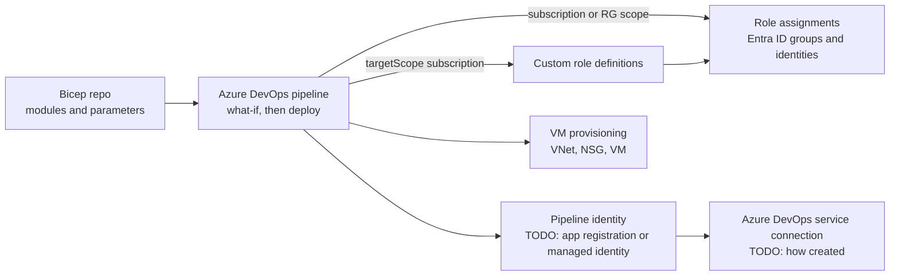

# My Projects: Least-Privilege Azure RBAC and Provisioning with Bicep

> STAR template for the project where you built reusable Bicep modules for custom roles and RBAC assignments to replace broad Owner and Contributor grants, and automated Azure DevOps service connections and VM provisioning with Bicep, with an architecture sketch and likely follow-up questions.

## Key Concepts

Lines marked **From resume:** repeat a claim that is already on your resume. Everything else is a `TODO (Siva):` for you to fill in with real facts.

### Situation

Guiding prompts: Who had Owner or Contributor, and at which scope? Why was that a risk (audit finding, incident, compliance)? How were service connections and VMs created before, and how long did a new environment take?

- TODO (Siva): which employer (Impressico or Infosys) and roughly when.
- TODO (Siva): how access was granted before, with a concrete example of over-privilege.
- TODO (Siva): how service connections and VMs were provisioned before, and how long it took.
- TODO (Siva): why it mattered (security review, audit, speed of onboarding).

### Task

Guiding prompts: What were you asked to do, or what did you take on? Which subscriptions and teams were in scope? What were the constraints?

- **From resume:** replace broad Owner and Contributor grants with least-privilege access using reusable Bicep modules for custom role definitions and RBAC assignments at subscription and resource group scope.
- **From resume:** automate Azure DevOps service connections and VM provisioning with Bicep.
- TODO (Siva): your exact responsibility vs the rest of the team, and the constraints.

### Action

Guiding prompts: How were the modules structured? How did you decide which permissions each role needed? How did you roll out the change without breaking pipelines or people? Which part of the service connection work did Bicep do, and which part used the Azure DevOps CLI or REST API?

- **From resume:** built reusable Bicep modules for custom role definitions and role assignments at subscription and resource group scope.
- TODO (Siva): step 1, how you found out what permissions each team and pipeline really used.
- TODO (Siva): step 2, the module design (parameters, scopes, naming, where the modules were stored and versioned).
- TODO (Siva): step 3, how service connections were automated (identity, federated credential or secret, role assignment, and the Azure DevOps side).
- TODO (Siva): step 4, the VM provisioning modules and pipeline.
- TODO (Siva): how you rolled out the access change (pilot team, communication, rollback plan).
- TODO (Siva): a trade-off you made and a problem you hit.

### Result

Guiding prompts: What measurably improved? Think about provisioning time, number of Owner and Contributor grants removed, audit findings, and time to onboard a new team or environment.

- **From resume:** environment provisioning more than 70% faster with Bicep.
- TODO (Siva): confirm how the 70% was measured (before and after times, for which environment type).
- TODO (Siva): how many broad grants were removed or replaced.
- TODO (Siva): what you would do differently next time.

### Architecture

The diagram below is a generic skeleton. Replace each placeholder with your real components and remove anything that did not exist.

TODO (Siva): replace this with the real flow and add a two-line explanation of each arrow.

### Tech stack

- **From resume:** Bicep, Azure RBAC, custom role definitions, Azure DevOps service connections, Azure VMs.
- TODO (Siva): how modules were shared (Bicep registry in ACR, template specs, or a Git repo).
- TODO (Siva): service connection auth type (workload identity federation or secret).
- TODO (Siva): pipeline tool and validation steps (linter, what-if).

## Interview Questions

Q1. [Basic] Give me a two-minute overview of this project.

**Answer:**

TODO (Siva): your two-minute STAR summary.

**Hints:** lead with the security problem, then the Bicep modules, then the more than 70% faster provisioning and how it was measured.

Q2. [Intermediate] How do you define a custom role in Bicep, and what does <code>assignableScopes</code> do?

**Answer:**

TODO (Siva): describe your module, ideally with a short code sketch.

**Hints:** a strong answer covers <code>targetScope = 'subscription'</code>, the <code>Microsoft.Authorization/roleDefinitions</code> resource, <code>actions</code>, <code>notActions</code>, and <code>dataActions</code>, and that <code>assignableScopes</code> limits where the role can be assigned.

Q3. [Intermediate] Why should a role assignment name be built with <code>guid()</code> in Bicep?

**Answer:**

TODO (Siva): explain how your module named role assignments.

**Hints:** the name must be a GUID, and building it from stable inputs (scope, principal ID, role ID) makes redeployments idempotent instead of failing with a "role assignment already exists" error.

Q4. [Intermediate] How did you decide what permissions a team or pipeline needed instead of Contributor?

**Answer:**

TODO (Siva): your method and one real example of a role you narrowed.

**Hints:** mention starting from what was actually used (activity logs, failed deployments), preferring built-in roles when they fit, scoping to a resource group, and reviewing roles regularly.

Q5. [Intermediate] How did you automate Azure DevOps service connections?

**Answer:**

TODO (Siva): which parts Bicep created and which parts used the Azure DevOps CLI or REST API.

**Hints:** be clear about the boundary: Bicep creates Azure-side resources such as identities and role assignments, while the service connection itself lives in Azure DevOps. Workload identity federation avoids storing a client secret.

Q6. [Intermediate] How did Bicep make environment provisioning more than 70% faster, and how did you measure it?

**Answer:**

TODO (Siva): before and after times, and what changed.

**Hints:** give the real before and after durations, what was manual before (portal clicks, tickets, waiting), and say clearly if the number is an estimate.

Q7. [Advanced] After you removed Contributor, a pipeline fails with <code>AuthorizationFailed</code>. What do you do? <em>(scenario)</em>

**Answer:**

TODO (Siva): your steps, ideally from a real case during the rollout.

**Hints:** read the exact action and scope in the error, add only that action to the custom role or assign a narrow built-in role, and remember that role changes can take a few minutes to apply.

Q8. [Advanced] How did you get teams to accept losing Owner and Contributor access?

**Answer:**

TODO (Siva): who pushed back, how you handled it, and what you offered instead.

**Hints:** show influence: explain the risk in their terms, pilot with one team, give a fast path for extra access (for example a just-in-time option such as Entra ID PIM, if you used it), and document the decision.

Q9. [Advanced] How did you test and release changes to the shared Bicep modules safely?

**Answer:**

TODO (Siva): your validation and versioning process.

**Hints:** mention the Bicep linter, <code>az deployment sub what-if</code> or <code>az deployment group what-if</code> in the pipeline, versioned modules, and testing in a lower subscription first.

Q10. [Advanced] If you did this project again, what would you change?

**Answer:**

TODO (Siva): one or two honest improvements.

**Hints:** pick a real limitation and say what you learned; avoid "nothing".

See also: [Bicep scopes and environments](../bicep/02-deployment-scopes-environments-and-secrets.md), [Azure identity and governance](../azure/05-identity-security-and-governance.md), and [Azure DevOps security and secrets](../azure-devops/05-security-and-secrets.md).
