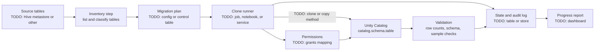

# My Projects: Clone Migration Manager

> STAR template for the Clone Migration Manager project, which supported migrating Databricks tables into Unity Catalog, with an architecture sketch and likely follow-up questions.

## Key Concepts

### Situation

Guiding prompts: What was the starting point (for example tables in the legacy Hive metastore, or across workspaces)? How many tables, schemas, or teams were involved? Why was the migration needed, and why was a tool needed rather than manual steps?

- TODO (Siva): the source environment and the scale of the migration.
- TODO (Siva): the problem with doing it manually.
- TODO (Siva): the deadline or business driver.

### Task

Guiding prompts: What did the Clone Migration Manager have to do? What was your role: designer, main developer, owner? Which constraints applied: downtime, data size, permissions, cost?

- TODO (Siva): your responsibility and the goal.
- TODO (Siva): constraints and stakeholders, for example data owners and platform admins.

### Action

Guiding prompts: How did it decide what to migrate? Which clone or copy method did it use and why? How did it track progress and handle failures and retries? How did you validate data and carry over permissions? How did teams use it?

- TODO (Siva): how the tool built its inventory of tables to migrate.
- TODO (Siva): the migration method and why you chose it.
- TODO (Siva): how state, progress, and retries were tracked.
- TODO (Siva): validation checks after each table.
- TODO (Siva): how grants and ownership were handled.
- TODO (Siva): a problem you hit and how you solved it.

### Result

Guiding prompts: How many tables or schemas were migrated? How long did it take compared with the estimate for manual work? How many failures or rollbacks? Did teams adopt it on their own?

- TODO (Siva): the main outcome with a number or honest estimate.
- TODO (Siva): adoption and feedback.
- TODO (Siva): what you would do differently.

### Architecture

The diagram below is a generic skeleton. Replace each placeholder with your real components and remove anything that did not exist.

TODO (Siva): replace this with the real flow, and note where it runs and who can trigger it.

### Tech stack

- TODO (Siva): Databricks features used, for example the clone command, jobs, or SQL warehouses
- TODO (Siva): language and framework of the tool
- TODO (Siva): where migration state is stored
- TODO (Siva): how it is deployed and triggered, for example a pipeline or job schedule
- TODO (Siva): how progress and failures are reported

## Interview Questions

Q1. [Basic] Give me a two-minute overview of the Clone Migration Manager.

**Answer:**

TODO (Siva): your two-minute STAR summary.

**Hints:** say why a tool was needed rather than a one-off script, and give the scale (number of tables or data size).

Q2. [Basic] Why migrate to Unity Catalog at all?

**Answer:**

TODO (Siva): the drivers in your environment.

**Hints:** common drivers are central governance across workspaces, fine-grained access control, lineage, and auditing. Tie them to your actual reason.

Q3. [Intermediate] Which clone or copy method did you use, and why that one?

**Answer:**

TODO (Siva): the method and the reasoning.

**Hints:** a strong answer compares options such as deep clone vs shallow clone vs other upgrade paths, and covers storage cost, independence from the source, and supported table types.

Q4. [Intermediate] How did the tool track state and recover from a failure halfway through?

**Answer:**

TODO (Siva): how progress was recorded and how retries worked.

**Hints:** mention idempotent steps (safe to re-run), a per-table status, and resuming from the last successful table instead of starting over.

Q5. [Intermediate] How did you validate that a migrated table was correct?

**Answer:**

TODO (Siva): the checks you ran.

**Hints:** row counts, schema comparison, and sample or checksum checks, plus how failures were reported to the data owner.

Q6. [Advanced] How did you handle permissions and ownership during the migration?

**Answer:**

TODO (Siva): how grants were mapped and applied.

**Hints:** explain mapping old access rules to Unity Catalog grants, using groups rather than individual users, and checking access with the data owners.

Q7. [Advanced] How did you migrate without breaking jobs and users that still read the old tables? <em>(scenario)</em>

**Answer:**

TODO (Siva): your cutover approach.

**Hints:** a strong answer covers phased cutover, a freeze or sync window for writes, communication with consumers, and a rollback plan.

Q8. [Advanced] How did you manage cost and performance for large tables?

**Answer:**

TODO (Siva): compute choices, batching, and scheduling.

**Hints:** mention running large copies in batches or off-peak, sizing compute, and the storage cost of full copies.

Q9. [Advanced] How did you coordinate with data owners and other teams?

**Answer:**

TODO (Siva): how you planned waves, communicated, and handled disagreements.

**Hints:** show influence: a migration schedule agreed with owners, clear status reporting, and sign-off per wave.

Q10. [Advanced] What would you change if you built it again?

**Answer:**

TODO (Siva): one or two honest improvements.

**Hints:** pick a real limitation and what you learned; avoid "nothing".

See also: [Architecture decision records](../leadership/01-architecture-decision-records.md) and [Stakeholder communication](../leadership/05-stakeholder-communication.md).
