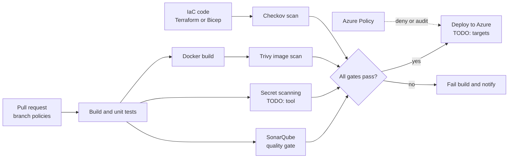

# My Projects: CI/CD Pipelines with DevSecOps Quality Gates

> STAR template for the project where you built CI/CD across Azure DevOps, GitHub Actions, GitLab CI, and Jenkins with SonarQube, Trivy, and Checkov quality gates, secret scanning, Azure Policy, and branch policies, with an architecture sketch and likely follow-up questions.

## Key Concepts

Lines marked **From resume:** repeat a claim that is already on your resume. Everything else is a `TODO (Siva):` for you to fill in with real facts.

### Situation

Guiding prompts: How were builds and releases done before? Why were there four CI/CD tools? What went wrong: slow releases, failed deployments, vulnerabilities found late, secrets in code?

- TODO (Siva): which employer (Impressico or Infosys) and roughly when.
- TODO (Siva): which tool was used by which team or product, and why.
- TODO (Siva): the main problems before, with a concrete example.
- TODO (Siva): why it mattered (release speed, security findings, compliance).

### Task

Guiding prompts: What were you asked to do, or what did you take on? Who had to adopt the new gates? What were the constraints?

- **From resume:** build and run CI/CD pipelines across Azure DevOps, GitHub Actions, GitLab CI, and Jenkins with security and quality gates.
- TODO (Siva): your exact responsibility vs the rest of the team.
- TODO (Siva): constraints and stakeholders (developers, security team, release managers).

### Action

Guiding prompts: What stages did a standard pipeline have? Where did each gate run and what failed the build? How did you keep four tools consistent? How did you handle false positives and pushback from developers?

- **From resume:** added SonarQube, Trivy, and Checkov quality gates, secret scanning, Azure Policy, and branch policies.
- TODO (Siva): step 1, the standard pipeline stages and how they were shared (templates, shared scripts).
- TODO (Siva): step 2, the gate thresholds (for example which Trivy severities fail the build).
- TODO (Siva): step 3, branch policies and Azure Policy assignments you set up.
- TODO (Siva): step 4, how you rolled the gates out (warn first, then block?).
- TODO (Siva): a trade-off you made and a problem you hit.

### Result

Guiding prompts: What measurably improved? Think about lead time, failed deployments, vulnerabilities caught before production, and time developers spent waiting.

- **From resume:** about 50% faster release lead time.
- **From resume:** about 40% fewer failed deployments.
- TODO (Siva): confirm how each number was measured (definition, data source, time window before and after).
- TODO (Siva): what you would do differently next time.

### Architecture

The diagram below is a generic skeleton. Replace each placeholder with your real components and remove anything that did not exist.

TODO (Siva): replace this with the real flow and add a two-line explanation of each arrow.

### Tech stack

- **From resume:** Azure DevOps, GitHub Actions, GitLab CI, Jenkins, SonarQube, Trivy, Checkov, Azure Policy.
- TODO (Siva): secret scanning tool used.
- TODO (Siva): how pipelines authenticated to Azure (service connection type, OIDC).
- TODO (Siva): artifact storage (for example Nexus, Azure Artifacts, ACR).

## Interview Questions

Q1. [Basic] Give me a two-minute overview of this project.

**Answer:**

TODO (Siva): your two-minute STAR summary.

**Hints:** name the gates in pipeline order, then give the 50% lead time and 40% failed deployment numbers with how you measured them.

Q2. [Intermediate] Why four CI/CD tools, and how did you keep the pipelines consistent across them?

**Answer:**

TODO (Siva): which teams used which tool and how you standardised.

**Hints:** a strong answer explains the history honestly and shows reuse: shared scripts or container images for the scanners, and the same stages and thresholds in every tool.

Q3. [Intermediate] Where in the pipeline did each gate run, and what made it fail the build?

**Answer:**

TODO (Siva): stage order and the exact thresholds you used.

**Hints:** cover the SonarQube quality gate on new code, Trivy failing on chosen severities (for example HIGH and CRITICAL), Checkov on IaC before plan or deploy, and secret scanning as early as possible.

Q4. [Intermediate] How did you handle false positives without turning the gates off?

**Answer:**

TODO (Siva): your exception process and one real example.

**Hints:** mention suppressions that need a written reason and an owner (for example a Checkov skip comment or a Trivy ignore file), reviews of old exceptions, and starting new gates in warning mode before blocking.

Q5. [Intermediate] Which branch policies did you set, and why?

**Answer:**

TODO (Siva): the policies on your main branches.

**Hints:** cover minimum reviewers, build validation on pull requests, resolved comments, linked work items, and no direct pushes to the main branch.

Q6. [Intermediate] How does Azure Policy fit together with the pipeline gates?

**Answer:**

TODO (Siva): which policies you assigned and with which effects.

**Hints:** pipeline gates catch problems early in code; Azure Policy enforces rules on the platform for every deployment path, including the portal. Know the <code>deny</code> and <code>audit</code> effects.

Q7. [Advanced] How did you measure the 50% faster lead time and 40% fewer failed deployments?

**Answer:**

TODO (Siva): definitions, data source, and the before and after periods.

**Hints:** use clear definitions, for example lead time from commit to production and the share of deployments that caused a failure or rollback. Say where the data came from and whether the numbers are estimates.

Q8. [Advanced] A developer commits a real secret to the repository. What do you do? <em>(scenario)</em>

**Answer:**

TODO (Siva): your steps, ideally from a real case.

**Hints:** rotate or revoke the secret first, then check logs for misuse, then clean history if needed. Prevention: push protection or pre-commit scanning, and secrets in Key Vault instead of code.

Q9. [Advanced] How did the pipelines authenticate to Azure without long-lived secrets?

**Answer:**

TODO (Siva): the auth method in each tool.

**Hints:** mention workload identity federation (OIDC) for Azure DevOps service connections, GitHub Actions, and GitLab CI, least-privilege roles for each pipeline identity, and how you handled Jenkins.

Q10. [Advanced] If you did this project again, what would you change?

**Answer:**

TODO (Siva): one or two honest improvements.

**Hints:** pick a real limitation, for example pipeline time added by scans, and say what you learned.

See also: [CI/CD security and compliance](../ci-cd/05-security-and-compliance.md), [Azure Repos branching and code review](../azure-devops/02-azure-repos-branching-and-code-review.md), and [Azure DevOps security and secrets](../azure-devops/05-security-and-secrets.md).
