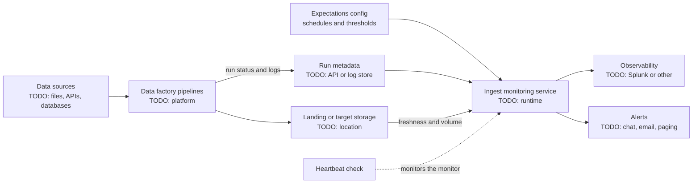

# My Projects: Data-Factory Ingest Monitoring Service

> STAR template for the service that monitors data-factory ingest pipelines and alerts on failed, late, or incomplete loads, with an architecture sketch and likely follow-up questions.

## Key Concepts

### Situation

Guiding prompts: What does the data factory ingest, and from where? How were failures or late data noticed before? Who was affected when an ingest silently failed: analysts, downstream jobs, customers?

- TODO (Siva): what the data factory is (platform and purpose) and roughly how many pipelines or feeds it runs.
- TODO (Siva): how ingest problems were found before the project.
- TODO (Siva): a concrete example of the impact of a missed or late load.

### Task

Guiding prompts: What was the service meant to detect? What was your role? What constraints applied: which platform to run on, budget, existing alerting tools?

- TODO (Siva): your responsibility and the goal.
- TODO (Siva): constraints and stakeholders.

### Action

Guiding prompts: What signals did the service check (run status, freshness, row counts, file arrival)? Where did it get them? How did it decide what was "late"? Where did alerts go? How was it deployed and kept healthy?

- TODO (Siva): the checks the service performs.
- TODO (Siva): where expected schedules and thresholds are defined.
- TODO (Siva): how alerts are routed and to whom.
- TODO (Siva): how the service is built, deployed, and monitored.
- TODO (Siva): a trade-off you made and why.
- TODO (Siva): a problem you hit and how you solved it.

### Result

Guiding prompts: How much faster are ingest problems detected now? How many issues were caught before users noticed? Did alert noise go down or up? Who relies on it?

- TODO (Siva): the main outcome with a number or honest estimate.
- TODO (Siva): adoption and feedback.
- TODO (Siva): what you would do differently.

### Architecture

The diagram below is a generic skeleton. Replace each placeholder with your real components and remove anything that did not exist.

TODO (Siva): replace this with the real flow, and note how often checks run.

### Tech stack

- TODO (Siva): data factory platform
- TODO (Siva): monitoring service language and runtime
- TODO (Siva): where it runs and how it is deployed (for example container platform, pipeline)
- TODO (Siva): where expectations and thresholds are configured
- TODO (Siva): alerting and dashboard tools

## Interview Questions

Q1. [Basic] Give me a two-minute overview of the ingest monitoring service.

**Answer:**

TODO (Siva): your two-minute STAR summary.

**Hints:** start with the cost of silent ingest failures, then what the service checks, then one result number.

Q2. [Intermediate] What exactly did the service check, and why those signals?

**Answer:**

TODO (Siva): the checks and your reasoning.

**Hints:** a strong answer separates "the pipeline failed" from "the pipeline succeeded but the data is late, empty, or too small", because the second kind is often missed.

Q3. [Intermediate] How did you define when a feed is "late" for pipelines with different schedules?

**Answer:**

TODO (Siva): how expected arrival times and grace periods were set.

**Hints:** mention per-feed configuration, grace windows, and handling of weekends or holidays.

Q4. [Intermediate] How did you route alerts to the right owner and keep noise down?

**Answer:**

TODO (Siva): routing rules and noise controls.

**Hints:** owner per feed, severity by business impact, grouping or de-duplicating repeat alerts, and linking each alert to a runbook.

Q5. [Intermediate] How was the service deployed, and how did you make changes safely?

**Answer:**

TODO (Siva): build, deploy, and config change process.

**Hints:** mention IaC, a pipeline with tests, and how threshold changes are reviewed.

Q6. [Advanced] How do you know the monitoring service itself is working? <em>(scenario)</em>

**Answer:**

TODO (Siva): how you monitor the monitor.

**Hints:** a heartbeat or dead-man alert that fires when the service stops reporting, plus a health check on the service itself.

Q7. [Advanced] A source sends a file on time but it is half the usual size. Would your service catch that? How? <em>(scenario)</em>

**Answer:**

TODO (Siva): whether and how volume anomalies are detected.

**Hints:** discuss fixed thresholds vs a comparison with recent history, and the risk of false alarms on genuine low-volume days.

Q8. [Advanced] How did you get pipeline owners to adopt the service and keep their expectations up to date?

**Answer:**

TODO (Siva): onboarding of feeds and ownership model.

**Hints:** show influence: self-service config, clear documentation, and reporting that made value visible.

Q9. [Advanced] What would you change if you built it again?

**Answer:**

TODO (Siva): one or two honest improvements.

**Hints:** pick a real limitation and what you learned; avoid "nothing".

See also: [Observability](../monitoring-tools/01-observability-and-apm.md), [Logging](../monitoring-tools/04-logging.md), and [Leading incidents](../leadership/04-leading-incidents.md).
