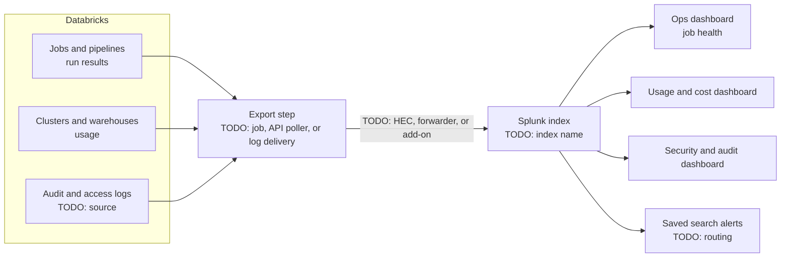

# My Projects: Databricks and Splunk Monitoring Dashboards

> STAR template for the project that brought Databricks operational data into Splunk dashboards and alerts, with an architecture sketch and likely follow-up questions.

## Key Concepts

### Situation

Guiding prompts: What visibility was missing before: job failures, cluster usage, cost, access audits? Who needed it (platform team, data engineers, managers, security)? How were problems found before?

- TODO (Siva): the Databricks environment and who uses it.
- TODO (Siva): what was hard to see or monitor before.
- TODO (Siva): a concrete example of a problem that was found late.

### Task

Guiding prompts: What were you asked to deliver? Which questions did the dashboards need to answer? What was your role? What constraints applied?

- TODO (Siva): your responsibility and goal.
- TODO (Siva): the audiences and the key questions each one needed answered.
- TODO (Siva): constraints, for example data volume, Splunk licence or ingest limits, access rules.

### Action

Guiding prompts: Which Databricks data sources did you use? How did data get into Splunk? How did you design the dashboards for each audience? Which alerts did you build? How did you keep searches efficient?

- TODO (Siva): the Databricks data sources used.
- TODO (Siva): how data is shipped to Splunk and how often.
- TODO (Siva): the dashboards and panels you built.
- TODO (Siva): alerts you built and how they are routed.
- TODO (Siva): a trade-off you made and why.
- TODO (Siva): a problem you hit and how you solved it.

### Result

Guiding prompts: What problems are now caught earlier? Did anyone use the dashboards to save cost or fix reliability? How many teams use them? Any change in time to detect job failures?

- TODO (Siva): the main outcome with a number or honest estimate.
- TODO (Siva): adoption and feedback.
- TODO (Siva): what you would do differently.

### Architecture

The diagram below is a generic skeleton. Replace each placeholder with your real components and remove anything that did not exist.

TODO (Siva): replace this with the real flow, and note data volumes and refresh frequency.

### Tech stack

- TODO (Siva): Databricks data sources, for example job run APIs, system tables, or audit log delivery
- TODO (Siva): how data reaches Splunk
- TODO (Siva): Splunk indexes, sourcetypes, and dashboard framework used
- TODO (Siva): alerting targets
- TODO (Siva): how the export is deployed and monitored

## Interview Questions

Q1. [Basic] Give me a two-minute overview of this project.

**Answer:**

TODO (Siva): your two-minute STAR summary.

**Hints:** name the audiences and the main question each dashboard answers, then one result number.

Q2. [Intermediate] Which Databricks data did you send to Splunk, and why that data?

**Answer:**

TODO (Siva): the sources and your reasoning.

**Hints:** a strong answer ties each source to a question someone needed answered, and explains what you chose not to send.

Q3. [Intermediate] How did the data get from Databricks into Splunk?

**Answer:**

TODO (Siva): the ingestion path and why.

**Hints:** compare options such as pushing to the HTTP Event Collector, a forwarder reading delivered logs, or a vendor add-on, and explain reliability and retry handling.

Q4. [Intermediate] Walk me through the most useful dashboard. What is on it?

**Answer:**

TODO (Siva): the panels and the decisions they support.

**Hints:** good dashboards start with a summary row (health or totals), then drill-down panels; mention filters such as workspace or team.

Q5. [Intermediate] Which alerts did you build, and how did you avoid alert fatigue?

**Answer:**

TODO (Siva): alert list and noise controls.

**Hints:** alert on things someone must act on, with an owner and a runbook; use throttling to avoid repeat alerts.

Q6. [Advanced] How did you keep Splunk ingest volume and search performance under control?

**Answer:**

TODO (Siva): how you managed volume and search cost.

**Hints:** mention filtering or summarising before ingest, choosing the right index and retention, and efficient searches (specific index and time range, summary indexing or accelerated data where appropriate).

Q7. [Advanced] Some of this data is audit and access data. How did you control who could see it?

**Answer:**

TODO (Siva): access model in Splunk.

**Hints:** separate indexes or roles for security data, least privilege, and agreement with the security team.

Q8. [Advanced] Give an example of a problem the dashboards helped catch or fix. <em>(scenario)</em>

**Answer:**

TODO (Siva): one real example with the outcome.

**Hints:** a specific story, such as a failing job or unusual usage caught early, is the best proof of value.

Q9. [Advanced] How did you get teams to actually use the dashboards?

**Answer:**

TODO (Siva): adoption steps and feedback loop.

**Hints:** show influence: built with the users, demoed them, linked them from alerts and runbooks, and iterated on feedback.

Q10. [Advanced] What would you change if you built it again?

**Answer:**

TODO (Siva): one or two honest improvements.

**Hints:** pick a real limitation and what you learned; avoid "nothing".

See also: [Logging](../monitoring-tools/04-logging.md), [Monitoring cost](../monitoring-tools/10-monitoring-cost-finops.md), and [Observability](../monitoring-tools/01-observability-and-apm.md).
