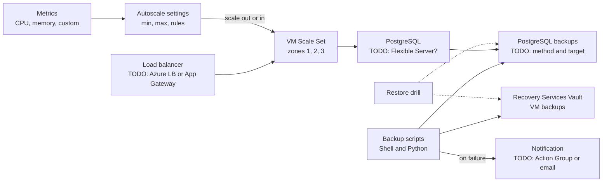

# My Projects: VM Scale Set Autoscaling and Backup Automation

> STAR template for the project where you set up VM Scale Set autoscaling with rolling upgrades and availability zones, and automated backups with Shell/Python, Recovery Services Vault, PostgreSQL backups, restore drills, and failure notifications, with an architecture sketch and likely follow-up questions.

## Key Concepts

Lines marked **From resume:** repeat a claim that is already on your resume. Everything else is a `TODO (Siva):` for you to fill in with real facts.

### Situation

Guiding prompts: What ran on the VMs and how was capacity handled before? Were there slowdowns at peak, wasted cost at quiet times, or risky manual patching? How were backups done, and had anyone tested a restore?

- TODO (Siva): which employer (Impressico or Infosys) and roughly when.
- TODO (Siva): the application on the scale set and its traffic pattern.
- TODO (Siva): how scaling, patching, and backups were done before, and what went wrong.
- TODO (Siva): why it mattered (outage risk, cost, audit or compliance needs).

### Task

Guiding prompts: What were you asked to do, or what did you take on? What were the RPO and RTO targets, if any? What were the constraints?

- **From resume:** configure VM Scale Set autoscaling and automate backups with Shell and Python.
- TODO (Siva): your exact responsibility vs the rest of the team.
- TODO (Siva): targets and constraints (RPO, RTO, budget, maintenance windows).

### Action

Guiding prompts: Which metrics drove scaling and why? How were rolling upgrades and zones configured? What exactly did the backup scripts do, and how were failures reported? How did restore drills work?

- **From resume:** VMSS autoscale on CPU, memory, and custom metrics, with a rolling upgrade policy and availability zones.
- **From resume:** Shell/Python backup automation with Recovery Services Vault, PostgreSQL backups, restore drills, and failure notifications.
- TODO (Siva): step 1, the autoscale rules (metric, threshold, duration, instance change, cooldown, min and max).
- TODO (Siva): step 2, how memory and custom metrics were collected (they are not host metrics by default).
- TODO (Siva): step 3, the rolling upgrade settings and the health signal used.
- TODO (Siva): step 4, what the backup scripts did, where they ran, and how they reported failures.
- TODO (Siva): step 5, how restore drills were run and recorded.
- TODO (Siva): a trade-off you made and a problem you hit.

### Result

Guiding prompts: What measurably improved? Think about peak performance, cost at quiet times, backup success rate, restore time measured in drills, and manual work removed.

- TODO (Siva): the main outcome with a number or honest estimate.
- TODO (Siva): restore drill results (time to restore, data checked).
- TODO (Siva): if this project fed into the ~25% cloud cost reduction on your resume, explain how and how it was measured; otherwise do not link them.
- TODO (Siva): what you would do differently next time.

### Architecture

The diagram below is a generic skeleton. Replace each placeholder with your real components and remove anything that did not exist.

TODO (Siva): replace this with the real flow and add a two-line explanation of each arrow.

### Tech stack

- **From resume:** Azure VM Scale Sets, autoscale, availability zones, Recovery Services Vault, Azure Database for PostgreSQL, Shell, Python.
- TODO (Siva): Uniform or Flexible orchestration mode.
- TODO (Siva): how the scripts ran (cron, pipeline schedule, Automation, Functions) and how they authenticated.
- TODO (Siva): how notifications were sent.

## Interview Questions

Q1. [Basic] Give me a two-minute overview of this project.

**Answer:**

TODO (Siva): your two-minute STAR summary.

**Hints:** cover scaling and backups as two clear parts, and end with a result from a real restore drill.

Q2. [Intermediate] How did you autoscale on memory when Azure only gives CPU as a host metric?

**Answer:**

TODO (Siva): how memory and custom metrics reached the autoscale rules.

**Hints:** a strong answer explains that memory is a guest OS metric, so it must be collected from inside the VM (for example with the Azure Monitor Agent or an application metric) before autoscale can use it.

Q3. [Intermediate] How did you stop the scale set from scaling out and in again and again?

**Answer:**

TODO (Siva): your thresholds, durations, and cooldown periods.

**Hints:** mention a gap between scale-out and scale-in thresholds, cooldown periods, a sensible minimum count, and scaling out fast but scaling in slowly.

Q4. [Intermediate] How do rolling upgrades work on a scale set, and what makes them safe?

**Answer:**

TODO (Siva): your upgrade policy settings and health signal.

**Hints:** cover batch size, maximum unhealthy instances, pause between batches, and that a health probe or the Application Health extension is what tells Azure an instance is healthy. Spreading across zones protects against one zone failing.

Q5. [Intermediate] What did Recovery Services Vault cover, and how were PostgreSQL backups done?

**Answer:**

TODO (Siva): what was backed up where, with retention.

**Hints:** be precise: Recovery Services Vault holds VM backups; Azure Database for PostgreSQL Flexible Server has its own automatic backups with point-in-time restore, and longer retention uses an Azure Backup vault or your own dumps to Storage. Say which you used.

Q6. [Intermediate] How did the backup automation report failures?

**Answer:**

TODO (Siva): the alert path, who received it, and how fast.

**Hints:** mention script exit codes and logging, Azure Backup alerts in Azure Monitor, Action Groups, and an alert when a backup did not run at all, not only when it failed.

Q7. [Advanced] How did you run restore drills, and what did you learn from them?

**Answer:**

TODO (Siva): drill steps, frequency, and one real finding.

**Hints:** restore to a separate resource group, check the data is usable, measure the time against the RTO, and write down what broke. A backup that was never restored is not proven.

Q8. [Advanced] During a traffic spike the scale set did not scale out. How do you investigate? <em>(scenario)</em>

**Answer:**

TODO (Siva): your steps, ideally from a real case.

**Hints:** check the autoscale run history and activity log, whether the metric had data, whether the maximum count was reached, cooldown periods, and vCPU quota or zone capacity limits.

Q9. [Advanced] If you did this project again, what would you change?

**Answer:**

TODO (Siva): one or two honest improvements.

**Hints:** pick a real limitation and say what you learned; avoid "nothing".

See also: [Azure compute and app hosting](../azure/02-compute-and-app-hosting.md), [Azure storage, networking, and reliability](../azure/04-storage-networking-and-reliability.md), and [Automation scripts in practice](../shell-scripting/02-automation-scripts-in-practice.md).
