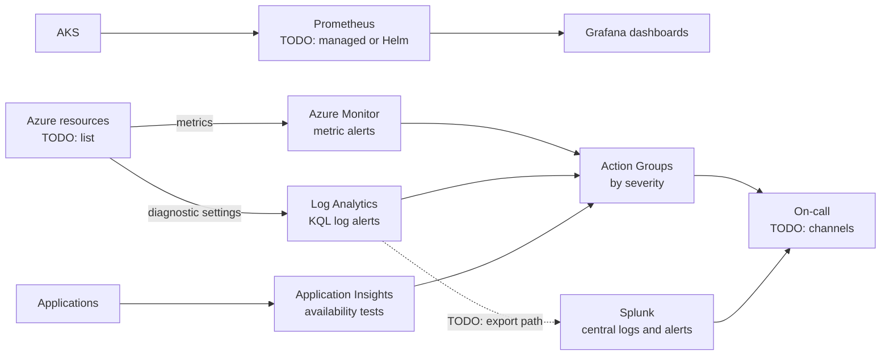

# My Projects: Azure Monitoring, Prometheus and Grafana, and Splunk Alerting

> STAR template for the project where you built Azure Monitor metric and log alerts with KQL, Application Insights availability tests, Action Groups with severity routing, Prometheus and Grafana dashboards on AKS, and Splunk integration for central logs and alerts, with an architecture sketch and likely follow-up questions.

## Key Concepts

Lines marked **From resume:** repeat a claim that is already on your resume. Everything else is a `TODO (Siva):` for you to fill in with real facts.

### Situation

Guiding prompts: How were problems noticed before: by customers, by people watching dashboards, by noisy emails? Were logs spread across many places? Was on-call overloaded with alerts that did not need action?

- TODO (Siva): which employer (Impressico or Infosys) and roughly when.
- TODO (Siva): the systems monitored (AKS, VMs, App Service, databases) and how they were monitored before.
- TODO (Siva): the main problem, with a concrete example (for example an incident found late).
- TODO (Siva): why it mattered.

### Task

Guiding prompts: What were you asked to do, or what did you take on? Who were the users of the alerts and dashboards? What were the constraints (cost, existing Splunk contract, team skills)?

- **From resume:** set up Azure Monitor alerting, Prometheus and Grafana on AKS, and Splunk integration for central logs and alerts.
- TODO (Siva): your exact responsibility vs the rest of the team.
- TODO (Siva): constraints and stakeholders.

### Action

Guiding prompts: Which alerts did you create and why? How did severity decide who was notified? How did metrics and logs flow into Prometheus, Grafana, and Splunk? How did you reduce noise?

- **From resume:** Azure Monitor metric alerts and log alerts written in KQL, Application Insights availability tests, and Action Groups with severity-based routing.
- **From resume:** Prometheus and Grafana dashboards on AKS.
- **From resume:** Splunk integration for central logs and alerts.
- TODO (Siva): step 1, how you chose what to alert on (and what not to).
- TODO (Siva): step 2, the severity levels and where each one was routed.
- TODO (Siva): step 3, how Prometheus and Grafana were deployed (managed service or Helm) and what the dashboards showed.
- TODO (Siva): step 4, how Azure logs reached Splunk.
- TODO (Siva): a trade-off you made and a problem you hit.

### Result

Guiding prompts: What measurably improved? Think about time to detect, number of alerts per week, share of alerts that needed action, incidents found by customers vs by monitoring, and log cost.

- TODO (Siva): the main outcome with a number or honest estimate.
- TODO (Siva): adoption: which teams used the dashboards and alerts.
- TODO (Siva): what you would do differently next time.

### Architecture

The diagram below is a generic skeleton. Replace each placeholder with your real components and remove anything that did not exist.

TODO (Siva): replace this with the real flow and add a two-line explanation of each arrow.

### Tech stack

- **From resume:** Azure Monitor, Log Analytics with KQL, Application Insights, Action Groups, Prometheus, Grafana, Splunk, AKS.
- TODO (Siva): notification channels (email, SMS, Teams, ticketing tool, paging tool).
- TODO (Siva): how alert rules were deployed (portal, Bicep, Terraform).
- TODO (Siva): how logs were sent to Splunk.

## Interview Questions

Q1. [Basic] Give me a two-minute overview of this project.

**Answer:**

TODO (Siva): your two-minute STAR summary.

**Hints:** follow one signal end to end (for example a failed availability test to the person paged), then give one measured result.

Q2. [Intermediate] When did you use a metric alert and when did you use a KQL log alert?

**Answer:**

TODO (Siva): one real example of each, with the KQL if you can.

**Hints:** metric alerts are fast and cheap for numeric signals such as CPU or request count; log search alerts run a KQL query on a schedule and suit patterns in logs, such as a count of errors with a given message.

Q3. [Intermediate] How did severity routing work with Action Groups?

**Answer:**

TODO (Siva): your severity levels and who got what.

**Hints:** cover Sev0 to Sev4 mapped to different Action Groups (for example paging for Sev0 and Sev1, a team channel for lower levels), and alert processing rules if you used them for routing or maintenance windows.

Q4. [Intermediate] What did your Application Insights availability tests check, and when did they alert?

**Answer:**

TODO (Siva): endpoints, locations, frequency, and alert rule.

**Hints:** mention standard tests from several Azure locations, checking status code and response content or SSL expiry, and alerting only when several locations fail to avoid false alarms. Classic URL ping tests are deprecated (retirement is planned for 30 September 2028), so standard tests are the current choice.

Q5. [Intermediate] How did you run Prometheus and Grafana for AKS, and what did the dashboards show?

**Answer:**

TODO (Siva): managed service or self-hosted, and the main panels.

**Hints:** know the trade-off between Azure Monitor managed service for Prometheus with Azure Managed Grafana and a self-hosted stack installed with Helm. Good dashboards show the golden signals: latency, traffic, errors, and saturation.

Q6. [Intermediate] How did Azure logs and alerts get into Splunk?

**Answer:**

TODO (Siva): the real path and who owned each part.

**Hints:** a common path is diagnostic settings to Event Hubs, then a Splunk add-on reads the events; another is sending to the Splunk HTTP Event Collector. Mention filtering so you do not pay to store the same noise twice.

Q7. [Advanced] How did you reduce alert noise?

**Answer:**

TODO (Siva): what you removed or changed, with before and after numbers if you have them.

**Hints:** every alert must need an action, have an owner, and link to a runbook. Mention tuning thresholds and durations, grouping duplicates, and reviewing alert history regularly.

Q8. [Advanced] An alert did not fire during a real incident. How do you find out why? <em>(scenario)</em>

**Answer:**

TODO (Siva): your steps, ideally from a real case.

**Hints:** check the rule is enabled, run the KQL by hand for that time, check evaluation frequency and window, log ingestion delay, the Action Group, and any alert processing rule that suppressed it.

Q9. [Advanced] How did you control the cost of logs in Log Analytics and Splunk?

**Answer:**

TODO (Siva): the cost controls you used.

**Hints:** mention collecting only useful categories, retention settings, cheaper table plans for verbose logs, and not sending the same data to both tools without a reason.

Q10. [Advanced] If you did this project again, what would you change?

**Answer:**

TODO (Siva): one or two honest improvements.

**Hints:** pick a real limitation, for example alerts deployed by hand instead of as code, and say what you learned.

See also: [Azure automation, monitoring, and cost](../azure/06-automation-monitoring-and-cost.md), [Prometheus](../monitoring-tools/02-prometheus.md), and [Splunk alerts and dashboards](../splunk/03-alerts-and-dashboards.md).
