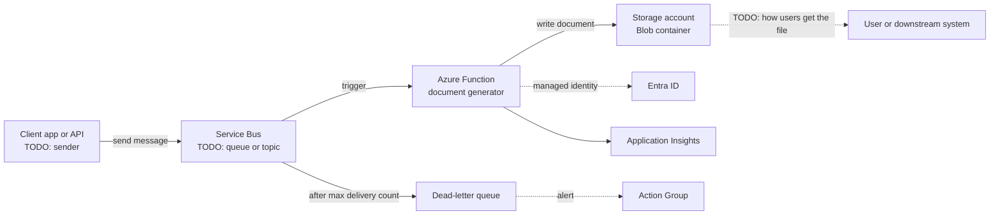

# My Projects: Azure Functions with Service Bus for Document Generation

> STAR template for the project where Azure Functions, triggered by Service Bus messages, processed requests asynchronously and generated documents into a Storage account, with an architecture sketch and likely follow-up questions.

## Key Concepts

Lines marked **From resume:** repeat a claim that is already on your resume. Everything else is a `TODO (Siva):` for you to fill in with real facts.

### Situation

Guiding prompts: What documents were generated and for whom? How was it done before: synchronously in the main app, by a batch job, by hand? What went wrong: timeouts, slow pages, lost requests at peak?

- TODO (Siva): which employer (Impressico or Infosys) and roughly when.
- TODO (Siva): the business process and the type of documents.
- TODO (Siva): how it worked before and what went wrong.
- TODO (Siva): why it mattered.

### Task

Guiding prompts: What was your part: the infrastructure, the pipeline, the function code, or all of it? What were the volume, latency, and reliability needs?

- **From resume:** run Azure Functions triggered by Service Bus that process requests asynchronously and generate documents into a Storage account.
- TODO (Siva): your exact responsibility vs the developers and the rest of the team.
- TODO (Siva): volume, latency targets, and constraints.

### Action

Guiding prompts: How did a request flow from sender to stored document? How were failures, retries, and duplicates handled? How did the function authenticate? How was it deployed and monitored?

- TODO (Siva): step 1, the message flow (queue or topic, message format, who sends).
- TODO (Siva): step 2, the function settings (hosting plan, concurrency, timeouts, retries).
- TODO (Siva): step 3, where documents were written in Storage (container, naming, access).
- TODO (Siva): step 4, identity and networking (managed identity, private endpoints, if used).
- TODO (Siva): step 5, deployment (IaC and pipeline) and monitoring (dead-letter and backlog alerts).
- TODO (Siva): a trade-off you made and a problem you hit.

### Result

Guiding prompts: What measurably improved? Think about response time for the user, failed or lost requests, documents per hour, peak handling, and cost.

- TODO (Siva): the main outcome with a number or honest estimate.
- TODO (Siva): what you would do differently next time.

### Architecture

The diagram below is a generic skeleton. Replace each placeholder with your real components and remove anything that did not exist.

TODO (Siva): replace this with the real flow and add a two-line explanation of each arrow.

### Tech stack

- **From resume:** Azure Functions, Azure Service Bus, Azure Storage.
- TODO (Siva): function language and hosting plan.
- TODO (Siva): IaC and pipeline used to deploy it.
- TODO (Siva): monitoring and alerting.

## Interview Questions

Q1. [Basic] Give me a two-minute overview of this project.

**Answer:**

TODO (Siva): your two-minute STAR summary.

**Hints:** follow one request from send to stored document, and be clear about which parts you owned.

Q2. [Basic] Why process the requests asynchronously with Service Bus instead of a direct HTTP call?

**Answer:**

TODO (Siva): the real reasons for your system.

**Hints:** mention that the caller does not wait for slow document generation, the queue absorbs peaks, and messages are not lost if the function is down or fails.

Q3. [Intermediate] What happens when the function fails to process a message?

**Answer:**

TODO (Siva): your retry and dead-letter settings.

**Hints:** cover peek-lock, the message being retried until it reaches the queue's max delivery count, then moving to the dead-letter queue, and lock renewal for long-running work.

Q4. [Intermediate] How did you make sure a message processed twice did not create a wrong or duplicate document?

**Answer:**

TODO (Siva): how idempotency was handled.

**Hints:** Service Bus gives at-least-once delivery, so the handler must be idempotent. Examples: a document name built from a request ID, checking if the blob already exists, or duplicate detection on the queue.

Q5. [Intermediate] How did the function authenticate to Service Bus and Storage?

**Answer:**

TODO (Siva): connection settings and roles used.

**Hints:** a strong answer uses a managed identity with identity-based connections (for example a <code>__fullyQualifiedNamespace</code> setting) and data-plane roles such as Azure Service Bus Data Receiver and Storage Blob Data Contributor, instead of connection strings.

Q6. [Intermediate] Which hosting plan did you use, and why?

**Answer:**

TODO (Siva): the plan and the reasons.

**Hints:** compare cold starts, scaling limits, maximum run time, and VNet integration across Flex Consumption, Premium, and Dedicated plans, and tie the choice to your document sizes and volume.

Q7. [Advanced] How did you monitor the pipeline and know it was healthy?

**Answer:**

TODO (Siva): metrics, logs, and alerts you set up.

**Hints:** watch the active message count (backlog), the dead-letter message count, function failures and duration in Application Insights, and alert on a growing backlog, not only on errors.

Q8. [Advanced] After a deployment the dead-letter queue starts filling up. What do you do? <em>(scenario)</em>

**Answer:**

TODO (Siva): your steps, ideally from a real case.

**Hints:** read the dead-letter reason and the function exceptions, roll back or fix forward, then resubmit the dead-lettered messages once the fix is live, and add a test that would have caught it.

Q9. [Advanced] If you did this project again, what would you change?

**Answer:**

TODO (Siva): one or two honest improvements.

**Hints:** pick a real limitation and say what you learned; avoid "nothing".

See also: [Azure integration and messaging](../azure/03-integration-and-messaging.md) and [Azure compute and app hosting](../azure/02-compute-and-app-hosting.md).
