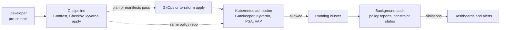

# Ops: Policy as Code with OPA and Kyverno

> Policy as code with OPA and Rego, Gatekeeper and Azure Policy for AKS, Conftest for azurerm Terraform plans and YAML in CI, Kyverno, audit-to-enforce rollout, exceptions, policy testing, and how it relates to Checkov and Pod Security Admission.

## Key Concepts

### What Policy as Code Is

Policy as code means writing rules ("no Storage accounts with public network access", "containers must not run as root", "images only from our ACR") as versioned, tested code. Then the same rules run in CI, at the Kubernetes API server, and in audits. Policies get pull requests, reviews, unit tests, and releases like any other code. See [DevSecOps](02-devsecops.md) for where policy fits in the full secure delivery flow.

### Where Policies Run

Run the same rule at several points. CI gives fast feedback. Admission is the hard gate. Background audit and runtime tools catch drift and things that got in before the policy existed.



### OPA and Rego

**Open Policy Agent (OPA)** is a general policy engine and a CNCF graduated project. You give it JSON input and Rego policies, and it returns a decision. OPA 1.0 (December 2024) made the `if` and `contains` keywords mandatory, so new Rego uses v1 syntax.

```rego
package main

deny contains msg if {
    some c in input.spec.template.spec.containers
    not c.securityContext.runAsNonRoot
    msg := sprintf("container %s must set runAsNonRoot", [c.name])
}
```

### Gatekeeper

Gatekeeper runs OPA as a Kubernetes validating admission webhook, and it can also mutate.

- A **ConstraintTemplate** holds the Rego and defines a new CRD kind with parameters.
- A **Constraint** is an instance of that kind: which resources to match, which parameters, and `enforcementAction` (`deny`, `warn`, or `dryrun`).
- The **audit** controller scans existing resources and writes violations to the Constraint status.
- Recent versions can also generate native ValidatingAdmissionPolicy resources from CEL-based templates, and Rego v1 syntax is opt-in from Gatekeeper 3.19.

### Azure Policy for AKS

On AKS, the **Azure Policy add-on** installs and manages Gatekeeper v3 for you. You assign policy definitions or initiatives in Azure (at a management group, subscription, or resource group), and the add-on turns them into ConstraintTemplates and Constraints in the cluster. Compliance shows up in Azure Policy next to your other Azure resources.

- Built-in initiatives include "Kubernetes cluster pod security baseline standards for Linux-based workloads" and the matching **restricted** initiative, plus single policies such as allowed container registries, no privileged containers, and required resource limits.
- Effects for Kubernetes policies are `audit`, `deny`, `disabled`, and `mutate`. Custom policies use the `Microsoft.Kubernetes.Data` mode and point at your own ConstraintTemplate.
- The add-on checks for assignment changes and runs a full audit scan about every 15 minutes, so changes are not instant.
- A separate Gatekeeper install beside the add-on is not supported. Pick one.

```bash
az aks enable-addons --addons azure-policy -g rg-aks-prod -n aks-prod
kubectl get pods -n kube-system | grep azure-policy
kubectl get pods -n gatekeeper-system
kubectl get constrainttemplates
```

### Conftest

Conftest runs Rego against files in CI: Terraform plan JSON, Kubernetes YAML, Helm output, Dockerfiles. It looks for `deny`, `violation`, and `warn` rules in package `main` by default, and it reads Rego v1 syntax by default.

### Kyverno

Kyverno is a Kubernetes-native policy engine that graduated in the CNCF in March 2026. Policies are Kubernetes resources, so there is no new language for basic rules. Rule types are **validate**, **mutate**, **generate**, **verifyImages**, and cleanup.

Kyverno 1.17 (February 2026) promoted CEL-based types (`ValidatingPolicy`, `MutatingPolicy`, `GeneratingPolicy`, `ImageValidatingPolicy`, `DeletingPolicy`) to `policies.kyverno.io/v1` and deprecated the classic `ClusterPolicy` and `Policy`. The project plans to remove the classic types in a later release. Many clusters still run them, so you must read both.

### Relation to Checkov and Pod Security Admission

- **Checkov / tfsec (now part of Trivy):** large built-in rule libraries for IaC misconfiguration. Use them for broad coverage, and Conftest or OPA for organization-specific rules. See [Checkov](../testing-tools/03-checkov.md).
- **Pod Security Admission (PSA):** built into Kubernetes (GA in 1.25). It applies the `privileged`, `baseline`, or `restricted` profile per namespace by label. It has no custom rules and no exceptions per workload, so Kyverno or Gatekeeper fill the gaps.
- **ValidatingAdmissionPolicy (VAP):** built-in CEL validation, GA in Kubernetes 1.30. Good for simple checks with no webhook to run.

## Interview Questions

<details><summary>Q1. [Basic] What is the difference between OPA, Gatekeeper, and Conftest?</summary>

**Answer:**

- **OPA** is the engine. It takes JSON input and Rego policies and returns a decision. It can run as a library, a sidecar, or a server.
- **Gatekeeper** wraps OPA as a Kubernetes admission controller. It adds ConstraintTemplate and Constraint CRDs, an audit controller, and data sync from the cluster.
- **Conftest** wraps OPA as a CLI for testing config files in CI.

The same Rego skills work in all three, but the input shape differs. Gatekeeper sees `input.review.object` and `input.parameters`, while Conftest sees the raw file as `input`. That means a Conftest policy cannot be dropped into Gatekeeper unchanged.

</details>

<details><summary>Q2. [Intermediate] Write a Gatekeeper ConstraintTemplate and Constraint that require an <code>owner</code> label on namespaces.</summary>

**Answer:**

```yaml
apiVersion: templates.gatekeeper.sh/v1
kind: ConstraintTemplate
metadata:
  name: k8srequiredlabels
spec:
  crd:
    spec:
      names:
        kind: K8sRequiredLabels
      validation:
        openAPIV3Schema:
          type: object
          properties:
            labels:
              type: array
              items: { type: string }
  targets:
    - target: admission.k8s.gatekeeper.sh
      rego: |
        package k8srequiredlabels
        violation[{"msg": msg}] {
          required := {l | l := input.parameters.labels[_]}
          provided := {l | input.review.object.metadata.labels[l]}
          missing := required - provided
          count(missing) > 0
          msg := sprintf("missing labels: %v", [missing])
        }
---
apiVersion: constraints.gatekeeper.sh/v1beta1
kind: K8sRequiredLabels
metadata:
  name: ns-must-have-owner
spec:
  enforcementAction: dryrun
  match:
    kinds:
      - apiGroups: [""]
        kinds: ["Namespace"]
  parameters:
    labels: ["owner"]
```

The legacy `rego` field uses Rego v0 syntax. For v1 syntax, use the `code` field with `engine: Rego` and `source.version: "v1"` (Gatekeeper 3.19 and later).

**Verify:** `kubectl get k8srequiredlabels ns-must-have-owner -o yaml` shows `status.totalViolations` and the list of violating namespaces. When the count is clean, change `dryrun` to `deny`.

</details>

<details><summary>Q3. [Intermediate] How do you use Conftest to block risky azurerm Terraform plans in CI?</summary>

**Answer:**

Test the **plan JSON**, not only the `.tf` source. The plan has resolved variables, module outputs, and the real list of changes.

```bash
tofu plan -out=tfplan        # or terraform plan
tofu show -json tfplan > tfplan.json
conftest test tfplan.json --policy policy/terraform --output github
```

```rego
package main

allowed_locations := {"westeurope", "northeurope"}

required_tags := {"owner", "environment", "cost-center"}

# Resources that are created or updated by this plan
changed contains rc if {
    some rc in input.resource_changes
    rc.mode == "managed"
    some action in rc.change.actions
    action in {"create", "update"}
}

deny contains msg if {
    some rc in changed
    rc.type == "azurerm_storage_account"
    rc.change.after.public_network_access_enabled == true
    msg := sprintf("%s must set public_network_access_enabled = false", [rc.address])
}

deny contains msg if {
    some rc in changed
    rc.type == "azurerm_storage_account"
    rc.change.after.allow_nested_items_to_be_public == true
    msg := sprintf("%s allows anonymous blob access", [rc.address])
}

deny contains msg if {
    some rc in changed
    "tags" in object.keys(rc.change.after)
    some tag in required_tags
    not rc.change.after.tags[tag]
    msg := sprintf("%s is missing required tag %q", [rc.address, tag])
}

deny contains msg if {
    some rc in changed
    loc := lower(replace(rc.change.after.location, " ", ""))
    not loc in allowed_locations
    msg := sprintf("%s uses location %s, which is not allowed", [rc.address, loc])
}

deny contains msg if {
    some rc in input.resource_changes
    "delete" in rc.change.actions
    rc.type == "azurerm_postgresql_flexible_server"
    msg := sprintf("%s would be destroyed; needs manual approval", [rc.address])
}
```

The `tags` rule only checks resource types that have a `tags` argument. The location rule normalizes values such as `West Europe` to `westeurope`.

The same tool checks Kubernetes YAML or rendered Helm output: `helm template ./chart | conftest test -`. In Azure DevOps, run these steps in the plan stage and publish the output, so the pull request shows why it failed.

**Pitfalls:** values marked `(known after apply)` are missing in `after`, so check `after_unknown` or write rules that do not depend on them. Pin the Conftest version and the policy repo version so results are reproducible. Run Checkov as well for the broad built-in rules. Keep the matching Azure Policy assignments ("Allowed locations", "Require a tag on resources", "Storage accounts should disable public network access") in place, because CI only sees changes that go through the pipeline.

</details>

<details><summary>Q4. [Intermediate] Show Kyverno validate, mutate, generate, and verifyImages rules. What does each do?</summary>

**Answer:**

```yaml
apiVersion: kyverno.io/v1
kind: ClusterPolicy
metadata:
  name: baseline-guardrails
spec:
  background: true
  rules:
    - name: require-limits                       # validate: allow or block
      match: { any: [ { resources: { kinds: [Pod] } } ] }
      validate:
        failureAction: Audit                     # Enforce to block
        message: "CPU and memory limits are required."
        pattern:
          spec:
            containers:
              - resources:
                  limits: { memory: "?*", cpu: "?*" }
    - name: add-default-team-label               # mutate: change the request
      match: { any: [ { resources: { kinds: [Deployment] } } ] }
      mutate:
        patchStrategicMerge:
          metadata:
            labels:
              +(team): unassigned
    - name: default-deny-netpol                  # generate: create a related resource
      match: { any: [ { resources: { kinds: [Namespace] } } ] }
      generate:
        apiVersion: networking.k8s.io/v1
        kind: NetworkPolicy
        name: default-deny
        namespace: "{{request.object.metadata.name}}"
        synchronize: true
        data:
          spec: { podSelector: {}, policyTypes: [Ingress, Egress] }
    - name: signed-images                        # verifyImages: check signatures
      match: { any: [ { resources: { kinds: [Pod] } } ] }
      verifyImages:
        - imageReferences: ["myregistry.azurecr.io/*"]
          attestors:
            - entries:
                - keyless:
                    issuer: "https://token.actions.githubusercontent.com"
                    subject: "https://github.com/my-org/*"
```

This is the classic `ClusterPolicy` format. It is deprecated since Kyverno 1.17, but still common. The CEL replacement for validation looks like this:

```yaml
apiVersion: policies.kyverno.io/v1
kind: ValidatingPolicy
metadata:
  name: require-owner-label
spec:
  validationActions: [Audit]      # Deny to block, Warn to warn
  matchConstraints:
    resourceRules:
      - apiGroups: ["apps"]
        apiVersions: ["v1"]
        operations: [CREATE, UPDATE]
        resources: [deployments]
  validations:
    - expression: "'owner' in object.metadata.?labels.orValue({})"
      message: "label 'owner' is required"
```

**Verify:** `kubectl get policyreports -A` and `kubectl get clusterpolicyreports` show pass and fail results per resource.

</details>

<details><summary>Q5. [Intermediate] Kyverno or Gatekeeper: how do you choose?</summary>

**Answer:**

| | Kyverno | Gatekeeper |
| --- | --- | --- |
| Language | YAML patterns, CEL, JMESPath | Rego (and CEL for VAP generation) |
| Learning curve | Low for Kubernetes teams | Higher; Rego is a new language |
| Mutate | Strong, plus generate and cleanup | Mutation CRDs, no generate |
| Image signatures | Built in (Cosign, Notary) | Needs an external data provider |
| Reuse outside Kubernetes | Kyverno CLI and JSON policies | Same Rego in Conftest, OPA for APIs and Terraform |
| Reports | PolicyReport CRDs | Constraint status and audit logs |

I choose **Kyverno** when the scope is Kubernetes only and the team wants YAML, mutation, generation, and image verification in one tool. I choose **Gatekeeper** when the organization already writes Rego for Terraform, APIs, or other systems and wants one policy language everywhere.

Running both in one cluster is possible but doubles webhook latency and the places to debug. Pick one for admission.

TODO (Siva): add which admission policy engine (if any) you have used and why it was picked.

</details>

<details><summary>Q6. [Intermediate] How does Azure Policy for AKS relate to Gatekeeper, and when do you use it instead of your own policy engine?</summary>

**Answer:**

The Azure Policy add-on runs Gatekeeper v3 inside the cluster, but you do not manage Gatekeeper directly. You assign a policy or initiative in Azure, and the add-on syncs it into the cluster as a ConstraintTemplate and Constraint. Gatekeeper enforces it at admission, and the audit results go back to Azure Policy compliance.

```bash
az aks enable-addons --addons azure-policy -g rg-aks-prod -n aks-prod

# Assign the built-in pod security baseline initiative to the cluster's resource group
INIT_ID=$(az policy set-definition list \
  --query "[?displayName=='Kubernetes cluster pod security baseline standards for Linux-based workloads'].id" -o tsv)
az policy assignment create --name aks-psb-baseline \
  --policy-set-definition "$INIT_ID" \
  --scope "$(az group show -n rg-aks-prod --query id -o tsv)" \
  --params '{"effect": {"value": "audit"}}'

kubectl get constrainttemplates     # synced by the add-on
```

Start with `audit`, check the compliance view, then change the effect to `deny`.

**Use Azure Policy for AKS when:**

- You want one compliance view for AKS and the rest of Azure, assigned once at a management group for every cluster.
- The built-in initiatives and policies (pod security, allowed registries, resource limits) cover most of your rules.

**Use your own Kyverno (or a self-managed engine) when:**

- You need mutation and generation beyond what the add-on offers, image signature checks, or fast policy changes through GitOps.
- You want policies to apply within seconds. The add-on syncs assignments and audits about every 15 minutes.

**Pitfalls:** a separate Gatekeeper install beside the add-on is not supported. Manual edits to the constraints the add-on created are overwritten. Exclude `kube-system` and `gatekeeper-system` from assignments. Existing Pods that break a new `deny` policy keep running until they are rescheduled, and then they are blocked.

</details>

<details><summary>Q7. [Advanced] How do you roll out a new blocking policy to 40 teams without breaking deployments? <em>(scenario)</em></summary>

**Answer:**

1. **Write and test** the policy with good and bad fixtures in CI (see Q9).
2. **Audit first.** Deploy with Kyverno `Audit`, or Gatekeeper `dryrun`. Nothing is blocked; violations show up in reports.
3. **Measure.** Export PolicyReports or constraint status to dashboards. List violators per namespace and owner.
4. **Warn.** Gatekeeper `warn` or VAP `Warn` shows a warning in `kubectl apply` and in CI output, so teams see it during their normal work.
5. **Shift left.** Add the same rule to the CI pipeline (`kyverno apply` or Conftest), so teams fix problems before merge.
6. **Communicate a date,** with migration docs and a known exception process.
7. **Enforce per namespace or environment,** dev first, then prod. Keep the rule in audit for namespaces with approved exceptions.

**Pitfalls:**

- Enforcing on existing workloads blocks their next rollout or scale event, not just new apps. That often happens during an incident.
- Policies on Pods also affect Pods created by controllers. A Deployment is accepted, but its ReplicaSet cannot create Pods. Kyverno auto-generates rules for Pod controllers. In Gatekeeper, match the controllers too, so the error shows at `kubectl apply`.
- Exclude system namespaces (`kube-system`, the policy engine's own namespace) to avoid deadlocks.

</details>

<details><summary>Q8. [Advanced] How do you handle exceptions without making the policy useless?</summary>

**Answer:**

Every exception needs a **scope**, an **owner**, a **reason**, and an **expiry**. It lives in Git and goes through review.

```yaml
apiVersion: kyverno.io/v2
kind: PolicyException
metadata:
  name: node-exporter-hostpath
  namespace: policy-exceptions
  annotations:
    owner: platform-observability
    ticket: SEC-1234
    expires: "2026-12-31"
spec:
  exceptions:
    - policyName: disallow-host-path
      ruleNames: ["host-path"]
  match:
    any:
      - resources:
          kinds: [Pod]
          namespaces: [monitoring]
          names: ["node-exporter-*"]
```

Controls:

- Allow PolicyException resources only in one namespace (Kyverno's `--exceptionNamespace` flag), with RBAC so only the platform and security teams can write there.
- Scope to the exact rule, namespace, and workload name, never "all policies".
- In Gatekeeper, use `excludedNamespaces` on the Constraint or the global `Config`, or add a parameter allow-list to the template.
- Run a scheduled job that lists expired exceptions and opens tickets. Track the exception count as a metric.

</details>

<details><summary>Q9. [Intermediate] How do you test policies before they reach a cluster?</summary>

**Answer:**

Treat policies like code: unit tests with fixtures that must pass and must fail.

```bash
# OPA / Conftest
opa test policy/ -v                     # *_test.rego files
conftest verify --policy policy/

# Gatekeeper
gator verify ./gatekeeper-tests/        # Suite files with templates, constraints, and test objects

# Kyverno
kyverno apply policies/ --resource tests/bad-pod.yaml
kyverno test tests/                     # kyverno-test.yaml with expected pass/fail per resource
```

Pipeline for the policy repo: lint (Regal for Rego), unit tests, run the policies in audit mode against a copy of real manifests to estimate impact, then release with a version tag. Clusters pin that version through GitOps.

</details>

<details><summary>Q10. [Advanced] Pod Security Admission, Kyverno or Gatekeeper, and Checkov all check security settings. How do you split responsibilities?</summary>

**Answer:**

- **PSA** sets the baseline per namespace: `restricted` for app namespaces, `baseline` or `privileged` only for system agents. It is built in, fast, and has no webhook to fail.

  ```bash
  kubectl label ns payments pod-security.kubernetes.io/enforce=restricted \
    pod-security.kubernetes.io/warn=restricted pod-security.kubernetes.io/audit=restricted
  ```

- **Kyverno or Gatekeeper** add what PSA cannot: approved registries, signed images, required labels and limits, ingress host rules, per-workload exceptions, mutation, and generating default NetworkPolicies.
- **VAP** handles simple CEL checks with no extra component.
- **Checkov, Trivy, and Conftest in CI** catch the same issues in Terraform, Bicep, and manifests before merge, plus Azure resources that admission never sees (Storage accounts, NSGs, role assignments).
- **Azure Policy** is the last line for changes made outside the pipeline. Assign deny and audit policies at the management group or subscription, and use the Azure Policy add-on to apply the pod security initiatives to every AKS cluster.

The design rule: block in admission what must never run, catch the rest earlier in CI for fast feedback, and audit continuously for drift. See [Checkov](../testing-tools/03-checkov.md) and [Kubernetes security](../kubernetes/06-security-rbac-secrets.md).

</details>

<details><summary>Q11. [Advanced] The admission webhook is down and nobody can deploy. What happened and how do you design against it? <em>(scenario)</em></summary>

**Answer:**

Kyverno and Gatekeeper register webhooks. With `failurePolicy: Fail`, the API server rejects matching requests when the webhook is unreachable. That includes Pod creation for every Deployment, so a broken policy engine can stop the whole cluster from healing.

**Immediate fix:**

```bash
kubectl get validatingwebhookconfigurations,mutatingwebhookconfigurations
kubectl -n kyverno get pods        # or gatekeeper-system
kubectl -n kyverno logs deploy/kyverno-admission-controller
```

Restore the engine (scale it up, fix its resources, fix the certificate). As a last resort, change the failure policy or delete the webhook config, and record that as a security exception.

**Design:**

- Three or more replicas with a PodDisruptionBudget and zone anti-affinity, and enough CPU and memory.
- Exclude `kube-system` and the engine's own namespace from webhooks. Set short timeouts and cache slow external calls such as image signature checks.
- Choose fail-closed for security-critical policies and fail-open for hygiene policies, on purpose.
- Alert on `apiserver_admission_webhook_admission_duration_seconds` and rejection rates, and move simple rules to built-in PSA or VAP, which have no webhook to fail.

</details>
