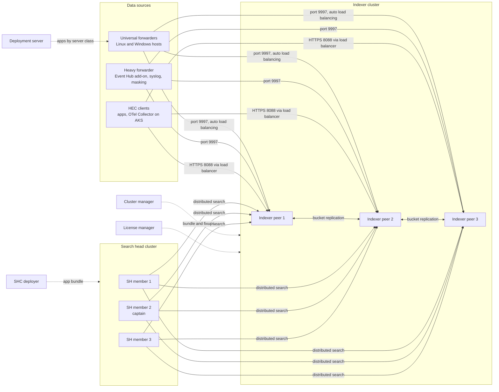

# Splunk: Architecture, Forwarders, Indexers, and Search Heads

> Splunk components, indexer and search head clustering, buckets and retention, indexes and sourcetypes, data onboarding with inputs/props/transforms and HEC, and Splunk Cloud versus Splunk Enterprise.

## Key Concepts

### Components and Their Jobs

A Splunk deployment splits work into three tiers: collect (forwarders), store and index (indexers), and search (search heads). Management components sit beside them.

| Component | What it does |
| --- | --- |
| Universal forwarder (UF) | Small agent. Reads files, Windows event logs, scripts, and network inputs, and sends raw data to indexers. Does almost no parsing. |
| Heavy forwarder (HF) | A full Splunk Enterprise instance that forwards. Parses, filters, masks, and routes data before it reaches the indexers. Also runs modular inputs (for example the Splunk Add-on for Microsoft Cloud Services, which reads Azure Event Hubs). |
| Indexer | Parses incoming data (if no HF did it), writes events into indexes as buckets, and answers the search part sent by search heads. |
| Search head (SH) | Runs the UI and SPL. Sends search requests to indexers, merges the results, and holds knowledge objects (saved searches, field extractions, lookups, dashboards). |
| Deployment server | Pushes apps and config to forwarders by server class. In Splunk Enterprise 10.0 the UI is called "Agent Management", but the `deploymentclient.conf` and `serverclass.conf` names stay. |
| Cluster manager | Coordinates an indexer cluster: bucket replication, fixups, and the config bundle for peers. Called "cluster master" before version 9.0. |
| License manager | Tracks daily indexed volume against the license. Called "license master" before version 9.0. |
| SHC deployer | Pushes apps and config to search head cluster members. It is not a cluster member itself. |
| Monitoring Console | Built-in app for health, indexing, search, and license views across the deployment. |

Common ports: `8000` web UI, `8089` management (REST), `9997` forwarder-to-indexer (convention), `8088` HEC, `8191` KV store.

### Distributed Architecture

Forwarders and HEC clients send data to an indexer cluster. Search heads query all peers in parallel. The management nodes do not sit in the data path, so a short outage of the deployment server or license manager does not stop indexing.



### Indexer Clustering and Search Head Clustering

- **Replication factor (RF):** how many copies of each bucket's raw data the cluster keeps. Default 3. The cluster survives RF minus 1 peer failures without losing data.
- **Search factor (SF):** how many of those copies are also searchable (they include the index files, `tsidx`). Default 2. SF cannot be larger than RF.
- **Multisite:** `site_replication_factor = origin:2,total:3` keeps copies in more than one site or Availability Zone.
- **Config bundle:** you put apps in `manager-apps` on the cluster manager and run `splunk apply cluster-bundle`. Peers must not be configured one by one.
- **Search head cluster (SHC):** at least 3 members. Members elect a captain (Raft-based), and the captain schedules searches and replicates knowledge objects. A majority must be up to elect a captain.

### Buckets and Retention

An index is a set of directories called buckets. Each bucket holds events for a time range.

| Stage | What happens | What moves it on |
| --- | --- | --- |
| Hot | Open and being written. Searchable. | Size (`maxDataSize`), age (`maxHotSpanSecs`), or a restart rolls it to warm. |
| Warm | Read-only, still in `homePath` (fast disk). | Too many warm buckets (`maxWarmDBCount`) or `homePath.maxDataSizeMB` rolls the oldest to cold. |
| Cold | Read-only, in `coldPath` (cheaper disk). | Age (`frozenTimePeriodInSecs`, default about 6 years) or total size (`maxTotalDataSizeMB`, default 500,000 MB). |
| Frozen | Deleted by default, or archived with `coldToFrozenDir` / `coldToFrozenScript`. Not searchable. | You can copy archived buckets into `thawedPath` to search them again. |

With **SmartStore**, warm buckets live in object storage (Azure Blob Storage is supported from Splunk Enterprise 9.0), and indexers keep a local cache. This separates storage from compute.

```ini
# indexes.conf
[app_prod]
homePath   = $SPLUNK_DB/app_prod/db
coldPath   = $SPLUNK_DB/app_prod/colddb
thawedPath = $SPLUNK_DB/app_prod/thaweddb
frozenTimePeriodInSecs = 7776000      # 90 days
maxTotalDataSizeMB     = 200000
repFactor = auto                       # required so the cluster replicates this index
```

### Indexes, Sourcetypes, and Default Fields

Every event gets four default metadata fields at index time: `index`, `host`, `source`, and `sourcetype`, plus `_time`. The index decides where data is stored, who can see it (role access is per index), and how long it is kept. The sourcetype decides how data is parsed: line breaking, timestamp, and field extraction rules in `props.conf`.

Good practice: separate indexes by retention and access needs (for example `app_prod`, `azure_activity`, `security`), not one index per host. Use the Splunk-supplied sourcetypes from add-ons (like `azure:monitor:activity` for the Azure Activity Log) so CIM data models and apps work.

### Data Onboarding: inputs, props, and transforms

Data passes through the parsing pipeline: **parsing** (character set, line breaking, header), **merging** (line merging, timestamps), **typing** (regex replacement, `SEDCMD`, transforms), and **indexing**. Each step has a queue. Index-time settings run on the **first full Splunk instance** in the path (a heavy forwarder or an indexer), not on a universal forwarder.

```ini
# inputs.conf on the universal forwarder
[monitor:///var/log/myapp/app.log]
index = app_prod
sourcetype = myapp:log
disabled = false

# outputs.conf on the universal forwarder
[tcpout:primary]
server = idx1.example.internal:9997, idx2.example.internal:9997, idx3.example.internal:9997
useACK = true

# props.conf on the indexers or heavy forwarder
[myapp:log]
SHOULD_LINEMERGE = false
LINE_BREAKER = ([\r\n]+)\d{4}-\d{2}-\d{2}T
TIME_PREFIX = ^
TIME_FORMAT = %Y-%m-%dT%H:%M:%S.%3N%z
MAX_TIMESTAMP_LOOKAHEAD = 30
TRUNCATE = 10000
TRANSFORMS-drop_debug = drop_debug

# transforms.conf
[drop_debug]
REGEX = \sDEBUG\s
DEST_KEY = queue
FORMAT = nullQueue
```

### HTTP Event Collector (HEC)

HEC accepts events over HTTPS with a token, so apps and cloud services can send data without an agent. `/services/collector/event` takes JSON events; `/services/collector/raw` takes raw text. Each token has a default index and an allowed index list.

```bash
curl -s https://hec.example.internal:8088/services/collector/event \
  -H "Authorization: Splunk ${HEC_TOKEN}" \
  -d '{"event": {"msg": "deploy finished", "service": "payments"}, "sourcetype": "app:deploy", "index": "app_prod"}'
# {"text":"Success","code":0}
```

With indexer acknowledgment on, the client sends a channel header (`X-Splunk-Request-Channel`) and later checks `/services/collector/ack`. A request without a channel is rejected, so turn acknowledgment on only for clients that support it.

### Splunk Cloud Platform vs Splunk Enterprise

| Topic | Splunk Enterprise | Splunk Cloud Platform |
| --- | --- | --- |
| Who runs it | You: servers, OS, upgrades, clustering, storage | Splunk runs the indexers and search heads |
| Access | SSH, CLI, `btool`, edit `.conf` files | No server access. Use the UI, Admin Config Service (ACS) API, and apps |
| Getting data in | Forwarders, HEC, HF | Forwarders with the Splunk Cloud forwarder credentials app, HEC, HF, Data Manager |
| Custom apps | Install anything | Private apps must pass app vetting |
| Retention beyond searchable | Frozen archive you manage | Dynamic Data Active Archive or Self Storage options |

You still own forwarders, heavy forwarders, and the deployment server in both models.

See also: [Monitoring Tools: Logging](../monitoring-tools/04-logging.md) and [Azure: Automation, Monitoring, and Cost](../azure/06-automation-monitoring-and-cost.md).

## Interview Questions

<details><summary>Q1. [Basic] What are the main components of a Splunk deployment, and what does each one do?</summary>

**Answer:**

I describe Splunk in three tiers plus management.

- **Collection:** universal forwarders on hosts, heavy forwarders for parsing, routing, and API inputs, and HEC for apps and cloud services.
- **Indexing:** indexers parse the data, write it into buckets, and run the search work on their own data.
- **Search:** search heads give the UI, run SPL, merge results from all indexers, and run scheduled searches and alerts.
- **Management:** deployment server (forwarder config), cluster manager (indexer cluster), SHC deployer (search head cluster apps), license manager, and the Monitoring Console.

The key point is that search is distributed. The search head sends the search to all indexers, each indexer does the filtering and partial stats on its own data, and the search head combines the results. That is why adding indexers improves both ingest and search speed.

**How to verify:** `splunk show cluster-status --verbose` on the cluster manager, `splunk show shcluster-status` on a search head member, and the Monitoring Console overview page.

</details>

<details><summary>Q2. [Basic] What is the difference between a universal forwarder and a heavy forwarder?</summary>

**Answer:**

| | Universal forwarder | Heavy forwarder |
| --- | --- | --- |
| Install | Separate small package | Full Splunk Enterprise |
| Parsing | No (except structured data with `INDEXED_EXTRACTIONS`) | Yes, full parsing pipeline |
| Filtering, masking, routing | Very limited | Yes, with props and transforms |
| Modular inputs, add-ons with Python | Mostly no | Yes |
| Resource use | Low | Higher |

I use the UF by default on every host. I add a heavy forwarder only when I need it: a central place to run API-based inputs (Azure Event Hubs, Azure Storage, Microsoft 365, other SaaS), to mask or drop data before it costs license, or to route data to different destinations.

**Pitfall:** once a heavy forwarder parses data, the indexers do not parse it again. So index-time `props.conf` settings for that data must be on the HF, not on the indexers. Putting them in the wrong place is a very common cause of "my props are not working".

</details>

<details><summary>Q3. [Basic] What is the difference between <code>index</code>, <code>sourcetype</code>, <code>source</code>, and <code>host</code>?</summary>

**Answer:**

- **index:** where the data is stored. It controls retention and who can search it.
- **sourcetype:** the format of the data. It controls line breaking, timestamp parsing, and field extraction.
- **source:** where the event came from, usually a file path, a script, or a HEC token name.
- **host:** the machine or device that produced the event.

All four are set at index time and are indexed fields, so filtering on them is very fast. I always start searches with `index=` and `sourcetype=`:

```text
index=app_prod sourcetype=myapp:log host=web-01 source="/var/log/myapp/app.log"
```

**Pitfall:** do not invent a new sourcetype per host or per file. Use one sourcetype per data format, and use `host` and `source` to tell instances apart.

</details>

<details><summary>Q4. [Basic] Explain the bucket lifecycle: hot, warm, cold, frozen, and thawed.</summary>

**Answer:**

- **Hot:** the bucket currently being written. Each index has a few hot buckets.
- **Warm:** a rolled hot bucket. Read-only, on fast storage in `homePath`.
- **Cold:** older warm buckets moved to `coldPath`, which can be cheaper storage.
- **Frozen:** data older than `frozenTimePeriodInSecs`, or pushed out because the index hit `maxTotalDataSizeMB`. By default Splunk deletes it. If `coldToFrozenDir` is set, it is archived instead.
- **Thawed:** archived buckets that you copied back into `thawedPath` to search again.

Retention is driven by whichever limit is hit first: age or size. If an index is too small for its daily volume, data is frozen much earlier than the time setting says.

**How to verify:**

```text
| dbinspect index=app_prod
| stats count min(startEpoch) as oldest by state
| eval oldest=strftime(oldest, "%F %T")
```

</details>

<details><summary>Q5. [Intermediate] What are replication factor and search factor, and what happens when one indexer in the cluster fails?</summary>

**Answer:**

Replication factor is the number of copies of raw data. Search factor is how many of those copies have index files, so they can be searched right away. Defaults are RF=3 and SF=2.

When a peer goes down:

1. The cluster manager notices the missing heartbeat.
2. For buckets where the failed peer held the primary searchable copy, another searchable copy becomes primary. Search keeps working if SF was at least 2.
3. The manager starts **bucket fixup**: it copies buckets to other peers until RF and SF are met again. Non-searchable copies may need to build their index files, which uses CPU and disk.
4. Forwarders using auto load balancing simply stop sending to the dead peer.

For planned work I use maintenance mode, so the manager does not start a large fixup for a short restart:

```bash
splunk enable maintenance-mode      # on the cluster manager
# patch / restart the peer
splunk disable maintenance-mode
splunk show cluster-status --verbose
```

**Pitfall:** with RF=3 you need at least 3 peers, and storage must be sized for 3 copies of raw data plus 2 copies of index files.

</details>

<details><summary>Q6. [Intermediate] How does a search head cluster work, and why does it need at least three members?</summary>

**Answer:**

A search head cluster is a group of search heads that share the same apps, knowledge objects, and scheduled searches. One member is the **captain**. The captain decides which member runs each scheduled search, and it coordinates replication of search artifacts and knowledge object changes.

The captain is elected by a majority vote. With 3 members, losing 1 still leaves a majority. With 2 members, losing 1 means no majority and no captain, so scheduled searches stop.

Apps are pushed from the **deployer**, not edited on the members:

```bash
# on the deployer
cp -r my_app $SPLUNK_HOME/etc/shcluster/apps/
splunk apply shcluster-bundle -target https://sh1.example.internal:8089 -auth admin:changeme
```

Users reach the members through a load balancer with sticky sessions.

**Pitfall:** changes made in the UI by users are replicated between members, but changes made by copying files onto one member are not. Treat the deployer as the only source of truth for app files.

</details>

<details><summary>Q7. [Intermediate] Walk through onboarding a new application log into Splunk. <em>(scenario)</em></summary>

**Answer:**

1. **Agree the basics** with the app team: format, sample events, volume per day, retention, and who needs access.
2. **Create the index** with the right retention, through the cluster bundle (Enterprise) or ACS (Cloud).
3. **Write the sourcetype** in `props.conf`: `LINE_BREAKER`, `SHOULD_LINEMERGE = false`, `TIME_PREFIX`, `TIME_FORMAT`, `MAX_TIMESTAMP_LOOKAHEAD`, `TRUNCATE`. Test it first with the "Add Data" preview on a test instance.
4. **Deploy the input** to the forwarders through a deployment server app, scoped by server class:

```ini
# serverclass.conf on the deployment server
[serverClass:myapp_linux]
whitelist.0 = web-*

[serverClass:myapp_linux:app:TA_myapp_inputs]
restartSplunkd = true
```

5. **Add search-time knowledge:** field extractions, field aliases to CIM names, and tags.
6. **Verify:**

```text
index=app_prod sourcetype=myapp:log earliest=-15m
| eval lag=_indextime-_time
| stats count avg(lag) as avg_lag_sec by host
```

Check that the event count looks right, events are not merged or split, timestamps match the log, and the lag is small.

**Pitfall:** onboarding straight into production with a guessed sourcetype. Bad timestamps and line breaks are written at index time and cannot be fixed later without re-indexing.

</details>

<details><summary>Q8. [Intermediate] How do you set up HEC and send events to it securely?</summary>

**Answer:**

1. Enable HEC globally and create a token with a default index and an allowed index list.
2. Put the HEC endpoints on the indexers (or heavy forwarders) behind a load balancer with a valid TLS certificate.
3. Store the token in a secret store (for example Azure Key Vault, read by the app with a managed identity), never in code.
4. Turn on indexer acknowledgment when the sender must know the data is safe and the client supports it (it must send a channel and poll for acknowledgments).

```ini
# inputs.conf on the HEC tier
[http://payments_app]
token = <generated-guid>
index = app_prod
indexes = app_prod, app_staging
sourcetype = payments:json
useACK = true
```

**How to verify:** a `curl` test returns `{"text":"Success","code":0}`, and the event shows up with `index=app_prod sourcetype=payments:json`. HEC errors are in `index=_internal sourcetype=splunkd component=HttpInputDataHandler`.

**Pitfall:** sending to `/services/collector/event` with a payload that is not wrapped in `{"event": ...}` gives a 400 error. Use `/services/collector/raw` for plain text.

</details>

<details><summary>Q9. [Intermediate] What is the difference between index-time and search-time processing, and where do <code>props.conf</code> and <code>transforms.conf</code> need to live?</summary>

**Answer:**

**Index time** happens once, when data is written: line breaking, timestamp, setting host/source/sourcetype/index, masking with `SEDCMD`, routing to `nullQueue`, and indexed fields. These settings must be on the first full Splunk instance in the path: the heavy forwarder if there is one, otherwise the indexers.

**Search time** happens every time someone searches: `EXTRACT-`, `REPORT-`, `FIELDALIAS-`, `EVAL-`, `LOOKUP-`, tags, and event types. These settings must be on the **search heads**.

A simple rule I use: deploy the same add-on to all tiers. Each tier uses only the settings that apply to it.

| Setting | Runs at | Deploy to |
| --- | --- | --- |
| `LINE_BREAKER`, `TIME_FORMAT`, `TRANSFORMS-` | Index time | HF or indexers |
| `EXTRACT-`, `REPORT-`, `EVAL-`, `LOOKUP-` | Search time | Search heads |
| `INDEXED_EXTRACTIONS = json` | Index time | The UF itself (structured data is parsed on the UF) |

**Pitfall:** prefer search-time extractions. Indexed fields grow the index and cannot be changed for old data.

</details>

<details><summary>Q10. [Intermediate] How do you mask sensitive data or drop noisy events before they are indexed?</summary>

**Answer:**

Both are done at index time, on the HF or indexers, so they also save license because dropped data is not counted.

```ini
# props.conf
[payments:log]
SEDCMD-mask_card = s/\b(\d{6})\d{6}(\d{4})\b/\1XXXXXX\2/g
TRANSFORMS-route = drop_healthchecks

# transforms.conf
[drop_healthchecks]
REGEX = GET /health
DEST_KEY = queue
FORMAT = nullQueue
```

Newer options are **Ingest Actions** (UI-based filter, mask, and route rules) and **Edge Processor** in Splunk Cloud. They do the same job with less hand-written regex.

**How to verify:** send a test line, then search for the raw card number. It must return nothing. Compare daily volume in `license_usage.log` before and after the drop rule.

**Pitfall:** masking only works on new data. If secrets were already indexed, a user with the `can_delete` role can run `| delete`, but that only hides events from search. It does not free disk space or license, so you also need to rotate the leaked secret.

</details>

<details><summary>Q11. [Advanced] Design a Splunk Enterprise deployment on Azure for about 1 TB/day with high availability across availability zones. <em>(scenario)</em></summary>

**Answer:**

I would say the numbers depend on search load, not only ingest, and I would size with the Splunk sizing guidance and test. A reasonable starting design in one Azure region:

- **Indexer cluster:** multisite, one site per availability zone, three zones. `site_replication_factor = origin:2,total:3` and `site_search_factor = origin:1,total:2`. Start with enough peers for roughly a few hundred GB/day each, depending on search load.
- **Storage:** SmartStore on Azure Blob Storage for warm data, with local NVMe disks as cache. Use a zone-redundant (ZRS) storage account, reach it through a private endpoint, and let the indexers authenticate with a managed identity instead of storage keys. Size the cache to hold the time range people search most.
- **Search head cluster:** 3 members in different zones behind Application Gateway with cookie-based affinity (sticky sessions). Separate search head for premium apps like Enterprise Security if needed.
- **Ingest:** UFs use **indexer discovery** through the cluster manager, so new peers are picked up automatically. HEC sits behind an Azure Load Balancer or Application Gateway with TLS. Heavy forwarders run the Splunk Add-on for Microsoft Cloud Services to read Azure Event Hubs, with checkpoints kept in a blob container so a replaced VM continues where the old one stopped.
- **Management:** cluster manager, deployment server, license manager, and Monitoring Console on separate small VMs. Back up the cluster manager config (for example with Azure Backup).
- **Security:** private subnets only, no public IPs, NSGs between tiers, TLS on 9997 and 8089, roles mapped to Entra ID groups through SAML, index-level access.

**How to verify:** load test with real data, watch indexing queues and search concurrency in the Monitoring Console, and test a zone loss by stopping one site's peers.

**Trade-off to mention:** multisite costs more storage and more traffic between zones, but one zone can fail without data loss or search outage.

</details>

<details><summary>Q12. [Advanced] When would you choose Splunk Cloud Platform over Splunk Enterprise, and what changes for the DevOps team?</summary>

**Answer:**

I choose Splunk Cloud when the team does not want to run indexer storage, clustering, and upgrades, and when the company accepts data being stored in Splunk's cloud region. I choose Enterprise when there are strict data residency or air-gap needs, heavy custom apps, or when we already have the skills and want full control.

What changes with Cloud:

- No SSH or `btool` on Splunk-managed instances. Indexes, HEC tokens, IP allow lists, and some limits are managed through the **Admin Config Service (ACS)** API or CLI, which fits well into a Terraform or pipeline workflow.
- Custom apps must pass app vetting before install.
- Forwarders use the Splunk Cloud forwarder credentials app for TLS to the cloud stack.
- You still run your own UFs, HFs, and deployment server.
- Cost and capacity are tied to the subscription (ingest-based or workload-based), so noisy data must be filtered at the edge.

```bash
acs login --token-user admin
acs indexes create --name app_prod --data-type event --searchable-days 90
acs hec-token create --name payments_app --default-index app_prod
```

**Pitfall:** teams expect to tune `limits.conf` or install any app like on Enterprise. Check what ACS and support allow before you promise a change.

</details>

<details><summary>Q13. [Advanced] How do you get AKS application logs, the Azure Activity Log, and Entra ID logs into Splunk? <em>(scenario)</em></summary>

**Answer:**

There are two paths: push container logs from the cluster to HEC, and pull Azure platform logs from Event Hubs.

**Application logs from AKS:** I install the **Splunk OpenTelemetry Collector for Kubernetes** with Helm. It runs as a DaemonSet, reads container logs from each node, adds Kubernetes metadata (namespace, pod, container), and sends them to HEC. Container logs get `sourcetype=kube:container:<container_name>` by default. A `splunk.com/index` annotation on a namespace or pod sends its logs to another index.

```yaml
# values.yaml for the splunk-otel-collector chart
clusterName: aks-prod-weu
cloudProvider: azure
distribution: aks
splunkPlatform:
  endpoint: https://hec.example.internal:8088/services/collector
  index: app_prod
  logsEnabled: true
secret:
  create: false             # Secret synced from Key Vault, holds the key splunk_platform_hec_token
  name: splunk-otel-collector
```

```bash
helm repo add splunk-otel-collector-chart https://signalfx.github.io/splunk-otel-collector-chart
helm upgrade --install splunk-otel splunk-otel-collector-chart/splunk-otel-collector \
  -n splunk --create-namespace -f values.yaml
```

**Azure platform logs:** a **diagnostic setting** streams the logs to an Event Hub, and the **Splunk Add-on for Microsoft Cloud Services** on a heavy forwarder reads it. Each input sets the sourcetype for its Event Hub:

| Data | Diagnostic setting on | Sourcetype |
| --- | --- | --- |
| Azure Activity Log | The subscription | `azure:monitor:activity` |
| Entra ID sign-in and audit logs | The Entra ID tenant | `azure:monitor:aad` |
| Resource logs (AKS `kube-audit-admin`, Application Gateway access and firewall logs) | Each resource | `azure:monitor:resource` |

The add-on authenticates with an Entra ID app registration that has the **Azure Event Hubs Data Receiver** role. I give it its own consumer group, so no other reader steals its partitions. In Splunk Cloud, Data Manager can set up the Event Hub path too.

**How to verify:** `index=azure_activity sourcetype=azure:monitor:activity | stats count by category` shows data, and `index=_internal sourcetype=mscs:azure:eventhub:log ERROR` shows no errors from the add-on.

**Pitfall:** an Event Hub keeps events only for its retention period. If the heavy forwarder is down longer than that, the logs are lost. Alert when the Event Hub input stops sending data.

</details>

<details><summary>Q14. [Advanced] Several teams share one Splunk platform. How do you keep data access, cost, and config under control?</summary>

**Answer:**

- **Access:** one or more indexes per team and environment, and roles that grant `srchIndexesAllowed` only to their indexes. Roles map to SAML or LDAP groups, not local users.
- **Cost:** show each team its daily volume from `license_usage.log` by index and sourcetype. Agree volume budgets and drop or sample noisy data at the HF.
- **Search load:** set role limits for concurrent searches and disk quota (`srchJobsQuota`, `srchDiskQuota`), and review expensive scheduled searches.
- **Config as code:** all apps, indexes, and inputs in Git, deployed through the cluster bundle, deployer, and deployment server (or ACS in Cloud) from a pipeline. Nobody edits production `.conf` files by hand.
- **Naming standards:** index names like `<team>_<env>`, sourcetypes like `vendor:product:format`.

```text
index=_internal source=*license_usage.log type=Usage earliest=-30d@d
| eval GB=b/1024/1024/1024
| stats sum(GB) as GB by idx
| sort - GB
```

**Pitfall:** sharing a single `main` index across teams. You lose access control and per-team retention.

</details>

<details><summary>Q15. [Intermediate] Describe the Splunk setup you worked with and your role in it.</summary>

**Answer:**

TODO (Siva): describe your real setup: Splunk Cloud or Enterprise, how data gets in (UF, HEC, Event Hubs with the Microsoft Cloud Services add-on), roughly which indexes and sourcetypes you owned, and what you changed or fixed. Do not guess numbers; only use ones you can explain.

</details>
