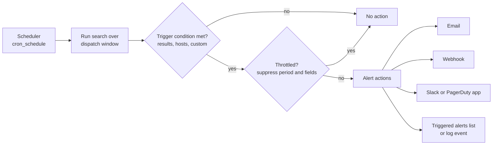

# Splunk: Alerts and Dashboards

> Scheduled and real-time alerts, trigger conditions, throttling, alert actions, alert fatigue and SLO-style alerting, Classic Simple XML and Dashboard Studio, tokens and drilldowns, summary indexing and acceleration, and a short ITSI overview.

## Key Concepts

### Scheduled vs Real-Time Alerts

An alert is a saved search with a schedule, a trigger condition, and actions.

- **Scheduled alert:** runs on a cron schedule over a fixed time window, for example every 5 minutes over the last 10 minutes. This is the default choice.
- **Real-time alert:** runs all the time. It can trigger **per result** (every matching event) or over a **rolling window** (for example "more than 50 errors in the last 5 minutes"). It holds a search slot on the search head and the indexers all the time, so use it rarely.

A scheduled alert every 1 to 5 minutes is close enough to real time for almost all DevOps use cases and is much cheaper.

### Alert Flow

The scheduler starts the search, the trigger condition decides if it fires, throttling decides if it is a duplicate, and then actions run. Each step writes to `_internal`, so you can follow an alert end to end.



### Trigger Conditions and Throttling

- **Trigger on:** number of results, number of hosts, number of sources, or a custom condition (a search run on the results).
- **Trigger mode:** **once** for the whole result set (`alert.digest_mode = 1`), or **for each result** (`alert.digest_mode = 0`), for example one notification per failing service.
- **Throttling:** after an alert fires, suppress it for a period. With **suppress fields**, the suppression is per value, so `payments` failing does not hide `orders` failing.

```ini
# savedsearches.conf
[AppGW 5xx rate high]
search = index=web sourcetype=azure:monitor:resource category=ApplicationGatewayAccessLog \
  | rename properties.* as * \
  | stats count as total count(eval(httpStatus>=500)) as errors by originalHost \
  | eval error_rate_pct=round(errors/total*100,2) \
  | where total>100 AND error_rate_pct>2
enableSched = 1
cron_schedule = */5 * * * *
dispatch.earliest_time = -10m@m
dispatch.latest_time = now
counttype = number of events
relation = greater than
quantity = 0
alert.digest_mode = 0
alert.suppress = 1
alert.suppress.period = 30m
alert.suppress.fields = originalHost
alert.severity = 5
alert.track = 1
action.webhook = 1
action.webhook.param.url = https://alerts.example.internal/splunk
```

### Alert Actions

| Action | Notes |
| --- | --- |
| Email | Built in. Supports tokens like `$name$` and `$result.originalHost$`. |
| Webhook | Built in. POSTs JSON with the search name, results link, and the first result row. |
| Log event / add to triggered alerts | Built in. Useful for audit and for a "triggered alerts" view. |
| Output results to lookup | Built in. Saves state for later searches. |
| Slack, PagerDuty, ServiceNow, Jira | Through apps from Splunkbase that add custom alert actions. |

### Alert Fatigue and SLO-Style Alerting

Alerts that fire too often get ignored. Good alerts are about **user impact** (error rate, latency, failed transactions), have an owner and a runbook link, and page only when someone must act now. Everything else goes to a ticket or a channel.

SLO-style alerts fire on **error budget burn rate** instead of raw counts. If the SLO is 99.9% success, the budget is 0.1% errors. A burn rate of 1 uses the budget exactly over the SLO period. A common pattern is a fast-burn page (high burn rate over 1 hour, confirmed over 5 minutes) and a slow-burn ticket (lower burn rate over 6 hours).

### Dashboards: Simple XML and Dashboard Studio

- **Classic dashboards (Simple XML):** the older framework. XML source, many examples online, supports custom JavaScript and CSS.
- **Dashboard Studio:** the newer framework. JSON definition, absolute or grid layout, better visuals, and data sources like `ds.search` and `ds.chain` (post-process). It does not run custom JavaScript.
- **Tokens:** variables set by inputs (dropdowns, time pickers) or by clicks (drilldowns), and used inside searches as `$token$`.
- **Base search and post-process:** one search feeds several panels, which cuts search load.

### Summary Indexing and Acceleration

| Method | How it works | Good for |
| --- | --- | --- |
| Report acceleration | Splunk builds summaries for one saved report with a transforming command | One slow report used often |
| Summary indexing | A scheduled search writes its results into a summary index with `collect` or the summary indexing action | Long-term trends, custom roll-ups |
| Data model acceleration | Builds `tsidx` summaries for a data model, queried with `tstats` | Many searches over the same CIM data |

### ITSI in One Paragraph

Splunk IT Service Intelligence (ITSI) is a premium app for service monitoring. You define **services** and their dependencies, and attach **KPIs** (searches such as error rate or latency) with static or **adaptive thresholds**. ITSI calculates a **service health score**, shows it on the Service Analyzer and **glass tables**, and groups related notable events into **episodes** with aggregation policies, so on-call engineers see one episode instead of fifty alerts.

See also: [Splunk: SPL Queries](02-spl-queries.md), [Azure: Application Gateway and WAF](../azure/07-application-gateway-and-waf.md), [Monitoring Tools: Grafana and Alertmanager](../monitoring-tools/03-grafana-and-alertmanager.md), and [Ops: SRE](../ops/03-sre.md).

## Interview Questions

<details><summary>Q1. [Basic] What is the difference between a scheduled alert and a real-time alert?</summary>

**Answer:**

A **scheduled alert** runs on a cron schedule over a fixed window, like every 5 minutes over the last 10 minutes. A **real-time alert** runs continuously and checks events as they arrive, either per result or over a rolling window.

I use scheduled alerts by default. Real-time searches hold a search slot on the search head and every indexer all the time. A handful of real-time alerts can take a big share of search capacity that scheduled searches need. I only use real-time for rare, critical cases where a minute of delay is not acceptable, and even then a 1-minute schedule usually works.

**Pitfall:** set the window a bit wider than the schedule (for example `-10m@m` for a 5-minute schedule) and snap it, so late events and run delays do not create gaps. Then use throttling to avoid duplicate alerts from the overlap.

</details>

<details><summary>Q2. [Basic] What trigger conditions can an alert use, and what is the difference between "once" and "for each result"?</summary>

**Answer:**

Trigger conditions:

- **Number of results** greater than, less than, equal to, or changed by a value.
- **Number of hosts** or **number of sources** in the results.
- **Custom:** a search on the results, for example `search error_rate_pct > 5`.

Trigger mode:

- **Once:** one notification for the whole result set, for example "3 services are failing".
- **For each result:** one notification per row, for example one PagerDuty incident per failing service.

Usually I put the logic in the search itself (`where error_rate_pct > 2`) and trigger on "number of results greater than 0". The search is then easy to test by running it by hand.

</details>

<details><summary>Q3. [Intermediate] How does alert throttling work, and how do you throttle per service? <em>(scenario)</em></summary>

**Answer:**

After an alert fires, throttling suppresses new triggers for a set period. Without suppress fields, the whole alert is silent for that period. With suppress fields, Splunk remembers each value and only blocks repeats of the same value.

```ini
alert.digest_mode = 0                   # for each result
alert.suppress = 1
alert.suppress.period = 30m
alert.suppress.fields = originalHost
```

With this, if `payments.example.com` fires at 10:00, a new `payments` result at 10:05 is suppressed, but `orders.example.com` at 10:05 still fires.

**How to verify:** suppressed runs show up in `index=_internal sourcetype=scheduler savedsearch_name="AppGW 5xx rate high"` (look at the `suppressed` and `alert_actions` fields), and in the alert's triggered history.

**Pitfall:** a throttle period much longer than the outage hides a second, different incident on the same service. Keep it close to the time someone needs to respond.

</details>

<details><summary>Q4. [Intermediate] How do you send Splunk alerts to Slack, PagerDuty, or a custom webhook?</summary>

**Answer:**

- **Webhook (built in):** set `action.webhook.param.url`. Splunk POSTs JSON with `search_name`, `results_link`, `sid`, and `result` (the first result row). Good for a small service that formats the message or opens tickets.
- **Slack:** install the Slack alert action app from Splunkbase, configure a webhook URL, then choose the channel and message per alert.
- **PagerDuty:** install the PagerDuty app, add the integration key, and choose it as an action. Use "for each result" so each service becomes its own incident.

Example webhook body from Splunk:

```json
{
  "search_name": "AppGW 5xx rate high",
  "results_link": "https://splunk.example.internal/app/search/@go?sid=...",
  "result": { "originalHost": "payments.example.com", "error_rate_pct": "7.4" }
}
```

**How to verify:** check alert action logs with `index=_internal sourcetype=splunkd component=sendmodalert`, which shows the action name and exit code.

**Pitfall:** the built-in webhook sends only the first result row. If you need all rows, use a custom alert action or have the receiver call the results link API.

</details>

<details><summary>Q5. [Intermediate] Design an alert for "Application Gateway 5xx error rate above 2% for 10 minutes" end to end. <em>(scenario)</em></summary>

**Answer:**

1. **Search:** calculate the rate per site (`originalHost`), with a minimum traffic filter, over the last 10 minutes.

```text
index=web sourcetype=azure:monitor:resource category=ApplicationGatewayAccessLog earliest=-10m@m latest=@m
| rename properties.* as *
| stats count as total count(eval(httpStatus>=500)) as errors by originalHost
| eval error_rate_pct=round(errors/total*100, 2)
| where total >= 200 AND error_rate_pct > 2
| lookup service_owners.csv originalHost OUTPUT service team runbook
```

2. **Schedule:** every 5 minutes. Keep `schedule_window = 0` (the default) so the scheduler does not delay a critical alert, and raise `schedule_priority`.
3. **Trigger:** number of results > 0, for each result.
4. **Throttle:** 30 minutes, by `originalHost`.
5. **Action:** PagerDuty for the owning team, with the runbook link from the lookup in the message.
6. **Test:** run the search over a past incident window, then trigger it in staging.

**Pitfall:** Application Gateway writes access logs about every 60 seconds, then they go through the Event Hub and the add-on, so data can be several minutes late. For faster alerting, an Azure Monitor metric alert on the gateway's `ResponseStatus` metric (split by `HttpStatusGroup`) can be better, and Splunk is used for investigation.

</details>

<details><summary>Q6. [Advanced] On-call gets hundreds of Splunk alerts a week and ignores most of them. How do you fix alert fatigue? <em>(scenario)</em></summary>

**Answer:**

1. **Measure first.** Count triggers per alert and per owner:

```text
index=_audit action=alert_fired earliest=-30d
| stats count by ss_name, ss_app
| sort - count
```

2. **Classify each alert:** did someone act on it? If not in the last month, delete it or make it a report.
3. **Alert on symptoms, not causes.** Page on user-facing error rate and latency. CPU on one host is a ticket, not a page.
4. **Add context:** owner, severity, runbook link, and a drilldown search in every alert.
5. **Use rates and baselines** instead of raw counts, with minimum volume filters.
6. **Throttle and group:** suppress by service, or use ITSI episodes so related alerts become one.
7. **Split by urgency:** page only for "act now", send the rest to a Slack channel or ticket queue.
8. **Review regularly:** a monthly review of top noisy alerts with the teams.

**Result to aim for:** every page is actionable. If an alert fires and the answer is "ignore it", the alert is the bug.

TODO (Siva): add a real example of an alert you tuned or removed, and what changed afterwards.

</details>

<details><summary>Q7. [Advanced] How do you build SLO burn-rate alerts in Splunk?</summary>

**Answer:**

Say the SLO is 99.9% of requests succeed over 30 days. The error budget is 0.1%. Burn rate = current error ratio divided by 0.001. A burn rate of 14.4 for 1 hour uses about 2% of a 30-day budget; that is a common fast-burn page threshold (from the Google SRE Workbook).

```text
index=web sourcetype=azure:monitor:resource category=ApplicationGatewayAccessLog earliest=-60m@m latest=@m
| rename properties.* as *
| eval bad=if(httpStatus>=500, 1, 0), recent=if(_time >= relative_time(now(), "-5m@m"), 1, 0)
| stats sum(bad) as bad_1h count as total_1h
        sum(eval(bad*recent)) as bad_5m sum(recent) as total_5m by originalHost
| eval burn_1h=(bad_1h/total_1h)/0.001, burn_5m=(bad_5m/total_5m)/0.001
| where burn_1h > 14.4 AND burn_5m > 14.4 AND total_1h > 500
```

The short window confirms the problem is still happening, so the alert resolves quickly after a fix. Add a second, slow-burn alert (for example burn rate above 6 over 6 hours) that creates a ticket.

For long windows like 30 days, I write a 5-minute roll-up into a summary index and calculate the remaining budget from that, instead of scanning 30 days of raw logs.

**Pitfall:** low-traffic services make the ratio jump. Use a minimum request count, or a longer window for them.

</details>

<details><summary>Q8. [Basic] What is the difference between Classic Simple XML dashboards and Dashboard Studio?</summary>

**Answer:**

| | Classic (Simple XML) | Dashboard Studio |
| --- | --- | --- |
| Source format | XML | JSON |
| Layout | Rows and panels | Absolute (free placement) or grid |
| Visuals | Standard charts | More visual options, images, shapes |
| Custom JS and CSS | Supported | Not supported |
| Post-process | `<search base="...">` | `ds.chain` data source |

For new operational dashboards I use Dashboard Studio. I keep Simple XML only when a dashboard depends on custom JavaScript, and plan to move away from that.

**Pitfall:** converting a Simple XML dashboard to Studio is not always one-to-one. Test tokens and drilldowns after conversion.

</details>

<details><summary>Q9. [Intermediate] How do tokens and drilldowns work in Splunk dashboards?</summary>

**Answer:**

A token is a variable. Inputs set tokens, and searches use them as `$name$`.

**Simple XML: a dropdown and a click that sets a token:**

```xml
<input type="dropdown" token="env">
  <label>Environment</label>
  <choice value="prod">prod</choice>
  <choice value="staging">staging</choice>
  <default>prod</default>
</input>
...
<table>
  <search><query>index=app_$env$ level=ERROR | stats count by service</query></search>
  <drilldown>
    <set token="sel_service">$row.service$</set>
  </drilldown>
</table>
```

A second panel uses `service="$sel_service$"` and only shows after the click (`depends="$sel_service$"`).

**Dashboard Studio:** the same idea in JSON, with an event handler:

```json
"eventHandlers": [
  { "type": "drilldown.setToken",
    "options": { "tokens": [ { "token": "sel_service", "key": "row.service.value" } ] } }
]
```

Common built-in tokens: `$click.value$`, `$row.<field>$`, and time picker tokens like `$time.earliest$`.

**Pitfall:** values with spaces or quotes break the search. Use the `|s` filter (`$sel_service|s$`) in Simple XML to quote them.

</details>

<details><summary>Q10. [Intermediate] A shared operations dashboard is slow and overloads the search heads every morning. What do you do? <em>(scenario)</em></summary>

**Answer:**

1. **Find the cost:** check search activity in the Monitoring Console and the dashboard's searches in the Job Inspector.
2. **Use one base search** with post-process for panels over the same data, instead of ten separate searches.
3. **Use `tstats`** on accelerated data models or indexed fields where possible.
4. **Schedule heavy panels:** make them saved reports that run every 15 minutes, and have the panel load the latest result (`ref=` in Simple XML, saved search data source in Studio). Many viewers then share one job.
5. **Accelerate:** report acceleration or a summary index for long time ranges.
6. **Limit refresh:** no 30-second auto-refresh on 30-day panels.
7. **Default time range:** short by default (last 4 hours), with longer ranges on request.

**Pitfall:** a base search that returns raw events (no transforming command) is limited in how many events it passes to post-process. Make the base search a `stats` and post-process from there.

</details>

<details><summary>Q11. [Intermediate] What is the difference between summary indexing, report acceleration, and data model acceleration?</summary>

**Answer:**

- **Report acceleration:** you tick a box on a saved report that has a transforming command. Splunk builds and maintains summaries for that report automatically. Easy, but only helps that one report.
- **Summary indexing:** you schedule a search that writes pre-aggregated results into a summary index. You control the format and keep it as long as you want. You must handle gaps if the scheduled search is skipped.
- **Data model acceleration:** builds `tsidx` summaries for a whole data model. Any `tstats` search on that model benefits. Best for shared, CIM-based data.

```text
index=web sourcetype=azure:monitor:resource category=ApplicationGatewayAccessLog earliest=-5m@m latest=@m
| rename properties.* as *
| stats count as total count(eval(httpStatus>=500)) as errors by originalHost
| collect index=summary_web source="appgw_5m_rollup"
```

**Pitfalls:** `collect` with a sourcetype other than the default `stash` counts against the license. Summary data does not backfill itself; use the `fill_summary_index.py` script or a manual backfill when runs are skipped.

</details>

<details><summary>Q12. [Basic] What is Splunk ITSI, and when would a team need it?</summary>

**Answer:**

ITSI is a premium Splunk app for service-level monitoring. Key terms:

- **Service:** a business or technical service, like "checkout", with dependencies.
- **KPI:** a search that measures the service, like error rate, with thresholds.
- **Adaptive thresholds:** thresholds learned from history by time of day and day of week.
- **Service health score:** a combined score from the KPIs and dependent services.
- **Glass table:** a custom visual of services and KPIs.
- **Episodes:** related notable events grouped by aggregation policies, reviewed in Episode Review.

A team needs it when there are many services and alerts, and they want one view of service health and fewer, grouped incidents. For a small setup, good saved searches and dashboards are usually enough. ITSI has its own license cost.

</details>

<details><summary>Q13. [Advanced] How do you manage Splunk alerts and dashboards as code across environments?</summary>

**Answer:**

I keep saved searches, dashboards, macros, and lookups in a Splunk **app** in Git.

- **Structure:** `default/savedsearches.conf`, `default/data/ui/views/*.xml` or Studio JSON, `default/macros.conf`, `lookups/`. Users' own edits land in `local/`, which is not in Git.
- **Macros for environment differences:** `` `web_index` `` expands to `index=web_prod` or `index=web_staging`, so the same alert works everywhere.
- **Pipeline:** lint and package the app, run AppInspect checks (required for private apps in Splunk Cloud), then deploy: the SHC deployer on Enterprise, or app install through ACS on Cloud.
- **Alternative:** the Splunk Terraform provider or the REST API (`/servicesNS/<owner>/<app>/saved/searches`) to manage saved searches. Good for a few objects; an app is cleaner for many.
- **Review:** every alert change goes through a pull request with the owner, the reason, and a test result.

**How to verify:** after deploy, `| rest /servicesNS/-/my_alerts_app/saved/searches | table title cron_schedule disabled` on the search head.

**Pitfall:** someone edits an alert in the UI, which writes to `local/` and overrides the Git version silently. Check for `local/` changes regularly, or restrict who can edit shared alerts.

</details>
