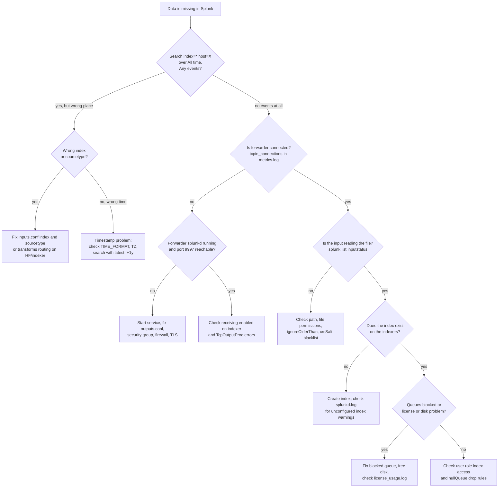

# Splunk: Troubleshooting

> How to troubleshoot forwarders that stop sending, data in the wrong index or sourcetype, timestamp and line-breaking problems, license violations, slow and skipped searches, blocked queues and full disks, using internal logs, metrics.log, and btool.

## Key Concepts

### Where Data Gets Lost

Data goes from the source to the forwarder, over the network to the indexer (or HEC), through the parsing pipeline, and into an index. Then a user searches it with a role and a time range. A problem at any step looks the same to the user: "my data is missing". Check the steps in order instead of guessing.



### Internal Indexes and Logs

| Index or log | What it tells you |
| --- | --- |
| `_internal` | Splunk's own logs from every instance, including forwarders |
| `splunkd.log` | Errors and warnings from every component (`component=TcpOutputProc`, `DateParserVerbose`, `LineBreakingProcessor`) |
| `metrics.log` | Every 30 seconds: queue sizes, throughput per index, sourcetype, host, and forwarder connections |
| `license_usage.log` | Bytes indexed per index, sourcetype, host, and source (on the license manager) |
| `scheduler.log` | Scheduled search runs, status `success`, `skipped`, or `continued`, and the reason |
| `_audit` | Who searched what, logins, alert triggers |
| `_introspection` | Resource usage: CPU, memory, disk per process and search |

Forwarders send their own `_internal` logs to the indexers by default, so you can debug most forwarder problems from the search head.

### The Indexing Pipeline and Queues

Each pipeline step has a queue: **parsingQueue**, **aggQueue** (merging and timestamps), **typingQueue** (regex and transforms), **indexQueue** (writing to disk). When a later step is slow, its queue fills and blocks the queues before it, all the way back to the forwarders.

```text
index=_internal source=*metrics.log group=queue
| eval fill_pct=round(current_size_kb/max_size_kb*100, 1)
| timechart span=5m max(fill_pct) by name
```

The **first** queue in the chain that is full is usually not the cause. The **last** full queue points to the slow step.

### btool

`btool` shows the merged config Splunk actually uses, and which file each line came from. It is the fastest way to answer "why is my setting not applied".

```bash
$SPLUNK_HOME/bin/splunk btool inputs list --debug
$SPLUNK_HOME/bin/splunk btool props list myapp:log --debug
$SPLUNK_HOME/bin/splunk btool outputs list tcpout --debug
$SPLUNK_HOME/bin/splunk btool check            # finds typos and unknown settings
```

In the global context, precedence is `system/local`, then app `local`, then app `default`, then `system/default`. On cluster peers, bundles pushed from the cluster manager win. In Splunk Cloud you cannot run `btool` on Splunk-managed instances; use `| rest` searches and support instead.

### Monitoring Console

The Monitoring Console has ready-made views for indexing performance, queue fill, search activity, skipped searches, license usage, forwarder status, and cluster health. Set it up in distributed mode so it covers every instance. It is often faster than writing your own internal searches.

See also: [Splunk: Architecture](01-architecture-forwarders-indexers-search-heads.md) and [AWS: Monitoring and Troubleshooting](../aws/04-monitoring-and-troubleshooting.md).

## Interview Questions

<details><summary>Q1. [Basic] Which internal indexes and logs do you use to troubleshoot Splunk itself?</summary>

**Answer:**

- **`index=_internal`** for Splunk's own logs. The main sources are `splunkd.log` (errors), `metrics.log` (throughput and queues), `license_usage.log`, and `scheduler.log`.
- **`index=_audit`** for searches run, logins, and alerts fired.
- **`index=_introspection`** for CPU, memory, and disk use.

Starter search for errors across the deployment:

```text
index=_internal sourcetype=splunkd log_level IN (ERROR, WARN) earliest=-1h
| stats count by host, component
| sort - count
```

**Pitfall:** `_internal` has short retention by default (30 days). If you need longer history for capacity planning, roll up the important metrics into a summary index.

</details>

<details><summary>Q2. [Basic] What is <code>btool</code>, and how do you use it?</summary>

**Answer:**

`btool` reads all `.conf` files the way Splunk does, merges them by precedence, and prints the result. With `--debug` it shows which file each setting came from.

```bash
splunk btool inputs list monitor:///var/log/myapp/app.log --debug
splunk btool props list myapp:log --debug | grep -E "TIME_|LINE_BREAKER|TRUNCATE"
splunk btool indexes list app_prod --debug
splunk btool check
```

I use it when a setting "does not work": usually another app sets the same key with higher precedence, or the stanza name is wrong (for example `[myapp:log]` in one file and `[myapp_log]` in another).

**Pitfall:** `btool` shows what is on disk, not what the running process loaded. Many changes need a restart or reload before they take effect.

</details>

<details><summary>Q3. [Intermediate] A universal forwarder stopped sending data. How do you troubleshoot it? <em>(scenario)</em></summary>

**Answer:**

**1. From the search head, check if the forwarder still connects:**

```text
index=_internal source=*metrics.log group=tcpin_connections earliest=-24h
| stats latest(_time) as last_seen by hostname, sourceIp, fwdType, version
| eval minutes_ago=round((now()-last_seen)/60)
| sort - minutes_ago
```

If its `_internal` logs still arrive but the app data does not, the connection works and the problem is the input. If nothing arrives, it is the forwarder or the network.

**2. On the forwarder host:**

```bash
sudo systemctl status SplunkForwarder        # or: $SPLUNK_HOME/bin/splunk status
$SPLUNK_HOME/bin/splunk list forward-server   # Active vs "configured but inactive"
$SPLUNK_HOME/bin/splunk list inputstatus      # is the file being read, and how far
nc -vz idx1.example.internal 9997             # network and security group
grep -E "TcpOutputProc|ERROR" $SPLUNK_HOME/var/log/splunk/splunkd.log | tail -50
```

**3. Common causes:**

- Wrong `server` in `outputs.conf`, or the indexer is not listening on 9997.
- Security group, NACL, or firewall change.
- TLS certificate expired or mismatch.
- File permissions: the `splunk` user cannot read the log file after rotation.
- The file looks "already seen" because the first 256 bytes did not change (use `crcSalt = <SOURCE>` or `initCrcLength` carefully).
- `ignoreOlderThan` skips files with old modification times.
- Deployment server pushed an app that disabled the input.

**How to verify:** new events appear with a small `_indextime - _time` lag.

</details>

<details><summary>Q4. [Intermediate] Data arrives in the wrong index or with the wrong sourcetype. How do you find and fix the cause? <em>(scenario)</em></summary>

**Answer:**

1. **Find where it went:**

```text
| tstats count where index=* host=web-01 earliest=-4h by index, sourcetype, source
```

2. **Check the input on the forwarder:** `splunk btool inputs list --debug`. A missing `index =` means data goes to `main`. A missing `sourcetype =` makes Splunk guess, which gives names like `app-too_small` or `access_combined-2`.
3. **Check routing on the HF or indexers:** a `TRANSFORMS-` rule with `DEST_KEY = _MetaData:Index` or `MetaData:Sourcetype` may override the input.
4. **Check if the index exists:** if it does not exist on the indexers, events are dropped (or sent to `lastChanceIndex` if set), and `splunkd.log` warns about an unconfigured index:

```text
index=_internal sourcetype=splunkd "unconfigured" OR "lastChanceIndex" earliest=-24h
| stats count by host, message
```

5. **Check HEC tokens:** the token's default index applies when the event has no `index`, and an index not in the allowed list is rejected.

**Fixing old data:** you cannot move indexed events between indexes. Re-index from the source if possible. For short-term use, `| collect` into the right index works, but with a non-`stash` sourcetype it counts against the license again.

</details>

<details><summary>Q5. [Intermediate] Events have the wrong timestamp, or appear in the future. How do you fix it? <em>(scenario)</em></summary>

**Answer:**

**Symptoms:** "data is missing" in the last 15 minutes, but it exists with a time hours away; or many events with the same time.

**1. Find it:**

```text
index=app_prod sourcetype=myapp:log earliest=-24h latest=+1y
| eval lag_sec=_indextime-_time
| stats min(lag_sec) max(lag_sec) avg(lag_sec) count by host
```

A negative lag means events are in the future, which usually means a time zone problem.

**2. Check parser warnings:**

```text
index=_internal sourcetype=splunkd component=DateParserVerbose earliest=-24h
| stats count by host, message
```

**3. Fix `props.conf`** on the HF or indexers:

```ini
[myapp:log]
TIME_PREFIX = ^\[
TIME_FORMAT = %Y-%m-%d %H:%M:%S,%3N
MAX_TIMESTAMP_LOOKAHEAD = 25
TZ = UTC
```

**Why it happens:** no `TIME_FORMAT`, so Splunk guesses and picks another date in the line; no time zone in the log and the host is not UTC; or the date is outside `MAX_DAYS_AGO` / `MAX_DAYS_HENCE`, so Splunk uses the previous event's time.

**Pitfall:** the fix only applies to new data. Wrong timestamps already indexed stay wrong.

</details>

<details><summary>Q6. [Intermediate] Multi-line events are split into pieces, or many lines are merged into one huge event. How do you fix line breaking? <em>(scenario)</em></summary>

**Answer:**

**Find the warnings:**

```text
index=_internal sourcetype=splunkd (component=LineBreakingProcessor OR component=AggregatorMiningProcessor) earliest=-24h
| stats count by host, component, message
```

- `LineBreakingProcessor ... Truncating line` means an event is longer than `TRUNCATE` (default 10,000 bytes).
- `AggregatorMiningProcessor ... Breaking event because limit of 256 has been exceeded` means line merging hit `MAX_EVENTS`.

**Fix:** turn off line merging and break on a regex that matches the start of each event. This is also faster.

```ini
[myapp:log]
SHOULD_LINEMERGE = false
LINE_BREAKER = ([\r\n]+)(?=\d{4}-\d{2}-\d{2}[ T]\d{2}:\d{2}:\d{2})
TRUNCATE = 50000
```

The first capture group in `LINE_BREAKER` is the text removed between events. A Java stack trace stays with its log line, because the trace lines do not start with a date.

For JSON logs from containers, make sure the app writes one JSON object per line. Then a simple `LINE_BREAKER = ([\r\n]+)` works and `KV_MODE = json` extracts fields at search time.

**How to verify:** test the sourcetype with a sample file in "Add Data" preview before deploying.

</details>

<details><summary>Q7. [Intermediate] Splunk shows license warnings. What do they mean and what do you do? <em>(scenario)</em></summary>

**Answer:**

A **warning** is created when daily indexed volume goes over the license on a day. A **violation** happens after too many warnings in a rolling window. For a Splunk Enterprise license stack below 100 GB/day, 45 warnings in 60 days is a violation. During a violation, search is blocked (except internal indexes), but indexing continues. Stacks of 100 GB/day and above do not violate under the same rule. Splunk Cloud handles overages through the subscription instead.

**Find what grew:**

```text
index=_internal source=*license_usage.log type=Usage earliest=-14d@d
| eval GB=b/1024/1024/1024
| timechart span=1d sum(GB) by st limit=10
```

Then split the top sourcetype by `h` (host) and `s` (source). These two fields may show as `SQUASHED` when there are too many values; then use `| tstats count where index=<idx> by host` to find the noisy host.

**Fix:**

- Drop or sample noisy events at the HF (`nullQueue`, Ingest Actions).
- Turn off debug logging that was left on after an incident.
- Stop duplicate inputs (the same file read by two apps).
- Alert on daily volume per index before you hit the limit.

**Pitfall:** indexes that are not needed still cost license. Agree a volume budget with each team.

</details>

<details><summary>Q8. [Intermediate] Users say searches are slow. How do you find out whether it is the search or the platform? <em>(scenario)</em></summary>

**Answer:**

**1. The search itself:** open the **Job Inspector**. Look at total run time, events scanned vs results, and which phase is slow. A search that scans 500 million events to return 10 rows needs a better base search, not more hardware.

**2. The platform:** check concurrency and resources:

```text
index=_introspection sourcetype=splunk_resource_usage component=Hostwide earliest=-4h
| eval cpu_pct='data.cpu_system_pct'+'data.cpu_user_pct'
| timechart span=5m avg(cpu_pct) by host
```

```text
index=_audit action=search info=completed earliest=-24h
| stats count avg(total_run_time) as avg_sec max(total_run_time) as max_sec by user
| sort - avg_sec
```

**3. Common platform causes:** too many concurrent searches, real-time searches holding slots, a large knowledge bundle (big lookups) slowing distributed search, a slow or overloaded indexer (searches wait for the slowest peer), or storage IOPS limits.

**Fix:** tune the worst searches, move heavy dashboards to scheduled reports, set role search quotas, and add indexers if the indexing tier is the bottleneck.

</details>

<details><summary>Q9. [Advanced] Many scheduled searches are being skipped. How do you troubleshoot and fix it? <em>(scenario)</em></summary>

**Answer:**

**Find what is skipped and why:**

```text
index=_internal sourcetype=scheduler status=skipped earliest=-24h
| stats count by savedsearch_name, app, reason
| sort - count
```

**How the limit works:** maximum concurrent historical searches = `max_searches_per_cpu` x CPU cores + `base_max_searches` (defaults 1 and 6). The scheduler may use 50% of that (`max_searches_perc`), and data model and report acceleration may use 50% of the scheduler share (`auto_summary_perc`). On a 16-core search head that is 22 searches in total and 11 for the scheduler.

**Common reasons and fixes:**

| Reason in the log | Fix |
| --- | --- |
| Maximum concurrent historical scheduled searches reached | Spread cron times (not everything at `*/5` on minute 0), use `schedule_window`, remove unused searches |
| Maximum concurrent running jobs for this search reached | The search runs longer than its interval. Make it faster or run it less often |
| Search head cluster member capacity | Add members or reduce load, since the captain spreads jobs across members |

**Pitfall:** do not just raise `max_searches_per_cpu`. More concurrency on the same CPUs makes every search slower and can overload the indexers too. Fix the search load first.

</details>

<details><summary>Q10. [Advanced] Indexing is delayed and forwarders show blocked output. How do you find the bottleneck in the indexing pipeline? <em>(scenario)</em></summary>

**Answer:**

**1. Which queues are blocked, and where:**

```text
index=_internal source=*metrics.log group=queue blocked=true earliest=-4h
| stats count by host, name
| sort - count
```

**2. Read the chain:** parsing, then aggregation, then typing, then indexing. The **last** blocked queue in the chain is the slow step:

| Last blocked queue | Likely cause |
| --- | --- |
| indexqueue | Disk I/O too slow, disk full, or replication to other peers is slow |
| typingqueue | Expensive regex in `TRANSFORMS-` or `SEDCMD` |
| aggqueue | Line merging (`SHOULD_LINEMERGE = true`) and timestamp guessing |
| parsingqueue | Heavy line breaking, or all later queues backed up |

**3. Check the indexer:** disk I/O wait (`iostat -x 5`), free space, and replication errors in `splunkd.log`.

**4. Check balance:** if one indexer gets most of the data, forwarders are "sticking" to it. Set `EVENT_BREAKER_ENABLE = true` with an `EVENT_BREAKER` on the UF for that sourcetype, so it can switch indexers safely during a stream, and check `autoLBFrequency`.

**Fix examples:** faster disks or more indexers, `SHOULD_LINEMERGE = false` with an explicit `LINE_BREAKER`, simpler regex, and dropping noisy data earlier.

**How to verify:** queue fill drops below about 80%, and `_indextime - _time` lag returns to seconds.

</details>

<details><summary>Q11. [Advanced] An indexer is almost out of disk and the cluster says the search factor is not met. What do you do? <em>(scenario)</em></summary>

**Answer:**

**What happens:** when free space on an indexer drops below `minFreeSpace` (`server.conf [diskUsage]`, default 5000 MB), it stops indexing. Data backs up to forwarders, and the cluster may not be able to place bucket copies, so RF or SF is not met.

**Steps:**

1. **Check status** on the cluster manager:

```bash
splunk show cluster-status --verbose
df -h $SPLUNK_DB
du -sh $SPLUNK_DB/* | sort -h | tail
```

2. **Find what grew:** a new noisy sourcetype, an index with no size limit, or retention set longer than the disk can hold.
3. **Short term:** lower `maxTotalDataSizeMB` or `frozenTimePeriodInSecs` for the biggest index through the cluster bundle, so old buckets freeze; or add disk. Do not delete bucket directories by hand on a clustered peer.
4. **Let fixup finish:** watch pending fixup tasks on the cluster manager until RF and SF are met again.
5. **Long term:** size indexes per volume (`[volume:]` with `maxVolumeDataSizeMB`), alert at 75% disk, or move to SmartStore.

**Pitfall:** restarting peers one by one during a fixup storm without maintenance mode starts even more fixup work and can make it worse.

</details>

<details><summary>Q12. [Advanced] Applications sending to HEC get errors and some events are missing. How do you troubleshoot? <em>(scenario)</em></summary>

**Answer:**

**1. Look at the HTTP response the client got:**

| Response | Meaning |
| --- | --- |
| 400 | Bad payload, for example JSON not wrapped in `{"event": ...}`, or an invalid index |
| 401 / 403 | Missing, wrong, or disabled token, or the index is not allowed for this token |
| 503 "Server is busy" | Indexer queues are full, so HEC rejects data |
| Timeout | Load balancer, security group, or TLS problem |

**2. Check Splunk's side:**

```text
index=_internal sourcetype=splunkd component=HttpInputDataHandler earliest=-1h
| stats count by host, message
```

```text
index=_introspection sourcetype=http_event_collector_metrics data.token_name=* earliest=-1h
| stats sum(data.num_of_events) as events sum(data.num_of_errors) as errors by data.token_name
```

**3. Check the sender:** Firehose sends failed events to its S3 backup bucket; Fluent Bit logs retries and drops; apps using HEC acknowledgment should retry when an ack never arrives.

**4. Check the load balancer:** health checks on `/services/collector/health`, and stickiness for acknowledgment channels.

**Fix:** clients must retry with backoff on 503, and the HEC tier must have enough capacity. Blocked indexer queues (Q10) are the most common root cause of 503.

</details>

<details><summary>Q13. [Intermediate] Tell me about a Splunk production problem you troubleshot.</summary>

**Answer:**

TODO (Siva): describe one real incident: the symptom users saw, the internal searches or commands you used, the root cause, the fix, and what you changed to stop it happening again.

</details>
