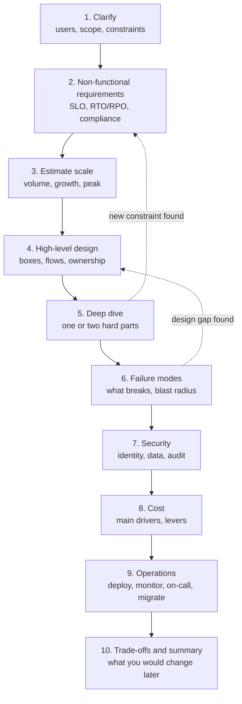

# System Design: Approach and Framework

> How to run a DevOps or platform system-design interview from start to finish: requirements, scale estimates, high-level design, deep dives, failure modes, security, cost, operations, and trade-offs, plus a reusable checklist and the mistakes to avoid.

## Key Concepts

### What a DevOps Design Interview Tests

A DevOps or platform design round is not about drawing the "right" picture. The interviewer wants to see how you think when the problem is vague, how you make trade-offs, and whether you design for day two: deploys, upgrades, on-call, cost, and audits. For a Lead role they also check if you think about people: many teams, adoption, ownership, and migration.

Typical prompts:

- Design a CI/CD platform for 50 teams.
- Design multi-region disaster recovery on Azure.
- Design a centralized logging platform.
- Design secrets management for the whole company.
- Design a Kubernetes platform, an observability stack, or an internal developer platform.

The same framework works for all of them. See the worked examples in this folder: [CI/CD platform](02-cicd-platform-for-50-teams.md), [multi-region DR](03-multi-region-dr-on-azure.md), [logging platform](04-centralized-logging-platform.md), and [secrets management](05-secrets-management-at-scale.md).

### The Framework, Step by Step

Move through the steps in order, but loop back when you learn something new. Keep the time boxes in mind so you never run out of time before the deep dive.



Suggested time split for a 45 to 60 minute round:

| Step | Time | Output |
| --- | --- | --- |
| Clarify and requirements | 5 to 8 min | Written list of requirements and assumptions |
| Estimate scale | 3 to 5 min | Three or four numbers that drive the design |
| High-level design | 10 to 12 min | One diagram with the main flows |
| Deep dive | 10 to 15 min | Details of the hardest one or two components |
| Failure, security, cost, operations | 8 to 10 min | Risks and how the design handles them |
| Trade-offs and wrap-up | 3 to 5 min | Summary, open questions, next steps |

### Clarify Requirements and Constraints

Never start drawing straight away. Ask questions, write the answers down, and state assumptions when the interviewer says "you decide".

- **Users and scope:** Who uses it (developers, SREs, auditors, customers)? What is in scope and what is not?
- **Functional requirements:** What must it do? For example, "build, test, scan, and deploy services to AKS and App Service".
- **Non-functional requirements:** Availability target, latency, RTO and RPO, retention, throughput, consistency.
- **Constraints:** Existing cloud and tools, budget, team size, compliance (SOC 2, PCI DSS, HIPAA, GDPR), data residency, deadlines.
- **Brownfield or greenfield:** What exists today, and what must keep working during migration?

A good habit is to split requirements into "must have now" and "later". It keeps the design small and shows prioritization.

### Estimate Scale

You only need rough numbers. Their job is to decide things like "one cluster or many", "hot storage for 7 days or 30", or "do we need a queue". Round hard and show the math out loud.

```text
Logging example:
  2,000 pods x 50 log lines/s x 300 bytes  = 30 MB/s
  30 MB/s x 86,400 s                       = about 2.6 TB/day raw
  Peak factor x3 during incidents          = about 90 MB/s at peak
  14 days hot, compressed about 10:1      = about 3.6 TB hot storage
CI example:
  50 teams x 20 pipeline runs/day          = 1,000 runs/day
  Peak hour = 25% of daily runs, 15 min each = 250 runs/hour, about 60 concurrent jobs
```

Useful numbers to remember: 1 day is about 86,400 seconds (round to 100,000), 1 million requests per day is about 12 per second on average, and peak is often 3 to 10 times the average.

### High-Level Design and Deep Dive

Draw the main boxes and the data or control flows between them. Name real services, but explain the role, not just the product: "a durable buffer (Kafka or Azure Event Hubs)" is better than just "Kafka". Show who owns each box, because ownership drives operations.

Then pick one or two hard parts and go deep. Good deep-dive topics are the ones with real trade-offs: data replication in DR, multi-tenancy in a CI platform, the buffer and back-pressure in a logging pipeline, or identity and rotation in secrets management. Ask the interviewer which part they want to explore; it saves time and shows you listen.

### Failure Modes, Security, Cost, and Operations

These four topics separate a senior answer from a junior one. Cover them for every design, even briefly.

- **Failure modes:** For each component ask "what if it is slow, down, or wrong?" Name the blast radius and how you detect it. Remember dependencies people forget: DNS, Entra ID, Key Vault, certificates, the CI system itself, and the control plane of the cloud.
- **Security:** Identity for humans and workloads, least privilege, encryption in transit and at rest, secrets, network boundaries, audit logs, and supply chain (signed artifacts, SBOMs).
- **Cost:** Name the top two or three cost drivers (compute, storage, data transfer, licences) and the levers (autoscaling, spot, tiering, retention, sampling).
- **Operations:** How the platform itself is deployed (IaC, GitOps), monitored (SLOs and alerts), upgraded, and supported (on-call, runbooks). Add how teams adopt it and how you migrate from the old system.

### Trade-offs

Every decision gives up something. Say it out loud with a simple pattern: "I choose X over Y because of requirement Z. The cost is W. If Z changes, I would switch to Y."

| Common trade-off | Lean one way when | Lean the other way when |
| --- | --- | --- |
| Managed service vs self-hosted | Small team, standard needs | Special compliance, very high scale, cost at scale |
| Shared vs dedicated per team | Cost and consistency matter | Strong isolation or noisy neighbours |
| Active-active vs active-passive | Near-zero RTO, data model allows it | Simpler ops, relational database, lower budget |
| Push vs pull deployments | Simple pipelines | Many clusters, drift detection (GitOps) |
| Build vs buy | Core differentiator | Commodity capability |

### Reusable Checklist

Keep this in your head (or on the whiteboard corner) for every design question:

```text
[ ] Users, scope, in/out of scope
[ ] Functional requirements (must now / later)
[ ] SLO, RTO/RPO, latency, retention, compliance, residency
[ ] Scale: volume, growth over 1-3 years, peak factor
[ ] High-level diagram with flows and owners
[ ] Deep dive on 1-2 hard parts
[ ] Failure modes and blast radius; how we detect each
[ ] Security: identity, least privilege, encryption, secrets, audit, supply chain
[ ] Multi-tenancy and quotas (if shared platform)
[ ] Cost drivers and levers
[ ] Operations: IaC, upgrades, monitoring of the platform, on-call, runbooks
[ ] Migration and adoption plan
[ ] Trade-offs, risks, what I would do differently with more time/budget
```

### Common Mistakes

- Jumping to tools ("we use Kubernetes and Kafka") before knowing the requirements.
- Designing for Google scale when the prompt is 50 teams, or the reverse.
- One giant diagram with no flows, no owners, and no numbers.
- Forgetting the platform itself must be monitored, upgraded, backed up, and paid for.
- Never naming a trade-off, so every choice sounds like the only option.
- Ignoring people and process: adoption, migration, documentation, and support load.
- Talking for 10 minutes without checking in with the interviewer.
- Saying "it is highly available" without explaining what fails over, how, and how fast.

## Interview Questions

<details><summary>Q1. [Basic] How do you structure your answer in a 45 minute system-design round?</summary>

**Answer:**

I follow the same framework every time, so I never lose track:

1. **Clarify (5 to 8 min):** users, scope, functional and non-functional requirements, constraints. I write them on the board.
2. **Estimate (3 to 5 min):** a few numbers that drive the design, like requests per second, data per day, or concurrent jobs.
3. **High-level design (10 min):** one diagram with the main components and flows.
4. **Deep dive (10 to 15 min):** one or two hard parts, ideally the ones the interviewer cares about.
5. **Failure, security, cost, operations (8 min):** what breaks, how we protect it, what it costs, how we run it.
6. **Wrap-up (3 min):** summary, trade-offs, and what I would do next.

I check in at each step: "Does this match what you had in mind, or should I focus somewhere else?"

**Pitfall:** spending 25 minutes on requirements and boxes, then having no time left for the deep dive, which is where most of the signal is.

</details>

<details><summary>Q2. [Basic] What is the difference between functional and non-functional requirements? Give DevOps examples.</summary>

**Answer:**

Functional requirements say **what** the system does. Non-functional requirements say **how well** it must do it.

| Functional | Non-functional |
| --- | --- |
| Build and deploy a service on every merge to main | 95% of pipelines finish in under 15 minutes |
| Collect logs from all AKS pods and App Service apps | Logs searchable within 60 seconds, kept 30 days hot |
| Fail the app over to a second region | RTO 15 minutes, RPO 1 minute |
| Give apps database credentials | Credentials rotate every 24 hours, every read is audited |

In DevOps designs the non-functional ones usually drive the architecture. A 15 minute RTO forces warm standby; a 1 minute RPO forces continuous replication instead of nightly backups.

</details>

<details><summary>Q3. [Intermediate] What clarifying questions do you ask before you start drawing?</summary>

**Answer:**

I group them so I do not forget any:

- **Who and what:** Who are the users? What is in and out of scope? Is this greenfield or replacing something?
- **Scale:** How many teams, services, regions, requests or events per second? Expected growth in 1 to 3 years?
- **Targets:** Availability SLO, latency, RTO and RPO, retention, freshness.
- **Constraints:** Which cloud and tools exist today? Budget? Team size to run it? Deadlines?
- **Compliance:** Regulated data (PCI, HIPAA, PII)? Data residency? Audit needs?
- **Operations:** Who will run it and who is on call?

If the interviewer says "you decide", I state an assumption and move on: "I will assume 50 teams, 300 services, Azure only, SOC 2 compliance, and a platform team of five."

**Pitfall:** asking 20 questions without writing the answers down, so the requirements never actually shape the design.

</details>

<details><summary>Q4. [Intermediate] Walk through a back-of-the-envelope estimate for a DevOps design. <em>(scenario)</em></summary>

**Answer:**

I keep it to a few numbers that change a decision. Example for a CI platform:

```text
Teams: 50, services: about 300
Runs per day: 50 teams x 20 runs        = 1,000 runs/day
Peak hour: about 25% of daily runs      = 250 runs/hour
Average run: 15 min, 3 parallel jobs    = 250 x 3 x 0.25 h = about 190 concurrent jobs at peak
Runner size: 4 vCPU                     = about 760 vCPU at peak, near 0 at night
Artifacts: 1,000 runs x 500 MB images   = 500 GB/day before dedup and cleanup
```

What these numbers decide:

- Peak is far above the night baseline, so I need **autoscaling runners**, not a fixed fleet.
- 760 vCPU at peak makes **Spot VMs** worth it for stateless jobs.
- 500 GB/day of images means I need **retention policies** on the registry from day one.

**Pitfall:** being too precise. Round to the nearest power of ten when it does not change the decision.

</details>

<details><summary>Q5. [Intermediate] How do SLOs, RTO, and RPO change your design?</summary>

**Answer:**

They set how much redundancy and automation I need, and they set the cost.

- **SLO** (for example 99.9% monthly) gives an error budget of about 43 minutes per month. A single-AZ design cannot reliably meet that, so I go multi-AZ.
- **RTO** is how long recovery may take. Hours allow backup and restore. Minutes need warm standby with pre-provisioned capacity and automated failover.
- **RPO** is how much data you may lose. 24 hours allows nightly backups. Seconds need continuous async replication. Zero needs synchronous replication, which adds write latency.

I always ask whether the targets are per service. Usually only a few critical services need tight targets, and tiering them saves a lot of money. See [multi-region DR](03-multi-region-dr-on-azure.md) for a worked example.

</details>

<details><summary>Q6. [Intermediate] How do you present trade-offs so the interviewer sees your reasoning?</summary>

**Answer:**

I use one short pattern for every decision: **choice, reason, cost, trigger to change.**

> "I choose a shared runner pool over dedicated pools per team, because it is cheaper and easier to patch. The cost is noisy neighbours and a bigger blast radius. I limit that with per-team quotas and a separate pool for production deploys. If a team has special compliance needs, they get a dedicated pool."

I also list one or two options I rejected and why. That shows I considered alternatives without wasting time on them.

**Pitfall:** saying "it depends" and stopping there. Always finish with what it depends on and what you would pick here.

</details>

<details><summary>Q7. [Advanced] How do you do failure-mode analysis on your own design during the interview? <em>(scenario)</em></summary>

**Answer:**

I walk the main flow from left to right and, for each box, ask three questions: **what if it is down, slow, or wrong?**

| Component | Failure | Effect | Mitigation | Detection |
| --- | --- | --- | --- | --- |
| Log agent | Destination down | Logs lost | Disk buffer, retries | Agent buffer size metric |
| Message buffer | Broker lost | Ingest stops | Zone-redundant Event Hubs, or 3 Kafka brokers across zones | Consumer lag and throttling alerts |
| Indexer | Slow queries | Search slow, ingest lags | Separate ingest and query capacity | Indexing lag SLO |
| Entra ID / Key Vault | Role assignment or access policy change | Everything fails closed | RBAC as code, review | Activity Log alerts |

Then I look at **shared dependencies** people forget: DNS, Entra ID, Key Vault, certificates, the CI/CD system, the container registry, and the cloud control plane. A good design keeps the data plane working when the control plane is impaired, for example DR failover that does not depend on the primary region's APIs.

Finally I state the **blast radius**: one team, one AZ, one region, or everyone. If a single failure hits everyone, I look for a way to split it into cells or tenants.

</details>

<details><summary>Q8. [Advanced] Halfway through, the interviewer changes a requirement, for example "the RPO is now zero". What do you do? <em>(scenario)</em></summary>

**Answer:**

This is usually on purpose. They want to see if I can adapt without panic.

1. **Restate it:** "So we cannot lose any committed write, even in a full region failure."
2. **Find what breaks:** My design used async replication (a PostgreSQL Flexible Server read replica in the second region, lag usually seconds). Async cannot give zero RPO.
3. **Offer options with costs:**
   - Synchronous replication across regions, for example Azure Cosmos DB with strong consistency and one write region, which adds write latency and limits how far apart the regions can be.
   - Write to a durable multi-region log or queue first and replay into the database after failover.
   - Push back: zero RPO for every service is very expensive. Can we limit it to payments data only?
4. **Update the diagram** and say what else changes: latency, cost, and failover runbook.

The key signal is that I do not throw the design away. I change the part that the new requirement touches and explain the ripple effect.

</details>

<details><summary>Q9. [Advanced] The interviewer names a tool you have not used. How do you handle it?</summary>

**Answer:**

I am honest and then reason from first principles.

> "I have not run Loki in production. I have used Splunk. What I know is that Loki indexes only labels and stores compressed chunks in object storage, so it is cheaper to store but full-text search is slower. If that is right, I would design the labels carefully and keep cardinality low."

Then I map the tool to the role it plays (index, buffer, store, scheduler) and design around the role. Interviewers care more about the reasoning than about knowing every product.

TODO (Siva): add one real example of a tool you learned quickly on the job and how you approached it.

</details>

<details><summary>Q10. [Advanced] How do you cover security in a platform design without it taking over the whole interview?</summary>

**Answer:**

I use a short, fixed list and touch each point in one or two sentences:

1. **Identity:** SSO with Entra ID for humans, short-lived workload identity for machines (managed identities, OIDC federation, AKS workload identity). No long-lived keys.
2. **Least privilege:** Per-team or per-service roles; separate production permissions.
3. **Data:** Encryption at rest (customer-managed keys in Key Vault where needed), TLS in transit, classification and PII handling.
4. **Secrets:** Central store, rotation, no secrets in repos or pipeline variables.
5. **Network:** Private VNets, NSGs, Private Endpoints, no public admin access (Azure Bastion or private agents).
6. **Supply chain:** Signed artifacts, SBOMs, scanning, admission policies.
7. **Audit:** Azure Activity Log and Entra ID audit logs in Log Analytics, immutable storage for long-term copies, alerts on sensitive actions.

Then I go deeper only on the point that matters most for this design. For a CI platform it is pipeline identity and supply chain. For logging it is PII and access control. See [secrets management](05-secrets-management-at-scale.md).

</details>

<details><summary>Q11. [Advanced] How do you talk about cost in a design interview?</summary>

**Answer:**

I name the **top cost drivers**, give a rough number if I can, and list the **levers**.

- **Compute:** autoscaling, right-sizing, Spot VMs for stateless work, reservations or an Azure savings plan for the steady base.
- **Storage:** tiers (hot, warm, cold), retention policies, compression, lifecycle rules.
- **Data transfer:** cross-region replication traffic, internet egress, and NAT Gateway data processing; keep chatty services in the same region.
- **Licences:** per-GB pricing (for example Splunk ingest) can be the largest cost in logging.

For a Lead role I also mention **showback**: tag resources by team, publish cost per team, and set budgets and alerts. Teams change behaviour when they see their own number. See [FinOps](../ops/04-finops.md).

**Pitfall:** treating cost as an afterthought. In DR and logging designs, cost often decides between two technically valid options.

</details>

<details><summary>Q12. [Advanced] How do you include migration and adoption in a platform design?</summary>

**Answer:**

A platform that nobody adopts has failed, so I always add a short migration plan:

1. **Pilot:** two or three friendly teams with different stacks; fix the rough edges with them.
2. **Golden path:** make the new way easier than the old way (templates, docs, self-service).
3. **Waves:** migrate teams in groups, with office hours and a clear support channel.
4. **Run both:** keep the old system read-only or in parallel for a set period; measure parity.
5. **Deadline and decommission:** announce a date, track progress per team, and switch off the old system.

I measure success with adoption numbers and outcome metrics, for example DORA metrics for a CI platform, or "percentage of secrets in the vault" for secrets management.

</details>

<details><summary>Q13. [Intermediate] What are the most common mistakes candidates make in DevOps design rounds?</summary>

**Answer:**

- Naming tools before requirements.
- Over-engineering (active-active everywhere) or under-engineering (one big server).
- No numbers, so there is no reason behind sizing decisions.
- No failure analysis; "it is HA" without saying how.
- Forgetting the platform's own monitoring, upgrades, backups, and on-call.
- No cost discussion.
- Not talking about multi-tenancy for shared platforms.
- Not checking in with the interviewer, so the deep dive goes where they do not care.

I avoid them by following the [checklist](#reusable-checklist) above and saying each step out loud.

</details>

<details><summary>Q14. [Advanced] How do you close the interview, and what do you say when asked "what would you do differently"?</summary>

**Answer:**

I give a 60 second summary: the requirements, the main design choice, the biggest risk, and how it is handled. Then I list next steps I would take with more time:

- Load test the riskiest component to confirm the estimates.
- Run a game day to prove failover or recovery targets.
- Add cells or sharding when we grow past the current estimate.
- Revisit build vs buy after six months of real cost data.

For "what would you do differently", I pick one honest weakness in my own design, for example "the shared indexer cluster is a big blast radius; at 3x the scale I would split it per business unit." Showing that I can critique my own design is a strong senior signal.

</details>
