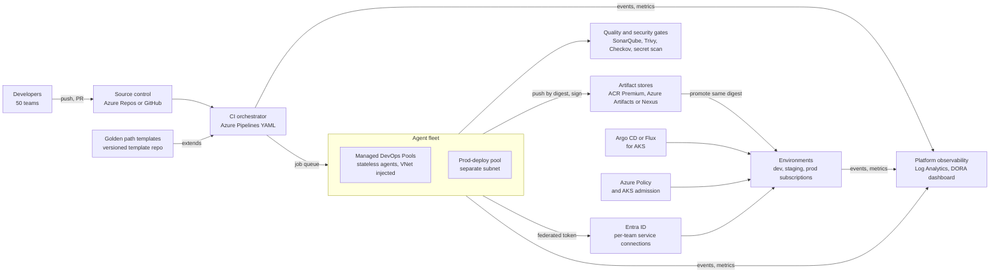

# System Design: CI/CD Platform for 50 Teams

> Designing a shared CI/CD platform on Azure for about 50 product teams: golden paths and templates, autoscaling agents, artifact management, environments and promotion, secrets, policy gates, multi-tenancy and quotas, platform observability, DORA metrics, and a migration plan.

## Key Concepts

### Requirements

Start by agreeing on scope and numbers. A reasonable set of assumptions if the interviewer says "you decide":

- **Users:** 50 teams, about 300 services, mostly containers on AKS, some App Service and Azure Functions apps, plus Terraform/OpenTofu and Bicep repos.
- **Functional:** build, test, scan, package, sign, and deploy on every merge; promote the same artifact through dev, staging, and production; self-service onboarding for a new service in under a day.
- **Non-functional:** 95% of pipelines start within 1 minute and finish in under 15 minutes; platform availability 99.9% during working hours; every production change is traceable to a commit, a pipeline run, and an approver.
- **Security and compliance:** no client secrets or long-lived keys in pipelines, signed artifacts, separation of duties for production, audit trail for SOC 2.
- **Constraints:** a platform team of about 5 engineers; existing tools are mixed (mostly Azure DevOps, some Jenkins, some GitHub Actions or GitLab CI).

Rough scale: 1,000 pipeline runs per day, about 200 concurrent jobs at peak, close to zero at night. That shape is why autoscaling agents and standby schedules matter.

### Architecture

The platform has a control layer (Azure Repos or GitHub, and Azure Pipelines), a shared template library, an autoscaling agent fleet, artifact stores, policy and security gates, and deployment targets. Pipelines reach Azure through service connections that use workload identity federation, so there is no stored secret. Every component emits events to a metrics store that powers platform SLOs and DORA dashboards.



TODO (Siva): adjust the diagram to your real stack, for example which teams use Azure DevOps versus Jenkins or GitHub Actions, whether you deploy to AKS, App Service, or both, and where your Terraform/OpenTofu and Bicep pipelines run.

### Golden Paths and Templates

A golden path is the supported, easiest way to build and ship a service. It is not a mandate for everything; it is a paved road that covers about 80% of cases.

- **Template library:** one repo with versioned pipeline templates (build-container, deploy-aks-helm, deploy-app-service, terraform-plan-apply, bicep-what-if-deploy). Teams reference a tag, not `main`.
- **Thin team pipelines:** a team's pipeline file is 10 to 20 lines that call templates with parameters.
- **Enforcement:** Azure DevOps can require that a pipeline `extends` an approved template. You add the "Required template" check on protected resources such as service connections, agent pools, and environments. GitHub can use reusable workflows plus rulesets that require specific workflows to pass.
- **Scaffolding:** a service template (Backstage or a simple cookiecutter) creates the repo, pipeline, Bicep or Terraform, dashboards, and alerts in one step.

```yaml
# azure-pipelines.yml in a team repo
resources:
  repositories:
    - repository: templates
      type: git
      name: platform/pipeline-templates
      ref: refs/tags/v3.4.0
extends:
  template: service/aks-helm-service.yml@templates
  parameters:
    serviceName: payments-api
    dockerfile: Dockerfile
    environments: [dev, staging, prod]
```

### Agents, Autoscaling, and Multi-Tenancy

Shared agents save money and make patching easy, but they need isolation and quotas.

- **Ephemeral agents:** one job per agent, then the VM is reset to a clean image or destroyed. No state leaks between teams, and no "works on agent 3" problems.
- **Managed DevOps Pools (default):** Microsoft runs the VMs; you choose the image, the size, the maximum agents, and a standby schedule (for example 10 warm agents from 8:00 to 18:00 on weekdays, zero at night). Use stateless pools for builds. Pools can join your VNet to reach private endpoints.
- **VM scale set agents:** the older option where the scale set lives in your subscription. It is still fine, but it scales in bigger steps and supports only one image per pool.
- **GitHub Actions or GitLab teams:** run self-hosted runners on AKS (Actions Runner Controller or the GitLab Runner Kubernetes executor), with the cluster autoscaler and a Spot node pool for cheap, stateless builds.
- **Pools by trust level:** a general build pool, a separate prod-deploy pool in its own subnet with stricter NSG rules, and optional dedicated pools for teams with special needs (larger disks, compliance).
- **Quotas:** a maximum agent count per pool, pools restricted to certain projects, job timeouts, and `maxParallel` in matrix jobs. This stops one team's runaway matrix build from starving everyone.
- **Caching:** ACR artifact cache for upstream images, a package proxy (Azure Artifacts upstream sources or Nexus), and pipeline caching keep builds fast on fresh agents.

See [runners and pipeline performance](../ci-cd/06-runners-and-pipeline-performance.md) for agent details.

### Artifacts, Environments, and Promotion

- **Build once, promote many:** build the image once, push it to ACR by digest, and promote that exact digest through environments. Never rebuild for production.
- **Immutability:** lock released images in ACR (`az acr repository update --write-enabled false`), sign images with Notation and a signing certificate in Key Vault, and attach an SBOM.
- **Retention:** a scheduled `acr purge` task deletes untagged and old images; keep anything deployed to production for the audit period.
- **Environments:** separate Azure subscriptions (or at least resource groups) for dev, staging, and prod under a management group. Promotion is a pipeline stage with checks: tests passed, scans clean, approval given, business hours open, no active Azure Monitor alerts.
- **Deploy strategies:** deployment slots and slot swap for App Service; rolling, blue/green, or canary for AKS with Helm, or Argo CD or Flux with Argo Rollouts for progressive delivery. Roll back on failed health checks or alerts.

See [environments and promotion](../ci-cd/03-environments-promotion-and-approvals.md) and [artifact versioning and promotion](../artifact-repositories/05-pipeline-artifacts-versioning-and-promotion.md).

### Secrets and Policy Gates

- **No stored cloud keys:** Azure Resource Manager service connections use workload identity federation. Azure DevOps gets a short-lived token from Entra ID for an app registration or a user-assigned managed identity. GitHub Actions uses the same idea with a federated credential on the identity. Each team gets its own identity and service connection per environment.
- **App secrets:** live in Key Vault. Pipelines read them through a variable group linked to Key Vault or the `AzureKeyVault@2` task. Apps on AKS read them at runtime with workload identity and the Secrets Store CSI driver.
- **Policy as code:** Checkov on Terraform plans and Bicep, Azure Policy on subscriptions (allowed locations, no public IPs, private endpoints required), and Azure Policy for AKS (Gatekeeper) or Kyverno in clusters (only images from approved registries).
- **Gates in the template:** secret scanning, SonarQube quality gate, dependency scan, Trivy image scan with a severity threshold, licence check. Teams cannot remove them, but they can request time-boxed exceptions that are recorded.

```bash
# One deploy identity per team and environment, scoped to the team's resource group
az identity create -g rg-cicd-identities -n id-payments-prod
PRINCIPAL_ID=$(az identity show -g rg-cicd-identities -n id-payments-prod --query principalId -o tsv)
az role assignment create \
  --assignee-object-id "$PRINCIPAL_ID" --assignee-principal-type ServicePrincipal \
  --role "Contributor" \
  --scope "/subscriptions/<prod-sub-id>/resourceGroups/rg-payments-prod"

# Azure DevOps: create an ARM service connection of type "Managed identity" for this identity;
# Azure DevOps adds the federated credential for you.
# GitHub Actions: add a federated credential that trusts only the prod environment of one repo
az identity federated-credential create -g rg-cicd-identities --identity-name id-payments-prod \
  --name gh-payments-prod \
  --issuer https://token.actions.githubusercontent.com \
  --subject repo:my-org/payments-api:environment:prod \
  --audiences api://AzureADTokenExchange
```

In a real setup I would use a custom role with only the deploy actions the team needs, not `Contributor`.

### Platform Observability and DORA Metrics

Treat the platform as a product with its own SLOs.

- **Platform SLIs:** queue wait time (job queued to job started), pipeline success rate excluding test failures, agent provisioning time, ACR push and pull latency, template error rate.
- **Alerts:** queue wait p95 above 2 minutes for 10 minutes, agent provisioning failures, ACR 5xx or throttling, service connection token failures.
- **Data sources:** Azure DevOps Analytics (OData) for pipeline runs, audit streaming from Azure DevOps to Log Analytics or Splunk, and Azure Monitor metrics for pools and ACR.
- **DORA metrics:** deployment frequency, lead time for changes, change failure rate, and failed deployment recovery time (earlier called time to restore). Newer DORA reports also track rework rate. Collect them from pipeline and deploy events plus incident data, per team.
- **Cost showback:** agent minutes and storage per team, published monthly, using tags and Azure Cost Management.

### Trade-offs

| Decision | Choice | Cost | Switch when |
| --- | --- | --- | --- |
| Shared vs per-team pools | Shared stateless pools with limits; a few dedicated pools | Noisy neighbours, larger blast radius | A team has strict isolation or special hardware needs |
| One CI tool vs many | Standardize on Azure Pipelines over time | Migration effort | Never fully; keep a small exception list |
| Push deploy vs GitOps | Push for App Service and Functions, GitOps for AKS | Two models to support | Most workloads move to AKS |
| Managed DevOps Pools vs self-hosted agents on AKS | Managed DevOps Pools for less platform work | No Spot VMs or reservations, less control | Cost dominates, or teams use GitHub Actions or GitLab runners |
| Strict gates vs advisory | Block on critical issues only, warn on others | Some risk accepted | Regulated workloads need stricter gates |

### Migration Plan

1. **Discover:** inventory pipelines, tools, secrets, service connections, and deploy targets per team.
2. **Build the paved road:** templates for the three most common service types, plus agent pools and federated service connections.
3. **Pilot:** three teams with different stacks; fix friction; publish docs and examples.
4. **Waves:** about 10 teams per wave, office hours, a migration checklist, and pairing.
5. **Parallel run:** old and new pipelines run side by side until the new one is trusted.
6. **Decommission:** freeze the old system, delete secret-based service connections and stored keys, and shut it down.

## Interview Questions

<details><summary>Q1. [Advanced] Design a CI/CD platform on Azure for 50 product teams. <em>(scenario)</em></summary>

**Answer:**

**1. Clarify.** I would ask: how many services and deploys per day, which runtimes (AKS, App Service, Functions), which CI tools exist today, compliance needs, and how big the platform team is. I assume 50 teams, about 300 services, Azure with separate subscriptions per environment, Azure DevOps as the main tool, SOC 2, and a platform team of five.

**2. Requirements.**

- Build, test, scan, sign, and deploy on every merge; promote the same artifact through environments.
- Onboard a new service in under a day.
- p95 queue wait under 1 minute, p95 pipeline under 15 minutes.
- No secrets in service connections; full audit trail for production changes.

**3. Estimate.** 1,000 runs per day, peak about 200 concurrent jobs, near zero at night. About 500 GB of new images per day before cleanup. This tells me: autoscaling agents with a standby schedule, enough purchased parallel jobs, and ACR retention from day one.

**4. High-level design.**

- **SCM and orchestrator:** Azure Repos (or GitHub) and Azure Pipelines YAML. Branch policies with required reviewers and build validation.
- **Template library:** versioned golden-path templates; team pipelines are thin and `extends` the templates. The "Required template" check enforces it.
- **Agent fleet:** Managed DevOps Pools with stateless agents, VNet injected, standby agents in working hours, and a separate prod-deploy pool.
- **Artifacts:** ACR Premium with private endpoints, locked release images, Notation signatures, SBOMs; Azure Artifacts or Nexus as a proxy for packages.
- **Identity:** workload identity federation service connections, one identity per team per environment, RBAC scoped to the team's resource group or AKS namespace.
- **Policy:** SonarQube, Trivy, Checkov, and secret scanning in templates; Azure Policy on subscriptions and AKS.
- **Deploy:** Helm or Argo CD for AKS with canary or blue/green; slot swap for App Service.
- **Observability:** platform SLOs in Azure Monitor, DORA dashboards per team, cost showback.

**5. Deep dive: multi-tenancy.** Each team gets its own service connections with approvals and checks, its own environments, and pipeline permissions granted only to its pipelines. Agents run each job on a fresh VM. Container builds use BuildKit or `az acr build`, so we do not need privileged Docker on shared agents. The prod-deploy pool runs in a separate subnet, is allowed only for production stages, and is the only pool whose network can reach the production private endpoints.

**6. Failure modes.**

- Agent pool down or out of quota: jobs queue; alert on queue wait; keep a small fallback pool (Microsoft-hosted agents or a scale set pool) for urgent hotfixes.
- ACR or package proxy down: builds fail; ACR is zone-redundant by default in regions with availability zones, and Premium can be geo-replicated; the proxy has cached content.
- Bad template release: teams pin template versions; roll out new versions to a canary group first.
- Identity or RBAC misconfiguration: deploys fail closed; role assignments and service connections are managed as code (Terraform `azurerm` and `azuredevops` providers, or Bicep) with tests.

**7. Security.** Federated credentials instead of secrets, signed artifacts, separation of duties (the author cannot approve their own production deploy), secret scanning, approved Marketplace extensions only, and Azure DevOps audit logs streamed to the central log platform.

**8. Cost.** Main drivers are agent compute, parallel jobs, and storage. Levers: standby schedules that drop to zero at night, caching, job timeouts, ACR purge tasks, and showback per team.

**9. Operations.** The platform itself is deployed with Terraform/OpenTofu or Bicep, has an on-call rotation, runbooks, a status page, and a support channel. Templates follow semantic versioning with a changelog.

**10. Migration.** Pilot with three teams, then waves of about 10, parallel run, then decommission old tools and delete secret-based service connections.

**11. Trade-offs.** Shared pools are cheaper but add blast radius; I limit it with per-pool maximums and separate pools. Strict gates improve security but slow teams; I block only on critical findings and allow recorded exceptions.

</details>

<details><summary>Q2. [Advanced] Peak load grows 5x after a reorg. How does your agent fleet scale, and what breaks first? <em>(scenario)</em></summary>

**Answer:**

Managed DevOps Pools scale out one agent at a time up to the pool maximum. What usually breaks first is not the agents but the limits around them:

- **Parallel jobs:** Azure DevOps runs only as many self-hosted jobs at once as the organization has paid parallel jobs. Extra jobs wait in the queue even if agents are free.
- **Pool maximum and regional quota:** raise the pool's maximum agents and request more quota for the VM size in that region.
- **Cold starts:** a new agent VM takes minutes. Use the standby schedule (or automatic standby) during working hours.
- **Subnet size:** a VNet-injected pool needs one IP per agent. Size the delegated subnet for the new maximum. For runners on AKS, Azure CNI Overlay avoids pod IP exhaustion.
- **ACR and package proxy:** thousands of pulls can hit throttling. Use ACR Premium, artifact cache for upstream images, and a proxy for packages.
- **Outbound traffic:** NAT Gateway SNAT ports and data processing cost. Private endpoints for ACR, Storage, and Key Vault keep that traffic off the NAT path.

```bash
az pipelines pool list --org https://dev.azure.com/my-org -o table
az pipelines agent list --pool-id 42 --org https://dev.azure.com/my-org -o table
az acr show-usage -n acrplatform -o table
```

**Verify:** load test by triggering a burst of dummy pipelines and watch queue wait time, agent provisioning time, and ACR throttling metrics.

</details>

<details><summary>Q3. [Advanced] The whole agent pool is down during a production incident and a team needs to ship a hotfix. What does your design do? <em>(scenario)</em></summary>

**Answer:**

**Immediate:** a documented break-glass path. Options I would design in advance:

- A small fallback pool on a different substrate (Microsoft-hosted agents or a scale set pool) that the templates can target with one parameter.
- The prod-deploy pool is separate from the build pool, so a build-pool problem does not stop deploys of already-built artifacts.
- Rollback must not need a build: redeploy the previous image digest, or swap the App Service slots back.

**Prevent:** pools are defined as code, spread across zones where supported, and have alerts on queue wait and provisioning errors. The platform has an SLO and an on-call owner.

**Pitfall:** a break-glass path that bypasses all gates. It should skip only the broken part, still use the federated service connection, and still log who used it and why.

</details>

<details><summary>Q4. [Intermediate] One team's matrix build is using all the agents and other teams are waiting. How do you fix it now and prevent it? <em>(scenario)</em></summary>

**Answer:**

**Now:** cancel or limit the runaway runs and tell the team. Raise the pool maximum or parallel jobs temporarily if budget allows.

**Prevent:**

- Separate pools per team group, each with its own maximum agents, and pools restricted to specific projects.
- `maxParallel` on matrix jobs and `timeoutInMinutes` on every job in the templates.
- Batch CI triggers and auto-cancel of superseded PR builds.
- The "Exclusive lock" check on environments so only one deploy runs at a time.
- Showback so the team sees the cost.

```yaml
jobs:
  - job: test
    timeoutInMinutes: 30
    strategy:
      maxParallel: 4
      matrix:
        node18: { nodeVersion: '18.x' }
        node20: { nodeVersion: '20.x' }
        node22: { nodeVersion: '22.x' }
    steps:
      - task: NodeTool@0
        inputs:
          versionSpec: $(nodeVersion)
      - script: npm ci && npm test
```

</details>

<details><summary>Q5. [Advanced] How do you stop team A's pipeline from deploying to team B's production resources?</summary>

**Answer:**

Isolation happens at the identity layer, not only in the CI tool.

- Each team and environment has its own service connection and its own identity. Its Azure RBAC role is scoped to that team's resource group. On AKS with Azure RBAC, the role can be scoped to the team's namespace.
- The service connection is not "granted to all pipelines". Only the team's pipelines are authorized to use it.
- Production service connections have checks: approvals, branch control (only `refs/heads/main`), and the Required template check. They are allowed only on the prod-deploy pool.
- Project settings "Limit job authorization scope" and "Protect access to repositories in YAML pipelines" stop a pipeline from reaching other projects.
- In Kubernetes, Argo CD AppProjects restrict which repos can deploy to which namespaces and clusters.

**Verify:** a negative test in the platform test suite that tries to deploy with team A's connection to team B's resource group and expects `AuthorizationFailed`. Activity Log alerts fire on unexpected role assignment changes, and Entra ID sign-in logs show which identity signed in.

</details>

<details><summary>Q6. [Advanced] A popular third-party pipeline task or action is compromised and leaks secrets. How does your platform limit the damage? <em>(scenario)</em></summary>

**Answer:**

**Design controls that limit blast radius:**

- Only org admins can install Marketplace extensions, and we keep an approved list. For GitHub Actions, pin third-party actions by full commit SHA.
- No long-lived secrets in the pipeline. With workload identity federation, a leaked token is short-lived and scoped to one identity.
- Minimal job token scope ("Limit job authorization scope to current project"), and secrets are not passed to builds from forks.
- Ephemeral agents, so nothing persists after the job.
- Egress controls on the agent subnet (NSG and Azure Firewall rules) where possible.

**Response:** find all runs that used the task (Azure DevOps audit log and pipeline history), rotate any Key Vault secrets those runs could read, review the Azure Activity Log for what the affected identities did, remove or pin the task to a safe version, and publish guidance to teams.

</details>

<details><summary>Q7. [Intermediate] How do you enforce policy gates without making teams hate the platform?</summary>

**Answer:**

- Put the gates in the templates, so teams get them for free.
- Block only on clear, high-severity issues (critical CVEs with a fix, leaked secrets, unsigned images in prod, a failed SonarQube quality gate on new code). Warn on the rest.
- Fast feedback: run scans in the PR build validation, not only at deploy time.
- A self-service, time-boxed exception process with an owner and expiry date, stored as code (for example a Checkov skip with a comment and a ticket).
- Publish the policy and the reason for each rule.
- Measure: how often each gate blocks, false-positive rate, and time to fix.

</details>

<details><summary>Q8. [Intermediate] Agent costs have doubled. How do you bring them down?</summary>

**Answer:**

1. **Measure:** agent minutes per team, per pipeline, and per job type; idle standby agent time.
2. **Quick wins:** tighter standby schedules (zero at night and weekends), right-size the VM SKU, job timeouts.
3. **Make builds faster:** pipeline caching, ACR artifact cache and package proxies, only build what changed in monorepos, split slow test suites.
4. **Cut waste:** batch CI triggers, cancel superseded PR runs, path filters so docs-only changes skip full pipelines.
5. **Move cheap work:** for GitHub Actions or GitLab teams, run stateless builds on a Spot node pool in AKS.
6. **Showback:** publish cost per team monthly.

**Verify:** compare cost per pipeline run before and after, not just total cost, because usage may also grow.

</details>

<details><summary>Q9. [Intermediate] How would you measure DORA metrics across 50 teams automatically?</summary>

**Answer:**

- **Deployment frequency:** count successful production deploy events per service from the deploy stage, the Azure DevOps environment history, or Argo CD.
- **Lead time for changes:** commit time of each change to the time that change reached production.
- **Change failure rate:** production deploys that led to a rollback, hotfix, or incident, divided by all production deploys.
- **Failed deployment recovery time:** time from a failed deploy (or linked incident) to recovery.

Send a standard event from the deploy template (service, version, commit SHAs, environment, result, timestamp) to Log Analytics or Application Insights. Link incidents by service and time window. Show per-team trends in a workbook or Grafana, not a leaderboard, and use them to find bottlenecks rather than to judge teams.

</details>

<details><summary>Q10. [Advanced] Teams want to customize the golden path. How do you version templates and roll out breaking changes?</summary>

**Answer:**

- **Semantic versioning:** teams pin a major version tag; minor and patch updates are backward compatible.
- **Extension points:** templates accept parameters and `stepList` hooks before and after key steps, so teams customize without forking.
- **Rollout:** release a new major to a canary group first, publish a migration guide, then give teams a deadline. Track which teams are on which version.
- **Deprecation:** warn in the pipeline log when a team uses an old version.
- **Forks:** allowed only as a documented exception, and the team owns the support.

**Pitfall:** letting teams reference `main` of the template repo. One bad commit then breaks 300 pipelines at once.

</details>

<details><summary>Q11. [Advanced] How would you migrate 50 teams from Jenkins to Azure Pipelines without stopping delivery? <em>(scenario)</em></summary>

**Answer:**

1. **Inventory:** list Jenkins jobs, plugins, credentials, and targets; group pipelines by pattern.
2. **Map patterns to templates:** most jobs fall into a few types (container service, library, Terraform or Bicep).
3. **Pilot and waves:** start with simple services, then complex ones; keep Jenkins running in parallel.
4. **Credentials:** move stored keys to federated service connections and Key Vault; revoke Jenkins credentials after each wave.
5. **Parity check:** compare artifacts, test results, and deploy outcomes between old and new pipelines.
6. **Freeze and decommission:** make Jenkins read-only, archive logs for the audit period, then shut it down.

TODO (Siva): if you have led a CI migration, add the real scope and timeline here.

</details>

<details><summary>Q12. [Intermediate] Where do pipeline secrets live in your design, and why not in pipeline variables?</summary>

**Answer:**

Azure access uses workload identity federation, so there is no cloud secret to store. App secrets live in Key Vault. Pipelines read them through a variable group linked to Key Vault or the `AzureKeyVault@2` task, and apps read them at runtime with a managed identity. Pipeline variables are only for non-sensitive config.

Secret variables typed into the CI tool are hard to rotate, often shared too widely, can leak in logs or forked PRs, and make audit difficult. See [secrets management at scale](05-secrets-management-at-scale.md).

</details>

<details><summary>Q13. [Advanced] Looking back at your design, what would you do differently or improve next?</summary>

**Answer:**

- The shared agent pool is a large blast radius. At higher scale I would split it into cells (for example per business unit) with the same templates.
- I would add progressive delivery with automatic rollback on SLO burn for every service, not only critical ones.
- I would add build provenance (SLSA level targets) and verify signatures at admission time in AKS.
- I would invest more in developer experience: a portal with service catalogue, scorecards, and one-click onboarding.
- I would revisit build vs buy for agents after six months of real cost and reliability data.

</details>
