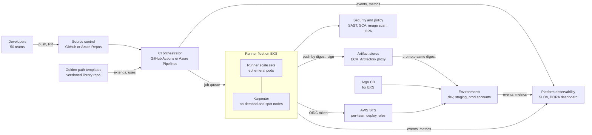

# System Design: CI/CD Platform for 50 Teams

> Designing a shared CI/CD platform for about 50 product teams: golden paths and templates, autoscaling runners, artifact management, environments and promotion, secrets, policy gates, multi-tenancy and quotas, platform observability, DORA metrics, and a migration plan.

## Key Concepts

### Requirements

Start by agreeing on scope and numbers. A reasonable set of assumptions if the interviewer says "you decide":

- **Users:** 50 teams, about 300 services, mostly containers on ECS Fargate and EKS, some Lambda and Terraform/OpenTofu repos.
- **Functional:** build, test, scan, package, sign, and deploy on every merge; promote the same artifact through dev, staging, and production; self-service onboarding for a new service in under a day.
- **Non-functional:** 95% of pipelines start within 1 minute and finish in under 15 minutes; platform availability 99.9% during working hours; every production change is traceable to a commit, a pipeline run, and an approver.
- **Security and compliance:** no long-lived cloud keys in pipelines, signed artifacts, separation of duties for production, audit trail for SOC 2.
- **Constraints:** a platform team of about 5 engineers; existing tools are mixed (some Jenkins, some Azure DevOps, some GitHub Actions).

Rough scale: 1,000 pipeline runs per day, about 200 concurrent jobs at peak, close to zero at night. That shape is why autoscaling and spot capacity matter.

### Architecture

The platform has a control layer (SCM and the CI orchestrator), a shared template library, an autoscaling runner fleet, artifact stores, policy and security checks, and deployment targets. Pipelines get cloud access through OIDC, not stored keys. Every component emits events to a metrics store that powers platform SLOs and DORA dashboards.



TODO (Siva): adjust the diagram to your real stack, for example whether your teams use Azure DevOps for build and deploy to ECS Fargate, and where Terraform/OpenTofu pipelines run.

### Golden Paths and Templates

A golden path is the supported, easiest way to build and ship a service. It is not a mandate for everything; it is a paved road that covers about 80% of cases.

- **Template library:** one repo with versioned pipeline templates (build-container, deploy-ecs, deploy-helm, terraform-plan-apply). Teams reference a tag, not `main`.
- **Thin team pipelines:** a team's pipeline file is 10 to 20 lines that call templates with parameters.
- **Enforcement:** Azure DevOps can require that pipelines `extends` an approved template (the "Required template" check on protected resources like service connections and environments). GitHub can use reusable workflows plus rulesets that require specific workflows to pass.
- **Scaffolding:** a service template (Backstage or a simple cookiecutter) creates the repo, pipeline, IaC, dashboards, and alerts in one step.

```yaml
# azure-pipelines.yml in a team repo
resources:
  repositories:
    - repository: templates
      type: git
      name: platform/pipeline-templates
      ref: refs/tags/v3.4.0
extends:
  template: service/ecs-service.yml@templates
  parameters:
    serviceName: payments-api
    dockerfile: Dockerfile
    environments: [dev, staging, prod]
```

### Runners, Autoscaling, and Multi-Tenancy

Shared runners save money and make patching easy, but they need isolation and quotas.

- **Ephemeral runners:** one job per runner pod or VM, then destroy it. No state leaks between teams, and no "works on runner 3" problems.
- **Autoscaling:** GitHub Actions Runner Controller (ARC) runner scale sets on EKS, or Azure DevOps Managed DevOps Pools or VM scale set agents. Karpenter adds nodes for pending runner pods, using spot for normal builds and on-demand for deploy jobs.
- **Pools by trust level:** a general build pool, a separate production-deploy pool with stricter network access, and optional dedicated pools for teams with special needs (GPU, compliance).
- **Quotas:** max concurrent runners per team or org, namespace `ResourceQuota` for runner pods, and job timeouts. This stops one team's runaway matrix build from starving everyone.
- **Caching:** a pull-through registry cache, package proxy (Artifactory or Nexus), and remote build caches keep builds fast on fresh ephemeral runners.

See [runners and pipeline performance](../ci-cd/06-runners-and-pipeline-performance.md) for runner details.

### Artifacts, Environments, and Promotion

- **Build once, promote many:** build the image once, push it by digest, and promote that exact digest through environments. Never rebuild for production.
- **Immutability:** ECR tag immutability, signed images (cosign or Notation), SBOM and provenance attached to the image.
- **Retention:** lifecycle policies delete untagged and old images; keep anything deployed to production for the audit period.
- **Environments:** separate AWS accounts for dev, staging, and prod. Promotion is a pipeline stage with checks: tests passed, scans clean, change approved, deploy window open.
- **Deploy strategies:** rolling or blue/green for ECS (CodeDeploy or the native ECS blue/green deployment), canary with automatic rollback on alarms; Argo CD with Argo Rollouts for EKS.

See [environments and promotion](../ci-cd/03-environments-promotion-and-approvals.md) and [artifact versioning and promotion](../artifact-repositories/05-pipeline-artifacts-versioning-and-promotion.md).

### Secrets and Policy Gates

- **No stored cloud keys:** pipelines get short-lived credentials through OIDC federation (GitHub OIDC to AWS IAM roles, Azure DevOps workload identity federation for Azure). Each team gets its own deploy role per environment.
- **App secrets:** live in Secrets Manager or Vault, read at deploy or run time, never echoed in logs.
- **Policy as code:** OPA/Conftest or Checkov on Terraform plans and Kubernetes manifests; Kyverno or Gatekeeper admission policies in clusters (only signed images from approved registries).
- **Gates in the template:** secret scanning, SAST, dependency scan, image scan with a severity threshold, licence check. Teams cannot remove them, but they can request time-boxed exceptions that are recorded.

```json
{
  "Effect": "Allow",
  "Principal": { "Federated": "arn:aws:iam::111122223333:oidc-provider/token.actions.githubusercontent.com" },
  "Action": "sts:AssumeRoleWithWebIdentity",
  "Condition": {
    "StringEquals": {
      "token.actions.githubusercontent.com:aud": "sts.amazonaws.com",
      "token.actions.githubusercontent.com:sub": "repo:my-org/payments-api:environment:prod"
    }
  }
}
```

### Platform Observability and DORA Metrics

Treat the platform as a product with its own SLOs.

- **Platform SLIs:** queue wait time (job queued to job started), pipeline success rate excluding test failures, runner start time, artifact push and pull latency, template error rate.
- **Alerts:** queue wait p95 above 2 minutes for 10 minutes, runner pod start failures, registry 5xx, OIDC assume-role failures.
- **DORA metrics:** deployment frequency, lead time for changes, change failure rate, and failed deployment recovery time (earlier called time to restore). Newer DORA reports also track rework rate. Collect them from pipeline and deploy events plus incident data, per team.
- **Cost showback:** runner minutes and storage per team, published monthly.

### Trade-offs

| Decision | Choice | Cost | Switch when |
| --- | --- | --- | --- |
| Shared vs per-team runners | Shared ephemeral pool with quotas | Noisy neighbours, larger blast radius | A team has strict isolation or special hardware needs |
| One CI tool vs many | Standardize on one over time | Migration effort | Never fully; keep a small exception list |
| Push deploy vs GitOps | Push for ECS, GitOps for EKS | Two models to support | Most workloads move to Kubernetes |
| Managed vs self-hosted runners | Self-hosted on EKS for private network and cost | Platform team runs it | Small scale, or a hosted option meets network needs |
| Strict gates vs advisory | Block on critical issues only, warn on others | Some risk accepted | Regulated workloads need stricter gates |

### Migration Plan

1. **Discover:** inventory pipelines, tools, secrets, and deploy targets per team.
2. **Build the paved road:** templates for the three most common service types, plus runners and OIDC roles.
3. **Pilot:** three teams with different stacks; fix friction; publish docs and examples.
4. **Waves:** about 10 teams per wave, office hours, a migration checklist, and pairing.
5. **Parallel run:** old and new pipelines run side by side until the new one is trusted.
6. **Decommission:** freeze the old system, remove stored keys, and shut it down.

## Interview Questions

<details><summary>Q1. [Advanced] Design a CI/CD platform for 50 product teams. <em>(scenario)</em></summary>

**Answer:**

**1. Clarify.** I would ask: how many services and deploys per day, which runtimes (ECS, EKS, Lambda), which CI tools exist today, compliance needs, and how big the platform team is. I assume 50 teams, about 300 services, AWS with separate accounts per environment, SOC 2, and a platform team of five.

**2. Requirements.**

- Build, test, scan, sign, and deploy on every merge; promote the same artifact through environments.
- Onboard a new service in under a day.
- p95 queue wait under 1 minute, p95 pipeline under 15 minutes.
- No long-lived cloud keys; full audit trail for production changes.

**3. Estimate.** 1,000 runs per day, peak about 200 concurrent jobs, near zero at night. About 500 GB of new images per day before cleanup. This tells me: autoscaling runners, spot for builds, and registry retention from day one.

**4. High-level design.**

- **SCM and orchestrator:** one standard CI tool (GitHub Actions or Azure Pipelines). Branch protection and required reviews.
- **Template library:** versioned golden-path templates; team pipelines are thin and `extends` the templates.
- **Runner fleet:** ephemeral runners on EKS with ARC runner scale sets (or Managed DevOps Pools for Azure Pipelines), Karpenter nodes, spot for builds, on-demand for deploys, separate prod-deploy pool.
- **Artifacts:** ECR with immutable tags, signed images, SBOMs; Artifactory or Nexus as a proxy cache for packages.
- **Identity:** OIDC from pipeline to AWS, one deploy role per team per environment, trust policy scoped to repo and environment.
- **Policy:** scanners and OPA checks built into templates; admission policies in clusters.
- **Deploy:** pipeline-driven blue/green or canary for ECS; Argo CD for EKS.
- **Observability:** platform SLOs, DORA dashboards per team, cost showback.

**5. Deep dive: multi-tenancy.** Each team gets a runner quota, its own IAM roles, and its own environments in the CI tool with approvals. Runner pods run as non-root with no privileged mode; container builds use a rootless builder (BuildKit rootless or Kaniko) or a remote builder. The prod-deploy pool runs in a separate node pool and subnet and is the only one that can assume production roles.

**6. Failure modes.**

- Runner fleet down: jobs queue; alert on queue wait; keep a small hosted fallback for urgent hotfixes.
- Registry or proxy down: builds fail; proxy has HA and cached content; ECR is regional and managed.
- Bad template release: teams pin template versions; roll out new versions to a canary group first.
- OIDC or IAM misconfiguration: deploys fail closed; trust policies managed in Terraform with tests.

**7. Security.** Short-lived credentials, signed artifacts, separation of duties (author cannot approve their own prod deploy), secret scanning with push protection, pinned third-party actions by commit SHA, and audit logs shipped to the central log platform.

**8. Cost.** Main drivers are runner compute and storage. Levers: spot, scale to zero at night, caching, job timeouts, registry lifecycle rules, showback per team.

**9. Operations.** The platform itself is deployed with Terraform/OpenTofu and GitOps, has an on-call rotation, runbooks, a status page, and a support channel. Templates follow semantic versioning with a changelog.

**10. Migration.** Pilot with three teams, then waves of about 10, parallel run, then decommission old tools and revoke old keys.

**11. Trade-offs.** Shared runners are cheaper but add blast radius; I mitigate with quotas and pools. Strict gates improve security but slow teams; I block only on critical findings and allow recorded exceptions.

</details>

<details><summary>Q2. [Advanced] Peak load grows 5x after a reorg. How does your runner fleet scale, and what breaks first? <em>(scenario)</em></summary>

**Answer:**

The runner layer scales horizontally: ARC creates more runner pods, Karpenter adds nodes. What usually breaks first is not the runners but the things around them:

- **Node provisioning speed:** cold nodes take minutes. Keep a small warm buffer (low-priority placeholder pods or a minimum runner count during working hours).
- **Spot capacity:** use many instance types and AZs in the Karpenter NodePool; fall back to on-demand.
- **IP addresses:** each pod uses a VPC IP with the AWS VPC CNI. Large subnets or prefix delegation prevent IP exhaustion.
- **Registry and package proxy:** thousands of pulls hit rate limits; use pull-through caches and VPC endpoints for ECR.
- **CI orchestrator limits:** API rate limits and concurrency limits on the SaaS plan.
- **NAT gateway cost and throughput:** VPC endpoints for S3 and ECR reduce NAT traffic.

```bash
kubectl get autoscalingrunnerset -A
kubectl get nodeclaims
kubectl get pods -n arc-runners --field-selector=status.phase=Pending
```

**Verify:** load test by triggering a burst of dummy pipelines and watch queue wait time and node provisioning time.

</details>

<details><summary>Q3. [Advanced] The whole runner fleet is down during a production incident and a team needs to ship a hotfix. What does your design do? <em>(scenario)</em></summary>

**Answer:**

**Immediate:** a documented break-glass path. Options I would design in advance:

- A small fallback pool on a different substrate (hosted runners or a VM scale set) that the templates can target with one parameter.
- The prod-deploy pool is separate from the build pool, so a build-pool problem does not stop deploys of already-built artifacts.
- Rollback must not need a build: redeploy the previous image digest.

**Prevent:** the runner fleet's own EKS cluster is spread across AZs, upgraded with a canary node pool, and has alerts on queue wait. The platform has an SLO and an on-call owner.

**Pitfall:** a break-glass path that bypasses all gates. It should skip only the broken part, still use OIDC, and still log who used it and why.

</details>

<details><summary>Q4. [Intermediate] One team's matrix build is using all the runners and other teams are waiting. How do you fix it now and prevent it? <em>(scenario)</em></summary>

**Answer:**

**Now:** cancel or limit the runaway runs and tell the team. Raise the pool maximum temporarily if budget allows.

**Prevent:**

- Per-team concurrency limits: separate runner scale sets per team group with `maxRunners`, or concurrency groups in the workflow.
- Kubernetes `ResourceQuota` per runner namespace.
- Job timeouts and `max-parallel` in matrix builds in the templates.
- Fair scheduling: priority classes so deploy jobs pre-empt low-priority batch jobs.
- Showback so the team sees the cost.

```yaml
strategy:
  max-parallel: 4
  matrix:
    node: [18, 20, 22]
timeout-minutes: 30
concurrency:
  group: ${{ github.workflow }}-${{ github.ref }}
  cancel-in-progress: true
```

</details>

<details><summary>Q5. [Advanced] How do you stop team A's pipeline from deploying to team B's production account?</summary>

**Answer:**

Isolation happens at the identity layer, not only in the CI tool.

- Each team and environment has its own IAM role. The OIDC trust policy checks the `sub` claim, for example `repo:my-org/payments-api:environment:prod`, so only that repo's prod environment can assume it.
- Production roles can be assumed only from the prod-deploy runner pool (network and session tags) and only after the environment approval.
- Permissions are scoped to the team's resources by tags or naming (for example `ecs:UpdateService` on its own cluster or services).
- In Kubernetes, Argo CD AppProjects restrict which repos can deploy to which namespaces and clusters.

**Verify:** a negative test in the platform test suite that tries to assume another team's role and expects `AccessDenied`. CloudTrail alerts on unexpected `AssumeRoleWithWebIdentity` failures.

</details>

<details><summary>Q6. [Advanced] A popular third-party pipeline action is compromised and leaks secrets. How does your platform limit the damage? <em>(scenario)</em></summary>

**Answer:**

**Design controls that limit blast radius:**

- Pin third-party actions or tasks by full commit SHA, not by tag. Keep an allow-list at the org level.
- No long-lived secrets in the pipeline. With OIDC, a leaked token is short-lived and scoped to one role.
- Minimal default token permissions (`permissions: contents: read`), raised per job only when needed.
- Ephemeral runners, so nothing persists after the job.
- Egress controls on runners where possible.

**Response:** find all runs that used the action (audit logs and pipeline search), rotate any secrets those runs could read, review CloudTrail for the roles they assumed, pin to a safe version or remove the action, and publish guidance to teams.

</details>

<details><summary>Q7. [Intermediate] How do you enforce policy gates without making teams hate the platform?</summary>

**Answer:**

- Put the gates in the templates, so teams get them for free.
- Block only on clear, high-severity issues (critical CVEs with a fix, leaked secrets, unsigned images in prod). Warn on the rest.
- Fast feedback: run scans in the PR, not only at deploy time.
- A self-service, time-boxed exception process with an owner and expiry date, stored as code.
- Publish the policy and the reason for each rule.
- Measure: how often each gate blocks, false-positive rate, and time to fix.

</details>

<details><summary>Q8. [Intermediate] Runner costs have doubled. How do you bring them down?</summary>

**Answer:**

1. **Measure:** runner minutes per team, per pipeline, and per job type; idle runner time.
2. **Quick wins:** scale to zero outside working hours, spot for build jobs, right-size runner pods, job timeouts.
3. **Make builds faster:** dependency and layer caching, pull-through caches, only build what changed in monorepos, split slow test suites.
4. **Cut waste:** cancel superseded runs on the same branch, stop running full pipelines on docs-only changes with path filters.
5. **Showback:** publish cost per team monthly.

**Verify:** compare cost per pipeline run before and after, not just total cost, because usage may also grow.

</details>

<details><summary>Q9. [Intermediate] How would you measure DORA metrics across 50 teams automatically?</summary>

**Answer:**

- **Deployment frequency:** count successful production deploy events per service from the deploy stage or Argo CD.
- **Lead time for changes:** commit time of each change to the time that change reached production.
- **Change failure rate:** production deploys that led to a rollback, hotfix, or incident, divided by all production deploys.
- **Failed deployment recovery time:** time from a failed deploy (or linked incident) to recovery.

Send a standard event from the deploy template (service, version, commit SHAs, environment, result, timestamp) to a data store. Link incidents by service and time window. Show per-team trends, not a leaderboard, and use them to find bottlenecks rather than to judge teams.

</details>

<details><summary>Q10. [Advanced] Teams want to customize the golden path. How do you version templates and roll out breaking changes?</summary>

**Answer:**

- **Semantic versioning:** teams pin a major version tag; minor and patch updates are backward compatible.
- **Extension points:** templates accept parameters and pre/post step hooks, so teams customize without forking.
- **Rollout:** release a new major to a canary group first, publish a migration guide, then give teams a deadline. Track which teams are on which version.
- **Deprecation:** warn in the pipeline log when a team uses an old version.
- **Forks:** allowed only as a documented exception, and the team owns the support.

**Pitfall:** letting teams reference `main` of the template repo. One bad commit then breaks 300 pipelines at once.

</details>

<details><summary>Q11. [Advanced] How would you migrate 50 teams from Jenkins to the new platform without stopping delivery? <em>(scenario)</em></summary>

**Answer:**

1. **Inventory:** list Jenkins jobs, plugins, credentials, and targets; group pipelines by pattern.
2. **Map patterns to templates:** most jobs fall into a few types (container service, library, Terraform).
3. **Pilot and waves:** start with simple services, then complex ones; keep Jenkins running in parallel.
4. **Credentials:** move stored keys to OIDC roles and the secrets store; revoke Jenkins credentials after each wave.
5. **Parity check:** compare artifacts, test results, and deploy outcomes between old and new pipelines.
6. **Freeze and decommission:** make Jenkins read-only, archive logs for the audit period, then shut it down.

TODO (Siva): if you have led a CI migration, add the real scope and timeline here.

</details>

<details><summary>Q12. [Intermediate] Where do pipeline secrets live in your design, and why not in pipeline variables?</summary>

**Answer:**

Cloud access uses OIDC, so there is no cloud key to store. App secrets live in Secrets Manager or Vault and are read by the app at runtime or injected at deploy time. Pipeline variables are only for non-sensitive config.

Secret variables in the CI tool are hard to rotate, often shared too widely, can leak in logs or forked PRs, and make audit difficult. See [secrets management at scale](05-secrets-management-at-scale.md).

</details>

<details><summary>Q13. [Advanced] Looking back at your design, what would you do differently or improve next?</summary>

**Answer:**

- The shared runner cluster is a large blast radius. At higher scale I would split it into cells (for example per business unit) with the same templates.
- I would add progressive delivery with automatic rollback on SLO burn for every service, not only critical ones.
- I would add build provenance (SLSA level targets) and verify it at admission time.
- I would invest more in developer experience: a portal with service catalogue, scorecards, and one-click onboarding.
- I would revisit build vs buy for runners after six months of real cost and reliability data.

</details>
