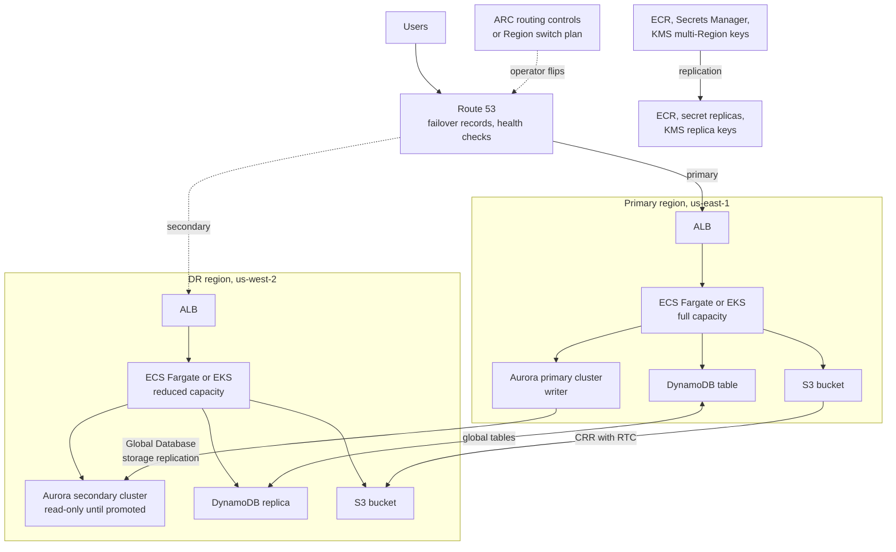

# System Design: Multi-Region DR on AWS

> Designing disaster recovery across two AWS regions: RTO and RPO, the four DR strategies, Route 53 failover, data replication with Aurora Global Database, DynamoDB global tables, and S3 replication, ECS and EKS in two regions, IaC for the DR region, runbooks, game days, and cost.

## Key Concepts

### Requirements: RTO, RPO, and Tiers

- **RTO (recovery time objective):** how long the service may be down before it is back.
- **RPO (recovery point objective):** how much data, measured in time, you may lose.
- **Scope of the disaster:** multi-AZ already covers a single AZ failure. Multi-region DR is for a full regional outage, a regional service impairment, or a bad change that breaks a whole region.
- **Tiers:** not every service needs the same target. Tiering saves a lot of money.

| Tier | Example | RTO | RPO | Strategy |
| --- | --- | --- | --- | --- |
| 0 | Payments, login | Minutes | Seconds | Warm standby or active-active |
| 1 | Customer API, orders | Under 1 hour | Minutes | Warm standby or pilot light |
| 2 | Internal tools, reporting | Hours to a day | Hours | Backup and restore |

Also agree on: who can declare a disaster, regulatory needs (data residency may forbid some regions), and whether the DR region must handle full production load or a reduced mode.

### The Four DR Strategies

| Strategy | What runs in DR region | Typical RTO | Typical RPO | Relative cost |
| --- | --- | --- | --- | --- |
| Backup and restore | Only backups (AWS Backup copies, S3) | Hours | Hours (last backup) | Lowest |
| Pilot light | Data replicated live; compute off or at zero | Tens of minutes to hours | Seconds to minutes | Low |
| Warm standby | Data replicated; full stack running at reduced size | Minutes | Seconds | Medium to high |
| Active-active (multi-site) | Full stack serving traffic in both regions | Near zero | Near zero to seconds | Highest |

The numbers are typical ranges, not guarantees. Your real RTO and RPO are only what your last game day proved.

### Architecture: Warm Standby Across Two Regions

Route 53 sends traffic to the primary region and fails over to the secondary when health checks fail or an operator flips a routing control. Data replicates continuously. Compute in the DR region runs at reduced size and scales up during failover.



TODO (Siva): replace the regions and services with your real setup, for example which ECS services sit behind your ALB and where the data lives.

### Traffic Failover

- **Route 53 failover routing:** a primary and a secondary record, with a health check on the primary. Use alias records to ALBs with "evaluate target health".
- **Health checks:** check a deep health endpoint that tests real dependencies, but avoid flapping. Combine checks with calculated health checks if needed.
- **Static stability:** do the failover with data plane actions only. Route 53 health checks and ARC routing control state changes are data plane. Editing DNS records through the Route 53 API is control plane, which you should not depend on during a regional event.
- **ARC:** Application Recovery Controller routing controls give a reliable on/off switch with safety rules. ARC Region switch (GA 2025) lets you define a plan of steps (scale up compute, promote databases, shift traffic) and run it as one workflow.
- **Low TTLs:** 60 seconds or less on records that change, and know that some clients cache longer.

### Data Replication

- **Aurora Global Database:** storage-level replication to secondary regions, typically under one second of lag. Supports up to 10 secondary regions. **Switchover** is the planned move with no data loss. **Failover** with `--allow-data-loss` is for an unplanned outage and loses whatever had not replicated. The global writer endpoint follows the current primary, so apps do not need a config change.
- **DynamoDB global tables:** multi-active replication. The default mode is multi-Region eventual consistency with last-writer-wins conflicts. Multi-Region strong consistency (GA June 2025) gives zero RPO at the cost of higher write latency and a limited set of regions.
- **S3 Cross-Region Replication (CRR):** needs versioning on both buckets. Replicates new objects only; use S3 Batch Replication for existing ones. S3 Replication Time Control is designed to replicate 99.99% of objects within 15 minutes and comes with an SLA.
- **Everything else:** ECR registry replication, Secrets Manager secret replicas, KMS multi-Region keys, Parameter Store values (no built-in replication, so copy with IaC or a sync job), ElastiCache Global Datastore if cache warm-up matters.
- **Backups still matter:** replication copies corruption and deletes too. Keep point-in-time recovery and AWS Backup copies in a separate account with Vault Lock.

```bash
# Planned switchover (no data loss)
aws rds switchover-global-cluster --region us-east-1 \
  --global-cluster-identifier orders-global \
  --target-db-cluster-identifier arn:aws:rds:us-west-2:111122223333:cluster:orders-west

# Unplanned failover (accepts data loss up to replication lag)
aws rds failover-global-cluster --region us-west-2 \
  --global-cluster-identifier orders-global \
  --target-db-cluster-identifier arn:aws:rds:us-west-2:111122223333:cluster:orders-west \
  --allow-data-loss
```

### Compute in Two Regions and IaC

- **ECS:** the same task definitions and services in both regions, created by the same Terraform/OpenTofu module. DR region runs a smaller `desired_count`; failover raises it. Check Fargate and other service quotas in the DR region before you need them.
- **EKS:** a second cluster built from the same module. Argo CD (or Flux) syncs the same manifests to both clusters, with region-specific values. Velero backs up cluster resources and volumes if needed.
- **IaC layout:** one module, one root per region, separate state per region, and the state bucket for the DR region must not live only in the primary region.
- **Region-specific values:** AMI IDs, certificates (ACM is regional), VPC CIDRs that do not overlap, endpoints.
- **Pipelines:** deploy to both regions on every release, so the DR region never drifts. A DR region that only gets deploys "when needed" will not work when needed.

```hcl
module "app_primary" {
  source        = "../modules/app"
  providers     = { aws = aws.use1 }
  desired_count = 6
  is_primary    = true
}

module "app_dr" {
  source        = "../modules/app"
  providers     = { aws = aws.usw2 }
  desired_count = 2
  is_primary    = false
}
```

### Runbooks, Game Days, and Cost

- **Runbook:** decision criteria, who declares, steps in order (freeze deploys, check replication lag, promote data, scale compute, shift traffic, verify), communication, and failback.
- **Game days:** at least twice a year per tier 0 and tier 1 service. Use AWS Fault Injection Service for controlled experiments, and do at least one real switchover of production traffic per year.
- **Measure:** record actual RTO and RPO in each test. Fix the gaps and re-test.
- **Cost drivers:** standby compute, duplicate databases (Aurora secondary instances), cross-region data transfer for replication, duplicate NAT gateways and load balancers, and storage for replicas and backups.
- **Levers:** tier services, scale DR compute small, use Aurora headless secondary clusters (no instances, storage only) for pilot light, buy Savings Plans that cover both regions.

### Trade-offs

| Decision | Benefit | Cost |
| --- | --- | --- |
| Automatic DNS failover | Fast, no human needed | Risk of false failover and flapping |
| Manual or semi-automatic failover | Human confirms before data loss | Slower RTO, needs on-call |
| Warm standby | Minutes of RTO | Paying for idle capacity |
| Active-active | Near-zero RTO, used every day | App must handle multi-writer data, much more complex |
| Async replication | Low write latency | Non-zero RPO |
| Sync replication | Zero RPO | Higher latency, fewer region choices |

## Interview Questions

<details><summary>Q1. [Advanced] Design multi-region disaster recovery on AWS for a customer-facing application. <em>(scenario)</em></summary>

**Answer:**

**1. Clarify.** I ask: what is the RTO and RPO, per service or overall? What is the data layer (Aurora, DynamoDB, S3)? Is it ECS or EKS? Any data residency limits? Must the DR region carry full load? Who decides to fail over? I assume an orders platform on ECS Fargate with Aurora PostgreSQL, DynamoDB for sessions, S3 for documents, RTO 30 minutes, RPO 1 minute for the core path, and two US regions.

**2. Choose the strategy.** RTO 30 minutes and RPO 1 minute rule out backup and restore. Active-active is overkill for these targets and hard with a single-writer relational database. I choose **warm standby** for tier 0 and 1 services and **backup and restore** for tier 2.

**3. High-level design.**

- **Traffic:** Route 53 failover records to the ALB in each region, health checks on a deep health endpoint, ARC routing controls as the switch.
- **Compute:** ECS services in both regions from one Terraform module; DR runs at about 25% capacity with auto scaling ready.
- **Data:** Aurora Global Database (primary in region A, secondary in B); DynamoDB global tables; S3 CRR with Replication Time Control; ECR replication; Secrets Manager replicas; KMS multi-Region keys.
- **Backups:** AWS Backup copies to a separate backup account with Vault Lock, to protect against corruption and ransomware.
- **Pipelines:** every release deploys to both regions.

**4. Deep dive: failover sequence.**

1. Detect: alarms on error rate and health checks; incident commander declares DR.
2. Freeze deploys and stop writes in the primary if it is still partly alive (fencing).
3. Check `AuroraGlobalDBRPOLag` to know the expected data loss, and pick the secondary with the lowest lag if there are several.
4. Promote Aurora with `failover-global-cluster --allow-data-loss` (or `switchover-global-cluster` if the primary is healthy).
5. Scale ECS in the DR region to full capacity.
6. Flip the ARC routing control so Route 53 sends traffic to region B.
7. Verify with synthetic transactions and business metrics.
8. Communicate status; plan failback.

**5. Failure modes.** False failover from a flapping health check, so I require a human decision for data promotion. Split brain if both regions accept writes, so I fence the old writer. Missing quotas or secrets in region B, found only in game days. Hidden dependencies on the primary region, like a CI system, a single-region SaaS, or an IAM Identity Center instance there.

**6. Security.** Same IAM, SCPs, and guardrails in both regions via IaC; KMS keys available in both; CloudTrail organization trail covers both; break-glass access works without the primary region.

**7. Cost.** Standby compute, Aurora secondary instances, replication data transfer, duplicate NAT and ALB. I keep standby small and tier services. Rough rule: warm standby adds a meaningful fraction of the primary's cost, so I give the business the cost per tier and let them choose.

**8. Operations.** A runbook per service, a game day every quarter for tier 0, one real production switchover a year, and the measured RTO and RPO reported to leadership.

**9. Trade-offs.** Warm standby instead of active-active keeps the app single-writer and simple. The price is minutes of downtime and seconds of data loss, which meet the targets.

</details>

<details><summary>Q2. [Intermediate] How do you choose between backup and restore, pilot light, warm standby, and active-active?</summary>

**Answer:**

I start from RTO, RPO, and budget for each service tier, then pick the cheapest strategy that meets them.

- RTO hours and RPO hours: **backup and restore.**
- RTO under an hour, RPO minutes, cost sensitive: **pilot light** (data replicated, compute off or at zero).
- RTO minutes: **warm standby** (everything running small).
- RTO near zero, and the data model supports multi-region writes: **active-active.**

Then I check two things that often change the answer: whether the database supports the needed replication, and whether the team can operate the complexity. Active-active that nobody tests is worse than a well-tested warm standby.

</details>

<details><summary>Q3. [Advanced] Should failover be automatic or manual? How do you avoid a false failover? <em>(scenario)</em></summary>

**Answer:**

I split it into two parts:

- **Stateless traffic shift** can be automatic for read-only or idempotent services, since moving traffic back is easy.
- **Data promotion** (Aurora failover with data loss) is a human decision, because it is hard to undo and loses unreplicated writes.

To avoid false failovers:

- Health checks test a deep endpoint but use several checkers and a failure threshold, and are combined with calculated health checks.
- Alarms look at real user impact (error rate and latency from multiple places), not one probe.
- ARC safety rules stop both regions being turned off at the same time.
- A short decision checklist: is it regional or just our service? Is AWS reporting an event? What is the replication lag?

</details>

<details><summary>Q4. [Advanced] The primary region comes back during your failover and both regions accept writes. How do you prevent and handle split brain? <em>(scenario)</em></summary>

**Answer:**

**Prevent:**

- Only one region is allowed to write. After promotion, the old primary is fenced: its app tier is scaled to zero or blocked, and its routing control is off.
- Before a managed failover, take the app's write path offline in the old region. Aurora also tries to "write fence" the old primary, but AWS documents this as best effort, so do not rely on it alone.
- When the old region recovers, managed failover rebuilds the old primary as a new secondary with a fresh storage volume. Aurora first tries to snapshot the old volume (named `rds:unplanned-global-failover-...`) so you can recover writes that never replicated.
- Apps use the global writer endpoint with a short DNS cache TTL, or a single config flag for "write region".

**Handle if it happens:** stop writes in one region immediately, export the writes made in the "wrong" region during the window (from binlogs, audit tables, or event logs), and reconcile them with business rules. For DynamoDB global tables in eventual mode, last writer wins, so idempotent writes and version attributes matter.

</details>

<details><summary>Q5. [Advanced] What does static stability mean for DR, and why should failover avoid control plane APIs?</summary>

**Answer:**

A statically stable design keeps working during a failure without needing to create or change resources. During a regional event, control plane APIs (creating resources, editing DNS records, changing IAM) may be slow or unavailable, even in other regions if they depend on a global service whose control plane lives in one region.

So I:

- Pre-create everything in the DR region: VPC, ALB, ECS services, IAM roles, secrets, certificates.
- Shift traffic with data plane actions: Route 53 health checks and ARC routing controls, not record edits.
- Keep enough capacity running, or make sure scaling up is just raising a desired count.
- Keep runbooks, credentials, and tools reachable without the primary region (for example a break-glass role and docs not stored only in a primary-region wiki).

</details>

<details><summary>Q6. [Intermediate] How do you measure and alert on your actual RPO?</summary>

**Answer:**

- **Aurora:** CloudWatch metric `AuroraGlobalDBRPOLag` on the secondary clusters (older Aurora MySQL versions use `AuroraGlobalDBReplicationLag`). Aurora PostgreSQL can also enforce a maximum RPO with the `rds.global_db_rpo` parameter (minimum 20 seconds). It blocks commits on the primary when every secondary is behind the target, so it trades availability for RPO.
- **DynamoDB global tables:** `ReplicationLatency` per replica region.
- **S3 CRR:** replication metrics (bytes and operations pending, replication latency) and RTC event notifications for late objects.
- Alarm when lag is above half of the RPO target for several minutes.

In game days I write a known record just before the "disaster" and check whether it exists after failover.

</details>

<details><summary>Q7. [Intermediate] How do you fail back to the primary region after the incident?</summary>

**Answer:**

Failback is a planned change, not an emergency, so I take my time:

1. Confirm the original region is fully healthy.
2. Rebuild replication from the current primary (region B) back to region A. With Aurora Global Database, add region A back as a secondary and let it catch up.
3. Deploy the current release to region A and run smoke tests.
4. Use a **switchover** (no data loss) to move the writer back during a quiet period.
5. Shift traffic gradually with weighted records, watch errors and latency.
6. Scale region B back to standby size.

Some teams decide not to fail back and simply make region B the new primary. That is fine if both regions are equal.

</details>

<details><summary>Q8. [Advanced] How do you stop the DR region from drifting and silently breaking? <em>(scenario)</em></summary>

**Answer:**

- Same Terraform/OpenTofu module for both regions; drift detection on a schedule (`tofu plan` with `-detailed-exitcode` in CI).
- Every release deploys to both regions; the DR region runs real tasks, so broken images or config show up quickly.
- Synthetic checks run against the DR region's ALB all the time, not only during tests.
- Service quotas, secrets, and certificates in the DR region are checked by an automated readiness test.
- Quarterly game days and a yearly real switchover.
- ARC Region switch plan evaluation regularly checks that the recovery plan can still run. (The older ARC readiness check feature is closed to new customers from April 30, 2026.)

**Pitfall:** "DR environment exists" without traffic. It will fail on the day you need it.

</details>

<details><summary>Q9. [Advanced] A bad migration corrupts data in the primary, and replication copies it to DR within a second. How does your design recover? <em>(scenario)</em></summary>

**Answer:**

Replication protects against losing a region, not against bad writes. For logical corruption I need point-in-time backups:

- Aurora backtrack (Aurora MySQL only) or point-in-time restore to a new cluster just before the bad change.
- DynamoDB point-in-time recovery (restore to a new table).
- S3 versioning to restore earlier object versions; Object Lock for critical data.
- AWS Backup copies in a separate account with Vault Lock, so an attacker or a bad script cannot delete them.

Recovery: restore to a new resource, compare and copy back the good data (or switch the app to the restored copy), then replay valid writes made after the restore point. The runbook for this is different from regional failover and must be tested separately.

</details>

<details><summary>Q10. [Intermediate] Leadership says DR costs too much. How do you reduce it without breaking the targets?</summary>

**Answer:**

- **Tier the services.** Many services can move from warm standby to pilot light or backup and restore.
- **Shrink standby compute** to the minimum that still proves it works, and scale up on failover.
- **Aurora headless secondary** (storage only, no instances) for pilot light; add instances during failover, which adds minutes to RTO.
- **Cut replication volume:** only replicate S3 prefixes that matter; use lifecycle rules on replicas.
- **Savings Plans** cover compute in any region, so they work for both.
- Show the cost per tier next to the RTO and RPO, so the business makes an informed choice.

</details>

<details><summary>Q11. [Intermediate] How do you design and run a DR game day?</summary>

**Answer:**

1. **Scope and hypothesis:** "If us-east-1 is unavailable, orders recover in us-west-2 within 30 minutes with under 1 minute of data loss."
2. **Safety:** start in a staging account, define abort criteria, inform stakeholders.
3. **Inject the failure:** block traffic to the primary with ARC, use AWS Fault Injection Service actions (for example network disruption), or do a real planned switchover.
4. **Run the runbook as written,** with the on-call engineer, not the expert who wrote it.
5. **Measure:** time to detect, time to decide, time to recover, data lost.
6. **Review:** blameless write-up, fix gaps, update the runbook, schedule the next one.

TODO (Siva): add a real DR test you ran, what you measured, and what you fixed.

</details>

<details><summary>Q12. [Advanced] What changes if the business wants active-active instead of warm standby?</summary>

**Answer:**

- **Data model:** each region must accept writes. That needs DynamoDB global tables or another multi-writer store, or partitioning users by home region. A single-writer Aurora cluster with write forwarding still sends writes to one region.
- **Conflicts:** last-writer-wins, idempotent operations, or strong consistency (DynamoDB multi-Region strong consistency) with higher latency.
- **Routing:** latency-based or geolocation records with health checks; each region must handle full load if the other fails, so each needs extra headroom.
- **Operations:** deploys, schema changes, and caches must work across regions at the same time.
- **Cost:** roughly double the production footprint plus headroom.

The upside is that failover becomes a routine traffic shift that is used every day, so it is well tested.

</details>

<details><summary>Q13. [Advanced] What hidden dependencies can break a regional failover even when your app is fully replicated?</summary>

**Answer:**

- CI/CD system, artifact registry, or Terraform state stored only in the primary region.
- IAM Identity Center or SSO in the primary region, so humans cannot log in.
- Secrets or Parameter Store values not replicated.
- Third-party SaaS (payment provider, email) with IP allow-lists for the primary region only.
- Certificates (ACM is regional) and WAF rules missing in DR.
- Monitoring and logging that only run in the primary region.
- Service quotas in the DR region left at default.
- Cron jobs and queue consumers that must run in exactly one region.

I list them in the runbook and test each one in game days.

</details>

<details><summary>Q14. [Advanced] Looking back at your DR design, what would you do differently?</summary>

**Answer:**

- Use ARC Region switch plans so the whole sequence is one tested workflow with a report, instead of a manual checklist.
- Push for cell-based design so a bad deploy affects one cell, not a whole region, which reduces how often DR is needed.
- Make the DR region serve a small share of real read traffic every day, so it is always proven.
- Add automated checks for hidden dependencies in the pipeline.
- Revisit the data layer: if the business keeps tightening RTO, plan a move to a multi-writer data store for the core path.

See also [AWS architecture and HA](../aws/01-architecture-and-high-availability.md) and [Kubernetes backup and DR](../kubernetes/09-observability-backup-dr.md).

</details>
