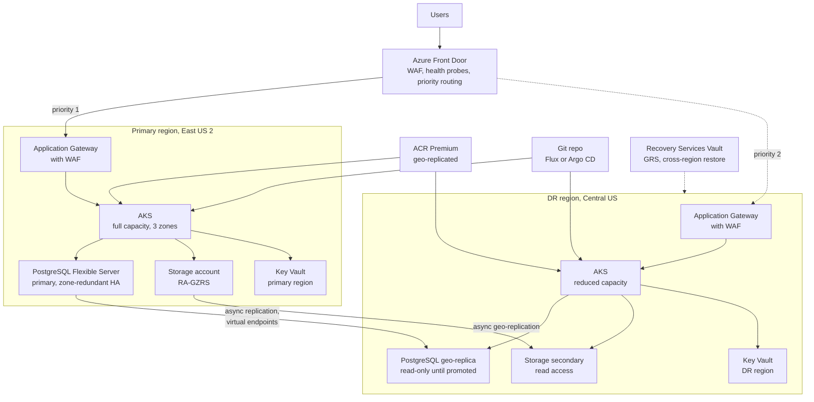

# System Design: Multi-Region DR on Azure

> Designing disaster recovery across two Azure regions: RTO and RPO, the four DR strategies, Azure Front Door and Traffic Manager failover, paired regions and availability zones, data replication for PostgreSQL Flexible Server and Storage, AKS and ACR in two regions, Key Vault per region, Azure Site Recovery and Recovery Services Vault, IaC for the DR region, runbooks, drills, and cost.

## Key Concepts

### Requirements: RTO, RPO, and Tiers

- **RTO (recovery time objective):** how long the service may be down before it is back.
- **RPO (recovery point objective):** how much data, measured in time, you may lose.
- **Scope of the disaster:** availability zones already cover a single datacenter or zone failure. Multi-region DR is for a full regional outage, a regional service impairment, or a bad change that breaks a whole region.
- **Tiers:** not every service needs the same target. Tiering saves a lot of money.

| Tier | Example | RTO | RPO | Strategy |
| --- | --- | --- | --- | --- |
| 0 | Payments, login | Minutes | Seconds to minutes | Warm standby or active-active |
| 1 | Customer API, orders | Under 1 hour | Minutes | Warm standby or pilot light |
| 2 | Internal tools, reporting | Hours to a day | Hours | Backup and restore |

Also agree on: who can declare a disaster, regulatory needs (data residency may forbid some regions), and whether the DR region must handle full production load or a reduced mode.

### Zones, Paired Regions, and Region Choice

- **Availability zones:** separate datacenters inside one region. Use zone-redundant AKS node pools, zone-redundant PostgreSQL HA, ZRS storage, and zone-redundant Application Gateway first. This is high availability, not DR.
- **Paired regions:** many Azure regions have a fixed pair in the same geography, for example East US 2 and Central US. Geo-redundant storage (GRS, GZRS) and PostgreSQL geo-redundant backup copy data to the pair. Azure also rolls out platform updates to one region of a pair at a time.
- **Non-paired regions:** some newer regions have no pair. Then you use features that let you pick the target region, such as PostgreSQL geo-replicas, object replication, and ACR geo-replication.
- **Pick the DR region by:** data residency, service availability (every SKU you need must exist there), latency for replication, and capacity quotas.

### The Four DR Strategies

| Strategy | What runs in DR region | Typical RTO | Typical RPO | Relative cost |
| --- | --- | --- | --- | --- |
| Backup and restore | Only backups (GRS Recovery Services Vault, PostgreSQL geo-backup, GRS storage) | Hours | Up to 1 hour or more (last backup copy) | Lowest |
| Pilot light | Data replicated live; AKS user node pools at zero or the cluster built on demand | Tens of minutes to hours | Seconds to minutes | Low |
| Warm standby | Data replicated; full stack running at reduced size | Minutes | Seconds to minutes | Medium to high |
| Active-active (multi-site) | Full stack serving traffic in both regions | Near zero | Near zero to seconds | Highest |

The numbers are typical ranges, not guarantees. Your real RTO and RPO are only what your last DR drill proved.

### Architecture: Warm Standby Across Two Regions

Azure Front Door sends traffic to the primary region and fails over to the secondary when health probes fail. Data replicates continuously. AKS in the DR region runs at reduced size and scales up during failover.



TODO (Siva): replace the regions and services with your real setup, for example which AKS services sit behind your Application Gateway, whether you use Front Door, and where your PostgreSQL and Storage data lives.

### Traffic Failover

- **Azure Front Door (Standard or Premium):** a global layer 7 entry point with WAF. Put both regional Application Gateways (or AKS ingress endpoints) in one origin group with priority 1 and priority 2. Health probes move traffic when the primary fails. Lock each Application Gateway to Front Door traffic (Front Door service tag plus an `X-Azure-FDID` header check).
- **Azure Traffic Manager:** DNS-based routing with priority, weighted, or performance methods. Use it for non-HTTP endpoints, or as an extra layer in front of Front Door and Application Gateway if you need to survive a Front Door outage. Clients cache DNS, so keep the TTL low and expect some clients to be slower.
- **Health probes:** probe a health endpoint that checks real dependencies, but avoid flapping. Tune the probe interval, sample size, and successful samples required.
- **Static stability:** do the failover with data plane actions only. Front Door health probes and a health endpoint that you can force to return 503 are data plane. Editing Front Door origins or Traffic Manager endpoints through Azure Resource Manager is control plane, which you should not depend on during a regional event.
- **Rehearsed switch:** many teams add a "drain" flag (an App Configuration key or a config map) that makes the primary health endpoint fail on purpose. Flipping it moves traffic through Front Door without any control plane change.

### Data Replication

- **PostgreSQL Flexible Server geo-replica:** an asynchronous read replica in the DR region (up to five replicas per primary). Lag is usually seconds, but heavy write load can push it to minutes. **Virtual endpoints** give the app a writer and a reader hostname that follow the roles. **Promote to primary server** (switchover) swaps roles; **planned** waits for all data, **forced** is for a regional outage and loses whatever had not replicated. Promotion is never automatic.
- **PostgreSQL geo-redundant backup:** copies backups to the paired region. It can be enabled only when the server is created. Geo-restore has an RPO of up to about one hour and an RTO of minutes to hours, so it fits tier 2, not tier 0.
- **Azure Storage:** GRS, GZRS, RA-GRS, and RA-GZRS copy data asynchronously to the paired region; RPO is typically under 15 minutes, with no SLA. RA- options let apps read the secondary during an outage. Customer-managed **planned** failover keeps geo-redundancy and loses no data; **unplanned** failover loses unsynced writes and leaves the account as LRS. **Object replication** copies block blobs to an account in any region you choose (it needs versioning and change feed).
- **Messaging:** Service Bus Premium geo-replication copies entities and messages. The older geo-disaster recovery feature copies only metadata (queues and topics), not messages.
- **Cosmos DB (only if you use it):** add a second region for reads and service-managed failover, or enable multi-region writes for active-active.
- **Everything else:** ACR geo-replication, a Key Vault in each region with the same secrets (synced by IaC or a pipeline), certificates in both regions, and App Configuration replicas.
- **Backups still matter:** replication copies corruption and deletes too. Keep PostgreSQL point-in-time restore (7 to 35 days), blob versioning and soft delete, and Recovery Services or Backup vaults with immutability and soft delete.

```bash
# One-time setup: virtual endpoints so apps use one writer hostname
az postgres flexible-server virtual-endpoint create -g rg-orders-eus2 \
  --server-name pg-orders-eus2 --name orders-ve \
  --endpoint-type ReadWrite --members pg-orders-cus

# Planned switchover (no data loss): the replica becomes primary, the old primary becomes a replica
az postgres flexible-server replica promote -g rg-orders-cus -n pg-orders-cus \
  --promote-mode SwitchOver --promote-option Planned

# Regional outage: forced promotion, accepts data loss up to the replica lag
az postgres flexible-server replica promote -g rg-orders-cus -n pg-orders-cus \
  --promote-mode SwitchOver --promote-option Forced

# Storage: check how far behind the secondary is, then fail over if needed
az storage account show -n stordersprod -g rg-orders-eus2 \
  --expand geoReplicationStats --query geoReplicationStats.lastSyncTime
az storage account failover -n stordersprod -g rg-orders-eus2
```

### Compute in Two Regions: AKS, ACR, Key Vault, and VMs

- **AKS:** a second cluster built from the same Terraform or Bicep module, with zone-redundant node pools. The DR cluster runs smaller minimum node counts, and the cluster autoscaler adds nodes on failover. Check vCPU quotas in the DR region before you need them.
- **Deploys:** Flux (the AKS GitOps extension) or Argo CD syncs the same manifests to both clusters with region overlays, or the Azure DevOps pipeline deploys to both regions in every release.
- **ACR geo-replication (Premium):** one registry name with replicas in both regions, so each cluster pulls from its local replica and a primary region outage does not stop image pulls.
- **Key Vault per region:** each region's workloads read from their own vault through workload identity. Microsoft also replicates vault data to the paired region, but Microsoft decides when to fail over (it can take hours), and the vault is read-only afterwards, so do not depend on it for your RTO, writes, or rotation.
- **Identities:** user-assigned managed identities are regional resources. Create one per region, with the same role assignments, so a regional outage does not block sign-ins for the other region.
- **Cluster state:** keep state in managed services. For persistent volumes, use Velero or Azure Backup for AKS, because Azure Disks do not replicate across regions.
- **VMs:** Azure Site Recovery replicates VMs to the DR region. Recovery plans start VMs in order and run scripts. Test failover runs in an isolated VNet without touching production. Stateless VM Scale Sets are rebuilt from images by IaC instead.
- **Backups:** a Recovery Services Vault with GRS and Cross Region Restore lets you restore VM backups in the paired region at any time, not only during a declared outage.

### IaC for the DR Region

- **One module, one root per region:** separate state per region. The Terraform state for the DR region must not live only in the primary region (use a state storage account in the DR region or one with RA-GZRS).
- **Region-specific values:** VNet address spaces that do not overlap, Private DNS zone links for both VNets, private endpoints in each region, certificates, quotas, and SKUs that exist in both regions.
- **Pipelines:** deploy to both regions on every release, so the DR region never drifts. A DR region that only gets deploys "when needed" will not work when needed.

```hcl
module "app_primary" {
  source            = "../modules/app-region"
  location          = "eastus2"
  aks_user_node_min = 6
  pg_role           = "primary"
}

module "app_dr" {
  source            = "../modules/app-region"
  location          = "centralus"
  aks_user_node_min = 2
  pg_role           = "replica"
}
```

With Bicep, the same idea is one `main.bicep` and one parameter file per region:

```bash
az deployment sub create -l centralus -f main.bicep -p main.centralus.bicepparam
```

### Runbooks, DR Drills, and Cost

- **Runbook:** decision criteria, who declares, steps in order (freeze deploys, check replication lag, promote data, scale compute, shift traffic, verify), communication, and failback. Keep it where you can reach it without the primary region.
- **DR drills:** at least twice a year per tier 0 and tier 1 service. Use ASR test failover for VMs, Azure Chaos Studio for controlled faults (for example an NSG fault that blocks traffic to the primary), and do at least one real planned switchover of production traffic per year.
- **Measure:** record actual RTO and RPO in each test. Fix the gaps and re-test.
- **Cost drivers:** standby AKS nodes, the PostgreSQL replica (for switchover it must match the primary's tier and storage size), cross-region data transfer, a second Application Gateway with WAF, GRS storage and backup storage, ASR per-VM fees.
- **Levers:** tier services, keep DR AKS small, use geo-restore instead of replicas for tier 2, scale DR user node pools to zero for pilot light, and use an Azure savings plan for compute, which applies in any region (reservations are region-scoped).

### Trade-offs

| Decision | Benefit | Cost |
| --- | --- | --- |
| Automatic Front Door failover | Fast, no human needed | Risk of false failover and flapping |
| Manual or semi-automatic failover | Human confirms before data loss | Slower RTO, needs on-call |
| Warm standby | Minutes of RTO | Paying for idle capacity and a full-size database replica |
| Active-active | Near-zero RTO, used every day | App must handle multi-writer data, much more complex |
| Async replication | Low write latency | Non-zero RPO |
| Sync replication (for example Cosmos DB strong consistency) | Zero RPO | Higher write latency, region distance limits |
| Paired region | GRS and geo-backup work out of the box | Less choice of region |

## Interview Questions

<details><summary>Q1. [Advanced] Design multi-region disaster recovery on Azure for a customer-facing application. <em>(scenario)</em></summary>

**Answer:**

**1. Clarify.** I ask: what is the RTO and RPO, per service or overall? What is the data layer (PostgreSQL, Blob Storage, Service Bus, Cosmos DB)? Is it AKS, App Service, or VMs? Any data residency limits? Must the DR region carry full load? Who decides to fail over? I assume an orders platform on AKS with PostgreSQL Flexible Server, Blob Storage for documents, Service Bus Premium for async work, RTO 30 minutes, RPO 5 minutes for orders and 15 minutes for documents, and the paired regions East US 2 and Central US.

**2. Choose the strategy.** RTO 30 minutes rules out backup and restore. Active-active is overkill for these targets and hard with a single-writer PostgreSQL server. I choose **warm standby** for tier 0 and 1 services and **backup and restore** for tier 2.

**3. High-level design.**

- **Traffic:** Azure Front Door with WAF, both regional Application Gateways in one origin group (priority 1 and 2), health probes on a deep health endpoint, and a drain flag as the manual switch.
- **Compute:** AKS in both regions from one Terraform or Bicep module, zone-redundant node pools; DR runs at about 25% capacity with the cluster autoscaler ready. Flux or Argo CD deploys the same manifests to both.
- **Data:** PostgreSQL Flexible Server with zone-redundant HA in the primary and a geo-replica in the DR region behind virtual endpoints; Storage RA-GZRS; Service Bus Premium geo-replication; ACR geo-replication; a Key Vault per region.
- **Backups:** PostgreSQL point-in-time restore and long-term retention, blob versioning and soft delete, and a Recovery Services Vault with GRS, Cross Region Restore, and immutability.
- **Pipelines:** every release deploys to both regions.

**4. Deep dive: failover sequence.**

1. Detect: alerts on error rate, Front Door probe health, App Insights availability tests, and Azure Service Health; the incident commander declares DR.
2. Freeze deploys and stop writes in the primary if it is still partly alive (fencing): scale the primary app to zero or set the drain flag.
3. Check the replica's `physical_replication_delay_in_seconds` metric and the Storage Last Sync Time to know the expected data loss.
4. Promote PostgreSQL with `--promote-option Forced` (or `Planned` if the primary is still healthy). The writer virtual endpoint now points to the DR server.
5. Fail over Service Bus and, if needed, the storage account.
6. Scale AKS in the DR region to full capacity.
7. Confirm Front Door now sends traffic to the DR origin.
8. Verify with synthetic transactions and business metrics.
9. Communicate status; plan failback.

**5. Failure modes.** False failover from a flapping probe, so data promotion is always a human decision. Split brain if both regions accept writes, so I fence the old writer. Missing quotas, secrets, or certificates in the DR region, found only in drills. Hidden dependencies on the primary region, like Terraform state, a self-hosted agent pool, or a Log Analytics workspace that lives only there.

**6. Security.** Same RBAC, Azure Policy assignments, and NSGs in both regions via IaC; secrets and certificates in both Key Vaults; Activity Log and Entra ID logs collected from both; emergency access (break-glass) accounts in Entra ID that work without the primary region.

**7. Cost.** Standby AKS nodes, a full-size PostgreSQL replica, cross-region data transfer, a second Application Gateway with WAF, and GRS storage. I keep standby small and tier services. Warm standby adds a meaningful fraction of the primary's cost, so I give the business the cost per tier and let them choose.

**8. Operations.** A runbook per service, a drill every quarter for tier 0, one real production switchover a year, and the measured RTO and RPO reported to leadership.

**9. Trade-offs.** Warm standby instead of active-active keeps the app single-writer and simple. The price is minutes of downtime and seconds to minutes of data loss, which meet the targets.

</details>

<details><summary>Q2. [Intermediate] How do you choose between backup and restore, pilot light, warm standby, and active-active?</summary>

**Answer:**

I start from RTO, RPO, and budget for each service tier, then pick the cheapest strategy that meets them.

- RTO hours and RPO hours: **backup and restore** (PostgreSQL geo-restore, Recovery Services Vault Cross Region Restore, GRS storage).
- RTO under an hour, RPO minutes, cost sensitive: **pilot light** (data replicated, AKS user node pools at zero or the cluster created by IaC).
- RTO minutes: **warm standby** (everything running small).
- RTO near zero, and the data model supports multi-region writes: **active-active.**

Then I check two things that often change the answer: whether the database supports the needed replication, and whether the team can operate the complexity. Active-active that nobody tests is worse than a well-tested warm standby.

</details>

<details><summary>Q3. [Advanced] Should failover be automatic or manual? How do you avoid a false failover? <em>(scenario)</em></summary>

**Answer:**

I split it into two parts:

- **Stateless traffic shift** can be automatic for read-only or idempotent services. Front Door does it when probes fail, and moving traffic back is easy.
- **Data promotion** (PostgreSQL forced promotion, storage unplanned failover) is a human decision, because it is hard to undo and loses unreplicated writes. PostgreSQL never promotes a replica on its own anyway.

To avoid false failovers:

- Probes test a deep endpoint but use a sample size and a failure threshold, so one slow response does not move traffic.
- Alerts look at real user impact (error rate and latency from App Insights availability tests in several locations), not one probe.
- Check Azure Service Health and Resource Health: is it regional or just our service?
- A short decision checklist: who is affected, what is the replication lag, and what is the expected data loss?

</details>

<details><summary>Q4. [Advanced] The primary region comes back during your failover and both regions accept writes. How do you prevent and handle split brain? <em>(scenario)</em></summary>

**Answer:**

**Prevent:**

- Only one region is allowed to write. After promotion, the old primary is fenced: its AKS workloads are scaled to zero, its drain flag is on, and its Front Door origin stays unhealthy or disabled.
- Apps connect through the PostgreSQL writer virtual endpoint, not a server hostname, so they follow the new primary.
- After a forced promotion, check the old server's role on the Replication page when the region recovers. If the replication state is broken, delete it and create a new replica from the new primary.
- Background jobs and queue consumers have a "write region" setting, so they run in exactly one region.

**Handle if it happens:** stop writes in one region immediately, export the writes made in the "wrong" region during the window (from audit tables, outbox tables, or event logs), and reconcile them with business rules. Idempotent writes and version columns make this much easier.

</details>

<details><summary>Q5. [Advanced] What does static stability mean for DR, and why should failover avoid control plane APIs?</summary>

**Answer:**

A statically stable design keeps working during a failure without needing to create or change resources. During a regional event, Azure Resource Manager operations for resources in that region (create, update, scale, change settings) may be slow or fail, while the data plane in the other region keeps working.

So I:

- Pre-create everything in the DR region: VNet, private endpoints, Application Gateway, AKS cluster, managed identities, Key Vault, secrets, certificates.
- Shift traffic with data plane actions: Front Door health probes and a drain flag on the health endpoint, not origin edits.
- Keep enough capacity running, or make sure scaling up is just the autoscaler adding nodes.
- Keep runbooks, emergency access accounts, and tools reachable without the primary region (for example docs not stored only in a primary-region wiki, and a fallback agent pool in the DR region).

</details>

<details><summary>Q6. [Intermediate] How do you measure and alert on your actual RPO?</summary>

**Answer:**

- **PostgreSQL:** the `physical_replication_delay_in_seconds` metric (Read Replica Lag) on the replica, and `physical_replication_delay_in_bytes` (Max Physical Replication Lag) on the primary.
- **Storage:** the Last Sync Time property (`geoReplicationStats.lastSyncTime`); alert when it is older than the RPO target.
- **Azure Site Recovery:** the RPO and replication health of each protected VM, with alerts from the Recovery Services Vault.
- **Cosmos DB (if used):** the replication latency metric per region.
- Alarm when lag is above half of the RPO target for several minutes.

In drills I write a known record just before the "disaster" and check whether it exists after failover.

</details>

<details><summary>Q7. [Intermediate] How do you fail back to the primary region after the incident?</summary>

**Answer:**

Failback is a planned change, not an emergency, so I take my time:

1. Confirm the original region is fully healthy.
2. Rebuild replication from the current primary (region B) back to region A. With PostgreSQL, check that the old server is a healthy replica, or create a new geo-replica.
3. Deploy the current release to region A and run smoke tests.
4. Use a **planned** switchover (no data loss) to move the writer back during a quiet period.
5. Re-enable zone-redundant HA on the new primary, because promotion turns HA off. Remember that geo-redundant backup is not carried over by promotion.
6. Shift traffic gradually with Front Door weights, and watch errors and latency.
7. For storage, use a planned failover back, or re-enable geo-redundancy after an unplanned one.
8. Scale region B back to standby size.

Some teams decide not to fail back and simply make region B the new primary. That is fine if both regions are equal.

</details>

<details><summary>Q8. [Advanced] How do you stop the DR region from drifting and silently breaking? <em>(scenario)</em></summary>

**Answer:**

- Same Terraform/OpenTofu or Bicep module for both regions; drift detection on a schedule (`terraform plan -detailed-exitcode` or `az deployment group what-if` in the pipeline).
- Every release deploys to both regions; the DR cluster runs real pods, so broken images or config show up quickly.
- App Insights availability tests run against the DR Application Gateway all the time, not only during drills.
- An automated readiness test checks vCPU quotas (`az vm list-usage -l centralus`), Key Vault secrets and certificate expiry, ACR replica health, PostgreSQL replication state, and ASR replication health.
- Quarterly drills and a yearly real switchover.

**Pitfall:** "DR environment exists" without traffic. It will fail on the day you need it.

</details>

<details><summary>Q9. [Advanced] A bad migration corrupts data in the primary, and replication copies it to DR within seconds. How does your design recover? <em>(scenario)</em></summary>

**Answer:**

Replication protects against losing a region, not against bad writes. For logical corruption I need point-in-time backups:

- PostgreSQL point-in-time restore to a new server just before the bad change (retention 7 to 35 days), plus long-term retention in a Backup vault.
- Blob versioning, soft delete, and point-in-time restore for block blobs; immutability policies for critical data.
- Cosmos DB continuous backup, if used.
- Recovery Services and Backup vaults with soft delete, immutability, and multi-user authorization, so an attacker or a bad script cannot delete them.

Recovery: restore to a new resource, compare and copy back the good data (or switch the app to the restored copy), then replay valid writes made after the restore point. The runbook for this is different from regional failover and must be tested separately.

</details>

<details><summary>Q10. [Intermediate] Leadership says DR costs too much. How do you reduce it without breaking the targets?</summary>

**Answer:**

- **Tier the services.** Many services can move from warm standby to pilot light or backup and restore.
- **Shrink standby compute** to the minimum that still proves it works, and let the cluster autoscaler scale up on failover.
- **Use geo-restore for tier 2** instead of a full-size PostgreSQL replica. It costs much less but has an RPO of up to about an hour and a longer RTO.
- **Cut replication volume:** only replicate the storage containers that matter (object replication rules with prefix filters); use lifecycle rules for cool and archive tiers.
- **Azure savings plan for compute** covers both regions; reservations are tied to one region.
- Show the cost per tier next to the RTO and RPO, so the business makes an informed choice.

</details>

<details><summary>Q11. [Intermediate] How do you design and run a DR drill?</summary>

**Answer:**

1. **Scope and hypothesis:** "If East US 2 is unavailable, orders recover in Central US within 30 minutes with under 5 minutes of data loss."
2. **Safety:** start in a staging subscription, define abort criteria, inform stakeholders.
3. **Inject the failure:** set the drain flag, use an Azure Chaos Studio NSG fault to block the primary, run an ASR test failover for VMs, or do a real planned switchover.
4. **Run the runbook as written,** with the on-call engineer, not the expert who wrote it.
5. **Measure:** time to detect, time to decide, time to recover, data lost.
6. **Review:** blameless write-up, fix gaps, update the runbook, schedule the next one.

TODO (Siva): add a real DR test you ran (for example a Recovery Services Vault or PostgreSQL restore test), what you measured, and what you fixed.

</details>

<details><summary>Q12. [Advanced] What changes if the business wants active-active instead of warm standby?</summary>

**Answer:**

- **Data model:** each region must accept writes. PostgreSQL Flexible Server has one writer, so I need Cosmos DB with multi-region writes, or partitioning users by home region so each region writes only its own users.
- **Conflicts:** last-writer-wins, idempotent operations, custom conflict resolution, or strong consistency with a single write region, which adds latency.
- **Routing:** Front Door with both origins at the same priority (latency-based or weighted); each region must handle full load if the other fails, so each needs extra headroom.
- **Operations:** deploys, schema changes, and caches must work across regions at the same time.
- **Cost:** roughly double the production footprint plus headroom.

The upside is that failover becomes a routine traffic shift that is used every day, so it is well tested.

</details>

<details><summary>Q13. [Advanced] What hidden dependencies can break a regional failover even when your app is fully replicated?</summary>

**Answer:**

- Terraform state, self-hosted agent pools, or Managed DevOps Pools that exist only in the primary region.
- Key Vault, managed identities, or App Configuration only in the primary region.
- Private DNS zone links and private endpoints missing for the DR VNet.
- Third-party SaaS (payment provider, email) with IP allow-lists for the primary region's NAT Gateway IPs only.
- Certificates missing in the DR Application Gateway or Key Vault.
- Log Analytics workspaces, alerts, and dashboards that only cover the primary region.
- vCPU and other quotas in the DR region left at default.
- Timer-triggered Functions, cron jobs, and Service Bus consumers that must run in exactly one region.

I list them in the runbook and test each one in drills.

</details>

<details><summary>Q14. [Advanced] Looking back at your DR design, what would you do differently?</summary>

**Answer:**

- Automate the whole sequence as one pipeline or Azure Automation runbook (and ASR recovery plans for VMs), so it is one tested workflow with a report, instead of a manual checklist.
- Push for a deployment stamp (cell) design so a bad deploy affects one stamp, not a whole region, which reduces how often DR is needed.
- Make the DR region serve a small share of real read traffic every day, so it is always proven.
- Add automated checks for hidden dependencies in the pipeline.
- Revisit the data layer: if the business keeps tightening RTO, plan a move to a multi-writer data store for the core path.

See also [Azure storage, networking, and reliability](../azure/04-storage-networking-and-reliability.md) and [Kubernetes backup and DR](../kubernetes/09-observability-backup-dr.md).

</details>
