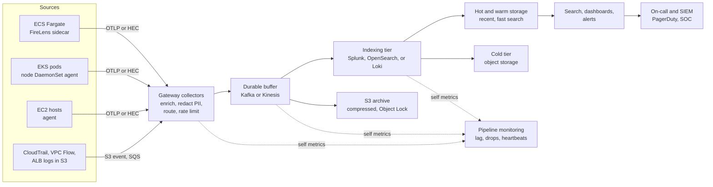

# System Design: Centralized Logging Platform

> Designing a company-wide logging platform: collection with agents and OpenTelemetry, transport and buffering, indexing and storage tiers in Splunk, OpenSearch, or Loki, retention and cost, multi-tenancy and access control, PII redaction, scale estimates, alerting, and the reliability of the pipeline itself.

## Key Concepts

### Requirements and Scale

Agree on these before choosing tools:

- **Sources:** ECS Fargate tasks, EKS pods, EC2 hosts, Lambda, and AWS service logs (CloudTrail, VPC Flow Logs, ALB access logs, WAF). Maybe Databricks audit logs and on-prem systems.
- **Users:** developers (debugging), SREs (incidents), security (detection and investigation), auditors (retention proof).
- **Freshness:** searchable within 30 to 60 seconds for app logs.
- **Retention:** for example 14 to 30 days searchable, 1 year or more archived for compliance.
- **Access:** teams see their own logs; security sees everything; PII is masked before storage.
- **Reliability:** no silent data loss; the logging platform must work during an incident, which is exactly when log volume spikes.

Rough sizing, with assumptions said out loud:

```text
2,000 containers x 50 lines/s x 300 bytes        = 30 MB/s average
30 MB/s x 86,400 s                               = about 2.6 TB/day raw
Plus AWS service logs (CloudTrail, VPC, ALB)     = about 1 TB/day
Peak factor x3 during incidents or deploys       = about 120 MB/s at peak
Hot 14 days, about 10:1 compression on disk      = about 5 TB hot (before replicas)
Archive 1 year in S3, compressed                 = about 130 TB in S3
```

These numbers tell me: I need a buffer to absorb peaks, storage tiers so hot storage stays small, and per-team volume control because licence or storage cost will be the main expense.

### Architecture

Agents collect logs close to the source and send them to a gateway tier that enriches, redacts, and routes. A durable buffer absorbs spikes and outages. Indexers serve recent data for search and alerts; an object-store archive keeps everything cheaply for compliance and replay.



TODO (Siva): adjust this to your real Splunk setup, for example which forwarders or HEC endpoints your ECS services use and how CloudTrail reaches Splunk.

### Collection

- **Agents:** OpenTelemetry Collector, Fluent Bit, Vector, or Splunk Universal Forwarder. One standard agent keeps config and upgrades simple.
- **EKS:** a DaemonSet reads container log files from each node and adds Kubernetes metadata (namespace, pod, labels) with the `k8sattributes` processor.
- **ECS Fargate:** FireLens runs Fluent Bit as a sidecar in the task; or send to CloudWatch Logs and forward from there.
- **AWS service logs:** most land in S3 or CloudWatch Logs; pull them with S3 event notifications plus SQS, or subscription filters to Firehose.
- **Structured logs:** JSON with standard fields (`service`, `env`, `trace_id`, `level`, `team`). Trace IDs link logs to traces.

```yaml
# OpenTelemetry Collector agent (simplified)
receivers:
  filelog:
    include: [/var/log/pods/*/*/*.log]
    operators:
      - type: container
processors:
  memory_limiter:
    check_interval: 1s
    limit_percentage: 80
  k8sattributes: {}
  batch: {}
exporters:
  otlp:
    endpoint: log-gateway.observability.svc:4317
    sending_queue:
      enabled: true
      storage: file_storage
extensions:
  file_storage:
    directory: /var/lib/otelcol/queue
service:
  extensions: [file_storage]
  pipelines:
    logs:
      receivers: [filelog]
      processors: [memory_limiter, k8sattributes, batch]
      exporters: [otlp]
```

### Transport, Buffering, and Back-Pressure

- **Gateway tier:** stateless collectors behind a load balancer. They redact, enrich, drop noise, and route by tenant or data type.
- **Buffer:** Kafka (MSK) or Kinesis decouples producers from indexers. If the indexer is slow or down, data waits in the buffer instead of being dropped. Size retention for at least several hours of peak volume.
- **Agent buffers:** disk-backed queues on agents cover short network or gateway outages.
- **Back-pressure:** when queues fill, agents slow down or spill to disk; the last resort is dropping low-priority logs (debug) before audit logs.
- **Acknowledgements:** with Splunk HEC, enable indexer acknowledgement so the sender knows data was indexed, not just received.

### Indexing and Storage Tiers

| Option | Index model | Storage tiers | Good for | Watch out for |
| --- | --- | --- | --- | --- |
| Splunk | Full index of events | Hot, warm, cold, frozen; SmartStore keeps warm data in object storage with a local cache | Rich search (SPL), security use cases, mature apps | Licence cost tied to ingest or workload |
| OpenSearch | Full-text inverted index | Hot, UltraWarm, cold on Amazon OpenSearch Service; Index State Management policies move data | Full-text search, open source, AWS managed | Shard sizing, cluster tuning, heap pressure |
| Loki | Indexes labels only; log lines in compressed chunks on object storage | Mostly object storage with caches | Cheap storage, Kubernetes, Grafana users | Slow full-text search on huge ranges; label cardinality must stay low |

Many companies mix them: Splunk for security and audit data, Loki or OpenSearch for high-volume app debug logs, and S3 as the cheap archive for everything.

### Retention and Cost

- **Classify data:** audit and security logs (long retention, immutable), app logs (short searchable retention), debug logs (very short or sampled).
- **Tiering:** keep 7 to 30 days hot, move older data to cold or object storage, archive to S3 with lifecycle rules to Glacier classes.
- **Reduce before you store:** drop health-check noise, sample debug logs, cut repeated stack traces, convert high-volume access logs to metrics.
- **Showback:** ingest volume per team per day on a dashboard, with budgets and alerts.
- **Replay:** because the archive keeps raw data, you can re-ingest a time range into the index if an investigation needs it.

### Multi-Tenancy, Access Control, and PII

- **Tenancy:** Splunk indexes per team or data class with role-based access; OpenSearch fine-grained access control with index and document-level security; Loki tenants using the `X-Scope-OrgID` header.
- **Access:** SSO groups map to roles; security and platform teams get wider access; break-glass for full access is logged.
- **PII redaction at the edge:** mask before data reaches the index, because deleting later is hard. Use the OpenTelemetry `redaction` or `transform` processors, Fluent Bit filters, Splunk Ingest Actions or Edge Processor, or `SEDCMD` in `props.conf` on the parsing tier.
- **Prevention:** logging libraries with safe defaults; code review and linting for logging of tokens or card numbers; scan samples for patterns.
- **Audit:** log who searched what, especially for sensitive indexes.

```text
# Splunk props.conf on a heavy forwarder or indexer (parsing tier)
[app:payments]
SEDCMD-mask_card = s/\b(\d{4})\d{8}(\d{4})\b/\1XXXXXXXX\2/g
SEDCMD-mask_bearer = s/(Authorization: Bearer )\S+/\1REDACTED/g
```

### Alerting and Pipeline Reliability

- **Alert on symptoms with metrics first;** use log-based alerts for things only logs show (specific errors, security events).
- **Rate and threshold:** alert on error rate per service, not single error lines.
- **Self-monitoring of the pipeline:** agent queue size and drops, gateway CPU and refused records, Kafka consumer lag, indexing lag (event time vs index time), and per-source "last seen" timestamps.
- **Heartbeats:** each agent sends a heartbeat event; alert when a source goes silent.
- **Separate failure domains:** the logging platform must not depend on the systems it monitors, for example its own cluster and on-call path.

### Trade-offs

| Decision | Choice | Cost |
| --- | --- | --- |
| Buffer or direct to indexer | Buffer (Kafka or Kinesis) | More components to run, but no data loss during indexer outages |
| Redact at edge or at search time | Edge | Rules must be deployed to the gateway; but PII never lands in the index |
| One backend or several | Splunk for security, cheaper backend for debug logs | Two query languages; but large cost savings |
| Long hot retention or archive and replay | Short hot plus S3 archive | Slower access to old data |
| Per-team indexes or shared | Per team or data class | More objects to manage; but clean access control and showback |

## Interview Questions

<details><summary>Q1. [Advanced] Design a centralized logging platform for a company running about 300 services on AWS. <em>(scenario)</em></summary>

**Answer:**

**1. Clarify.** I ask: what sources (ECS, EKS, EC2, AWS service logs)? Who uses it (devs, SRE, security)? Freshness target? Retention and compliance needs? Is there an existing tool like Splunk? Budget limits? I assume about 3.5 TB per day, 30 to 60 second freshness, 30 days searchable, 1 year archive, SOC 2, and Splunk already used by security.

**2. Requirements.**

- Collect from all sources with standard metadata (service, team, env, trace ID).
- Search within 60 seconds; alerts on error rates and security events.
- Teams see only their logs; PII masked before storage.
- No silent data loss; works during incidents.
- Cost visible per team.

**3. Estimate.** About 3.5 TB/day raw, peak about 120 MB/s, about 5 TB hot after compression, about 130 TB per year in S3. Peak is three times average, so a buffer is required.

**4. High-level design.**

- **Agents:** OpenTelemetry Collector as a DaemonSet on EKS, FireLens with Fluent Bit on ECS Fargate, disk-backed queues.
- **AWS logs:** CloudTrail, VPC Flow Logs, and ALB logs land in S3; S3 events plus SQS feed the gateway.
- **Gateway:** stateless collector fleet that enriches, redacts PII, drops noise, and routes per tenant and data class.
- **Buffer:** MSK (Kafka) with replication factor 3 across three AZs, 12 to 24 hours of retention.
- **Backends:** Splunk for security, audit, and production error logs; Loki (or OpenSearch) for high-volume debug and app logs; S3 archive with Object Lock for everything.
- **Access:** SSO groups to Splunk roles and indexes, Loki tenants per team.
- **Alerting:** log-based alerts in Splunk and Grafana routed to on-call and to the SOC.

**5. Deep dive: reliability.** Every hop has a buffer: agent disk queue, Kafka, and indexer acknowledgements. I monitor end-to-end lag (event time vs index time), consumer lag, drops at each hop, and a heartbeat per source. If indexers fail, Kafka holds the data and indexers catch up later. If Kafka fails, agents spill to disk.

**6. Failure modes.** Log storm from one service (per-tenant rate limits at the gateway), bad redaction rule dropping data (canary rules, tests with sample events), high-cardinality labels in Loki (label allow-list), indexer disk full (tiering and alerts), agent upgrade breaks collection (canary node pool).

**7. Security.** TLS on every hop, IAM roles for agents, KMS encryption for S3 and Kafka, Object Lock for audit logs, audit of searches, least privilege on indexes.

**8. Cost.** The main drivers are licence or storage, and compute for indexers. Levers: drop and sample at the gateway, route low-value logs to cheaper backends, short hot retention, archive and replay, per-team showback and budgets.

**9. Operations.** Platform defined with Terraform and Helm; gateway rules in Git with tests; SLOs for freshness and completeness; on-call rotation for the platform; runbooks for lag, drops, and storms.

**10. Trade-offs.** Two backends add complexity but cut cost a lot. Edge redaction adds rule management but keeps PII out of the index, which is much easier than deleting it later.

</details>

<details><summary>Q2. [Advanced] Log volume doubled and the Splunk bill is over budget. What do you do? <em>(scenario)</em></summary>

**Answer:**

1. **Find the growth:** volume by index, sourcetype, and host.

```text
index=_internal source=*license_usage.log type=Usage earliest=-7d
| stats sum(b) as bytes by idx, st
| eval GB=round(bytes/1024/1024/1024,2)
| sort - GB
```

2. **Quick wins:** drop health checks and debug logs at the gateway; fix the top noisy services with their teams; turn high-volume access logs into metrics.
3. **Route by value:** send low-value logs to S3 or a cheaper backend instead of Splunk, with replay if needed. Ingest Actions or Edge Processor can filter and route to S3.
4. **Prevent:** per-team volume budgets, alerts on sudden jumps, showback dashboards.

**Verify:** daily ingest per team trends back under budget with no gaps in critical sources.

</details>

<details><summary>Q3. [Advanced] The indexing tier is down for two hours. Do you lose logs? <em>(scenario)</em></summary>

**Answer:**

Not if the design is right. Data flows into Kafka, which keeps 12 to 24 hours. Agents keep sending to the gateway, the gateway keeps writing to Kafka, and the archive consumer keeps writing to S3.

When indexers come back, they consume the backlog. I make sure they can catch up: extra indexer capacity, or priority consumers for security and production data first.

**What could still lose data:** an agent whose disk queue fills during a longer gateway outage, or a source with no buffer (for example a UDP syslog sender). I monitor agent queue fill and drops, and alert before the queue is full.

**Pitfall:** alerts based on logs are blind during the outage. The pipeline's own health must be alerted from metrics, not from the log platform.

</details>

<details><summary>Q4. [Advanced] Security finds credit card numbers in indexed logs. What do you do now, and how do you prevent it? <em>(scenario)</em></summary>

**Answer:**

**Now:**

1. Treat it as a security incident; involve security and compliance.
2. Find the scope: which service, which index, which time range, who has access.
3. Fix the source: deploy a redaction rule at the gateway right away and fix the app's logging.
4. Remove the data. In Splunk, the `delete` command (needs the `can_delete` role) only makes events unsearchable; it does not free disk. For full removal you may need to remove the affected buckets or clean the index, or let retention age them out with access restricted meanwhile. In OpenSearch, delete by query or drop the affected indices. Also clean the S3 archive and Kafka topics.
5. Review search audit logs to see who viewed the data.

**Prevent:** redaction at the gateway with tested patterns, safe logging libraries, PR checks for logging of sensitive fields, and a periodic scan of samples for card or token patterns.

</details>

<details><summary>Q5. [Intermediate] How do you make sure team A cannot see team B's logs, while SREs and security can see everything?</summary>

**Answer:**

- Route each team's logs to its own index (Splunk) or tenant (Loki) at the gateway, based on a trusted label like the Kubernetes namespace or ECS cluster, not a field the app sets itself.
- Map SSO groups to roles: `team-a-dev` can search `idx_team_a_*` only; `sre` and `security` roles get all indexes.
- Restrict sensitive indexes (audit, security) to small groups.
- Log and review searches on sensitive data.

**Verify:** log in as a member of team A and search team B's index; it must return nothing. Add this check to the platform's tests.

</details>

<details><summary>Q6. [Intermediate] Loki is slow and its index is growing fast. What is the likely cause?</summary>

**Answer:**

Usually **high label cardinality**. Loki creates a stream for every unique label set. Labels like `user_id`, `request_id`, or `pod_ip` create millions of streams, which makes ingest and queries slow and expensive.

**Fix:**

- Keep labels to low-cardinality values: `cluster`, `namespace`, `app`, `env`, `level`.
- Move high-cardinality values into the log line or structured metadata, and filter them at query time.
- Set limits per tenant (max streams, ingestion rate).
- Enforce a label allow-list at the gateway.

**Verify:** check active streams per tenant before and after.

</details>

<details><summary>Q7. [Intermediate] How do you detect that a source has silently stopped sending logs?</summary>

**Answer:**

- **Heartbeats:** each agent sends a small heartbeat event every minute; alert when one is missing for 5 minutes.
- **Last seen per source:** a scheduled search compares the last event time per host or service with an expected list (the CMDB or service catalogue).

```text
| tstats latest(_time) as last_seen where index=* by index, sourcetype, host
| eval minutes_ago=round((now()-last_seen)/60)
| where minutes_ago > 15
```

- **Volume anomalies:** alert when a service's volume drops sharply compared to the same hour last week.
- **Pipeline metrics:** agent export errors and queue drops.

</details>

<details><summary>Q8. [Intermediate] How do you choose between Splunk, OpenSearch, and Loki?</summary>

**Answer:**

- **Splunk:** best when you need powerful search and analytics, security and SIEM use cases, and mature apps. Highest cost, so control volume.
- **OpenSearch:** full-text search, open source, AWS managed option. You manage shards, mappings, and tiers.
- **Loki:** cheapest storage, great with Kubernetes and Grafana, but slower for full-text search across huge ranges and needs label discipline.

I decide based on who uses it (security team needs Splunk-like search), volume and budget, existing skills, and the cost of running it. A mixed setup is common: Splunk for security and audit, Loki for debug logs, S3 for everything.

TODO (Siva): add which backend your company uses and why, without naming the company if needed.

</details>

<details><summary>Q9. [Advanced] Compliance requires audit logs kept for one year and proven tamper-proof. How do you design that?</summary>

**Answer:**

- Send audit logs (CloudTrail, admin actions, access logs) to a dedicated archive bucket in a separate log-archive account.
- Enable S3 Object Lock in compliance mode with a one-year retention, plus versioning.
- Encrypt with KMS keys owned by the log-archive account; deny delete in the bucket policy and with SCPs.
- Enable CloudTrail log file integrity validation for CloudTrail data.
- Keep a shorter searchable copy in Splunk for investigations; replay older data from S3 when needed.
- Document the retention policy and test a restore.

</details>

<details><summary>Q10. [Advanced] One service starts logging 50x its normal volume during an incident and slows the whole pipeline. How does your design protect other teams? <em>(scenario)</em></summary>

**Answer:**

- **Per-tenant rate limits** at the gateway: over-limit logs from that tenant are sampled or diverted to S3 only.
- **Priority routing:** audit and security logs use a separate Kafka topic and consumer group, so they are not stuck behind the storm.
- **Autoscaling** of the gateway and indexer consumers on lag.
- **Alert the owning team** with their volume graph.
- **After the incident:** fix the log loop (often retries logging a full stack trace on every attempt), and add a volume budget alert.

</details>

<details><summary>Q11. [Intermediate] How do you collect logs from many AWS accounts and regions?</summary>

**Answer:**

- **AWS Organizations trail:** one organization CloudTrail writing to the log-archive account's S3 bucket.
- **VPC Flow Logs and ALB logs:** each account writes to a central S3 bucket (with bucket policy) or to its own bucket with replication.
- **CloudWatch Logs:** cross-account subscription filters to a central Firehose or Kinesis stream in the logging account.
- **App logs:** agents send to regional gateway endpoints over PrivateLink, then to the central buffer.
- **Region choice:** keep data in-region if residency rules require it, with a regional backend per jurisdiction.

</details>

<details><summary>Q12. [Intermediate] How do you add trace context so logs and traces link together?</summary>

**Answer:**

- Instrument apps with OpenTelemetry SDKs so every log record carries `trace_id` and `span_id`.
- Keep the field names standard across services.
- In Grafana, configure derived fields or data links from the log `trace_id` to the tracing backend; in Splunk, link to the trace view from a field action.
- Use trace IDs in incident timelines to jump from an error log to the full request path.

See [observability and APM](../monitoring-tools/01-observability-and-apm.md) and [logging](../monitoring-tools/04-logging.md).

</details>

<details><summary>Q13. [Advanced] Looking back at your logging design, what would you do differently?</summary>

**Answer:**

- Push teams harder to **emit metrics instead of logs** for high-volume signals; it is cheaper and faster.
- Introduce **volume budgets per team from day one**, not after the first big bill.
- Treat **redaction rules as code** with unit tests and canary rollout, because a bad rule can drop or leak data.
- Consider a **schema standard** (for example OpenTelemetry semantic conventions) earlier, to make cross-team search easier.
- Revisit the **split between backends** after six months of real query patterns; some data may not need indexing at all.

</details>
