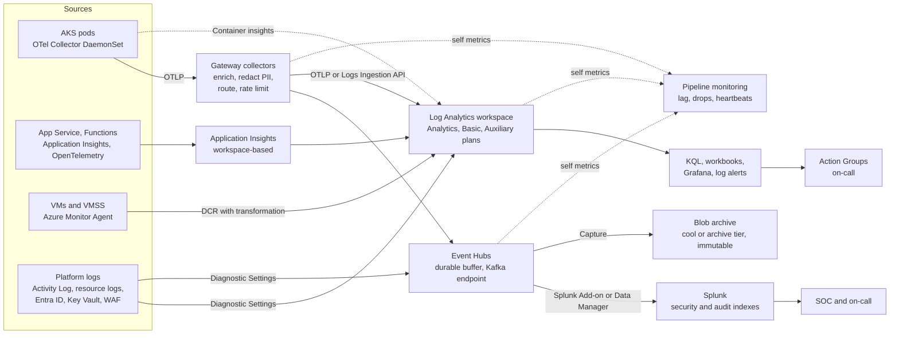

# System Design: Centralized Logging Platform

> Designing a company-wide logging platform on Azure: collection with Azure Monitor Agent, Diagnostic Settings, and OpenTelemetry, Event Hubs as the buffer, Log Analytics and KQL, streaming to Splunk, Application Insights, table plans, retention and cost, multi-tenancy and access control, PII redaction, scale estimates, alerting, and the reliability of the pipeline itself.

## Key Concepts

### Requirements and Scale

Agree on these before choosing tools:

- **Sources:** AKS pods, App Service and Functions apps, VMs and VM Scale Sets, and Azure platform logs (Activity Log, resource logs from Application Gateway WAF, Key Vault, PostgreSQL, VNet flow logs). Also Entra ID sign-in and audit logs, Azure DevOps audit logs, and maybe on-prem systems.
- **Users:** developers (debugging), SREs (incidents), security (detection and investigation), auditors (retention proof).
- **Freshness:** searchable within 30 to 60 seconds for app logs. Log Analytics ingestion latency is usually a few minutes, so say this out loud if the target is tighter.
- **Retention:** for example 14 to 30 days searchable, 1 year or more archived for compliance.
- **Access:** teams see their own logs; security sees everything; PII is masked before storage.
- **Reliability:** no silent data loss; the logging platform must work during an incident, which is exactly when log volume spikes.

Rough sizing, with assumptions said out loud:

```text
2,000 containers x 50 lines/s x 300 bytes          = 30 MB/s average
30 MB/s x 86,400 s                                 = about 2.6 TB/day raw
Plus Azure platform and Entra ID logs              = about 1 TB/day
Peak factor x3 during incidents or deploys         = about 120 MB/s at peak
Hot 14 to 30 days (Analytics plan or Splunk)       = the biggest cost line
Archive 1 year in Blob (cool or archive tier)      = about 130 TB compressed
```

These numbers tell me: I need a buffer to absorb peaks, table plans and tiers so hot storage stays small, and per-team volume control, because ingestion and licence cost will be the main expense.

### Architecture

There are two paths. The **Azure-native path** sends logs to Log Analytics through Azure Monitor Agent, Container insights, Application Insights, and Diagnostic Settings. The **streaming path** sends logs through Event Hubs to Splunk and to a cheap Blob archive. Most companies use both: Log Analytics for day-to-day debugging and Azure alerts, Splunk for security and long-term search.



TODO (Siva): adjust this to your real setup, for example which resources send Diagnostic Settings to Log Analytics, whether Splunk reads from Event Hubs, and which KQL alerts and Action Groups you built.

### Collection

- **Azure Monitor Agent (AMA):** the agent for VMs and VM Scale Sets. Data Collection Rules (DCRs) say what to collect (syslog, Windows events, text logs, performance counters) and where to send it. The old Log Analytics agent is retired.
- **AKS:** Container insights collects stdout and stderr into the `ContainerLogV2` table with namespace, pod, and container fields. Teams that also send to Splunk run an OpenTelemetry Collector or Fluent Bit DaemonSet that adds Kubernetes metadata with the `k8sattributes` processor.
- **App Service and Functions:** Application Insights through the Azure Monitor OpenTelemetry distro, plus Diagnostic Settings for platform logs such as HTTP logs.
- **Azure platform logs:** Diagnostic Settings send resource logs to Log Analytics, Event Hubs, or Storage. Use Azure Policy (DeployIfNotExists) at management group scope so every new resource gets them. The Activity Log has a subscription-level diagnostic setting.
- **Entra ID:** Entra ID diagnostic settings export sign-in and audit logs (sign-in log export needs an Entra ID P1 or P2 licence). Entra ID keeps them only for a short time itself, so export is a must.
- **Structured logs:** JSON with standard fields (`service`, `env`, `trace_id`, `level`, `team`). Trace IDs link logs to traces.

```yaml
# OpenTelemetry Collector agent on AKS (simplified)
receivers:
  filelog:
    include: [/var/log/pods/*/*/*.log]
    operators:
      - type: container
processors:
  memory_limiter:
    check_interval: 1s
    limit_percentage: 80
  k8sattributes: {}
  batch: {}
exporters:
  otlp:
    endpoint: log-gateway.observability.svc:4317
    sending_queue:
      enabled: true
      storage: file_storage
extensions:
  file_storage:
    directory: /var/lib/otelcol/queue
service:
  extensions: [file_storage]
  pipelines:
    logs:
      receivers: [filelog]
      processors: [memory_limiter, k8sattributes, batch]
      exporters: [otlp]
```

### Transport, Buffering, and Back-Pressure

- **Gateway tier:** stateless collectors on AKS behind an internal load balancer. They redact, enrich, drop noise, and route by tenant or data type.
- **Event Hubs as the buffer:** it decouples producers from Splunk and the archive. If Splunk is slow or down, data waits in Event Hubs. Standard tier keeps data up to 7 days, Premium and Dedicated up to 90 days. Size partitions and throughput units (or processing units) for peak, and turn on auto-inflate on Standard.
- **Consumer groups:** one per consumer (Splunk, archive, security tools), so each reads at its own pace.
- **Event Hubs Capture:** writes raw data to Blob Storage or Data Lake in Avro or Parquet, which becomes the cheap archive for replay.
- **Kafka endpoint:** Event Hubs Standard and above speak the Kafka protocol, so Kafka clients and exporters work without running Kafka brokers.
- **Agent buffers:** disk-backed queues on agents cover short network or gateway outages; AMA also caches locally when it cannot reach Azure Monitor.
- **Back-pressure:** when queues fill, agents slow down or spill to disk; the last resort is dropping low-priority logs (debug) before audit logs.
- **Acknowledgements:** with Splunk HEC, enable indexer acknowledgement so the sender knows data was indexed, not just received.

### Indexing and Storage Options

| Option | Index model | Storage tiers | Good for | Watch out for |
| --- | --- | --- | --- | --- |
| Log Analytics | Columnar store, KQL | Analytics plan (full KQL, alerts), Basic and Auxiliary plans (cheaper ingest, limited queries), long-term retention up to 12 years | Azure-native logs, AKS, App Insights, Azure alerts, no servers to run | Cost per GB ingested; slow if you query huge ranges without filters |
| Splunk | Full index of events | Hot, warm, cold, frozen; SmartStore keeps warm data in object storage | Rich search (SPL), security use cases, mature apps | Licence cost tied to ingest or workload |
| Loki on AKS | Indexes labels only; log lines in compressed chunks in Blob Storage | Mostly object storage with caches | Cheap storage, Kubernetes, Grafana users | Slow full-text search on huge ranges; label cardinality must stay low |

Many companies mix them: Log Analytics for Azure and app logs, Splunk for security and audit data, and Blob Storage as the cheap archive for everything.

### Retention and Cost

- **Classify data:** audit and security logs (long retention, immutable), app logs (short searchable retention), debug logs (very short or sampled).
- **Table plans:** keep alerting and incident tables on the Analytics plan; move verbose tables (for example `ContainerLogV2` from noisy namespaces, or custom debug tables) to Basic or Auxiliary, which cost less to ingest but charge per query.
- **Retention:** Analytics tables include 31 days of retention in the ingestion price and can keep up to 2 years for interactive queries. Total retention (long-term) goes up to 12 years at low cost; you bring data back with search jobs or restore. `AzureActivity` and Application Insights tables keep 90 days at no charge.
- **Commitment tiers:** from 100 GB per day upward, cheaper than pay-as-you-go if volume is stable. A daily cap protects the budget but stops collection when hit, so never use it on security workspaces.
- **Reduce before you store:** drop health-check noise and unused columns with DCR transformations, use Application Insights sampling, cut repeated stack traces, and turn high-volume access logs into metrics. On Analytics and Basic tables, filtering more than 50% of the data in a transformation adds a processing charge, so filter at the source or the agent first.
- **Splunk:** send only the data that needs SPL or the SOC to Splunk; keep the rest in Log Analytics or the Blob archive.
- **Archive:** Blob lifecycle rules move Capture files to cool, cold, and archive tiers.
- **Showback:** ingestion volume per team per day from the `Usage` table and resource tags, with budgets and alerts.

```kusto
// Billable GB per table in the last 7 days
Usage
| where TimeGenerated > ago(7d) and IsBillable == true
| summarize BillableGB = round(sum(Quantity) / 1000, 2) by DataType
| sort by BillableGB desc
```

### Multi-Tenancy, Access Control, and PII

- **Workspace design:** a small number of central workspaces (for example one per environment or region), not one per team. A separate workspace for security data if the SOC needs it.
- **Access:** use resource-context access so a team that can read its AKS cluster or resource group sees only those logs, plus table-level RBAC for sensitive tables. In Splunk, use indexes per team or data class with roles mapped from Entra ID groups through SSO.
- **PII redaction at the edge:** mask before data reaches the index, because deleting later is hard. Use the OpenTelemetry `redaction` or `transform` processors on the gateway, DCR transformations for Log Analytics, Application Insights telemetry processors, and Splunk Ingest Actions, Edge Processor, or `SEDCMD` in `props.conf`.
- **Prevention:** logging libraries with safe defaults; code review and linting for logging of tokens or card numbers; scan samples for patterns.
- **Audit:** log who searched what. Log Analytics has query auditing (`LAQueryLogs`), and Splunk has its own audit index.

```text
# Splunk props.conf on a heavy forwarder or indexer (parsing tier)
[app:payments]
SEDCMD-mask_card = s/\b(\d{4})\d{8}(\d{4})\b/\1XXXXXXXX\2/g
SEDCMD-mask_bearer = s/(Authorization: Bearer )\S+/\1REDACTED/g
```

### Alerting and Pipeline Reliability

- **Alert on symptoms with metrics first;** use log search alerts (KQL) for things only logs show (specific errors, security events). Route alerts through Action Groups.
- **Rate and threshold:** alert on error rate per service, not single error lines.
- **Self-monitoring of the pipeline:** agent queue size and drops, gateway CPU and refused records, Event Hubs incoming and outgoing messages and throttled requests, Splunk input lag, Log Analytics ingestion latency (`ingestion_time() - TimeGenerated`), and the `_LogOperation` function for ingestion errors.
- **Heartbeats:** AMA writes to the `Heartbeat` table; gateways send their own heartbeat events; alert when a source goes silent.
- **Separate failure domains:** the logging platform must not depend on the systems it monitors, for example its own AKS cluster and on-call path.

### Trade-offs

| Decision | Choice | Cost |
| --- | --- | --- |
| Buffer or direct to indexer | Event Hubs for the Splunk path | One more service to size, but no data loss during Splunk outages |
| Redact at edge or at search time | Edge (gateway and DCR) | Rules must be deployed and tested; but PII never lands in the index |
| One backend or several | Log Analytics for Azure and app logs, Splunk for security | Two query languages (KQL and SPL); but large cost savings |
| Long hot retention or archive and replay | Short Analytics retention plus long-term retention or Blob archive | Slower access to old data |
| Per-team workspaces or shared | Shared workspaces with resource-context RBAC | Careful RBAC design; but simpler queries and fewer workspaces to manage |

## Interview Questions

<details><summary>Q1. [Advanced] Design a centralized logging platform for a company running about 300 services on Azure. <em>(scenario)</em></summary>

**Answer:**

**1. Clarify.** I ask: what sources (AKS, App Service, Functions, VMs, platform logs, Entra ID)? Who uses it (devs, SRE, security)? Freshness target? Retention and compliance needs? Is there an existing tool like Splunk? Budget limits? I assume about 3.5 TB per day, 1 to 5 minute freshness for most logs, 30 days searchable, 1 year archive, SOC 2, and Splunk already used by security.

**2. Requirements.**

- Collect from all sources with standard metadata (service, team, env, trace ID).
- Search within minutes; alerts on error rates and security events.
- Teams see only their logs; PII masked before storage.
- No silent data loss; works during incidents.
- Cost visible per team.

**3. Estimate.** About 3.5 TB/day raw, peak about 120 MB/s, about 130 TB per year in the archive. Peak is three times average, so the Splunk path needs a buffer, and Log Analytics needs table plans and a commitment tier to keep cost under control.

**4. High-level design.**

- **Agents:** Container insights on AKS for `ContainerLogV2`, an OpenTelemetry Collector DaemonSet for logs that also go to Splunk, Azure Monitor Agent with DCRs on VMs, and Application Insights with OpenTelemetry for apps.
- **Platform logs:** Diagnostic Settings deployed by Azure Policy to every resource, the Activity Log per subscription, and Entra ID sign-in and audit logs.
- **Gateway:** stateless collector fleet that enriches, redacts PII, drops noise, and routes per tenant and data class.
- **Buffer:** Event Hubs (Premium for longer retention), with a consumer group for Splunk and Capture to Blob for the archive.
- **Backends:** Log Analytics for Azure, AKS, and app logs; Splunk for security, audit, and production error logs (Splunk Add-on for Microsoft Cloud Services or Data Manager reading from Event Hubs); immutable Blob archive for everything.
- **Access:** resource-context RBAC in Log Analytics, Entra ID groups mapped to Splunk roles and indexes.
- **Alerting:** KQL log search alerts and metric alerts through Action Groups; Splunk alerts to the SOC.

**5. Deep dive: reliability.** Every hop has a buffer: agent disk queue, Event Hubs, and indexer acknowledgements. I monitor end-to-end lag (event time vs index time), Event Hubs throttling, drops at each hop, and a heartbeat per source. If Splunk fails, Event Hubs holds the data and the add-on catches up from its checkpoint. If the gateway fails, agents spill to disk.

**6. Failure modes.** Log storm from one service (per-tenant rate limits at the gateway), bad redaction rule dropping data (canary rules, tests with sample events), Event Hubs throttling (more throughput units or partitions), a missing diagnostic setting on a new resource (Azure Policy compliance report), agent upgrade breaks collection (canary node pool).

**7. Security.** TLS on every hop, managed identities for agents and the Splunk add-on where supported, private endpoints for Event Hubs, Storage, and the workspace (Azure Monitor Private Link Scope), immutable storage for audit logs, query auditing, least privilege on tables and indexes.

**8. Cost.** The main drivers are Log Analytics ingestion, the Splunk licence, and Event Hubs capacity. Levers: drop and sample at the gateway and in DCRs, Basic or Auxiliary plans for verbose tables, a commitment tier, short Analytics retention with long-term retention, route low-value logs only to the archive, per-team showback and budgets.

**9. Operations.** Platform defined with Terraform or Bicep and Helm; DCRs and gateway rules in Git with tests; SLOs for freshness and completeness; on-call rotation for the platform; runbooks for lag, drops, and storms.

**10. Trade-offs.** Two backends add complexity but cut cost a lot. Edge redaction adds rule management but keeps PII out of the index, which is much easier than deleting it later.

</details>

<details><summary>Q2. [Advanced] Log volume doubled and the Log Analytics and Splunk bills are over budget. What do you do? <em>(scenario)</em></summary>

**Answer:**

1. **Find the growth.** In Log Analytics, check billable GB per table with the `Usage` query above, then drill into the top table:

   ```kusto
   ContainerLogV2
   | where TimeGenerated > ago(1d)
   | summarize GB = round(sum(_BilledSize) / 1e9, 2) by PodNamespace, ContainerName
   | sort by GB desc
   | take 20
   ```

   In Splunk, check licence usage by index and sourcetype:

   ```text
   index=_internal source=*license_usage.log type=Usage earliest=-7d
   | stats sum(b) as bytes by idx, st
   | eval GB=round(bytes/1024/1024/1024,2)
   | sort - GB
   ```

2. **Quick wins:** drop health checks and debug logs at the gateway or with a DCR transformation; fix the top noisy services with their teams; turn on Application Insights sampling; turn high-volume access logs into metrics.
3. **Route by value:** move verbose tables to the Basic or Auxiliary plan; send low-value logs only to the Blob archive instead of Splunk, with replay if needed.
4. **Buy smarter:** move to a commitment tier that matches the new steady volume.
5. **Prevent:** per-team volume budgets, alerts on sudden jumps, showback dashboards.

**Verify:** daily ingestion per team trends back under budget with no gaps in critical sources.

</details>

<details><summary>Q3. [Advanced] The Splunk indexers are down for two hours. Do you lose logs? <em>(scenario)</em></summary>

**Answer:**

Not if the design is right. Data flows into Event Hubs, which keeps it for at least a day (I set retention well above the longest expected outage). Agents keep sending to the gateway, the gateway keeps writing to Event Hubs, Capture keeps writing to Blob, and Log Analytics is a separate path that keeps working.

When Splunk comes back, the add-on resumes from its checkpoint and consumes the backlog. I make sure it can catch up: enough Event Hubs partitions and consumer capacity, and security and production data first.

**What could still lose data:** an agent whose disk queue fills during a longer gateway outage, a source with no buffer (for example a UDP syslog sender), or an Event Hubs retention shorter than the outage. I monitor agent queue fill, drops, and Event Hubs backlog, and alert before limits are hit.

**Pitfall:** alerts based on Splunk are blind during the outage. The pipeline's own health must be alerted from Azure Monitor metrics, not from the log platform being monitored.

</details>

<details><summary>Q4. [Advanced] Security finds credit card numbers in indexed logs. What do you do now, and how do you prevent it? <em>(scenario)</em></summary>

**Answer:**

**Now:**

1. Treat it as a security incident; involve security and compliance.
2. Find the scope: which service, which tables or indexes, which time range, who has access.
3. Fix the source: deploy a redaction rule at the gateway and a DCR transformation right away, and fix the app's logging.
4. Remove the data. In Log Analytics, the purge API (needs the Data Purger role) removes matching records, but it is slow and meant for compliance cases. In Splunk, the `delete` command (needs the `can_delete` role) only makes events unsearchable; full removal may mean cleaning the affected buckets. Event Hubs data expires with retention. Check the Blob archive too: if it uses a locked immutability policy, you cannot delete it, so restrict access and record the exception.
5. Review query audit logs (`LAQueryLogs` and the Splunk audit index) to see who viewed the data.

**Prevent:** redaction at the gateway and in DCRs with tested patterns, safe logging libraries, PR checks for logging of sensitive fields, and a periodic scan of samples for card or token patterns.

</details>

<details><summary>Q5. [Intermediate] How do you make sure team A cannot see team B's logs, while SREs and security can see everything?</summary>

**Answer:**

- In Log Analytics, set the workspace to use resource or workspace permissions. Team A gets Reader on its own resource group and AKS cluster, so it sees only logs from those resources. SREs and security get Log Analytics Reader on the workspace.
- Restrict sensitive tables (for example `SigninLogs`, `AuditLogs`, Key Vault `AzureDiagnostics`) with table-level RBAC.
- In Splunk, route each team's logs to its own index at the gateway, based on a trusted label like the Kubernetes namespace or resource group, not a field the app sets itself. Map Entra ID groups to roles: `team-a-dev` can search `idx_team_a_*` only.
- Log and review searches on sensitive data.

**Verify:** sign in as a member of team A and query team B's logs; it must return nothing. Add this check to the platform's tests.

</details>

<details><summary>Q6. [Intermediate] Loki on AKS is slow and its index is growing fast. What is the likely cause?</summary>

**Answer:**

Usually **high label cardinality**. Loki creates a stream for every unique label set. Labels like `user_id`, `request_id`, or `pod_ip` create millions of streams, which makes ingest and queries slow and expensive.

**Fix:**

- Keep labels to low-cardinality values: `cluster`, `namespace`, `app`, `env`, `level`.
- Move high-cardinality values into the log line or structured metadata, and filter them at query time.
- Set limits per tenant (max streams, ingestion rate).
- Enforce a label allow-list at the gateway.

**Verify:** check active streams per tenant before and after.

</details>

<details><summary>Q7. [Intermediate] How do you detect that a source has silently stopped sending logs?</summary>

**Answer:**

- **Heartbeats:** AMA writes to the `Heartbeat` table every minute; alert when a machine is missing for 5 minutes.

```kusto
Heartbeat
| summarize LastSeen = max(TimeGenerated) by Computer
| where LastSeen < ago(15m)
```

- **Last seen per service:** a scheduled query compares the last log time per namespace or app with an expected list (the service catalogue).

```kusto
ContainerLogV2
| where TimeGenerated > ago(1d)
| summarize LastSeen = max(TimeGenerated) by PodNamespace, ContainerName
| where LastSeen < ago(15m)
```

- **Missing diagnostic settings:** the Azure Policy compliance report shows resources without them.
- **Volume anomalies:** alert when a service's volume drops sharply compared to the same hour last week.
- **Pipeline metrics:** agent export errors, queue drops, and Event Hubs outgoing messages dropping to zero.

</details>

<details><summary>Q8. [Intermediate] How do you choose between Log Analytics, Splunk, and Loki?</summary>

**Answer:**

- **Log Analytics:** best default for Azure. No servers, native Diagnostic Settings, Container insights, Application Insights, KQL alerts, and table plans for cost control. Cost grows with ingestion, so control volume.
- **Splunk:** best when you need powerful search and analytics, security and SIEM use cases, and mature apps. Highest cost, so send only what needs it.
- **Loki on AKS:** cheapest storage, great with Kubernetes and Grafana, but you run it yourself, it is slower for full-text search across huge ranges, and it needs label discipline.

I decide based on who uses it (the security team may need Splunk), volume and budget, existing skills, and the cost of running it. A mixed setup is common: Log Analytics for Azure and app logs, Splunk for security and audit, Blob Storage for the archive.

TODO (Siva): add which backend your company uses and why (for example Log Analytics with KQL alerts plus Splunk), without naming the company if needed.

</details>

<details><summary>Q9. [Advanced] Compliance requires audit logs kept for one year and proven tamper-proof. How do you design that?</summary>

**Answer:**

- Send audit logs (Activity Log, Entra ID audit and sign-in logs, Key Vault `AuditEvent`, Azure DevOps audit stream) through Diagnostic Settings to a storage account in a separate security subscription.
- Turn on immutable storage with a locked time-based retention policy of one year on that container, plus versioning and soft delete.
- Restrict access with RBAC, a resource lock, and Azure Policy; only the security team can read.
- Keep a searchable copy in Log Analytics with total retention of one year (or in Splunk) for investigations.
- Remember the defaults: the Activity Log keeps 90 days, and Entra ID keeps logs only for a short time, so export from day one.
- Document the retention policy and test a restore or search job.

</details>

<details><summary>Q10. [Advanced] One service starts logging 50x its normal volume during an incident and slows the whole pipeline. How does your design protect other teams? <em>(scenario)</em></summary>

**Answer:**

- **Per-tenant rate limits** at the gateway: over-limit logs from that tenant are sampled or diverted to the Blob archive only.
- **Priority routing:** audit and security logs use a separate event hub and consumer group, so they are not stuck behind the storm.
- **Autoscaling** of the gateway and Splunk consumers on backlog; Event Hubs auto-inflate or more processing units.
- **Log Analytics:** a DCR transformation can drop the noisy container's debug lines; avoid a workspace-wide daily cap because it stops every team's data.
- **Alert the owning team** with their volume graph.
- **After the incident:** fix the log loop (often retries logging a full stack trace on every attempt), and add a volume budget alert.

</details>

<details><summary>Q11. [Intermediate] How do you collect logs from many Azure subscriptions and regions?</summary>

**Answer:**

- **Azure Policy at management group scope:** DeployIfNotExists policies (built-in initiatives exist for resource logs) create Diagnostic Settings on every resource and the Activity Log setting on every subscription.
- **Entra ID:** one tenant-level diagnostic setting for sign-in and audit logs.
- **Event Hubs per region:** Diagnostic Settings to Event Hubs need a namespace in the same region as the resource, so I deploy one namespace per region and let Splunk read from each.
- **Log Analytics:** a central workspace per environment or region; cross-region sends are allowed but add egress cost.
- **App logs:** agents send to regional gateway endpoints over private endpoints, then to the central buffer.
- **Residency:** keep data in-region if rules require it, with a regional workspace and Splunk input per jurisdiction.

</details>

<details><summary>Q12. [Intermediate] How do you add trace context so logs and traces link together?</summary>

**Answer:**

- Instrument apps with OpenTelemetry (the Azure Monitor OpenTelemetry distro) so every log record carries `trace_id` and `span_id`. In Application Insights this shows up as `OperationId`.
- Keep the field names standard across services.
- In Application Insights, use the transaction search and end-to-end transaction view. In Grafana, configure data links from the log `trace_id` to the tracing backend; in Splunk, link to the trace view from a field action.
- Use trace IDs in incident timelines to jump from an error log to the full request path.

See [observability and APM](../monitoring-tools/01-observability-and-apm.md) and [logging](../monitoring-tools/04-logging.md).

</details>

<details><summary>Q13. [Advanced] Looking back at your logging design, what would you do differently?</summary>

**Answer:**

- Push teams harder to **emit metrics instead of logs** for high-volume signals; it is cheaper and faster.
- Introduce **volume budgets per team from day one**, not after the first big bill.
- Treat **redaction rules and DCR transformations as code** with unit tests and canary rollout, because a bad rule can drop or leak data.
- Consider a **schema standard** (for example OpenTelemetry semantic conventions) earlier, to make cross-team search easier.
- Revisit the **split between Log Analytics, Splunk, and the archive** after six months of real query patterns; some data may not need indexing at all.

</details>
